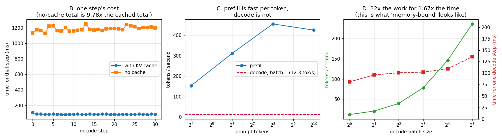

# Manual Inference Loop

---

> Every inference engine is, at heart, a `while` loop that grows a [KV cache](/shared/glossary/#kv-cache) one token at a time. This project writes that loop by hand on a real 0.5B model and measures what it does. Findings: the hand-written loop reproduces `model.generate()` **exactly** — but only after switching off a `repetition_penalty=1.1` that the model's own config injects silently, which changes the **very first token**. Turning the cache off gives **bit-identical text for 9.78x the time**. [Prefill](/shared/glossary/#prefill) runs at **425 tokens/second** on a 1024-token prompt (peaking at 455); [decode](/shared/glossary/#decode) manages **12.3** — a **34.6x** gap on the same model, same machine, same weights. And decoding **32 sequences at once costs 1.67x one sequence**, for **19x the throughput**: the clearest possible picture of a [memory-bound](/shared/glossary/#memory-bound) step.

---

## Key Insight

This project loads a real [LLM](/shared/glossary/#llm), runs the whole prompt through it once to build the [KV cache](/shared/glossary/#kv-cache) ([prefill](/shared/glossary/#prefill)), and then walks a `while` loop that asks the model for one new token at a time ([decode](/shared/glossary/#decode)), feeding the cache back in each step. Writing the two phases by hand makes their very different shapes — one big parallel pass, then many tiny serial steps — concrete and measurable.

## Why This Matters

The two-phase split is the single most important fact in LLM serving: [prefill](/shared/glossary/#prefill) is compute-heavy, [decode](/shared/glossary/#decode) is memory-bandwidth-heavy, and almost every later optimization in this guide targets one phase or the other. Building the loop yourself first means you can read any production engine's source code and recognize what it is doing.

It also supplies the phase's shared code. `loop_lib.py` (model loading, the cached and uncached decode loops, an interleaved timer) is written here and reused by [project 02](../02-streaming-server/README.md), [project 06](../06-determinism-audit/README.md) and [project 07](../07-request-lifecycle-tracer/README.md).

---

**This is project 1.**

### The words first

- **[Autoregressive](/shared/glossary/#autoregressive-model)** — the name is two Latin pieces: *auto* = "self", *regress* = "predict a value from earlier values". So an autoregressive model predicts *its own* next output from its own earlier outputs. That is why generation is a loop and not a single call: token 5 cannot be computed until token 4 exists.
- **[Prefill](/shared/glossary/#prefill)** — the one big [forward pass](/shared/glossary/#forward-pass) that reads the entire prompt. Called "pre-fill" because its job is to *fill* the cache *before* any generation starts.
- **[Decode](/shared/glossary/#decode)** — the loop that produces one new token per forward pass. The name comes from encoder/decoder terminology: the decoder is the half that emits output symbols.
- **[KV cache](/shared/glossary/#kv-cache)** — the saved **K**ey and **V**alue vectors of every token seen so far, at every layer. Section B measures what it is worth.
- **[Logits](/shared/glossary/#logits)** — the raw score the model assigns to each of the 151,936 vocabulary entries before they are turned into probabilities. The word is short for "**log**istic un**it**": these are scores on a log-odds scale, which is why you exponentiate them ([softmax](/shared/glossary/#softmax)) to get probabilities.
- **[Greedy decoding](/shared/glossary/#greedy-decoding)** — always take the highest-[logit](/shared/glossary/#logits) token (`argmax`). "Greedy" is the standard algorithms word for *take the best local step and never reconsider*; it is exactly the greedy strategy of shortest-path textbooks, applied to text.
- **[TTFT](/shared/glossary/#ttft) (time to first token)** and **[ITL](/shared/glossary/#itl--tpot) (inter-token latency)** — the two clocks a user feels. TTFT is "how long until something appears"; ITL is "how fast does it then flow".
- **[Memory-bound](/shared/glossary/#memory-bound) / [compute-bound](/shared/glossary/#compute-bound)** — whether a step is limited by how fast bytes move from memory or by how fast the arithmetic units multiply. Section D shows decode is the first and section C shows prefill is the second.
- **[Arithmetic intensity](/shared/glossary/#ai-arithmetic-intensity)** — FLOPs performed ÷ bytes moved. One number that tells you which of the two above you are.

### "Why write the loop by hand? `model.generate()` already does this."

Because `generate()` is a *policy*, and this project is about the *mechanism*. Three concrete reasons, and the first one is measured in section A below:

1. **`generate()` is not doing what you think.** Qwen2.5-Instruct ships a `generation_config.json` containing `repetition_penalty: 1.1`. Ask for greedy decoding with `do_sample=False` and you still get that penalty applied to the [logits](/shared/glossary/#logits) first. Our raw-`argmax` loop and HF's "greedy" therefore disagree **at token 0**. Neither is wrong — but if you had assumed `generate()` = argmax, you would have spent a day debugging your own correct code.
2. **A server cannot use `generate()`.** `generate()` owns the loop: it decides when to stop, and it hands you the answer at the end. A serving engine has to interleave *other people's requests* between your decode steps, stream your bytes out as they appear, and cancel you when you disconnect. You cannot do any of that from inside a function that will not return until it is finished.
3. **You cannot instrument what you cannot see into.** Every measurement in this phase — per-step timings ([project 07](../07-request-lifecycle-tracer/README.md)), the sampling path ([project 04](../04-sampling-kernel/README.md)), incremental detokenization ([project 05](../05-detokenizer-fuzzer/README.md)) — needs a hook between two steps of the loop.

### "Prefill already computed the K and V for the prompt. Why keep them — can't decode just recompute?"

It can, and it gives exactly the same text — `generate_no_cache()` in `loop_lib.py` does precisely that, and section B confirms the output is identical token for token. The cache is not about *correctness*; it is about not repeating work that provably cannot change.

Here is why it cannot change. Attention is **causal**: token *t* is allowed to look at tokens 0…*t*, never forward. So the K and V vectors of token 3 depend only on tokens 0–3. When token 200 arrives, token 3's K and V are the same numbers they were 197 steps ago. Recomputing them is not "refreshing stale data" — it is recomputing a constant.

The bill for recomputing it is quadratic. Generating *N* tokens after a prompt of *P* re-reads a prefix that grows every step: `P + (P+1) + (P+2) + …`. Section B measures a **9.78x** penalty at `P=512, N=32`; at production context lengths it is the difference between a working product and one that never ships.

### "Decode does 1/512th of prefill's work per pass. Why isn't it 512x faster?"

This is the question the whole phase is built around, and section D answers it with numbers. The short version: a decode step must read **all 1.98 GB of the model's weights out of memory** in order to multiply them by a single token's vector. Prefill reads the same 1.98 GB and multiplies it by 512 tokens' worth of vectors. The expensive part — the memory traffic — is *the same in both cases*. Prefill just amortizes it over 512 tokens instead of 1.

That is what "decode is [memory-bound](/shared/glossary/#memory-bound)" means in plain language: **the arithmetic is free, the fetching is not, and decode fetches just as much as prefill for a five-hundredth of the work.**

---

## Running it

```bash
python3 run.py           # ~80 s on 6 CPU threads
python3 run.py --plot    # redraw the figure from the committed findings.json
```

Needs `torch`, `transformers`, `matplotlib`. Model: **Qwen2.5-0.5B-Instruct** (494M parameters, 24 layers, 2 [KV heads](/shared/glossary/#gqa), 151,936-token vocabulary), float32, **CPU only** — the GPU in this machine is a GTX 1070 Ti ([compute capability](/shared/glossary/#compute-capability) 6.1) which this PyTorch build refuses to run on, so every number below is from 6 cores of an Intel i7-8700K. The *shapes* of the curves are what transfer to a GPU; the absolute tokens/second do not.

> **About the numbers.** Everything below comes from the committed
> [`outputs/findings.json`](outputs/findings.json) and
> [`outputs/findings.csv`](outputs/findings.csv).



---

## A. The hand-written loop is correct — and `generate()` is not argmax

| comparison | identical tokens? | first divergence |
|---|---|---|
| manual loop vs `generate(do_sample=False)` | **no** | token **0** |
| manual loop vs `generate(do_sample=False, repetition_penalty=1.0)` | **yes** | — |

Both HF calls asked for greedy decoding. The only difference is one argument that the model's shipped config sets behind your back. Its effect is not subtle — it changes the *first* token, and everything downstream of it.

The lesson generalizes past this one flag: **a model repository ships behavioral defaults, and they are part of your serving contract.** When you swap a model, `generation_config.json` changes too, and your outputs move even if your code did not. Production engines pin these explicitly rather than inherit them. (vLLM, for example, lets you choose whether to honor the file at all.)

The generated text, for the record: `" a magical formula that could transform any number into a unique numbe…"`.

## B. What the KV cache buys: nothing in quality, 9.78x in time

Prompt 512 tokens, generate 32, on the same model:

| | with KV cache | without |
|---|---|---|
| total time | **3.87 s** | **37.91 s** |
| cost of one decode step | ~90 ms, flat | ~1,180 ms, climbing |
| last step ÷ first step | 0.80x | 1.06x |
| output tokens | *identical* | *identical* |

The left panel of the figure is the whole argument in one picture: the cached line is flat near the bottom, the uncached line sits 13x higher and drifts upward as the prefix grows.

Two details worth noticing:

- **The uncached line is only drifting slowly upward** because 32 new tokens on top of 512 is a 6% growth in prefix length. Run it for 512 new tokens and the drift becomes the dominant term — that is the quadratic curve everyone draws.
- **The cached line's last step is *faster* than its first** (0.80x). That is not the cache getting cheaper; it is the first step paying one-time costs (memory allocator warm-up, the first touch of each weight tensor). It is a good reminder to discard warm-up samples, which `interleaved()` in `loop_lib.py` does for every other measurement here.

## C. Prefill: the more tokens you hand it, the better it does

| prompt tokens | prefill time | tokens/second | ms per token |
|---|---|---|---|
| 16 | 0.104 s | 153.6 | 6.5 |
| 64 | 0.206 s | 311.1 | 3.2 |
| 256 | 0.562 s | 455.4 | 2.2 |
| 1024 | 2.409 s | 425.0 | 2.4 |

Per-token cost *falls* by 3x from 16 to 256 tokens, then flattens. That shape is the signature of a [compute-bound](/shared/glossary/#compute-bound) step: at 16 tokens the machine is still dominated by fixed overheads (reading weights, launching operations), and the extra tokens ride along nearly free. By 256 the matrix multiplications are big enough to saturate the cores, and from there you pay honest linear cost per token — 1024 tokens takes 4.3x as long as 256.

**The serving consequence:** small prompts are *inefficient*, not cheap. Sixteen separate 16-token prefills cost 1.66 s; one batched 256-token prefill costs 0.56 s for the same tokens. This is the entire economic argument for batching prefills, and it is why [chunked prefill](/shared/glossary/#chunked-prefill) (Phase 3) chooses chunks in the thousands of tokens, not the tens.

## D. Decode: 32x the work for 1.67x the time

| batch | one decode step | tokens/second | step cost vs batch 1 | throughput vs batch 1 |
|---|---|---|---|---|
| 1 | 81.1 ms | 12.3 | 1.00x | 1.00x |
| 2 | 96.2 ms | 20.8 | 1.19x | 1.69x |
| 4 | 100.9 ms | 39.6 | 1.24x | 3.22x |
| 8 | 102.2 ms | 78.3 | 1.26x | 6.35x |
| 16 | 109.5 ms | 146.1 | 1.35x | 11.85x |
| 32 | 135.7 ms | 235.8 | 1.67x | **19.13x** |

Read the last two columns together, because that pairing *is* the result: going from one sequence to thirty-two multiplies the useful work by 32 and the wall-clock cost by 1.67. Nineteen-fold more tokens per second, out of the same hardware, for free.

Nothing clever is happening. The step reads the same 1.98 GB of weights either way; the only thing that grows is the tiny matrix on the other side of the multiply. **The GPU-equivalent statement is the founding fact of [continuous batching](/shared/glossary/#continuous-batching)** (Phase 3): if a decode step is mostly waiting for memory, then serving more users during that wait is nearly free — until the batch gets big enough to become compute-bound. On this CPU the corner starts showing at batch 32 (step cost jumps from 1.35x to 1.67x); on an H100 with a 7B model it typically arrives somewhere between 64 and 256, depending on context length.

**The flip side, which the table also shows:** batching does *not* make any individual user faster. At batch 32 each user's tokens arrive every 135.7 ms instead of 81.1 ms — 1.67x *worse* [ITL](/shared/glossary/#itl--tpot). Batching is a throughput lever paid for in latency, exactly as the guide's Phase 0 framing says.

## E. The arithmetic behind C and D

Weights: 494M parameters × 4 bytes = **1.98 GB**. [KV cache](/shared/glossary/#kv-cache): `2 (K and V) × 24 layers × 2 kv-heads × 64 dims × 4 bytes` = **24.6 KB per token** — for this model the cache is a rounding error next to the weights, which is *not* true for the 70B models Phase 2 studies (320 KB/token there).

| batch | bytes read per decode step | FLOPs per step | [arithmetic intensity](/shared/glossary/#ai-arithmetic-intensity) |
|---|---|---|---|
| 1 | 1.98 GB | 0.99 GFLOP | **0.5 FLOP/byte** |
| 8 | 1.99 GB | 7.9 GFLOP | 3.97 FLOP/byte |
| 32 | 2.03 GB | 31.6 GFLOP | 15.6 FLOP/byte |

An intensity of 0.5 FLOP/byte means: for every byte hauled out of memory, the machine does half a floating-point operation. A modern CPU can do tens of FLOPs per byte of bandwidth, and a GPU hundreds. So at batch 1 the arithmetic units are idle more than 95% of the time — and batching is simply the act of climbing this column.

The measured check: 1.98 GB read in 81.1 ms is **24.4 GB/s** of effective memory bandwidth. That is in the right neighborhood for dual-channel DDR4 on this box, which confirms the model: decode is not doing math, it is streaming weights.

And the headline ratio the whole phase rests on:

```
   prefill:  425 tokens/second   (1024-token prompt, batch 1)
   decode:  12.3 tokens/second   (batch 1)
   ─────────────────────────────────────────────────────────
   prefill is 34.6x faster per token than decode
```

Same weights. Same machine. Same arithmetic per token. The only difference is how many tokens share one trip to memory.

---

## What to take from this

1. **Two phases, two bottlenecks, two toolboxes.** If a change helps prefill, it moves [TTFT](/shared/glossary/#ttft). If it helps decode, it moves [ITL](/shared/glossary/#itl--tpot) and throughput. Know which one you are shipping before you benchmark it.
2. **The cache is not an optimization you add later.** Without it the loop is quadratic, and 9.78x at 512 tokens becomes unusable at 32k.
3. **Batching is nearly free on the decode side and not free at all on the latency side.** 19x throughput, 1.67x worse per-user ITL.
4. **Check what your library is doing before you trust a baseline.** One line in a JSON file changed the first token of a "greedy" decode.

### Common traps this project walks into on purpose

- **Timing on a shared machine.** `interleaved()` runs the variants round-robin and keeps the minimum. Timing A fully then B fully charges any background disturbance entirely to whichever ran during it — this box idles at load 2–4, so that error is real.
- **Re-using a mutated cache.** `past_key_values` is *modified in place* by each forward pass. Timing "one decode step" ten times means giving each repeat its own copy (`copy.deepcopy`), or step 2 silently runs on a 1-token-longer context than step 1.
- **Warm-up.** The first forward pass after loading pays allocator and page-fault costs; section B's first step is 20% slower than its last for exactly this reason.

---

## Next

[Project 02 — streaming server](../02-streaming-server/README.md) puts this loop behind HTTP and asks what happens to [TTFT](/shared/glossary/#ttft) and [ITL](/shared/glossary/#itl--tpot) when several users arrive at once.
