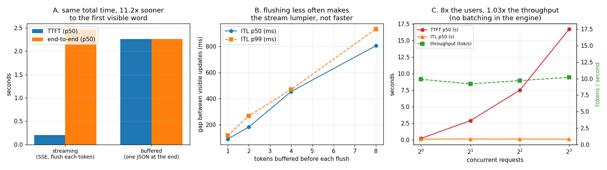

# Streaming Server

---

> A generation loop becomes a *server* the moment someone else is waiting on it. This project wraps project 01's loop in FastAPI, streams tokens with [Server-Sent Events](/shared/glossary/#sse-server-sent-events), and points a load generator at it. Findings: streaming shows the first word **11.2x sooner** (0.20 s vs 2.26 s) while finishing at the same time — the entire win is *perceived*, not real. Buffering 8 tokens per flush pushes [ITL](/shared/glossary/#itl--tpot) from **90 ms to 804 ms**, so "fewer, bigger writes" makes the stream lumpier and not one token faster. And the headline negative: **8 concurrent users get 1.03x the throughput of one** — 10.2 tok/s either way — while [TTFT](/shared/glossary/#ttft) p50 blows up from 0.18 s to **16.7 s**. Removing the lock so all 8 decode at once moves the pain instead of removing it (TTFT **16.7 s → 1.0 s**, ITL **93 ms → 650 ms**, throughput +17%). Project 01's batch curve says a real engine would have got **6.35x** here. That gap is what Phase 3 is for.

---

## Key Insight

Serving is not generation plus HTTP. The moment a second user exists, two new clocks start: how long they wait in a *queue*, and how the server chooses to divide a single model between them. This project measures both, with a server that deliberately has **no batching** — so the cost of not having it is a number rather than a claim.

## Why This Matters

Every production incident in an inference stack shows up first as one of the three curves in the figure below: [TTFT](/shared/glossary/#ttft) climbing under load, [ITL](/shared/glossary/#itl--tpot) turning lumpy, or [throughput](/shared/glossary/#throughput) refusing to rise when you add users. Building the smallest server that reproduces all three teaches you to read them.

---

**This is project 2.**

### The words first

- **[Streaming](/shared/glossary/#streaming)** — sending the answer piece by piece as it is produced instead of all at once at the end.
- **[Server-Sent Events (SSE)](/shared/glossary/#sse-server-sent-events)** — the HTTP convention for that. The server keeps one response open and writes `data: {...}` lines; the client reads them as they land. "Server-sent" because, unlike WebSockets, the traffic only flows one way — the client cannot talk back on the same channel, which is all a token stream needs.
- **[TTFT](/shared/glossary/#ttft)** — time to first token: from sending the request to seeing the first visible character.
- **[ITL](/shared/glossary/#itl--tpot)** — inter-token latency: the gap between visible updates after that. Its productized name is TPOT (time per output token).
- **[p50 / p99](/shared/glossary/#percentile)** — the median and the 99th [percentile](/shared/glossary/#percentile). p99 = "only 1 request in 100 is worse than this". Serving [SLOs](/shared/glossary/#slo) are written on p99 because the median hides exactly the users who are suffering.
- **[Load generator](/shared/glossary/#load-generator)** — a client that fires many requests at a chosen concurrency and records per-request timing. `oha`, `vegeta` and `wrk` are the standard tools; `loadgen.py` here is a 90-line stand-in so the project has no extra install step.
- **[Head-of-line blocking](/shared/glossary/#head-of-line-blocking)** — when one item at the front of a queue holds up everything behind it, no matter how small those items are. Section C is a pure demonstration.
- **[Throughput](/shared/glossary/#throughput)** — total tokens per second across all users. The number your GPU bill is divided by.

### "The loop already produces tokens one at a time. Why does *streaming* need extra machinery?"

Because "produced" and "delivered" are different events, and by default a web framework couples them in the wrong direction. A normal handler builds a complete response object and returns it; the framework then serializes it, sets `Content-Length`, and writes it once. Nothing reaches the network until your function *returns* — so a loop that yields a beautiful token every 90 ms still shows the user a blank screen for 2.3 seconds.

Streaming is the machinery that decouples them:

1. **Hand the framework a generator, not a value** (`StreamingResponse`), so the response begins before the answer exists.
2. **Give up `Content-Length`** — the server does not know the final size — and use chunked transfer instead. That is why HTTP needed a separate framing mode for this at all.
3. **Flush per token**, and tell every proxy in the path not to re-buffer you (`X-Accel-Buffering: no`). A single caching proxy that collects your chunks and forwards them together silently converts your streaming server back into a buffered one, and the symptom — good TTFT in `curl`, terrible TTFT in production — is a classic.

Section A measures what that machinery is worth: **11.2x** on the clock the user actually watches.

### "If streaming doesn't finish any sooner, is it just a UI trick?"

Partly, and it is worth being honest about that: total time is unchanged (2.47 s streamed vs 2.26 s buffered — the streaming run is even marginally *slower*, because writing 24 small chunks costs more than writing one big one). What changes is that the user gets evidence of progress in 200 ms instead of staring at nothing for 2.3 s.

But two consequences are not cosmetic:

- **You can cancel.** A user who sees the answer going the wrong way closes the tab; the server notices the dropped connection and stops decoding. Work saved is real capacity. A buffered server discovers the client left only after computing the whole answer.
- **Memory stops scaling with answer length.** A buffered server holds every generated token per in-flight request; a streaming one holds a few bytes.

### "Why does the server have a lock around the model? Isn't that just making it slow on purpose?"

Yes, and that is the experiment. The lock (`_model_lock`) makes this server do the honest, naive thing: one request's forward pass at a time, first come first served. That is the baseline every batching engine is measured against, and the point is to make its failure mode measurable rather than assumed.

Section C2 removes the lock and lets all 8 requests run their loops at once. Note what does *not* happen: throughput barely moves (10.2 → 11.9 tok/s). The 8 loops now interleave, so each one's tokens come 7x further apart — the same total tokens, redistributed. **Locking and not-locking are two ways of dividing a fixed pie.** Batching is the only way to make the pie bigger, because it is the only option that serves 8 users with *one* trip to memory instead of 8 (project 01, section D).

---

## Running it

```bash
python3 run.py            # ~2.5 min: starts the server, load-tests it, stops it
python3 run.py --plot     # redraw the figure from the committed findings.json

# or drive it by hand
python3 server.py --port 8117 --threads 3
curl -N -X POST localhost:8117/generate -d '{"prompt":"Hello","max_new_tokens":16}'
```

Needs `torch`, `transformers`, `fastapi`, `uvicorn`, `httpx`, `matplotlib`. Same CPU-only Qwen2.5-0.5B-Instruct as project 01, with 3 torch threads per server so 4 concurrent requests can occupy the 12-core box without oversubscribing it.

> **About the numbers.** Everything below comes from the committed
> [`outputs/findings.json`](outputs/findings.json) and
> [`outputs/findings.csv`](outputs/findings.csv).



---

## A. Streaming vs buffered: 11.2x sooner, 0x faster

| | streaming (SSE) | buffered (one JSON) |
|---|---|---|
| [TTFT](/shared/glossary/#ttft) p50 | **0.202 s** | **2.264 s** |
| end-to-end p50 | 2.472 s | 2.264 s |
| what the user sees at t=0.2 s | the first word | a spinner |

TTFT for the buffered endpoint *equals* its end-to-end time, by construction: the first byte and the last byte leave together. And the streamed TTFT — 0.202 s — is essentially project 01's [prefill](/shared/glossary/#prefill) cost for this prompt plus HTTP overhead. That identity is worth remembering: **in an unloaded server, TTFT is prefill.** Everything above prefill that you measure in production is queueing, and section C is where it comes from.

## B. How often to flush: `chunk_every` is a real knob, and its default is 1

| tokens per flush | TTFT p50 | ITL p50 | ITL p99 |
|---|---|---|---|
| 1 | 0.197 s | **90 ms** | 117 ms |
| 2 | 0.270 s | 182 ms | 267 ms |
| 4 | 0.591 s | 454 ms | 469 ms |
| 8 | 0.912 s | **804 ms** | 932 ms |

Buffering 8 tokens before writing makes each visible update arrive 8x further apart *and* delays the first one 4.6x. Nothing is gained — the tokens were already computed; they are just being held.

Why would anyone do it, then? Because on a **loaded** server each flush is not free: it is a syscall, a chunk header, and for SSE a JSON encode, per token per user. At thousands of concurrent streams that overhead is measurable, and engines do coalesce writes on a short timer (a few milliseconds, not a few tokens). The lesson is the direction of the trade: **flush cadence buys server CPU at the price of the user's perceived smoothness**, and 8 tokens is far past where anyone should want to be.

This table is also a diagnostic. If a production stream shows ITL of ~800 ms while the engine reports 90 ms per token, nothing is slow — something in the path is batching your chunks.

## C. Eight users, one model, no batching: the whole cost in one table

| concurrency | TTFT p50 | TTFT p99 | ITL p50 | throughput |
|---|---|---|---|---|
| 1 | **0.182 s** | 0.183 s | 92 ms | 9.9 tok/s |
| 2 | 2.879 s | 2.995 s | 100 ms | 9.2 tok/s |
| 4 | 7.469 s | 8.001 s | 95 ms | 9.7 tok/s |
| 8 | **16.707 s** | 16.970 s | 93 ms | **10.2 tok/s** |

Three things are happening at once, and they are worth separating:

- **Throughput is flat.** 8x the users, 1.03x the tokens per second. The server was already using the machine fully with one user; more users add no capacity, they only add waiting.
- **TTFT grows linearly** — 0.18 → 2.9 → 7.5 → 16.7 s, roughly *(your position in the queue) × (time for one full answer)*. That is textbook [head-of-line blocking](/shared/glossary/#head-of-line-blocking): request 8 cannot start its 0.2 s prefill until requests 1–7 have finished *all 24 of their decode steps*.
- **ITL is perfectly flat** at ~93 ms, which looks like good news and is actually the smoking gun. Once a request wins the lock it runs alone to completion, so its token cadence is undisturbed. **A dashboard that watches only ITL would report this server as healthy at every load level**, while users at concurrency 8 wait 16 seconds to see anything. Alert on TTFT p99, not on ITL alone.

## C2. Removing the lock does not create capacity, it relocates the pain

Same 8 concurrent users, but every request runs its own decode loop simultaneously (`SERIALIZE=0`):

| | serialized (lock) | interleaved (no lock) |
|---|---|---|
| TTFT p50 | 16.707 s | **1.015 s** (16x better) |
| ITL p50 | 93 ms | **650 ms** (7x worse) |
| throughput | 10.2 tok/s | 11.9 tok/s (**1.17x**) |

Everyone now starts almost immediately and then crawls. Total useful work rose 17% — that is 8 threads squeezing a little more out of the CPU's idle memory-wait cycles, which is a small, real echo of *why* batching works — but the tokens per second are still within noise of a single user's.

Two bad schedules, one lesson: **without batching, a serving system can only choose who waits, not how much work gets done.**

## D. What a batching engine would have done instead

| going from 1 user to 8 | throughput gain |
|---|---|
| this server, serialized | 1.03x |
| this server, interleaved | 1.17x |
| **project 01, one batched forward pass** | **6.35x** |

Project 01 measured a batch-8 decode step at 1.26x the cost of a batch-1 step. Eight users folded into one forward pass therefore cost 1.26x the time and produce 8x the tokens — 6.35x the throughput, and *lower* TTFT too, since nobody waits for anyone else's answer to finish.

That is the missing 6x, and it is not an exotic optimization: it is the single change that separates a demo server from an inference engine. [Phase 3](../../README.md#phase-3-batching-and-scheduling) builds it in [project 16](../16-static-vs-continuous/README.md).

---

## What to take from this

1. **TTFT in an idle server is prefill. TTFT in a busy server is queueing.** The gap between those two numbers is your scheduler's report card.
2. **ITL can look perfect while your service is unusable.** Page on TTFT p99.
3. **Streaming is a latency illusion — and worth building anyway**, for cancellation and for bounded memory as much as for the illusion.
4. **Concurrency is not capacity.** Adding users to an unbatched engine adds queue, not tokens.

### Traps this project walks into on purpose

- **`from __future__ import annotations` + FastAPI.** With postponed annotations, FastAPI resolves `request: Request` as a *string* against the module's globals. Importing `Request` inside a factory function makes it invisible, and every request fails with `Field required` on a query parameter you never declared. `server.py` imports it at module level and says why.
- **Measuring TTFT with a non-streaming client.** `httpx.post()` returns after the last byte; TTFT must be measured with `client.stream()` and a timestamp on the first `data:` line, which is what `loadgen.py` does.
- **Thread oversubscription.** Each server process sets 3 torch threads. Running 8 concurrent unlocked requests still oversubscribes 12 cores — which is part of why section C2's throughput gain is small.

---

## Next

[Project 03 — stop-string matcher](../03-stop-string-matcher/README.md) asks what the server should do when the user says "stop when you see `\n\n`" and the model emits that string split across two tokens.
