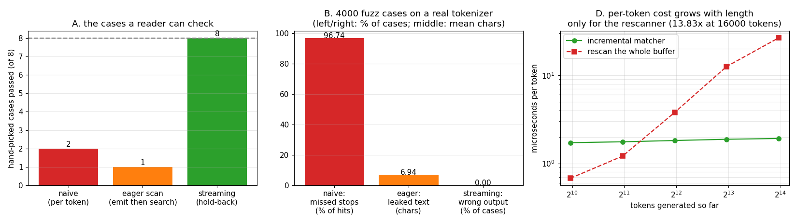

# Stop-String Matcher

---

> The user asks the server to stop at `"\n4."`. The model does not emit strings — it emits [tokens](/shared/glossary/#tokenizer) — and it writes that stop as three separate ones: `'\n'`, `'4'`, `'.'`. Findings: a per-token matcher detects **100% of stop strings that fit inside one token and exactly 0% of the ones that straddle a boundary** — not "unreliable", *categorically blind*, and 2,348 of 2,427 fuzz hits landed in the blind spot. The obvious fix (emit first, search the accumulated text) detects everything but has already sent the client **6.94 characters past the stop on average, 48 at worst**. The hold-back matcher is exact on **4,000/4,000** cases with a **provably bounded 5-character** delay. On a real generation it stops at token 6 where the naive one runs to the 48-token limit — **42 wasted [decode](/shared/glossary/#decode) steps, 3.7 s of GPU time for text nobody wanted**. And the cost comparison inverts: rescanning is **2.6x cheaper** at 1,000 tokens and **13.8x more expensive** at 16,000.

---

## Key Insight

A stop condition is stated in *user* alphabet (characters) and evaluated in *model* alphabet (tokens). Those alphabets do not align, so every serving engine needs a small state machine that (a) sees across token boundaries and (b) never sends a byte it might have to take back.

## Why This Matters

Stop strings are how agents work. `"Observation:"` ends a ReAct step; `"\n\n"` ends a completion; `"</tool_call>"` ends a function call. If the matcher misses a boundary-straddling stop, the agent's parser receives text that was supposed to be cut and the whole loop derails — and because the failure depends on how the [tokenizer](/shared/glossary/#tokenizer) happened to split *that* sentence, it looks random and reproduces only sometimes.

---

**This is project 3.**

### The words first

- **[Stop string](/shared/glossary/#stop-string)** — a piece of *text* supplied by the caller that ends generation. Distinct from the [EOS token](/shared/glossary/#eos-token), which is a single vocabulary entry the model emits by itself. Stop strings are checked in the server; EOS is checked in the sampling loop.
- **[Tokenizer](/shared/glossary/#tokenizer) / [BPE](/shared/glossary/#bpe)** — the map between text and the integers the model consumes. BPE = "byte-pair encoding": it starts from raw bytes and repeatedly merges the most frequent adjacent *pair*, so the units it invents are frequency artifacts, not linguistic ones. That is precisely why `"\n4."` is not a token: it is not a common enough pair-merge in the training corpus.
- **Straddling** — a stop string whose characters come from two or more consecutive tokens. There is no rule preventing it and no way to detect it before generation.
- **Hold-back** — deliberately *not* sending text that could turn out to be the first characters of a stop string. The cost is a few characters of delay; the benefit is never having to un-send anything.
- **Oracle** (in testing) — a slow but obviously-correct reference implementation to compare against. Here: concatenate everything, find the first stop, cut. Named after the philosophical "oracle" that always answers correctly; you use it to judge a fast implementation, not to ship it.

### "The tokenizer knows the text. Why not just tokenize the stop string and compare token IDs?"

This is the first idea everyone has, and it is *almost* right — it fails because tokenization is context-dependent, not compositional.

`tokenizer("\n4.")` might give you `['\n4', '.']` — two tokens. But when the model generates that same text in a numbered list, it produces `['\n', '4', '.']` — three tokens, because it chose each one independently given the preceding context. **The same text has many token spellings**, and the model's spelling depends on what came before it. A token-ID comparison matches one spelling and misses the others.

So the comparison has to happen on the decoded text. Which puts you back at the real problem: the text arrives in fragments whose boundaries you do not control.

### "Why hold text back? Just check the text after emitting it and stop then."

Because "emit" means "the bytes are on the wire". `eager_scan_matcher` in `matcher.py` does exactly this, and it is *correct about detection* — it never misses a stop. It is wrong about **delivery**: the search only succeeds once the complete stop string is in the buffer, and by then the token containing its final characters (plus everything that token carried after them) has already reached the client.

Section B measures 6.94 characters leaked on average, up to 48. For an agent that parses `"Observation:"` out of a stream, a leak means the parser sees the delimiter it was supposed to be shielded from. For a chat UI, it means the user briefly sees `"</tool_call>"` flash on screen before the client hides it — everyone has seen this bug in a shipped product.

The hold-back rule is one line and it is worth reading twice:

> After appending a token's text, hold back the longest suffix of the buffer that is a **proper prefix** of some stop string.

If a stop string has length *L*, at most *L−1* characters can be "in progress", so the buffer is bounded by `max(len(stop)) − 1` regardless of how long generation runs. Section C confirms the bound empirically: max hold observed **5 characters**, **0** violations in 4,000 cases.

### "Isn't this just `str.find()` in a loop? Why write a state machine?"

For short answers, `str.find()` on the whole buffer *is* the better choice — and section D says so with numbers: at 1,000 tokens it is **2.6x cheaper** than the incremental matcher, because Python's `find` is a tuned C routine and the incremental one is a Python loop.

The reason engines still use the incremental form is the shape of the curve, not its starting point. Rescanning the whole buffer on every token is quadratic: `1 + 2 + 3 + … + N`. At 4,000 tokens it has lost (2.1x); at 16,000 it costs **13.8x** more and is climbing. Both are microseconds against a ~90 ms decode step, so this is not where your latency goes — but it is a clean, cheap demonstration of a *class* of bug that shows up everywhere in serving code: **per-token work that secretly touches all previous tokens.** The [detokenizer](/shared/glossary/#detokenization) has the same trap, and so does naive logprob accounting.

---

## Running it

```bash
python3 run.py           # ~16 s
python3 run.py --plot    # redraw the figure from the committed findings.json
```

Needs `torch`, `transformers`, `matplotlib`. Sections A–D need only the [tokenizer](/shared/glossary/#tokenizer); section E generates real text with Qwen2.5-0.5B-Instruct on CPU.

> **About the numbers.** Everything below comes from the committed
> [`outputs/findings.json`](outputs/findings.json) and
> [`outputs/findings.csv`](outputs/findings.csv).



---

## A. Eight cases a reader can check by hand

| case | token stream | naive | eager scan | hold-back |
|---|---|---|---|---|
| stop inside one token | `Answer` `: 42<\|end\|>` `more` | ✅ | ❌ | ✅ |
| split over two tokens | `Answer` `: 42<\|` `end\|>` `more` | ❌ | ❌ | ✅ |
| split over four tokens | `ok` `<` `\|` `end` `\|>` `tail` | ❌ | ❌ | ✅ |
| `\n\n` split as `\n` + `\n` | `line one` `\n` `\n` `line two` | ❌ | ❌ | ✅ |
| false start that never completes | `a<` `b` `c` | ✅ | ✅ | ✅ |
| two stops, later one shorter | `hello ` `wor` `ld STOP tail` | ❌ | ❌ | ✅ |
| stop is the first thing emitted | `STO` `P` `anything` | ❌ | ❌ | ✅ |
| near-miss then a real hit | `aa` `ab` `aab` `x` | ❌ | ❌ | ✅ |
| **passed** | | **2/8** | **1/8** | **8/8** |

Two of these deserve a second look:

- **"false start that never completes"** is the case that makes hold-back subtle. After `a<`, the matcher is holding `<` because it might begin `<|end|>`. It never does — so at the end of generation the held text must be **flushed**, or the user silently loses a character. A matcher without a `flush()` truncates a small fraction of every answer, which is a bug nobody notices until a customer pastes a diff.
- **"two stops, later one shorter"** is why you must take the *earliest* match across all stop strings, not the first one that happens to match. `world` starts at index 6 and `STOP` at index 11; the correct answer is `"hello "`.

## B. Fuzz: 4,000 random cases on the real Qwen vocabulary

The generator samples token sequences from the tokenizer's ASCII vocabulary, then carves a stop string out of the resulting text — 60% of the time positioned to straddle a token boundary, because that is the case worth stressing. 2,427 of the 4,000 cases contain a real stop.

| matcher | detection | output exactly correct | note |
|---|---|---|---|
| naive per-token | **3.3%** of hits | 1,639 / 4,000 | see the split below |
| eager scan | 100% of hits | 1,573 / 4,000 | leaks **6.94** chars mean, **48** max |
| hold-back | 100% of hits | **4,000 / 4,000** | max hold **5** chars, **0** bound violations |

The interesting number is not 3.3%, it is what that average is hiding:

| where the stop string lands | cases | naive detection rate |
|---|---|---|
| entirely inside one token | 79 | **100.0%** |
| straddling ≥2 tokens | 2,348 | **0.0%** |

The naive matcher is not flaky — it is *exactly right* on one class of input and *exactly wrong* on the other. This matters for how the bug reaches you: it will pass every test you write with `"STOP"` as the stop string (a single token in most vocabularies) and fail in production on `"\n\n"`, `"</tool_call>"`, and every multi-word delimiter an agent uses.

**Honest caveat on the 3.3%:** the fuzzer *deliberately* over-samples straddling stops, so 3.3% is a property of this corpus, not an estimate of what your traffic will do. The two rows above are the transferable result; the aggregate is not.

## C. The hold-back bound

`max(len(stop)) − 1` characters, and the fuzz run confirms it: the largest buffer ever observed was **5 characters** with **0** violations across 4,000 cases and every stop-string length the fuzzer generated.

That bound is why hold-back is safe to ship. It means:

- Delay is bounded by *characters of the stop string*, not by output length. Ten thousand tokens in, you are still holding at most a few characters.
- Memory is O(1) per request, which matters when "per request" means 500 concurrent streams.
- The user-visible cost is at most one extra token of latency on the last update — invisible next to a 90 ms [ITL](/shared/glossary/#itl--tpot).

## D. Cost, and the crossover that inverts the answer

| tokens generated | incremental | rescan whole buffer | ratio |
|---|---|---|---|
| 1,000 | 1.72 µs/token | **0.68 µs/token** | 0.39x (rescan wins) |
| 2,000 | 1.76 | 1.21 | 0.68x |
| 4,000 | 1.82 | 3.78 | 2.08x |
| 8,000 | 1.88 | 12.55 | 6.66x |
| 16,000 | 1.92 | **26.52** | **13.83x** |

The incremental matcher's per-token cost is flat (1.72 → 1.92 µs, all of it Python interpreter overhead). The rescanner's grows linearly *per token*, which is quadratic in total — and it starts out ahead because C-implemented `str.find` beats a Python loop until the buffer is a few thousand characters.

**The plain consequence:** if you benchmark stop-string handling on 200-token chat replies you will conclude the simple version is faster and ship it. It is faster — for that workload. Then someone points the same endpoint at a 16k-token document-generation task and the "free" check costs 26 µs per token, on every request, forever.

## E. On a real generation: 42 wasted decode steps

Prompt: `"List three colours, one per line, then stop.\n1. red\n2. green\n"`, stop string `"\n4."`, cap 48 tokens.

The model emits: `'3'` `'.'` `' blue'` `'\n'` `'4'` `'.'` `' yellow'` `'\n'` …

The user's three-character stop string spans **tokens 4, 5 and 6**.

| matcher | stopped at | text delivered | decode steps used |
|---|---|---|---|
| hold-back | token **6** | `"3. blue"` | 6 |
| naive per-token | never | eleven colours, up to `"13. teal"` | **48** (the cap) |

**42 wasted decode steps ≈ 3.7 s** on this machine, per request — and on a GPU serving real traffic, 42 steps is 42 slots of [KV cache](/shared/glossary/#kv-cache) occupancy plus 42 × (whole model read from memory) that produce text the client throws away. This is why stop-string handling is a *throughput* feature, not just a formatting one: correct early termination is the cheapest capacity you will ever buy.

---

## What to take from this

1. **Match on decoded text, never on token IDs.** The same string has many token spellings, and the model picks one at run time.
2. **Never emit what you might have to retract.** Hold back `max(len(stop)) − 1` characters and the problem disappears with an O(1) memory cost.
3. **Always `flush()`.** A partial match that never completes must still be delivered at the end of generation.
4. **Take the earliest match across all stop strings**, not the first one that fires.
5. **Correct stopping is capacity.** Section E's 42 wasted steps are 42 steps of somebody else's queue time.

### Traps this project walks into on purpose

- **Testing with single-token stop strings.** `"STOP"` is one token; a test suite built on it gives the broken matcher a perfect score.
- **Confusing detection with delivery.** The eager scanner detects 100% of stops and is still wrong 100% of the time on those cases, because it already sent the bytes.
- **Multi-byte characters.** This project restricts its fuzz corpus to ASCII on purpose. When a stop string contains non-ASCII text, stop matching and incremental UTF-8 decoding interact — that is [project 05](../05-detokenizer-fuzzer/README.md)'s subject.

---

## Next

[Project 04 — sampling kernel](../04-sampling-kernel/README.md) moves from what the server does *with* a token to how the token was chosen in the first place.
