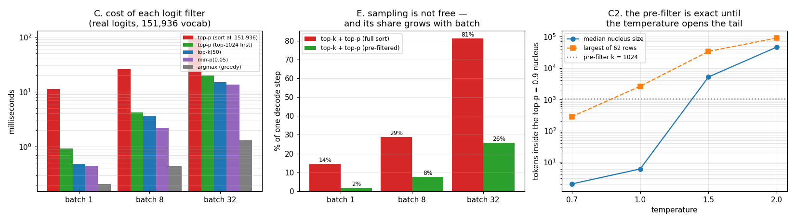

# Sampling Kernel

---

> Choosing the next token looks like the cheap part of a decode step. It is not. Findings, all on **real logits** from a real model: at batch 32, `top-k + top-p` implemented the obvious way costs **81% of the decode step it rides on** — the sampler nearly doubles the cost of generation. Pre-filtering to the top 1,024 candidates before sorting cuts that to **26%** (a **4.8x–12.2x** speedup on the filter itself) and matches the full sort on **61 of 62** real distributions at *T*=0.7 — the one difference being a rounding-boundary token, not a truncated tail. [Greedy](/shared/glossary/#greedy-decoding) `argmax` costs **1%**. Two honest surprises: our top-p and HuggingFace's disagree on **1 row in 16** — same formula, different summation order, **6.8e-05** of probability mass in dispute — and a one-character clamp bug in a [Gumbel](/shared/glossary/#gumbel-max-trick) sampler produces a distribution **0.377** total-variation away from the truth while raising nothing and looking completely normal.

---

## Key Insight

All of [sampling](/shared/glossary/#sampling) — [temperature](/shared/glossary/#temperature), [top-k](/shared/glossary/#top-k), [top-p](/shared/glossary/#top-p), [min-p](/shared/glossary/#min-p), [repetition penalty](/shared/glossary/#repetition-penalty) — is a chain of transforms on one `(batch, vocab)` array of [logits](/shared/glossary/#logits), followed by one random draw. Each transform is simple. Stacked on a 151,936-entry vocabulary, inside a loop that runs once per token per user, they stop being simple.

## Why This Matters

The sampling path is the one part of an inference engine that beginners assume is free and profilers show is not. It is also where correctness bugs hide best: a sampler that is subtly wrong still produces fluent text, so nothing crashes, no test fails, and the only symptom is that your model feels slightly worse than the same model served by someone else.

---

**This is project 4.**

### The words first

- **[Logits](/shared/glossary/#logits)** — one raw score per vocabulary entry, before [softmax](/shared/glossary/#softmax). All the filters below work on logits, and "filtering" means setting the losers to `-inf` so softmax gives them probability exactly 0.
- **[Temperature](/shared/glossary/#temperature)** — divide all logits by *T*. The name is borrowed from statistical physics: the Boltzmann distribution `exp(−E/kT)` has the same shape, and raising the temperature of a physical system makes its states more equally likely. Same here — high *T* flattens the distribution, low *T* sharpens it, and `T→0` is [greedy](/shared/glossary/#greedy-decoding).
- **[Top-k](/shared/glossary/#top-k)** — keep the k best tokens. Fixed-size shortlist.
- **[Top-p](/shared/glossary/#top-p) (nucleus)** — keep the smallest set of best tokens whose probabilities sum to *p*. "Nucleus" because you are keeping the dense core of the distribution and dropping the diffuse tail. Variable-size shortlist — that is the whole point.
- **[Min-p](/shared/glossary/#min-p)** — keep tokens whose probability is at least `min_p ×` the best token's probability. Also variable-size, but computed with one comparison instead of a sort.
- **[Repetition penalty](/shared/glossary/#repetition-penalty)** — divide the logits of already-seen tokens by a constant > 1 to discourage loops.
- **[Gumbel-max trick](/shared/glossary/#gumbel-max-trick)** — add a specific kind of random noise to logits and take the `argmax`; the result is distributed exactly as if you had done softmax-then-sample. Named after Emil Julius Gumbel, who studied the statistics of **maxima** (annual floods, record temperatures) — and the distribution of a maximum is exactly what this trick manipulates.
- **[Total-variation distance](/shared/glossary/#total-variation-distance)** — one number for "how different are these two distributions", equal to half the sum of absolute differences. 0 = identical, 1 = disjoint. Section B uses it as the pass/fail measure for a sampler.

### "The model already outputs probabilities. Why filter them at all — isn't sampling from the model's own distribution the *correct* thing to do?"

It is the mathematically faithful thing, and it is a bad product. A 151,936-token distribution has an enormous tail: even when the model is 99% sure, the remaining 1% is spread over tens of thousands of tokens, and a 1-in-100 chance of an absurd word fires roughly once per hundred tokens — several times per answer.

Filtering is the admission that **the model's tail is worse-calibrated than its head**. The model has seen millions of examples of the likely continuations and almost none of the unlikely ones, so the ranking near the top is trustworthy and the exact probabilities near the bottom are noise. Top-k, top-p and min-p are three different guesses at where "trustworthy" ends:

- top-k cuts at a **fixed rank** — simple, but wrong in both directions: too permissive when the model is certain, too restrictive when it is genuinely torn.
- top-p cuts at a **fixed probability mass** — adapts to the model's confidence, at the cost of a sort.
- min-p cuts at a **fixed ratio to the best token** — also adapts, and needs no sort at all.

Section F shows the three behaving very differently on one real distribution, and section C shows what each costs.

### "Isn't min-p just top-p with extra steps? Why does a serving engine ship both?"

They answer the same question — "how many candidates deserve a chance?" — with different definitions, and the gap between them widens exactly where it matters. On this project's real logits at *T*=1.5:

| | tokens kept |
|---|---|
| top-p (0.9) | **11,206** |
| min-p (0.05) | **28** |

Top-p is measuring *cumulative mass*, and at high temperature the flattened tail holds a lot of mass spread over a lot of tokens, so the nucleus explodes. Min-p is measuring *relative height*, and no matter how flat the distribution gets, a token 20x less likely than the best one is still excluded. That is why min-p became popular for creative writing at high temperature: it stays sane where top-p stops filtering at all.

It is also **25x cheaper** than a full-sort top-p (section C: 0.45 ms vs 11.31 ms at batch 1) because there is no sort at all — just `probs.max()` and one comparison.

### "Why pre-filter to 1,024 before the top-p sort? Top-p already sorts — isn't this doing the same work twice?"

It is doing *less* work, not the same work twice, and the distinction is worth being precise about.

- **The full sort** orders all 151,936 logits: `O(V log V)` with a large constant, and it is the single most expensive operation in the whole sampling path (11.3 ms at batch 1; 95.3 ms at batch 32).
- **`topk(1024)`** does not order the vocabulary. It makes one pass with a bounded heap and returns the 1,024 largest, `O(V log k)` — and crucially it moves 148x less data into the sorting step that follows.

Since top-p's answer only ever involves the few tokens at the top, ranking the other 150,912 is pure waste. Pre-filtering skips it. Measured: **12.2x** faster at batch 1, **4.8x** at batch 32, and it gives the same answer whenever the nucleus fits inside 1,024 — which section C shows is essentially always at *T* ≤ 1.0 and never at *T* ≥ 1.5.

---

## Running it

```bash
python3 run.py            # ~11 s
python3 run.py --plot     # redraw the figure from the committed findings.json
```

Needs `torch`, `transformers`, `matplotlib`. All measurements use a **bank of 62 real next-token distributions**, produced by one forward pass of Qwen2.5-0.5B-Instruct over a mixed prompt (prose, code, Q&A, story opening). This matters more than it sounds — see the warning below.

> **About the numbers.** Everything below comes from the committed
> [`outputs/findings.json`](outputs/findings.json) and
> [`outputs/findings.csv`](outputs/findings.csv).



### Why random logits would have given the wrong answer

The first version of this project benchmarked on `torch.randn(batch, 151936) * 2`. Those logits have a **top-p=0.9 nucleus of about 17,000 tokens**. Real logits from the same vocabulary have a **median nucleus of 6**. Every conclusion about pre-filtering, about min-p, and about cost inverts between those two worlds. If you take one methodological habit from this project, take this one: **benchmark the sampler on distributions your model actually produces.**

---

## A. Correctness: three exact matches and one instructive disagreement

Compared against `transformers`' own logits processors on 16 real rows:

| filter | identical kept-set | rows differing | probability mass in dispute |
|---|---|---|---|
| `top_k(50)` | ✅ | 0 / 16 | 0 |
| `min_p(0.05)` | ✅ | 0 / 16 | 0 |
| `repetition_penalty(1.1)` | ✅ | 0 / 16 | 0 |
| `top_p(0.9)` | ❌ | **1 / 16** | **6.78e-05** |

The top-p disagreement is not a bug in either implementation. Both compute "keep the smallest set of top tokens whose probabilities sum to 0.9". Ours sorts **descending** and accumulates from the most likely token down; HuggingFace sorts **ascending** and accumulates from the least likely up. Adding 151,936 floats in the opposite order gives a slightly different running total, and when the boundary token sits within rounding distance of the threshold, the two implementations put it on opposite sides.

Two things follow, and both are load-bearing for the rest of this guide:

1. **The disputed mass is 6.8e-05** — the disagreement is about a token with essentially no chance of being drawn. Practically harmless.
2. **It is not deterministic across implementations**, which means "same model, same seed, same parameters, different engine" is not a promise anyone can keep. [Project 06](../06-determinism-audit/README.md) takes this failure mode apart properly; note here that it appeared *without any GPU involved*, in a pure-CPU sum of floats.

## B. A sampler is a distribution, and one clamp turns it into garbage

400,000 draws from a 6-token distribution, scored by [total-variation distance](/shared/glossary/#total-variation-distance) from the exact softmax:

| drawer | TVD from truth | verdict |
|---|---|---|
| `torch.multinomial` | **0.00040** | correct (sampling noise at this sample size ≈ 0.001) |
| Gumbel-max | **0.00080** | correct |
| Gumbel-max with a clamp bug | **0.37676** | **badly wrong** |

The bug is one line:

```python
g = -torch.log(-torch.log(u.clamp_min(1e-20)).clamp_min(1e-20))   # WRONG
g = -torch.log(-torch.log(u.clamp(1e-20, 1 - 1e-7)))              # right
```

The inner `torch.log(u)` is already **negative** (u is in [0,1]), so `.clamp_min(1e-20)` replaces essentially every value with `1e-20`. The noise collapses, the argmax becomes near-deterministic, and the sampler quietly returns the most likely token far too often.

Why this is the archetypal sampling bug: **the output still looks like text.** No exception, no NaN, no shape error. Only a distribution test catches it — which is why "sample 400k times and compare frequencies" belongs in your test suite next to the shape assertions.

## C. What each filter costs, on 151,936 real logits

| filter | batch 1 | batch 8 | batch 32 |
|---|---|---|---|
| top-p (sort the whole vocabulary) | 11.31 ms | 25.97 ms | **95.29 ms** |
| top-p (pre-filter to top-1024) | **0.92 ms** | 4.18 ms | 20.01 ms |
| top-k(50) | 0.49 ms | 3.59 ms | 14.91 ms |
| min-p(0.05) | 0.45 ms | 2.18 ms | 13.44 ms |
| argmax (greedy) | 0.21 ms | 0.44 ms | 1.31 ms |
| **pre-filter speedup** | **12.24x** | 6.22x | 4.76x |

Greedy decoding is 50x cheaper than nucleus sampling. That is not an argument for greedy — it is an argument for knowing what your default sampling parameters cost, because most API defaults turn on top-p.

### When is the pre-filter exact?

| temperature | median nucleus | largest of 62 rows | rows with nucleus > 1024 | rows where pre-filter differs | …and with the renormalisation bug |
|---|---|---|---|---|---|
| 0.7 | 2 | 281 | 0 / 62 | **1** | 6 |
| 1.0 | 6 | 2,613 | 2 / 62 | **2** | 28 |
| 1.5 | 5,179 | 33,929 | 47 / 62 | 47 | 62 |
| 2.0 | 46,638 | 90,591 | 62 / 62 | 62 | 62 |

Read the two right-hand columns as a pair, because that comparison is a real bug found while writing this project.

The tempting way to write the pre-filter is: take the top 1,024 logits, `softmax` **those**, cumulative-sum, cut. It is wrong — softmax over a subset renormalises the mass to sum to 1, so every probability comes out slightly too large, the running total reaches *p* too early, and the nucleus is cut a token or two short. At *T*=1.0 that shifts **28 of 62 rows** instead of the 2 that genuinely have an oversized nucleus. The fix costs one full-row softmax (no sort): `softmax` over all 151,936 logits, *then* `topk` on the probabilities.

Both variants are in `sampling.py` (`top_p_filter_prefilter` and `..._renorm`) so the difference can be measured rather than argued about.

One row still differs at *T*=0.7 even with the correct pre-filter, and it is worth knowing why: **no** row there has a nucleus above 1,024, so this is not truncation. It is the same floating-point boundary effect as section A — `topk` then `cumsum` accumulates in a different order than `sort` then `cumsum`, and one token sitting within rounding distance of the 0.9 threshold falls on the other side of it.

**The operational rule:** pre-filtering with `k=1024` is exact for the temperatures production traffic uses (≤1.0) and silently truncates the tail above them. If you expose temperature to users, either scale k with temperature or fall back to the full sort above a threshold — do not let a "10x faster sampler" quietly change what high-temperature requests can produce.

## D. Batching the sampler helps — but only when each row is small

Batch 32, per-request Python loop vs one vectorized call:

| vocabulary | per-request loop | batched | speedup |
|---|---|---|---|
| 4,096 | 6.01 ms | 2.88 ms | **2.09x** |
| 32,768 | 31.04 ms | 23.34 ms | 1.33x |
| 151,936 | 128.39 ms | 125.67 ms | **1.02x** |

The loop's disadvantage is fixed overhead — 32 sets of Python calls, dispatch and allocation. When each row is 4,096 wide that overhead is a large share of the work and batching wins 2x. When each row is 151,936 wide the actual arithmetic dwarfs the overhead, and batching wins nothing.

**Why engines fuse sampling anyway:** on a GPU the fixed cost per operation is a *kernel launch* (~5–10 µs), and a sampling pipeline is 6–8 operations. At batch 1 on a GPU, the launches can cost more than the math — which is exactly the regime this CPU measurement cannot show you. The transferable lesson is the shape: **batching pays back overhead, not work**, so measure your overhead before assuming a fused kernel will help.

## E. Sampling's share of a decode step

Against project 01's measured decode-step times on the same machine:

| batch | decode step | greedy | top-k + top-p (full sort) | top-k + top-p (pre-filtered) |
|---|---|---|---|---|
| 1 | 81.1 ms | 0.3% | 14.5% | **1.7%** |
| 8 | 102.2 ms | 0.4% | 28.9% | 7.6% |
| 32 | 135.7 ms | 1.0% | **81.2%** | **25.7%** |

This is the result to remember. The decode step's cost is nearly flat in batch size (project 01: it is [memory-bound](/shared/glossary/#memory-bound), reading the same weights for everyone). The sampler's cost is *linear* in batch size, because every sequence needs its own sort over its own 151,936 logits. So the sampler's share grows with exactly the thing you increase to get throughput.

Left alone, sampling turns a 32-way batch — the whole point of which was 19x more tokens per second — into a run that spends **45% of its wall clock choosing tokens rather than computing them**. That is why production engines fuse the sampling path into one kernel and why vocabulary size is a serving cost, not just a modelling choice.

## F. The knobs, on one real distribution

After `"The capital of France is Paris. In 1969 humans first walked on the…"`, the top-5 candidates are ` the` (0.236), ` ` (0.194), ` Paris` (0.111), ` which` (0.054), ` this` (0.053).

| temperature | p(best token) | top-p(0.9) keeps | min-p(0.05) keeps |
|---|---|---|---|
| 0.0 (greedy) | 1.000 | 1 | 1 |
| 0.7 | 0.374 | 7 | 7 |
| 1.0 | 0.236 | 43 | 10 |
| 1.5 | 0.068 | **11,206** | **28** |

At *T*=0.7 the two rules agree almost exactly. At *T*=1.5 they differ by a factor of 400. The plain consequence: **"top_p=0.9" does not mean a fixed amount of randomness** — it means whatever the temperature and the model's confidence make it mean, and at high temperature it means almost no filtering at all.

---

## What to take from this

1. **Benchmark on real logits.** Random logits have a nucleus three orders of magnitude too big and will send you to the wrong conclusion about every filter.
2. **The sort is the cost.** Pre-filter with `topk` before sorting; take the softmax over the whole row, not over the shortlist.
3. **Sampling scales with batch; decode does not.** At batch 32 the sampler can cost as much as the model.
4. **Test samplers as distributions.** 400k draws and a total-variation check catches bugs that no shape assertion ever will.
5. **"Same parameters" is not "same output" across engines.** Even a pure-CPU float summation order changes the nucleus boundary.

---

## Next

[Project 05 — detokenizer fuzzer](../05-detokenizer-fuzzer/README.md) takes the token this project chose and asks the surprisingly hard question of how to turn it back into text, one piece at a time.
