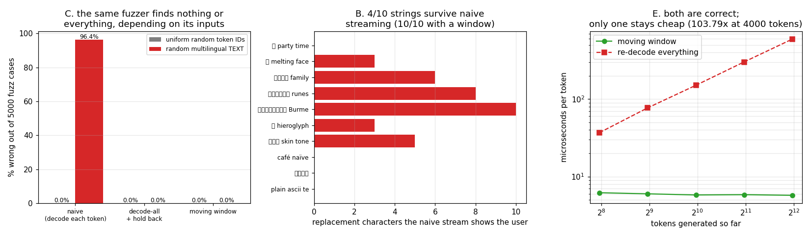

# Detokenizer Fuzzer

---

> `decode("a") + decode("b")` does not always equal `decode("ab")` — and a fuzzer will find the case that proves it, **if you point it at the right inputs**. Findings: **1,457 of Qwen's 151,643 vocabulary entries (0.96%)** are not characters at all, just fragments of UTF-8 bytes. Fuzzing with **uniform random token IDs found 0 failures in 5,000 cases**; the same fuzzer fed random *multilingual text* found **4,822 of 5,000 (96.4%)**, averaging **8.2 corrupted characters** per failure. Then the model itself broke it without any fuzzing at all: asked for a sentence with emoji, a plain 40-token generation produced **21 `�` characters** under naive streaming and perfect text under an incremental [detokenizer](/shared/glossary/#detokenization). Both correct implementations score 5,000/5,000 — but re-decoding the whole sequence each step costs **103.8x** more per token at 4,000 tokens than a moving window that never grows.

---

## Key Insight

This project generates token sequences and compares two ways of turning them back into text: piece-by-piece [detokenization](/shared/glossary/#detokenization) (one token at a time, as a streaming server does) versus all-at-once detokenization (the entire sequence in one call). Because [BPE](/shared/glossary/#bpe) works on *bytes*, a token can carry half a character — and the two paths then disagree.

## Why This Matters

Users notice when a streamed reply shows a `�` replacement glyph or a half-finished emoji, and the bug only appears on certain prompts — usually the ones from users whose language is not English. Production [tokenizers](/shared/glossary/#tokenizer) ship a dedicated incremental decoder for exactly this reason; building one, and building the fuzzer that catches its absence, is the cleanest way to understand why that extra machinery exists.

---

**This is project 5.**

### The words first

- **[Tokenizer](/shared/glossary/#tokenizer) / [detokenization](/shared/glossary/#detokenization)** — the map from text to token IDs, and back again.
- **[BPE](/shared/glossary/#bpe) (byte-pair encoding)** — build a vocabulary by starting from the 256 possible **bytes** and repeatedly merging the most frequent adjacent *pair*. The name is literal. The consequence that matters here: because it starts from bytes, nothing forces a token to end on a character boundary.
- **[UTF-8](/shared/glossary/#utf-8)** — the encoding that stores a character in 1 to 4 bytes. ASCII is 1, accented Latin is 2, most CJK is 3, emoji are 4. Bytes 2–4 of a character mean nothing on their own.
- **`�` (U+FFFD, the replacement character)** — what a UTF-8 decoder emits when it meets bytes that are not a valid character. It is not an error; it is a *substitution*, which is precisely why this bug is silent.
- **[ZWJ](/shared/glossary/#zwj-zero-width-joiner) (zero-width joiner)** — an invisible character that glues emoji into one picture: 👨‍👩‍👧‍👦 is *seven* codepoints (four people + three joiners), 25 bytes. Plenty of places to split.
- **Oracle** — the obviously-correct reference to test against: here, `tok.decode(all_ids)`.

## A Concrete Example

The emoji 🎉 is four bytes in UTF-8: `F0 9F 8E 89`. A [BPE](/shared/glossary/#bpe) [tokenizer](/shared/glossary/#tokenizer) might split those four bytes across two tokens — say token **A** decodes to `F0 9F` and token **B** decodes to `8E 89`. Neither half is valid UTF-8 on its own.

- **Piece-by-piece (streaming):** `decode(A)` sees `F0 9F`, can't form a character, and hands back the `�` replacement glyph; `decode(B)` does the same with `8E 89`. The user sees `��`.
- **All-at-once:** `decode([A, B])` concatenates the bytes *first* — `F0 9F 8E 89` — and only then interprets them, recovering the real 🎉.

Same two tokens, two different answers. That disagreement at the multi-byte boundary is exactly the bug the fuzzer is built to surface, and it explains why a streaming server needs more machinery than a single decode call.

The shortest failure the fuzzer found is three tokens long: `['🤛', '�', '�']` — where the last two fragments together are the Thai character `๒`. Naive streaming shows `🤛��`; the truth is `🤛๒`.

### Implementing all-at-once detokenization

All-at-once decoding is the simpler path to write, because you never have to deal with half a character:

1. Take the full list of token IDs.
2. For each token, look up the raw **byte string** it maps to and concatenate those bytes (not the decoded text) into one buffer.
3. Decode the whole buffer to text in a single UTF-8 pass — e.g. `byte_buffer.decode("utf-8")` in Python.

Because every multi-byte character's bytes are already sitting next to each other before decoding, valid UTF-8 always reassembles correctly. The streaming path is the hard one: it must hold back trailing bytes that *might* be the start of a multi-byte character and wait for the next token before emitting them — the same rolling-buffer idea the [stop-string matcher](../03-stop-string-matcher/README.md) relies on.

### "The tokenizer decodes tokens. Why write a detokenizer on top of the tokenizer's own decode?"

Because `decode()` answers a different question than a stream needs. `decode(ids)` means "what text do *these tokens together* represent". A stream needs "what text became *newly readable* when this token arrived" — and that is not `decode([newest_token])`, for two separate reasons:

1. **A token may be half a character** (the 🎉 case above). Its own decode is `�`.
2. **A token's text can depend on its neighbours.** Byte-level BPE merges and sentencepiece-style space handling both mean the characters a token contributes can change depending on what precedes it.

So the incremental detokenizer is not duplicating `decode()`; it *calls* `decode()`, on a small moving window, and computes the difference between two consecutive decodes. `decode()` supplies the meaning; the detokenizer supplies the streaming discipline `decode()` has no way to provide.

### "If holding back text fixes it, why not just re-decode the whole answer every step and emit the new part?"

That works, and `DecodeAllDetok` in `detok.py` does exactly that — 5,000/5,000 exact. It has one flaw, and it is the same flaw project 03 found in its rescanning matcher: **per-token work that touches every previous token**.

Section E measures it: re-decoding costs 36.9 µs/token at 250 tokens and **593.8 µs/token at 4,000** — the per-token cost grows linearly, so the total is quadratic. The moving window sits at **5.7–6.2 µs/token** regardless of length. At 4,000 tokens that is a **103.8x** gap, and unlike project 03's rescanner this one is not free at any length: even at 250 tokens it is already 6x behind.

And the failure is production-shaped: it only appears on long outputs, which are exactly the requests that were already slow.

---

## Running it

```bash
python3 run.py           # ~22 s
python3 run.py --plot    # redraw the figure from the committed findings.json
```

Needs `torch`, `transformers`, `matplotlib`. Sections A–C and E need only the [tokenizer](/shared/glossary/#tokenizer); section D runs a real generation with Qwen2.5-0.5B-Instruct on CPU.

> **About the numbers.** Everything below comes from the committed
> [`outputs/findings.json`](outputs/findings.json) and
> [`outputs/findings.csv`](outputs/findings.csv).



---

## A. Nearly 1% of the vocabulary is not text

| | |
|---|---|
| vocabulary size | 151,643 |
| entries that decode to a replacement character alone | **1,457** |
| share | **0.96%** |

These are the byte fragments. They exist because byte-level BPE guarantees the tokenizer can encode *any* byte sequence — including text in scripts the training corpus barely contained. That guarantee is valuable (no input is ever unencodable) and its price is paid right here: about one token in a hundred is meaningless by itself.

Note what 0.96% implies for the fuzzing strategy in section C. A random pair of tokens has roughly a 1-in-10,000 chance of being two fragments, and even then they usually do not combine into a valid character.

## B. Ten hand-written strings

| string | tokens | naive stream survives? | `�` shown to user |
|---|---|---|---|
| `🎉 party time` | 3 | ✅ | 0 |
| `🫠 melting face` | 5 | ❌ | 3 |
| `👨‍👩‍👧‍👦 family` | 11 | ❌ | 6 |
| `ᚠᚢᚦᚨᚱᚲ runes` | 11 | ❌ | 8 |
| `ကျွန်ုပ် Burmese` | 16 | ❌ | 10 |
| `𓀀 hieroglyph` | 6 | ❌ | 3 |
| `🥹🫶🏽 skin tone` | 8 | ❌ | 5 |
| `café naïve` | 4 | ✅ | 0 |
| `你好世界` | 2 | ✅ | 0 |
| `plain ascii text` | 3 | ✅ | 0 |
| **naive passes** | | **4 / 10** | |
| **moving window passes** | | **10 / 10** | |

The pattern in the passes is the real lesson. ASCII is safe (1 byte). Accented Latin is safe (2 bytes, and common enough to have its own tokens). Common Chinese is safe — `你好世界` is *two* tokens, because Qwen's training data had plenty of Chinese.

What breaks is: **rarer emoji, minority scripts, and anything with a zero-width joiner.** In other words, the failure rate of a naive detokenizer is a direct function of how well represented your user's language was in the tokenizer's training corpus. English-speaking developers testing in English will never see it. That is not a coincidence — it is the mechanism.

## C. The fuzzer that found nothing, and the fuzzer that found everything

Two runs of the same comparison, differing only in how inputs are generated:

| input generator | cases | naive wrong | decode-all wrong | moving window wrong |
|---|---|---|---|---|
| uniform random token IDs | 5,000 | **0 (0.0%)** | 0 | 0 |
| random multilingual **text**, then tokenized | 5,000 | **4,822 (96.4%)** | 0 | 0 |

The first row is the finding worth carrying away, because it is a fuzzing lesson rather than a Unicode one.

Uniform random token IDs cannot find this bug. Triggering it needs *two adjacent fragment tokens that happen to combine into a real character*, and fragments are 0.96% of the vocabulary with no reason to be adjacent. Sampling the token space uniformly puts almost no probability on the corner where the bug lives. **The fuzzer was correct, exhaustive, and blind.**

The second row samples *text* — random characters from emoji, runic, Burmese, hieroglyphic, Thai, CJK and ASCII ranges — and then lets the tokenizer decide the splits. Now the failing structure appears naturally, because the tokenizer produces exactly the fragment sequences that real text produces.

**The generalizable rule: a fuzzer explores the distribution you give it, not the space you imagined.** For any component downstream of a tokenizer, generate *text* and tokenize it; do not generate token IDs.

Also measured across both runs: the moving-window detokenizer never held back more than **3 tokens**. That bound (at most one character's worth of tokens) is what makes it safe to use on unbounded streams.

## D. The model breaks it without any fuzzing

Prompt: `"Write one sentence full of emoji about a party: 🎉"`, 40 tokens, [greedy](/shared/glossary/#greedy-decoding).

```
correct      : 🎉🎉 Party in the park 🎉🎉🎉 🎉🎉🎉 🎉🎉🎉 🎉🎉🎉 …
naive stream : 🎉🎉 Party in the park ���🎉🎉 ���🎉🎉 ���🎉🎉 ���🎉🎉 …
```

**21 replacement characters in a 40-token answer.** The moving-window detokenizer reproduces the correct string exactly.

The token pieces show what happened: `['🎉', '🎉', ' Party', ' in', ' the', ' park', ' �', '�', '�', '🎉', …]`. A bare `🎉` is one token, but `" 🎉"` — *space followed by* 🎉 — is not in the vocabulary, so the tokenizer emitted the space plus the first byte of the emoji as one token and the remaining bytes as two more. The exact same emoji renders perfectly in one position and shatters in another, decided by whether a space came first.

That is why this bug reaches production: it is not "emoji are broken", it is "emoji are broken *sometimes*", and the condition is invisible to anyone reading the output text.

## E. Cost: correctness is free, the wrong shape of correctness is not

| tokens so far | moving window | re-decode everything | ratio |
|---|---|---|---|
| 250 | 6.18 µs/token | 36.86 µs/token | 6.0x |
| 500 | 5.98 | 76.99 | 12.9x |
| 1,000 | 5.78 | 150.49 | 26.0x |
| 2,000 | 5.83 | 301.23 | 51.7x |
| 4,000 | **5.72** | **593.78** | **103.8x** |

Both columns are correct. One is flat and one doubles every time the answer doubles.

For scale: 593.8 µs is 0.6 ms, against a ~90 ms decode step on this machine — still under 1%. On a GPU where a decode step is 10–20 ms and a server is running 200 concurrent streams, the same 0.6 ms per token per stream becomes a genuinely busy CPU core doing nothing but re-decoding text it already decoded. This is the standard shape of a serving bottleneck: **not one slow thing, one cheap thing multiplied by concurrency and by length.**

---

## What to take from this

1. **Byte-level BPE means tokens are not characters.** About 1% of this vocabulary is byte fragments, and they cluster in exactly the languages your tests do not cover.
2. **Never emit a decode that ends in `�`.** Hold it; the next token probably completes it.
3. **Generate text, not token IDs, when fuzzing anything behind a tokenizer.** The uniform fuzzer here was 0-for-5,000.
4. **Watch the shape, not just the correctness.** Re-decoding everything is right and 103.8x too expensive at 4,000 tokens.
5. **This bug is a fairness bug.** It fires on minority scripts and rare emoji and never on English prose.

### Traps this project walks into on purpose

- **Testing detokenization with `你好世界`.** Chinese has whole tokens in this vocabulary and passes cleanly, which makes it a *reassuring* test that proves nothing.
- **Decoding one token in isolation.** Even without multi-byte characters, a token's contributed text can depend on the previous token; the window exists for that too.
- **Forgetting `flush()`.** A stream that ends mid-character must still emit the held-back bytes, exactly as in [project 03](../03-stop-string-matcher/README.md).

---

## Next

[Project 06 — determinism audit](../06-determinism-audit/README.md) asks a question this project brushed against in project 04's top-p disagreement: if nothing is random, why do two runs of the same prompt differ?
