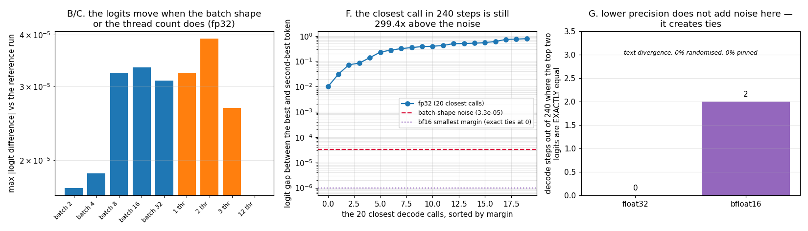

# Determinism Audit

---

> [Greedy decoding](/shared/glossary/#greedy-decoding) draws no random numbers, so the same prompt should give the same answer forever. It does not — and this project measures exactly how far the "should" breaks. Findings, and one of them contradicts the folklore: putting the same prompt inside a batch of 32 changes its [logits](/shared/glossary/#logits) by up to **3.3e-05**; changing the CPU thread count changes them by up to **3.9e-05**; adding masked left padding changes them by up to **4.2e-05**. All of that is real, reproducible, and involves **no randomness whatsoever**. And yet **0 of 20** generations under a randomised batch size and thread count produced different text — because across **240 decode steps** the smallest margin between the best and second-best token was **0.0100**, still **299x** larger than the noise. Then the twist: in **bfloat16**, the precision production actually serves, the batch-shape noise drops to **exactly 0.0** — and **2 of 240 decode steps become exact ties**, where the answer is decided not by the model but by whichever token `argmax` happens to return first.

---

## Key Insight

Non-determinism in LLM serving is not one phenomenon. It is a **noise source** (floating-point summation order, which changes with batch shape, thread count and padding) meeting a **decision margin** (how far apart the top two logits are). A flip needs both. Measuring only one of them — as most determinism discussions do — tells you nothing about whether your users will see different answers.

## Why This Matters

"Same prompt, same answer" is a contractual question in some deployments (regulated decisions, reproducible evaluations, cached responses, A/B tests) and a non-issue in others. You cannot decide which case you are in without knowing both numbers, and you cannot fix what you cannot attribute. This project attributes it.

---

**This is project 6.**

### The words first

- **Bitwise identical** — every bit of every float is the same. A much stronger claim than "the same to 6 decimal places", and the only one a cache or an audit log can rely on.
- **[Floating point](/shared/glossary/#floating-point)** — numbers stored with a fixed number of significant digits. The consequence that drives this whole project: addition is **not associative**. `(a+b)+c` and `a+(b+c)` can differ, because each `+` rounds.
- **Reduction order** — the sequence in which a sum over many terms is accumulated. A matrix multiply is a huge pile of sums; how the library splits them across threads and blocks decides the order, and the order decides the last bits.
- **Decision margin** — `logit(best) − logit(second best)` at one decode step. If the margin is bigger than the noise, the noise cannot change the token.
- **[bfloat16](/shared/glossary/#bfloat16)** — a 16-bit float with the same *range* as float32 but only ~3 significant decimal digits ("b" for **b**rain, from Google Brain, where it was designed). Production inference runs in bf16 or fp16 almost everywhere.
- **Tie-break** — what `argmax` does when two values are exactly equal. PyTorch returns the *lowest index*; that is a convention, not a law, and other implementations differ.

### "Nothing in greedy decoding is random. Where can a difference possibly come from?"

From the arithmetic itself. Every [logit](/shared/glossary/#logits) is the end of a chain of sums over thousands of terms, and floating-point addition rounds at every step, so **the order of the sum changes the answer in the last bits**.

A concrete example you can run in your head: in float32, `1e10 + 1.0 - 1e10` gives `0.0` if you add left to right (the `1.0` is lost in the rounding of `1e10 + 1.0`), and `1.0` if you add the last two first. Nothing is broken; the number just has a finite number of digits.

Now: a GEMM (matrix multiply) library picks how to split those sums across threads and cache blocks based on the **shape** of the matrices. Change the batch size from 1 to 32 and the shape changes, so the split changes, so the order changes, so the last bits change. Same weights, same input, same code — different sum order. That is sections B, C and D, and it is why the answer to "is greedy deterministic?" is "yes, given a fixed environment; no, across environments."

### "If a batched run changes the logits, doesn't the answer change too?"

Not necessarily — and this project's headline result is that it usually does not. The noise has to be big enough to reorder the *top two* candidates, and section F measures how close those two typically are:

| | value |
|---|---|
| median decision margin (240 steps) | **5.14** |
| 10th-percentile margin | 1.09 |
| smallest margin seen | **0.0100** |
| largest noise measured (section B) | **3.34e-05** |

The closest call in 240 decode steps still had **299x** more margin than the noise could cover. So the noise is real and the text is stable — a nice example of a true statement ("batching changes the numbers") that does not imply the conclusion people usually attach to it ("so batching changes your output").

Two caveats that keep this honest, and both are measurable rather than rhetorical:

- **Margins have a long tail.** Four prompts × 60 steps is not a proof about all prompts. A near-tie *will* eventually appear — sampling more text is how you would estimate the rate.
- **fp32 is not what you serve.** Section G repeats the audit in bfloat16 and finds a completely different failure mode.

### "Why does bfloat16 make things *better* in section G? Shouldn't less precision mean more noise?"

This surprised us too, and the resolution is worth understanding because it is the same mechanism, seen from the other side.

Low precision does not add random noise. It **quantizes** — it snaps every result onto a coarse grid of representable values. With ~3 significant digits, a reordering that would have changed the result by 1e-5 now changes it by less than half a grid step, so the rounded result is *identical*. That is why the bf16 batch-shape difference measures exactly **0.0** while fp32's measures 3.3e-05.

But the same grid does something worse at the top of the distribution: **two different logits land on the same grid point.** Section G finds **2 exact ties in 240 steps (0.8%)**, versus **0** in fp32. At a tie, the model has expressed no preference at all, and the token is chosen by the tie-break rule inside `argmax` — lowest index in PyTorch, but not necessarily in a fused CUDA kernel, another framework, or the next version of either.

The plain consequence: **in low precision, determinism stops being a question about arithmetic noise and becomes a question about tie-breaking conventions.** The first is fixable by pinning your environment; the second is only fixable by specifying the convention and testing it.

---

## Running it

```bash
python3 run.py           # ~3 min
python3 run.py --plot    # redraw the figure from the committed findings.json
```

Needs `torch`, `transformers`, `matplotlib`. Qwen2.5-0.5B-Instruct on CPU, float32 unless a section says otherwise. **This machine has no usable GPU** (a GTX 1070 Ti that this PyTorch build refuses to run kernels on), so every number is CPU. That changes the *magnitudes* — a GPU's reduction trees are wider and its noise is typically larger — but not the structure of the argument.

> **About the numbers.** Everything below comes from the committed
> [`outputs/findings.json`](outputs/findings.json) and
> [`outputs/findings.csv`](outputs/findings.csv).



---

## A. In a fixed environment, it is perfectly deterministic

100 identical forward passes, same process, same batch size, same threads:

| runs | bitwise different |
|---|---|
| 100 | **0** |

This is the baseline that makes everything else meaningful. There is no hidden randomness, no clock, no uninitialised memory. Anything that follows is caused by something we *changed*.

## B. Batch size changes the logits

The same prompt as row 0 of a batch of *n*, with unrelated sequences of the **same length** in the other rows — so no padding is involved and nothing about the prompt's own computation should change:

| batch | bitwise identical | max \|Δlogit\| | argmax same | top-5 same |
|---|---|---|---|---|
| 2 | ❌ | 1.72e-05 | ✅ | ✅ |
| 4 | ❌ | 1.86e-05 | ✅ | ✅ |
| 8 | ❌ | 3.24e-05 | ✅ | ✅ |
| 16 | ❌ | 3.34e-05 | ✅ | ✅ |
| 32 | ❌ | 3.10e-05 | ✅ | ✅ |

Your request's numbers depend on **who else was in the batch**. Not on their content — on the mere fact of their presence, because it changed the shape of a matrix.

This is the single most under-appreciated fact about production LLM serving: with [continuous batching](/shared/glossary/#continuous-batching), the batch composition at each step depends on other users' arrival times. Your output therefore depends on traffic. There is nothing you can do about that from inside your own request.

## C. Thread count changes the logits

| threads | bitwise identical | max \|Δlogit\| |
|---|---|---|
| 1 | ❌ | 3.24e-05 |
| 2 | ❌ | 3.91e-05 |
| 3 | ❌ | 2.67e-05 |
| 12 | **✅** | **0.0** |
| 6 (reference) | ✅ | 0 |

Same mechanism: more threads means the sum is split into more partial sums, combined in a different order.

The 12-thread row is the instructive one. It matches the 6-thread reference *bitwise* — because the machine has 12 logical cores over 6 physical ones, and the threading layer's blocking decision came out the same. **Determinism here is an accident of a library's internal heuristics, not a guarantee**, and a library upgrade can silently change it.

## D. Padding changes the logits, even when it is masked

| left padding | bitwise identical | max \|Δlogit\| | argmax same |
|---|---|---|---|
| 1 token | ❌ | 4.01e-05 | ✅ |
| 8 tokens | ❌ | 3.19e-05 | ✅ |
| 64 tokens | ❌ | 4.20e-05 | ✅ |

The [attention mask](/shared/glossary/#attention-mask) is correct: the padded positions contribute nothing to the result *mathematically*. They still contribute rounding, because the masked terms are computed and then multiplied by zero (or added as `-inf` before a [softmax](/shared/glossary/#softmax)) inside sums whose length and layout changed.

"Masked out" means "does not affect the mathematics", not "does not affect the floating point". This is the largest of the three noise sources measured here.

## E. And yet the text does not change

20 generations of 24 tokens, each with a randomly chosen batch size (1–16) and thread count (1–12):

| runs | produced different text |
|---|---|
| 20 | **0** |

Every logit vector in this test differed from the reference. Not one token did.

## F. Why: the margin is 299x the noise

240 decode steps across 4 prompts (an explanation, a copy task, a counting task, and a repeating pattern):

| statistic | value |
|---|---|
| median margin | 5.1444 |
| p10 margin | 1.0865 |
| **minimum margin** | **0.0100** |
| max noise from batch shape | 3.34e-05 |
| **worst-case margin ÷ noise** | **299.4x** |
| steps with margin below 2× the noise | **0** |

Language models are usually not close to a decision. A margin of 5 logits is a probability ratio of `e^5 ≈ 150:1`; nothing in the last bits of a float is going to overturn that.

**How to use this number rather than the folklore:** the flip rate is `P(margin < noise)`, so if you need to know whether *your* deployment is stable, measure your margin distribution on your traffic and compare it with your engine's noise. Both are one afternoon's work, and the answer is workload-specific — a summarizer that copies from its input has huge margins, a creative-writing model at high temperature has small ones.

## G. bfloat16: the noise disappears and ties appear

Repeating the audit with the model in [bfloat16](/shared/glossary/#bfloat16):

| | float32 | bfloat16 |
|---|---|---|
| max \|Δlogit\| at batch 2 / 8 / 32 | 1.7e-05 / 3.2e-05 / 3.1e-05 | **0.0 / 0.0 / 0.0** |
| median decision margin | 5.14 | 5.38 |
| **exact ties in 240 steps** | **0** | **2 (0.8%)** |

Two conclusions that pull in opposite directions:

- **bf16 is *more* reproducible across batch shapes**, because its grid is coarse enough to absorb the reordering. If your goal is "the same request gives the same bits regardless of who else is in the batch", lower precision helps.
- **bf16 introduces a new class of ambiguity.** Roughly 1 decode step in 125 has no winner at all. The output is then determined by `argmax`'s tie-break, which PyTorch documents as *the first occurrence* but which fused kernels, other frameworks and reduction trees are free to implement differently.

For a serving team: if you promise bitwise reproducibility in bf16, you are promising that your `argmax` implementation never changes — including inside any library upgrade that swaps a fused sampling kernel in.

## H. The fix, and its limits

Pinning batch position (always 1) and thread count (always 6), then repeating section E's test:

| | divergence rate |
|---|---|
| randomised batch size + thread count | 0/20 |
| **pinned** | **0/20** |

Both are zero here, so this project cannot claim a dramatic fix — the honest statement is that **the fix removes the noise source (sections B and C prove it was there), not a divergence we were able to provoke.**

What pinning genuinely buys you is stated more usefully as a list of what it does *not* buy:

| still not fixed by pinning your process | why |
|---|---|
| a different GPU or CPU model | different kernels, different reduction trees |
| a different engine (vLLM vs TGI vs HF) | different implementations of the same formula — [project 04](../04-sampling-kernel/README.md) measured our top-p and HF's disagreeing on 1 row in 16 |
| a library upgrade | section C's 12-thread row shows how fragile a blocking heuristic is |
| **[continuous batching](/shared/glossary/#continuous-batching)** | your batch neighbours are other users, arriving at random times |
| bf16 exact ties | decided by a tie-break convention, not by your configuration |

The last two are why production engines that need reproducibility offer a *batch-invariant* mode — kernels whose reduction order does not depend on batch size — and pay real throughput for it. That is the actual trade: determinism is not free, and it costs the thing you batch for.

---

## What to take from this

1. **A fixed environment is bitwise deterministic.** 100/100. Every difference below was caused by a change we made.
2. **Batch shape, thread count and padding each move the logits by ~1e-5** with no randomness involved, purely through floating-point summation order.
3. **Noise alone does not flip tokens; margin decides.** The closest of 240 decisions had 299x more margin than the noise.
4. **Low precision does not simply mean more noise.** In bf16, batch-shape differences vanished and exact ties appeared instead.
5. **Measure both numbers on your own workload.** "Is greedy decoding deterministic?" has no answer that is not workload-specific.

### Traps this project walks into on purpose

- **Comparing runs with different padding *lengths* and calling it a batching effect.** Section B uses equal-length rows so the only variable is the batch dimension; section D isolates padding separately.
- **Reusing a mutated KV cache between runs.** Each measurement re-prefills from the same token IDs.
- **Concluding from `argmax_same=True` that the system is deterministic.** The logits were not identical — a cache keyed on outputs would still be fine, but one keyed on logits, or an eval that hashes them, would not.

---

## Next

[Project 07 — request-lifecycle tracer](../07-request-lifecycle-tracer/README.md) goes back to the server from project 02 and asks where a slow request's time actually went.
