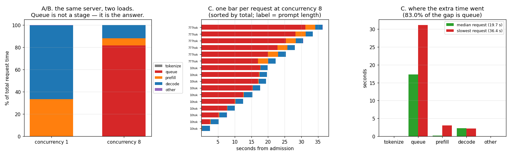

# Request-Lifecycle Tracer

---

> "The server is slow" is not a diagnosis. This project stamps a timestamp on every stage of every request — admission, tokenize, queue, [prefill](/shared/glossary/#prefill), each [decode](/shared/glossary/#decode) step, done — drives the [project 02](../02-streaming-server/README.md) server with a mixed workload, and draws the waterfall. Findings: with one user, time is **33.2% prefill and 66.5% decode** and there is no queue. At concurrency 8 the same server spends **81.6% of every request's life waiting in a queue**, with prefill down to 6.4% and decode to 11.9%. The slowest request took **36.4 s** against a median of **19.7 s**, and **83.0% of that 16.7-second gap was queue** — its own [prefill](/shared/glossary/#prefill), 24x bigger than the median request's, explains only 2.9 s of it. Meanwhile the decode cadence never degraded (p99 **150 ms → 132 ms**), and the client's measured latency matched the server's own accounting to **0.0%** — **2.3 ms** of HTTP in a 17.3-second [TTFT](/shared/glossary/#ttft).

---

## Key Insight

A per-stage trace turns "which request was slow?" into "which *stage* was slow, and why". Once you have it, most performance arguments end in one table — and the answer is usually a stage nobody was optimizing.

## Why This Matters

Optimization effort follows attention, and attention follows what is easy to see. The kernel is easy to see: it has a name, a profiler, a paper. The queue has none of those, and in this measurement it is **81.6% of the latency**. A team without a lifecycle trace will spend a quarter on a kernel that owns 12% of the time.

---

**This is project 7.**

### The words first

- **Stage** — a named, non-overlapping slice of one request's wall clock. Non-overlapping is the load-bearing word: if stages can overlap, the percentages stop adding up and the trace stops being an argument.
- **Waterfall** — one horizontal bar per request, cut into coloured stages, all on the same time axis. The standard picture for "who was waiting on whom" (your browser's network tab draws one).
- **[Flamegraph](/shared/glossary/#flamegraph)** — the related picture for *nested* time (function calls inside function calls); its width is time and its height is call depth. A request lifecycle is a flat sequence, not a call stack, so a waterfall is the right shape here — the same information, one level deep.
- **Queue time** — from "tokenized and ready" to "the model actually started on me". It is not work; it is *waiting for someone else's work* to finish.
- **[Head-of-line blocking](/shared/glossary/#head-of-line-blocking)** — one request at the front holding up everything behind it.
- **Attribution** — splitting a *difference* (slow request minus median request) across stages, rather than just reporting each stage's size. It is the difference between "the slow request had a big queue" and "the queue is where its extra time came from".

### "The client already measures latency. Why instrument the server as well?"

Because the client measures *how much*, and can never say *where*. A client sees one number per request — 36.4 seconds — and every explanation is consistent with it: a big prompt, a slow GPU, a network hiccup, a queue. The server's own timestamps separate those, and section C shows why that matters: the slow request really did have a 78x bigger prompt, so "big prompt" was a plausible story — and it accounts for **2.9 s of a 16.7-second gap**. The other 13.9 s was waiting.

Without the trace you would have "optimized" the prefill path, gained 2.9 s at best, and left 83% of the problem untouched.

The opposite check matters too, and section D runs it: **is the trace missing anything?** Client-measured latency is compared against the sum of the server's stages. Here they agree to 0.0% (2.3 ms of HTTP inside a 17.3-second TTFT), which says the trace is complete — on loopback, with one process. Over a real network, behind a proxy, that gap is exactly where the interesting bugs live, and you only find it by measuring both ends.

### "Isn't queue time just the scheduler being slow? What would I even do about it?"

Queue time is not a bug in the scheduler — it is the *shape* of the scheduler's policy, made visible. This server's policy is "one request at a time, first come first served", so a request's queue time is the sum of the full generation times of everyone ahead of it. That is a policy decision with three known alternatives, each of which moves the number:

| change | effect on queue |
|---|---|
| **[Continuous batching](/shared/glossary/#continuous-batching)** ([phase 3](../../README.md#phase-3-batching-and-scheduling)) | requests run *together* rather than in turn; queue time collapses to "wait for the next iteration", not "wait for the previous answer" |
| **[Chunked prefill](/shared/glossary/#chunked-prefill)** | the 777-token prompt stops occupying the engine in one 3-second block |
| **Priority / [SLO](/shared/glossary/#slo)-aware scheduling** ([project 22](../22-slo-aware-scheduler/README.md)) | short requests stop queueing behind long ones |

So the trace does more than locate the problem: the *name of the stage* selects the family of fixes. That is the practical value of insisting on non-overlapping, named stages.

---

## Running it

```bash
python3 run.py            # ~90 s: starts the traced server, load-tests it, stops it
python3 run.py --plot     # redraw the figure from the committed findings.json
```

Needs `torch`, `transformers`, `fastapi`, `uvicorn`, `httpx`, `matplotlib`. It reuses `server.py` from [project 02](../02-streaming-server/README.md) unchanged, with the `TRACE_PATH` environment variable set — the tracing code was written into that server from the start, which is the point: **tracing is not something you bolt on during an incident.**

The raw trace is committed as [`outputs/trace.jsonl`](outputs/trace.jsonl), one JSON object per request.

> **About the numbers.** Everything below comes from the committed
> [`outputs/findings.json`](outputs/findings.json) and
> [`outputs/findings.csv`](outputs/findings.csv).



---

## A. With one user, there is no mystery

6 requests (4 short prompts of 10 tokens, 2 long ones of 777), sent one at a time:

| stage | share of total time |
|---|---|
| tokenize | 0.0% |
| **queue** | **0.0%** |
| prefill | 33.2% |
| decode | 66.5% |
| other (HTTP, SSE encoding, detokenize) | 0.3% |

Median request 2.312 s, worst 6.255 s. Everything the server did was *work*, and the split matches [project 01](../01-manual-inference-loop/README.md): a couple of long prompts push prefill to a third of the time, and the rest is 24 decode steps each.

Note what "other" being 0.3% tells you: HTTP framing, JSON encoding, [detokenization](/shared/glossary/#detokenization) and socket writes together cost less than a third of one decode step across the whole run. All the things that *feel* like server overhead are noise next to the model.

## B. With eight users, the same server is a queue with a model attached

16 requests (10 short, 6 long) at concurrency 8:

| stage | share | vs concurrency 1 |
|---|---|---|
| tokenize | 0.0% | — |
| **queue** | **81.6%** | was 0.0% |
| prefill | 6.4% | was 33.2% |
| decode | 11.9% | was 66.5% |
| other | 0.1% | was 0.3% |

Nothing got slower. The *work* is identical — same prompts, same 24 tokens each, same ~96 ms per decode step. The only new ingredient is other people, and it now owns four fifths of every request's life.

This is why "% of time in X" is a meaningless number without a stated load level. At concurrency 1, decode is two thirds of the time and looks like the thing to optimize. At concurrency 8, decode is 11.9% — and the same optimization that would have been worth 66% of a request is now worth 12%.

Median request: 19.561 s. Worst: 36.361 s. Worst queue: 31.168 s.

## C. The slowest request, attributed

| stage | median request | slowest request | difference |
|---|---|---|---|
| prompt tokens | 10 | **777** | 78x |
| tokenize | 0.000 s | 0.004 s | +0.004 s |
| **queue** | 17.312 s | **31.168 s** | **+13.856 s** |
| prefill | 0.122 s | 3.009 s | +2.887 s |
| decode | 2.227 s | 2.171 s | −0.056 s |
| other | 0.013 s | 0.009 s | −0.003 s |
| **total** | **19.674 s** | **36.361 s** | **+16.687 s** |

**83.0% of the gap is queue. 17.3% is prefill. Decode is negative** — the slow request's decode was marginally *faster* than the median's.

The story a beginner would tell from the request's own properties ("it had a 777-token prompt, so of course it was slow") is not wrong about prefill: 3.0 s vs 0.12 s is a real 24x. It is just small. The long request's true sin was arriving after ten others in a server that finishes one answer before starting the next.

Look again at the middle panel of the figure: the six long requests are the six longest bars, and almost all of that length is red. Their prompts are 78x bigger, but their orange prefill segments are barely visible.

## D. Does the trace explain everything? (a check you should always run)

| | client measured | server accounted | unexplained |
|---|---|---|---|
| median end-to-end | 19.563 s | 19.561 s | 0.002 s (**0.0%**) |
| median TTFT | 17.305 s | 17.302 s | **2.3 ms** |
| worst end-to-end | 36.363 s | 36.361 s | 0.002 s |

The stages sum to what the user experienced. That is a *result*, not a formality — a trace whose stages sum to 60% of the observed latency is telling you the important stage has no name yet, and it is by far the most common way a first tracing attempt fails.

Two honest limits on this particular clean result:

- **Loopback, one process, one machine.** No proxy, no TLS handshake, no cross-AZ hop, no cold DNS. Every one of those adds time that the engine's trace cannot see, which is exactly why the client-side number has to stay in the comparison.
- **The client is the same box.** Clock skew is zero here. Across machines you would compare *durations*, never absolute timestamps, unless you are prepared to think about clock synchronisation.

## E. What did *not* degrade: the decode cadence

| | p50 decode step | p99 decode step | worst |
|---|---|---|---|
| concurrency 1 | 93.6 ms | 150.1 ms | 150.1 ms |
| concurrency 8 | 96.3 ms | 131.8 ms | 133.7 ms |

Under 8x the load, the per-token cadence is unchanged — and the p99 is even slightly *better*, because the concurrency-1 run's tail is dominated by its own first-step warm-up costs.

This is the same trap [project 02](../02-streaming-server/README.md) flagged, seen from the tracer's side: **every per-step metric this server exports looks healthy at every load level.** The suffering is entirely in a stage that per-step metrics do not have an opinion about. If your dashboard is built from token-rate gauges, it will be green while your users wait half a minute.

---

## What to take from this

1. **Instrument stages, not requests.** A request-level latency number cannot be attributed; a stage-level one can.
2. **Attribute the *difference*, not the total.** "The slow request had a 31-second queue" is a fact; "83% of its extra time was queue" is a decision.
3. **Always check that the stages sum to the client's number.** The unexplained remainder is where the un-named stage hides.
4. **The name of the dominant stage picks the fix.** Queue → batching and scheduling. Prefill → chunking. Decode → kernels and quantization.
5. **Percentages are meaningless without a load level.** Decode went from 66.5% to 11.9% of the same work.

### Traps this project walks into on purpose

- **Overlapping stages.** If "prefill" and "queue" can overlap, the shares no longer add to 100% and the waterfall lies. Here `t_scheduled` is stamped *inside* the lock, so queue ends exactly where compute begins.
- **Tracing only when there is a problem.** The trace is in `server.py` from project 02, off by default, on with one environment variable. Adding it during an incident means measuring a different system than the one that broke.
- **Timing with `time.time()`.** Every stamp uses `time.perf_counter()`, a monotonic clock; wall-clock time can jump backwards (NTP) and produce negative stages.

---

## Next

[Project 08 — diffusion vs LLM serving](../08-diffusion-vs-llm-serving/README.md) points this same load generator at a completely different kind of model, and finds that almost none of the shapes measured in this phase carry over.
