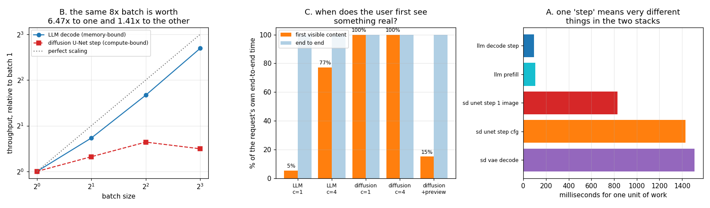

# Diffusion vs LLM Serving

---

> The same machine, the same HTTP interface, the same load generator — and two workloads that agree on almost nothing. Findings: an 8x batch is worth **6.47x throughput to LLM [decode](/shared/glossary/#decode)** and **1.41x to a [diffusion](/shared/glossary/#diffusion-model) U-Net** (which actually got *slower* going from batch 4 to 8). The LLM shows its first word after **5.3%** of the request; diffusion shows the user nothing until **100.0%** — there is no partial image, only partial noise. Paying for a preview at every step moves first content to **15.1%** and costs **+46% total time**, because one [VAE](/shared/glossary/#vae) decode (**1,508 ms**) is more expensive than a denoising step (**1,428 ms** with [CFG](/shared/glossary/#cfg-classifier-free-guidance)). Diffusion has a latency dial an LLM does not — 4/8/12 steps costs 6.98/12.89/18.71 s, exactly linear — and it keeps **1,536x less per-request state**: a constant 16 KB [latent](/shared/glossary/#latent-space) versus a [KV cache](/shared/glossary/#kv-cache) that grows 24.6 KB per token, 25.2 MB at 1k tokens.

---

## Key Insight

Almost every technique in this guide — [KV cache](/shared/glossary/#kv-cache) management, [continuous batching](/shared/glossary/#continuous-batching), speculative decoding, streaming — exists because LLM [decode](/shared/glossary/#decode) is [memory-bandwidth-bound](/shared/glossary/#memory-bound) and [autoregressive](/shared/glossary/#autoregressive-model). Diffusion is neither. Serving both behind the same interface is the fastest way to see which of your instincts are about *inference* and which are about *LLMs*.

## Why This Matters

Teams that succeed at LLM serving and then inherit an image endpoint tend to reach for the same playbook and get nothing. The differences are structural, not tuning: no KV cache to page, no jagged sequence lengths to schedule around, no cheap batching win, and no meaningful [TTFT](/shared/glossary/#ttft) unless you buy one.

---

**This is project 8.**

### The words first

- **[Diffusion model](/shared/glossary/#diffusion-model)** — a model that starts from pure noise and removes a little of it at each of N steps, guided by a text prompt, until an image remains. The name is from physics: particles *diffusing* into disorder, run backwards.
- **[Denoising step](/shared/glossary/#denoising-step)** — one pass of the U-Net over the whole image. Every step costs the same, and every step processes the entire image, which is why diffusion is "prefill-shaped".
- **[Latent space](/shared/glossary/#latent-space)** — Stable Diffusion does not denoise pixels; it denoises a compressed 32×32×4 array. "Latent" = hidden/not directly observable; the image is *implied* by these numbers but is not readable from them.
- **[VAE](/shared/glossary/#vae) decoder** — the network that expands a latent into actual pixels. This is the step that makes a latent *visible*, and it is not free (measured: 1,508 ms, more than a denoising step).
- **[CFG](/shared/glossary/#cfg-classifier-free-guidance) (classifier-free guidance)** — run the U-Net twice per step, once with the prompt and once without, and push the result away from the prompt-free direction. It doubles the work per step; "classifier-free" because earlier methods needed a separate trained classifier to steer generation and this one does not.
- **[U-Net](/shared/glossary/#u-net)** — the denoiser's architecture. Named for its shape when drawn: downsample to a bottleneck, then upsample back, with skip connections across the "U".

### "Why is there no TTFT for diffusion? Doesn't it produce the image gradually?"

It produces the image *gradually* but not *progressively*, and the difference is the whole point.

An LLM's partial output is **final**: token 3 will never change, so the server can send it and forget it. That is what makes streaming cheap — the tokens were already produced, and flushing them costs nothing extra ([project 02](../02-streaming-server/README.md)).

A diffusion model's partial output is **the whole image, still wrong**. At step 2 of 6 the latent contains a blurry version of the *entire* picture. Nothing is finished; everything will change. So there is no "first part of the answer" to send.

And what the model holds at step 2 is not even an image — it is a [latent](/shared/glossary/#latent-space). Turning it into pixels requires the [VAE](/shared/glossary/#vae) decoder, which section A measures at **1,508 ms**, i.e. **more than one denoising step (1,428 ms)**. So diffusion's "streaming" is not free flushing, it is **paying about one extra step of compute for every preview you show**. Section C measures the bill: **+46% end-to-end** to move first content from 100% to 15.1% of the request.

That is a genuine product decision with a price tag, not a plumbing detail — which is exactly what "diffusion has no TTFT" really means.

### "Batching is the big win for LLM serving. Why is it worth so little here?"

Because LLM decode is [memory-bound](/shared/glossary/#memory-bound) and a U-Net step is [compute-bound](/shared/glossary/#compute-bound), and batching only helps the first case.

[Project 01](../01-manual-inference-loop/README.md) showed why: an LLM decode step reads 1.98 GB of weights to multiply them by *one token's* vector. The arithmetic units are idle; adding 7 more sequences uses idle capacity, so 8x the work costs about 1.1x the time.

A U-Net step is the opposite. It already applies the weights to a 32×32 grid of latent positions — thousands of vectors, not one — so the multipliers are already busy. Adding a second image adds a second image's worth of arithmetic, and there is no spare capacity to absorb it. Measured: 1.19 → 1.68 image-steps/s across an 8x batch, **1.41x**, and *non-monotonic*: batch 4 (1.86 img-steps/s) beat batch 8 (1.68).

That non-monotonicity is worth taking seriously rather than smoothing away. Beyond some batch size the working set stops fitting in cache and the extra parallelism costs more than it earns. **For a compute-bound workload there is an optimal batch size and it is small**; for a memory-bound one, bigger is nearly always better until you run out of memory. Two workloads, two opposite tuning rules.

### "If diffusion is just N identical steps, isn't its scheduling trivial?"

Much simpler, yes — and the reasons are worth naming because they are exactly the reasons LLM scheduling is hard:

| | LLM | diffusion |
|---|---|---|
| work per request | unknown until it stops (EOS) | **known exactly** (steps × step cost) |
| state per request | [KV cache](/shared/glossary/#kv-cache), **grows every token** | one latent, **constant** |
| requests in a batch | different lengths, different positions | identical shape, identical step count |
| can a request be admitted? | depends on future cache growth ([project 21](../21-cache-aware-admission/README.md)) | depends on a constant |
| does a slow request hurt others? | yes — it holds cache slots for its whole life | only for its own known duration |

The measured version of row 2: **24,576 bytes per token** of KV cache (25.2 MB at 1k tokens) versus a **16,384-byte** latent that is the same size at step 1 and step 50 — a **1,536x** difference at 1k tokens, and unbounded as context grows.

So a diffusion scheduler is close to a classic fixed-size job queue, and the entire literature of [PagedAttention](/shared/glossary/#pagedattention), [preemption](/shared/glossary/#preemption) and cache-aware admission simply does not apply. What *does* apply is throughput scheduling of a compute-bound resource — a different, older, better-understood problem.

---

## Running it

```bash
python3 run.py            # ~4 min
python3 run.py --plot     # redraw the figure from the committed findings.json

# or drive the two-model server by hand
python3 server_both.py --port 8131 --threads 6
curl -N -X POST localhost:8131/imagine -d '{"prompt":"a red apple","steps":6}'
```

Needs `torch`, `transformers`, `diffusers`, `fastapi`, `uvicorn`, `httpx`, `matplotlib`. Models: **Qwen2.5-0.5B-Instruct** and **Stable Diffusion 1.5 (`Lykon/dreamshaper-8`)**, both float32 on **CPU** (this machine's GTX 1070 Ti is unusable by this PyTorch build). Diffusion runs at 256×256 with 6 [DPM-Solver++](/shared/glossary/#dpm-solver) steps so the whole project fits in four minutes; the *shapes* below are what transfer, not the absolute seconds.

> **About the numbers.** Everything below comes from the committed
> [`outputs/findings.json`](outputs/findings.json) and
> [`outputs/findings.csv`](outputs/findings.csv).



Actual output of the served endpoint (256×256, 6 steps, `"a red apple on a wooden table, studio photo"`):


---

## A. One "step" means very different things

| unit of work | cost |
|---|---|
| LLM decode step (1 token) | **94.7 ms** |
| LLM prefill (11-token prompt) | 105.8 ms |
| diffusion U-Net step, 1 image | 829.3 ms |
| diffusion U-Net step **with [CFG](/shared/glossary/#cfg-classifier-free-guidance)** (what actually runs) | **1,428.0 ms** |
| [VAE](/shared/glossary/#vae) decode (latent → pixels), once per image | **1,507.8 ms** |

Three things to read off this table:

1. **A diffusion step is 15x an LLM decode step**, and a request needs 6–50 of them. This is why image latency is measured in seconds and token latency in milliseconds.
2. **[CFG](/shared/glossary/#cfg-classifier-free-guidance) makes every step a batch of 2** (1,428 ms vs 829 ms — 1.72x, not 2x, because the batch of 2 is slightly more efficient than two batches of 1). Every diffusion request is *already* batched before your scheduler sees it, which is part of why adding more batch buys so little.
3. **The VAE decode costs more than a denoising step.** For a 6-step image it is 15% of the whole job — spent entirely on making the result visible.

## B. The same 8x batch, measured on both

| batch | LLM tokens/s | LLM gain | diffusion image-steps/s | diffusion gain |
|---|---|---|---|---|
| 1 | 11.4 | 1.00x | 1.19 | 1.00x |
| 2 | 18.9 | 1.66x | 1.49 | 1.25x |
| 4 | 36.2 | 3.18x | **1.86** | **1.56x** |
| 8 | 73.8 | **6.47x** | 1.68 | 1.41x |

The LLM line climbs towards the diagonal; the diffusion line flattens by batch 4 and turns *down* at batch 8.

**The plain consequence for a serving team:** on the LLM side, "increase max batch size" is a throughput lever with an obvious direction. On the diffusion side it is a tuning parameter with an interior optimum that you must measure — and past that point you are paying latency for negative throughput.

## C. Behind the same load generator

Identical client code, identical [SSE](/shared/glossary/#sse-server-sent-events) parsing, two endpoints:

| workload | first event | first **visible content** | content as % of E2E | E2E p50 | requests/s |
|---|---|---|---|---|---|
| LLM, concurrency 1 | 0.122 s | **0.122 s** | **5.3%** | 2.289 s | 0.411 |
| LLM, concurrency 4 | 7.826 s | 7.826 s | 77.3% | 10.118 s | 0.386 |
| diffusion, concurrency 1 | 1.934 s | **13.168 s** | **100.0%** | 13.169 s | 0.076 |
| diffusion, concurrency 4 | 21.536 s | 30.764 s | 100.0% | 30.765 s | 0.088 |
| diffusion + per-step preview | 2.894 s | **2.894 s** | **15.1%** | 19.193 s | 0.052 |

The two columns that matter are "first event" and "first visible content", and diffusion is the only workload where they differ.

- **Diffusion at concurrency 1** emits a progress event after 1.9 s — but that event carries *no image*. The user's first pixel arrives at 13.168 s, which is 100.0% of the request. A progress bar is not a stream.
- **With previews on**, the first real image arrives at 2.894 s (15.1%) and the request takes **19.193 s instead of 13.169 s — +46%**. You bought a 4.5x better perceived latency with 46% more compute. On a busy GPU that trade is a capacity decision, not a UX one.
- **The LLM's 5.3% → 77.3%** shift between concurrency 1 and 4 is the queueing effect [project 07](../07-request-lifecycle-tracer/README.md) took apart; it is included here to show the *same* client measuring both.

## D. A latency dial diffusion has and an LLM does not

| steps | seconds | s/step |
|---|---|---|
| 4 | 6.98 | 1.744 |
| 8 | 12.89 | 1.612 |
| 12 | 18.71 | 1.559 |

Perfectly linear, and the *quality* knob and the *latency* knob are the same knob. Compare the images:

| 4 steps (6.98 s) | 8 steps (12.89 s) | 12 steps (18.71 s) |
|---|---|---|
|  |  |  |

An LLM has no equivalent. You cannot ask for "a 30%-quality answer in 30% of the time" — the answer's length is chosen by the model, and cutting it off yields a truncated answer, not a rougher one. This is why the diffusion world invests so heavily in **step distillation** (training 50-step models to work in 1–4 steps): it is compressing the one dial that dominates its cost. See [Image Generation Phase 10](../../../image-generation/README.md#phase-10-training-at-scale-distillation-evaluation-and-frontier-topics).

The LLM analogue of that research is [speculative decoding](/shared/glossary/#speculative-decoding) ([Phase 4](../../README.md#phase-4-speculative-decoding)) — and note how differently it works: it cannot reduce the number of tokens, so it makes each *round* produce more of them instead.

## E. Per-request state

| | LLM | diffusion |
|---|---|---|
| per token / per step | **24,576 B per token** | 0 B |
| at 1,000 tokens / any step count | **25.2 MB** | **16,384 B** |
| at 8,000 tokens | 201.3 MB | 16,384 B |
| ratio at 1k tokens | | **1,536x** |

The LLM number is for this *small* 0.5B model; [Phase 2](../../README.md#phase-2-the-kv-cache) computes 320 KB/token for a 70B model, i.e. 2.6 GB for a single 8k-token request.

This single row explains why the two stacks look so different. An LLM server's central data structure is a memory allocator for a growing, per-request cache — hence [PagedAttention](/shared/glossary/#pagedattention), block tables, [preemption](/shared/glossary/#preemption), prefix sharing, cache quantization. A diffusion server's per-request state is a constant you can put in a config file.

---

## What to take from this

1. **Batching is a memory-bound trick.** 6.47x for LLM decode, 1.41x for a U-Net — with an interior optimum at batch 4.
2. **Diffusion has no free streaming.** Partial output is not final output, and making a latent visible costs more than computing one.
3. **Diffusion's cost is known in advance; an LLM's is not.** That one fact removes most of the scheduling difficulty — and most of the scheduling toolbox.
4. **The steps knob has no LLM equivalent**, which is why distillation is to diffusion what speculative decoding is to LLMs.
5. **Do not serve them from the same pool.** Their optimal batch sizes differ by ~2x here and by an order of magnitude on real hardware, and their memory behaviour has nothing in common.

### Traps this project walks into on purpose

- **Buffering the "stream".** The first version of `/imagine` built its event list and yielded at the end, which makes every event arrive simultaneously and turns a streaming measurement into a batched one. The fixed version runs the pipeline in a worker thread and drains a queue.
- **Timing the first pipeline call.** The 4-step run initially measured *slower* than the 6-step run; the first `pipe(...)` call pays one-time costs. There is now an explicit warm-up.
- **Reporting "TTFT" for diffusion without asking what arrived.** A progress event at 1.9 s and a picture at 13.2 s are both "the first event".

---

## Phase 1 complete

Eight projects: [the loop](../01-manual-inference-loop/README.md), [the server](../02-streaming-server/README.md), [stopping](../03-stop-string-matcher/README.md), [sampling](../04-sampling-kernel/README.md), [detokenizing](../05-detokenizer-fuzzer/README.md), [determinism](../06-determinism-audit/README.md), [tracing](../07-request-lifecycle-tracer/README.md), and this comparison.

The thread running through all of them: **a single request's lifecycle is simple, and everything expensive comes from the second request.** [Phase 2](../../README.md#phase-2-the-kv-cache) starts on the data structure that makes serving many of them possible at all.
