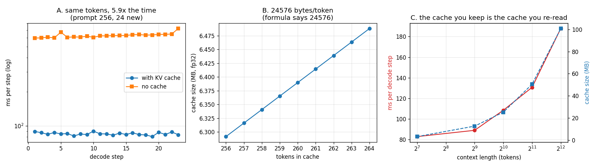

# KV Cache From Scratch

---

> The fastest way to understand the [KV cache](/shared/glossary/#kv-cache) is to delete it, watch [decode](/shared/glossary/#decode) crawl, then add it back. This project writes a whole [transformer](/shared/glossary/#transformer) [forward pass](/shared/glossary/#forward-pass) by hand — real Qwen2.5-0.5B weights, our own arithmetic — so the cache becomes a component *we* control instead of something the library hides. Findings: the hand-written model matches HuggingFace **token for token**, with logits agreeing to **2.5e-5** on a scale of 23. Deleting the cache gives **byte-identical text for 5.89x the time** at a 256-token prompt, and the per-step cost goes from a flat **85 ms** to **626 ms and climbing**. The textbook size formula predicts the cache to the byte: **24,576 bytes/token, measured 24,576**. And a decode step at 4k context costs **2.27x** one at 128 — from a cache that is only **5%** the size of the weights, which turns out to be a story about attention's *shape*, not its bytes.

---

## Key Insight

This project bolts a simple, contiguous [KV cache](/shared/glossary/#kv-cache) onto a [transformer](/shared/glossary/#transformer) and checks that generating *with* the cache produces exactly the same tokens as generating *without* it — bit-for-bit. The cache stores the [attention](/shared/glossary/#attention) keys and values from earlier tokens, so each [decode](/shared/glossary/#decode) step only has to compute them for the single new token.

## Why This Matters

Without a cache, every new token re-reads and re-computes the entire prompt, so generation gets slower the longer it runs. Building the cache yourself — and proving it changes speed but not output — is the cleanest way to trust that this optimization is safe before you rely on it in a real serving engine.

It also supplies the phase's shared engine. `kvlib.py` — the hand-written Qwen2 forward pass, the `KVCache` interface, and the timing helpers — is written here and reused by [project 11](../11-tiny-paged-cache/README.md), [project 12](../12-prefix-share-benchmark/README.md), [project 13](../13-kv-quantization-study/README.md), [project 14](../14-attention-sink-eviction/README.md) and [project 15](../15-cpu-nvme-offload/README.md).

---

**This is project 9.**

### The words first

- **[KV cache](/shared/glossary/#kv-cache)** — the saved **K**ey and **V**alue vectors of every token seen so far, at every layer. "Key" and "value" come from the database metaphor inside [attention](/shared/glossary/#attention): each past token publishes a *key* (what I am about, used for matching) and a *value* (what I contribute, used for the answer). The current token publishes a *query* and looks up the keys.
- **Causal** — from *cause*. Token *t* may only look at tokens 0…*t*, never at the future, because in a left-to-right model the future has not been caused yet. This one word is why the cache is correct: a past token's K and V can never change, so storing them is storing a constant.
- **[Prefill](/shared/glossary/#prefill)** — the one big [forward pass](/shared/glossary/#forward-pass) that reads the entire prompt. Called "pre-fill" because its job is to *fill* the cache *before* generation starts.
- **[Decode](/shared/glossary/#decode)** — the loop that produces one new token per forward pass.
- **[GQA](/shared/glossary/#gqa) (grouped-query attention)** — several query [heads](/shared/glossary/#heads) share one key/value head. Qwen2.5-0.5B has 14 query heads and **2** KV heads, so each KV head serves 7 queries and the cache is 7x smaller than it would otherwise be. The size formula uses the KV-head count, and using the query-head count instead is the single most common way to get it wrong.
- **[RoPE](/shared/glossary/#rope) (rotary position embedding)** — position is applied by *rotating* each pair of dimensions of the query and key vectors by an angle proportional to the token's index. It is called rotary because the operation is literally a 2-D rotation. The useful consequence: the dot product between a rotated query and a rotated key depends only on the *difference* of their positions.
- **[Perplexity](/shared/glossary/#perplexity)** — not used here, but it arrives in projects 13 and 14 as the quality metric.
- **Bit-for-bit / token-for-token identical** — the strongest form of "the optimization is safe". Not "close enough"; the same numbers.

### "Why write the model by hand? `transformers` already runs Qwen."

Because Phase 2 is about the cache, and `transformers` owns its cache. Every later project in this phase needs to change what the cache *is*:

| project | what it replaces the cache with |
|---|---|
| 11 | fixed-size blocks scattered across a pool, with a block table |
| 12 | blocks shared between requests that begin with the same tokens |
| 13 | keys and values stored in 8 or 4 bits |
| 14 | a cache that throws tokens away to stay inside a budget |
| 15 | a cache whose cold parts live on an SSD |

None of that is reachable from the outside of a library call. So `kvlib.py` writes out the forward pass — embedding, RMSNorm, q/k/v projections, RoPE, attention, [SwiGLU](/shared/glossary/#swiglu) MLP, output head — with exactly one seam in the middle:

```python
q, k, v  = projections(x)          # our code
k, v     = cache.append(layer, k, v)   # <- the seam every later project swaps
out      = attention(q, k, v)      # our code
```

That is roughly 120 lines. Section A proves those 120 lines *are* Qwen2.5, so every measurement in this phase is a measurement of the real model.

### "Prefill already computed the K and V for the prompt. Why keep them — can't decode just recompute?"

It can, and it produces exactly the same text — `generate_no_cache()` does precisely that, and section B confirms the output is identical token for token. The cache is not about *correctness*; it is about not repeating work that provably cannot change.

Here is why it cannot change. Attention is causal, so the K and V vectors of token 3 depend only on tokens 0–3. When token 200 arrives, token 3's K and V are the same numbers they were 197 steps ago. Recomputing them is not "refreshing stale data" — it is recomputing a constant.

And the bill for recomputing grows quadratically. Generating *N* tokens after a prompt of *P* re-reads a prefix that grows every step: `P + (P+1) + (P+2) + …`. Section B measures **5.89x** at `P=256, N=24`. At production context lengths it is the difference between a working product and one that never ships.

### "If the cache is only 5% the size of the weights, why does a longer context slow decode down at all?"

This is the question section D answers, and the answer is *not* the one the size formula suggests. Read section D before assuming the cache's bytes are the whole story — a naive attention implementation pays a cost that scales with context for reasons that have nothing to do with the cache's footprint, and that gap is the entire reason [FlashAttention](/shared/glossary/#flashattention) exists.

---

## Running it

```bash
python3 run.py           # ~4 minutes on 6 CPU threads
python3 run.py --plot    # redraw the figure from the committed findings.json
```

Needs `torch`, `transformers`, `matplotlib`. Model: **Qwen2.5-0.5B-Instruct** (494M parameters, 24 layers, 14 query heads, **2 KV heads**, head width 64, 151,936-token vocabulary), float32, **CPU only** — the GPU in this machine is a GTX 1070 Ti ([compute capability](/shared/glossary/#compute-capability) 6.1), which this PyTorch build refuses to run on, so every number below comes from 6 cores of an Intel i7-8700K. The *shapes* of the curves transfer to a GPU; the absolute milliseconds do not.

> **About the numbers.** Everything below comes from the committed
> [`outputs/findings.json`](outputs/findings.json) and
> [`outputs/findings.csv`](outputs/findings.csv).



---

## A. The hand-written model *is* Qwen2.5

| check | result |
|---|---|
| generated tokens, ours vs `generate(do_sample=False, repetition_penalty=1.0)` | **identical** |
| largest disagreement in the final [logits](/shared/glossary/#logits) | **2.53e-05** |
| scale of those logits | 23.1 |

Both produce: `"A KV cache is a type of memory-based data storage system that stores key-value pairs. It is a type of cache"`.

A logit gap of 2.5e-5 against values around 23 is a relative error of about one part in a million — floating-point summation order, nothing more. (Phase 1's [project 06](../06-determinism-audit/README.md) measured exactly this class of noise and found the *decision* margin between the top two tokens is roughly 300x larger, which is why the text never moves.)

Note the `repetition_penalty=1.0` in that comparison. Qwen ships `repetition_penalty: 1.1` inside its `generation_config.json`, so HuggingFace's "greedy" decoding is not [argmax](/shared/glossary/#argmax) unless you say so — [project 01](../01-manual-inference-loop/README.md) found that the hard way, and it changes the *first* token.

## B. What the cache buys: nothing in quality, 5.89x in time

Prompt 256 tokens, generate 24, same model, same weights:

| | with KV cache | without |
|---|---|---|
| total time | **2.56 s** | **15.06 s** |
| first pass ([prefill](/shared/glossary/#prefill)) | 0.588 s | 0.615 s |
| median decode step | **85 ms**, flat | **626 ms**, climbing |
| last decode step | 84 ms | 722 ms |
| output tokens | *identical* | *identical* |

The left panel of the figure is the whole argument in one picture: the cached line sits flat near the bottom; the uncached line sits 7x higher and drifts upward as the prefix grows.

Two details worth reading carefully:

- **The prefill costs the same either way** (0.588 vs 0.615 s). Of course it does — the first pass has nothing cached yet. The cache is a *decode*-side optimization exclusively, which is why it moves [ITL](/shared/glossary/#itl--tpot) and throughput but not [TTFT](/shared/glossary/#ttft).
- **The uncached line only drifts slowly upward** here because 24 new tokens on top of 256 is a 9% growth in prefix length. Run it for 2,000 new tokens and that drift becomes the dominant term — that is the quadratic curve everyone draws. The 5.89x measured here is the *mildest* version of the penalty, not the worst.

Also notice the ratio: an uncached step costs 626 ms against a 588 ms prefill of the *entire* 256-token prompt. That is the point — without the cache, every single decode step is nearly a full prefill.

## C. The size formula, checked against a real allocation

```
KV bytes per token = 2 (K and V) x n_layers x n_kv_heads x d_head x bytes
                   = 2 x 24 x 2 x 64 x 4
                   = 24,576 bytes
```

| | bytes per token |
|---|---|
| formula | 24,576 |
| measured, by watching the cache tensors grow | **24,576** |

Exact, with no fudge factor. The middle panel shows the cache growing by precisely one step's worth per token.

Two things to take from the arithmetic itself:

- **`n_kv_heads`, not `n_heads`.** This model has 14 query heads and 2 KV heads. Using 14 would predict 172 KB/token — **7x too big**. [GQA](/shared/glossary/#gqa)'s headline benefit is usually described as a FLOPs saving; at decode time the FLOPs saving is negligible and the *cache* saving is the whole point.
- **Compare against the weights.** 494M parameters at 4 bytes is **1.98 GB**. At 24.6 KB/token, the cache would have to hold **80,000 tokens** to match the weights. For this small model the cache is a rounding error — but for a 70B model at 320 KB/token, it takes only ~430k tokens at batch 1, or **13.5k tokens per user at batch 32**, to reach parity. [Project 10](../10-kv-size-calculator/README.md) works that out for six real models.

## D. Decode cost vs context — and why it is not what the bytes predict

| context | decode step | cache size | step vs 128-token step | cache vs 128-token cache |
|---|---|---|---|---|
| 128 | 82.9 ms | 3.3 MB | 1.00x | 1.00x |
| 512 | 89.0 ms | 12.7 MB | 1.07x | 3.9x |
| 1024 | 108.5 ms | 25.3 MB | 1.31x | 7.7x |
| 2048 | 130.7 ms | 50.5 MB | 1.58x | 15.4x |
| 4096 | **187.8 ms** | 100.8 MB | **2.27x** | 30.8x |

Here is the puzzle. Every decode step must read the **1.98 GB** of weights. Going from 128 to 4096 tokens of context adds only **97 MB** of extra reading — a **4.9%** increase in bytes moved. Yet the step got **127%** slower.

So the extra time is not the cache's bytes. It is the *shape* of the attention our code writes:

```python
k_all = k_all.repeat_interleave(7, dim=1)     # 2 kv-heads -> 14 query heads
scores = q @ k_all.transpose(-1, -2)          # materialises 14 x 1 x 4096
w = torch.softmax(scores, dim=-1)             # ... then reads it back
o = w @ v_all
```

Two costs hide there, and both grow with context:

1. **`repeat_interleave` physically copies** the 2 KV heads into 14. At 4096 tokens that is a 100 MB cache expanded into a 700 MB temporary, *per layer per step*. GQA's memory saving is thrown away the instant you materialize it.
2. **The score matrix is written to memory and read back** by the softmax, then read again by the second matmul. Three passes over a tensor that a fused kernel would keep in fast on-chip memory and never write out at all.

**This is exactly the gap [FlashAttention](/shared/glossary/#flashattention) closes**, and it is worth naming plainly: FlashAttention is not a faster multiply. It is the same multiply with the intermediate score matrix never leaving on-chip memory, and with the GQA expansion done by *indexing* rather than copying. Phase 6 measures it; this table is the "before" picture.

The honest reading of section D is therefore: **a real engine's decode cost does grow with context, but on this naive implementation most of that growth is our own overhead, not the cache.** Do not quote 2.27x as "what the KV cache costs at 4k" — quote it as what an unfused attention costs.

---

## What to take from this

1. **The cache changes speed, never output.** Both loops produced identical tokens. If your cached and uncached paths disagree, you have a bug — most often a position index that was not advanced, or a mask built from the wrong length.
2. **The size formula is exact, and it uses `n_kv_heads`.** 24,576 bytes/token predicted, 24,576 measured.
3. **The cache helps decode and does nothing for prefill.** Which means it moves [ITL](/shared/glossary/#itl--tpot) and throughput, not [TTFT](/shared/glossary/#ttft). Know which number your change is supposed to move.
4. **Measure before you attribute.** The step-cost growth in section D *looks* like the cache and is mostly unfused attention. The distinction decides whether you should buy memory or write a kernel.

### Common traps this project walks into on purpose

- **`n_heads` where `n_kv_heads` belongs.** 7x error on this model, 8x on Llama-3.1-70B, 71x on Falcon-7B.
- **Storing K and V before applying [RoPE](/shared/glossary/#rope).** Positions must be baked into the keys *before* they are cached, or every later step re-rotates them and the answers drift. `kvlib.py` applies RoPE to `q` and `k` and only then calls `cache.append`.
- **A causal mask built from lengths instead of positions.** `kvlib.py` builds the mask from *absolute positions* (`pos < kv_pos`) rather than from row indices, which costs nothing here and is the only reason project 14's evicting cache — whose rows are no longer 0, 1, 2, … — works at all.
- **Timing on a shared machine.** `interleaved()` runs variants round-robin and keeps the minimum. Timing A fully then B fully charges any background disturbance entirely to whichever ran during it; this box idles at load 2–4, so that error is real.

---

## Next

[Project 10 — KV size calculator](../10-kv-size-calculator/README.md) takes the formula this project verified and asks the capacity-planning question with it: how many users fit on one GPU, and which model shape decides that?
