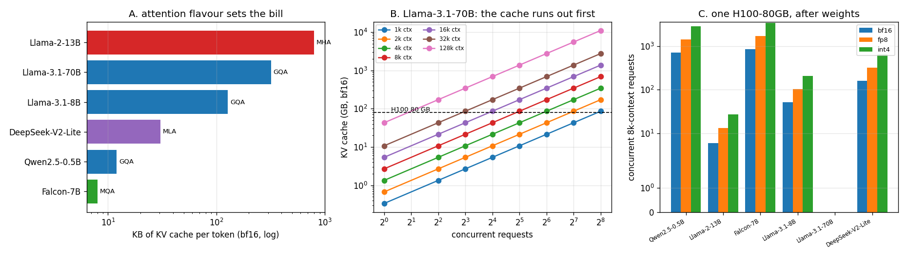

# KV Size Calculator

---

> On a busy server it is the [KV cache](/shared/glossary/#kv-cache), not the model [weights](/shared/glossary/#weights), that usually runs out of memory first. This project turns the size formula into code, checks it against a cache [project 09](../09-kv-cache-from-scratch/README.md) actually allocated (**0.000%** error), and sweeps it across six real model shapes. Findings: the same 8k-context request costs **8 KB** on Falcon-7B and **800 KB** on Llama-2-13B — a **100x** spread that comes from the attention design, not the parameter count. One H100-80GB holds **six** concurrent Llama-2-13B users and **858** Falcon-7B users. Llama-3.1-70B does not fit on one H100 at all; on the four it needs, 8k-context concurrency is **54** at bf16 and **218** at int4. And the crossover where cache outweighs weights arrives at **13,465 tokens per user** on a 70B at batch 32 — well inside a normal long-document workload.

---

## Key Insight

This project turns the KV-cache size formula into code and sweeps its inputs — number of key/value [heads](/shared/glossary/#heads), sequence length, and [dtype](/shared/glossary/#dtype) — to plot how much GPU memory the [KV cache](/shared/glossary/#kv-cache) eats as you serve more users at once. It makes clear why tricks like [GQA](/shared/glossary/#gqa) (sharing key/value heads) and lower-precision storage matter so much.

## Why This Matters

How many users a single GPU can serve at once is set mostly by KV-cache memory, not by the size of the weights. Being able to estimate that number on a napkin tells you whether a deployment will fit in [HBM](/shared/glossary/#hbm) — before you commit money to hardware.

---

**This is project 10.**

### The words first

- **[HBM](/shared/glossary/#hbm) (high-bandwidth memory)** — the memory soldered next to the GPU die. It is what "80 GB H100" refers to. Everything the GPU computes on has to fit here or be streamed in from somewhere slower.
- **[MHA](/shared/glossary/#heads) / [GQA](/shared/glossary/#gqa) / [MQA](/shared/glossary/#mqa) / [MLA](/shared/glossary/#mla)** — four ways to arrange attention heads, ordered by how much K/V they share:
  - **MHA** (multi-head attention) — every query head has its own key/value head. No sharing.
  - **GQA** (grouped-query) — heads are grouped, and each *group* shares one K/V head. The name says it: queries are *grouped*.
  - **MQA** (multi-query) — the extreme case, *one* K/V head for all queries. "Multi-query, single key/value."
  - **MLA** (multi-head latent attention, DeepSeek) — instead of storing K and V per head, store one small compressed vector per token and reconstruct K and V from it on the fly. "Latent" is the machine-learning word for a compressed hidden representation.
- **[Concurrency](/shared/glossary/#batching)** — how many requests are alive on one replica at the same time. Each one owns cache, so concurrency and cache size are the same question asked twice.
- **[bf16](/shared/glossary/#bfloat16) / [fp8](/shared/glossary/#fp8) / [int4](/shared/glossary/#int4)** — 2, 1 and 0.5 bytes per stored number. The cache is a pile of numbers, so its size scales exactly with this.

### "Isn't this just multiplying six numbers? Why does it need a project?"

Because the multiplication is easy and the *inputs* are where people go wrong, in four specific ways this project is built to expose:

1. **Using `n_heads` instead of `n_kv_heads`.** On Falcon-7B that is a **71x** overestimate. On Llama-3.1-70B, 8x. The formula only looks trivial once you know which head count goes in it.
2. **Forgetting that the weights are in the same memory.** The interesting quantity is never "how big is the cache" but "how much is left after the weights", and for a 70B model at bf16 the answer on one 80 GB card is *negative*.
3. **Quoting the batch-1 number.** A cache of 2.7 GB per request sounds harmless until you multiply by 32 users.
4. **Assuming MLA and GQA are the same kind of saving.** They are not: GQA divides the per-head cost by the sharing factor, while MLA replaces the whole per-head structure with a single shared latent. The formula itself has to change shape, which is why `kv_bytes_per_token()` in `run.py` takes an `mla=` argument instead of pretending a head count exists.

### "The guide already prints the formula. Why re-derive it here?"

The guide prints it; this project *validates* it. Section A compares the formula's prediction against the bytes a real cache actually allocated in project 09 — 24,576 predicted, 24,576 measured. That check is the difference between a formula you believe and a formula you can quote to a colleague who is about to sign a hardware order.

---

## Running it

```bash
python3 run.py           # ~5 seconds, no model download
python3 run.py --plot    # redraw the figure from the committed findings.json
```

Needs `matplotlib` only. Everything else is arithmetic — which is the point: capacity planning should cost a coffee's worth of thought, not a cluster reservation. Section A additionally reads
[`../09-kv-cache-from-scratch/outputs/findings.json`](../09-kv-cache-from-scratch/outputs/findings.json), so run project 09 first if you want that row filled in.

> **About the numbers.** Everything below comes from the committed
> [`outputs/findings.json`](outputs/findings.json),
> [`outputs/per_model.csv`](outputs/per_model.csv) and
> [`outputs/concurrency.csv`](outputs/concurrency.csv).



---

## A. The formula, checked against a real allocation

| | bytes per token (fp32, Qwen2.5-0.5B) |
|---|---|
| formula | 24,576 |
| measured in project 09 | **24,576** |
| error | **+0.000%** |

```
KV bytes per token = 2 (K and V) x n_layers x n_kv_heads x d_head x bytes
```

The 2 is "one key vector and one value vector". `n_kv_heads` is the count *after* GQA sharing. `d_head` is the width of one head. `bytes` is 4 for fp32, 2 for bf16, 1 for fp8, 0.5 for int4.

**MLA needs a different formula**, because it does not store per-head K and V at all:

```
MLA bytes per token = n_layers x (kv_lora_rank + qk_rope_head_dim) x bytes
```

No factor of 2, no head count. DeepSeek-V2-Lite's `kv_lora_rank` is 512 and its rotary part is 64, so one token costs `27 x 576 x 2` = **31 KB** instead of the **221 KB** the same model would cost with plain MHA.

## B. The same 8k request, on six models

| model | attention | layers | q-heads | kv-heads | KB/token (bf16) | vs. no sharing | cache at 8k | weights (bf16) |
|---|---|---|---|---|---|---|---|---|
| Falcon-7B | MQA | 32 | 71 | **1** | **8.0** | 71.0x smaller | 0.07 GB | 14.4 GB |
| Qwen2.5-0.5B | GQA | 24 | 14 | 2 | 12.0 | 7.0x | 0.10 GB | 1.0 GB |
| DeepSeek-V2-Lite | MLA | 27 | 16 | — | 30.4 | 7.1x | 0.25 GB | 31.4 GB |
| Llama-3.1-8B | GQA | 32 | 32 | 8 | 128.0 | 4.0x | 1.07 GB | 16.1 GB |
| Llama-3.1-70B | GQA | 80 | 64 | 8 | 320.0 | 8.0x | 2.68 GB | 141.2 GB |
| Llama-2-13B | **MHA** | 40 | 40 | 40 | **800.0** | 1.0x | 6.71 GB | 26.0 GB |

Read the first and last rows together. **Falcon-7B and Llama-2-13B differ by 100x in cache cost while differing by less than 2x in parameter count.** The cache bill is set by the attention design, not by how big the model is. A 13B model from 2023 is more expensive to *serve at scale* than a 70B model from 2024, per token of context — 800 KB against 320 KB.

The "vs. no sharing" column is the ratio to what the same layer/head/width shape would cost under plain MHA. That number *is* the sharing factor: `n_heads / n_kv_heads`. It is why the industry converged on GQA within about a year.

## C. How many users fit on one GPU

Weights first, cache in whatever is left. Assuming 90% of [HBM](/shared/glossary/#hbm) is usable (the rest goes to the framework, activations and fragmentation), 8k context per request:

| model | weights | one H100-80GB, bf16 cache | fp8 | int4 |
|---|---|---|---|---|
| Falcon-7B | 14.4 GB | **858** | 1,716 | 3,433 |
| Qwen2.5-0.5B | 1.0 GB | 705 | 1,411 | 2,822 |
| DeepSeek-V2-Lite | 31.4 GB | 159 | 318 | 637 |
| Llama-3.1-8B | 16.1 GB | 52 | 104 | 208 |
| Llama-2-13B | 26.0 GB | **6** | 13 | 27 |
| Llama-3.1-70B | 141.2 GB | **0 — does not fit** | 0 | 0 |

Three plain consequences:

- **Llama-2-13B serves six users per H100.** Not sixty. That is the MHA cache, and no amount of scheduling cleverness fixes it — the memory is simply booked.
- **Halving the cache doubles the seats, exactly.** Every fp8 column is exactly 2x its bf16 column, every int4 column exactly 4x. The relationship is linear because the weights are a fixed subtraction and everything after that is cache. ([Project 13](../13-kv-quantization-study/README.md) measures what those seats cost in quality.)
- **"Does not fit" is a real answer.** A 70B model at bf16 is 141 GB of weights against 80 GB of HBM. There is no cache question until you have added GPUs.

On the smallest H100 box that holds each model (reserving 20% of total HBM for cache):

| model | GPUs needed | bf16 | fp8 | int4 |
|---|---|---|---|---|
| Llama-3.1-70B | **4 x H100** | 54 | 109 | 218 |
| Llama-3.1-8B | 1 | 52 | 104 | 208 |
| Llama-2-13B | 1 | 6 | 13 | 27 |

Note the first two rows: **a 70B on four H100s serves about the same number of concurrent 8k users as an 8B on one.** Four times the hardware, roughly the same concurrency — because the 70B's weights eat three cards before the cache gets any. That is the cost-per-token argument for smaller models stated in memory terms, and it is the single most useful thing this table says.

## D. When does the cache outweigh the weights?

The context length at which KV cache = model weights, at bf16:

| model | weights | crossover at batch 1 | at batch 32 |
|---|---|---|---|
| Llama-2-13B | 26.0 GB | 31,738 tokens | **991** |
| Qwen2.5-0.5B | 1.0 GB | 79,752 | 2,492 |
| Llama-3.1-8B | 16.1 GB | 122,528 | 3,829 |
| Llama-3.1-70B | 141.2 GB | 430,908 | **13,465** |
| DeepSeek-V2-Lite | 31.4 GB | 1,009,516 | 31,547 |
| Falcon-7B | 14.4 GB | 1,757,812 | 54,931 |

The batch-1 column is reassuring and misleading. Nobody serves at batch 1 — that is the configuration with the worst economics in the entire guide ([project 01](../01-manual-inference-loop/README.md) measured 19x throughput from batching alone).

The batch-32 column is the one to internalize: **on Llama-2-13B the cache passes the weights at a thousand tokens per user.** A single pasted email does that. On Llama-3.1-70B it takes 13.5k tokens per user — one long document each, which is exactly the retrieval-augmented workload everybody is building.

**What "the cache outweighs the weights" actually means for you:** past that point, adding memory to serve more users stops looking like "buy a bigger model card" and starts looking like "buy a bigger cache" — and every technique in the rest of this phase (paging, sharing, quantizing, evicting, offloading) is aimed at the second half of that sentence.

---

## What to take from this

1. **`n_kv_heads`, always.** Getting this wrong is a 4x–71x error depending on the model, and it always errs toward over-provisioning, which looks safe and is expensive.
2. **The attention design decides the serving bill.** 100x between two models of similar size.
3. **Compute "free HBM after weights", not "cache size".** Six users on a 13B is a number you can only find by subtracting first.
4. **Halving the bytes exactly doubles the seats.** Which is why cache quantization is the highest-leverage single change in Phase 2 — and why project 13 spends its whole runtime checking whether the quality survives.

### Common traps this project walks into on purpose

- **Ignoring the framework's overhead.** The tables reserve 10% of HBM. Real engines default to something similar (vLLM's `gpu_memory_utilization` is 0.90) and you will OOM at a long-tail request if you set it to 1.0.
- **Treating MLA as "GQA with a big sharing factor".** The formula changes shape; a head-count-based calculator silently produces nonsense for DeepSeek models.
- **Quoting a model's *maximum* context as the planning number.** Capacity is set by the context your traffic actually uses, times the concurrency you actually run. Both are measurements, not spec-sheet entries.

---

## Next

[Project 11 — tiny paged cache](../11-tiny-paged-cache/README.md) asks what happens when those neat per-request rectangles have to share one real arena of memory, and requests arrive and leave at different times.
