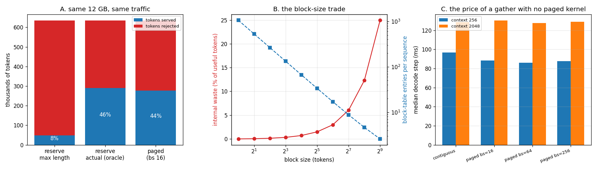

# Tiny Paged Cache

---

> Stop giving each request one big contiguous slab; hand out small fixed-size pages instead, and the wasted space disappears. This project builds the [PagedAttention](/shared/glossary/#pagedattention) data structure — a block pool, a per-request [block table](/shared/glossary/#block-table), reference counting — plugs it into [project 09](../09-kv-cache-from-scratch/README.md)'s engine, and proves it produces **identical tokens**. Then it runs 600 requests with realistic length variation through a 12 GB arena. Findings: reserving each request's *maximum* length — the only contiguous policy a real server can implement, because it cannot know how long an answer will be — serves **48k tokens** while paging serves **278k**, a **5.8x** gap, and books 97.5% of memory while only **18.8%** of it holds real tokens. Paging holds **90.2%**. Two honest inversions: against an *oracle* contiguous allocator that magically knows every final length, paging serves **4% fewer** tokens, so paging's real win is entirely about not having to guess — and the block-table gather costs **1.00x** on this hardware, i.e. nothing measurable, because both paths were already paying a copy.

---

## Key Insight

This project builds a small [PagedAttention](/shared/glossary/#pagedattention)-style [KV cache](/shared/glossary/#kv-cache): instead of one contiguous block per request, the cache is cut into fixed-size pages (16 tokens each) that are handed out on demand and tracked by a per-request page table — the same data structure [vLLM](/shared/glossary/#vllm) uses.

## Why This Matters

Giving each request its own contiguous chunk wastes memory through [fragmentation](/shared/glossary/#fragmentation) — gaps too small to reuse. Paging removes those gaps, so the same GPU fits far more concurrent requests; reproducing the page table by hand demystifies the core idea behind every modern serving engine.

`paged.py` is also reused by [project 12](../12-prefix-share-benchmark/README.md), which turns the reference counting written here into automatic prefix sharing.

---

**This is project 11.**

### The words first

The whole design is borrowed from operating systems, and so is the vocabulary. Learning the OS meaning first makes the serving version obvious.

- **Page / block** — a fixed-size unit of memory. An OS hands processes 4 KB *pages*; this cache hands sequences 16-token *blocks*. Same idea, different name (vLLM says "block", so this project does too).
- **[Block table](/shared/glossary/#block-table)** (OS: *page table*) — the per-request map from "logical block 3 of my sequence" to "physical block 917 of the pool". Indirection is the entire trick: because the request only ever names logical blocks, the physical ones can be anywhere.
- **[Fragmentation](/shared/glossary/#fragmentation)** — memory that is free but unusable. It comes in two flavours, and they behave differently:
  - **External** fragmentation — the free space is split into gaps *between* allocations, each too small for the request that needs it. This is what kills contiguous allocation, and paging eliminates it completely: any free block will do, so there is no such thing as a gap of the wrong shape.
  - **Internal** fragmentation — space wasted *inside* an allocation, because you rounded up. A 100-token sequence with 16-token blocks gets 7 blocks = 112 slots, so 12 are wasted. Paging trades external fragmentation (which can be catastrophic) for internal fragmentation (which is bounded by half a block per sequence on average).
- **Allocator / arena** — the code that hands out memory, and the pool it hands out from.
- **Reference count** — how many requests currently point at a physical block. Zero means free. This is the mechanism that lets project 12 give two requests the *same* block.
- **First-fit** — the classic contiguous allocation strategy: scan the free list, take the first hole big enough. Named for exactly what it does.

### "Doesn't a request just need N tokens of memory? Why is the shape a problem?"

Because the request does not know N when it arrives, and memory has to be booked before it is used.

A serving engine receives a prompt and starts generating. It has no idea whether the answer will be 12 tokens or 4,000 — that is decided by the model, one token at a time. A contiguous allocator must therefore reserve `max_model_len` up front, because the sequence has to grow *in place* and anything it might later need must already be reserved behind it. On a model with an 8,192-token limit and a median request of 615 tokens, that books **13x more memory than the median request will ever use**.

Paging removes the requirement to grow in place. A sequence that needs one more block gets one more block from anywhere in the pool, and its block table gains one entry. Nothing has to be contiguous, so nothing has to be reserved in advance.

**This is the gap the block table fills**, and it is worth stating plainly because "one more level of indirection" always sounds like pure overhead: the indirection is what converts "reserve for the worst case" into "allocate for the actual case."

### "The engine already has a KV cache. Why add a whole allocator underneath it?"

Because the cache and the allocator answer different questions. The cache answers *what does attention read* (project 09 built that). The allocator answers *where do those bytes live, and who else is using the machine right now*. A single-request cache never has to answer the second question, which is why every tutorial gets away without one — and why every tutorial's design falls over at concurrency 30.

---

## Running it

```bash
python3 run.py           # ~5 minutes on 6 CPU threads
python3 run.py --plot    # redraw the figure from the committed findings.json
```

Needs `torch`, `transformers`, `matplotlib`. Sections B and C are a discrete-event simulation of an allocator (no model needed, runs in a second); sections A and D run the real Qwen2.5-0.5B through `paged.py`.

The simulated workload: 600 requests arriving at random independent times (a *Poisson process* — named after Siméon Poisson, and the standard model for "events that happen at some average rate but with no coordination between them", which is exactly what independent users do), lengths drawn from a lognormal (median **615** tokens, mean 1,058, p99 **7,689**, capped at the model's 8,192 limit), a **12 GB** cache arena, and Llama-3.1-8B's **128 KB/token** cost from [project 10](../10-kv-size-calculator/README.md). A lognormal is used because the *logarithm* of the length is normally distributed, which produces exactly the shape real traffic has: most turns short, a long tail of pasted documents, and nothing negative.

> **About the numbers.** Everything below comes from the committed
> [`outputs/findings.json`](outputs/findings.json),
> [`outputs/policies.csv`](outputs/policies.csv) and
> [`outputs/block_sweep.csv`](outputs/block_sweep.csv).



---

## A. Paging changes nothing the model can see

| check | result |
|---|---|
| tokens generated, paged vs contiguous | **identical** |
| blocks used for a 271-token sequence | 17 |
| slots reserved but empty (internal fragmentation) | **1** |

271 tokens in 16-token blocks needs `ceil(271/16)` = 17 blocks = 272 slots, so exactly one slot is idle. That is the whole cost of paging at the data-structure level, and it is the number the block-size sweep in section C generalizes.

The correctness check is not a formality. The three ways a paged cache silently goes wrong are all *shape* bugs that produce plausible-looking text: writing new tokens at the wrong offset inside the last block, gathering blocks in the wrong order, and forgetting that the causal mask must count logical positions rather than physical slots. Comparing tokens against a contiguous run catches all three immediately.

## B. Three allocation policies, one arena, one traffic trace

| policy | requests admitted | tokens served | rejections caused by fragmentation | long requests rejected | memory *reserved* | memory *holding tokens* |
|---|---|---|---|---|---|---|
| reserve max length | 59 / 600 | **48.2k** | 0 | 92.7% | 97.5% | **18.8%** |
| reserve actual length (oracle) | 467 / 600 | **290.1k** | **128** | 68.0% | 83.4% | 83.4% |
| **paged**, 16-token blocks | 404 / 600 | **277.9k** | **0** | 62.0% | 90.7% | **90.2%** |

Four things in that table, in order of importance.

**1. Against the only contiguous policy you can actually build, paging serves 5.8x the tokens.** `reserve_max` is not a straw man — it is what an engine must do when it cannot see the future. It books 8,192 tokens for a request whose median length is 615, so it fills 97.5% of the arena while only 18.8% of that memory holds anything. Five sixths of an H100's cache memory, reserved and empty.

**2. Fragmentation is a real, countable failure mode.** The oracle allocator rejected 133 requests, and **128 of them arrived when the arena had enough total free bytes but no single hole big enough**. That is the definition of external fragmentation, and it is a nasty class of production bug precisely because your memory dashboard shows free space at the moment the request fails. Paging's fragmentation-rejection count is **0**, structurally — a block is a block, any block will do.

**3. The honest inversion: paging *loses* to the oracle, slightly.** 277.9k tokens against 290.1k, about 4% fewer. Two effects are mixed in there: paging pays 0.71% internal waste at block 16, and the rest is a selection artifact — when the oracle rejects a 7,000-token request, it frees room for a dozen short ones that arrive next, so its *request* count looks better than its capacity really is. (Which is why the table reports tokens *and* requests: counting requests alone flatters whichever allocator drops the big ones. The long-request rejection column makes that visible directly: the oracle turns away 68% of the largest quartile, paging 62%.)

The useful conclusion is not "paging packs better than an oracle" — it does not, and claiming otherwise would be wrong. It is: **paging gets oracle-grade packing without the oracle.** The 5.8x is what you actually collect, because the oracle does not exist.

**4. Occupancy is the metric to watch, not utilization.** `reserve_max` reports 97.5% "utilization" and is nearly empty. Any dashboard that plots reserved bytes will show a healthy green line while your users get rejected. Plot *tokens held ÷ tokens the arena could hold* instead.

## C. Block size is a dial with two ends

| block size | internal waste | block-table entries per sequence |
|---|---|---|
| 1 | 0.00% | 1,058 |
| 4 | 0.14% | 265 |
| **16** | **0.71%** | **67** |
| 64 | 2.98% | 17 |
| 128 | 6.04% | 8.8 |
| 256 | 12.29% | 4.6 |
| 512 | 24.95% | 2.6 |

The trade is straightforward once you see both columns: **small blocks waste almost no memory and produce enormous block tables; large blocks produce tiny tables and waste up to a quarter of your cache.**

Why the table size matters at all: on a GPU that table is read by the attention kernel on **every decode step, for every request in the batch**. It has to be copied to the device, indexed, and dereferenced. A thousand entries per sequence times a batch of 64 is a real cost in a kernel that is already memory-bound.

Block 16 is vLLM's default and the table shows why: 0.71% waste is negligible, and 67 entries per sequence is a table that fits comfortably in a kernel's fast memory. The waste column doubles for each doubling of block size, so 16 sits at the last comfortable point before the cost becomes visible.

One consequence project 12 will care about: **blocks are the unit of sharing, too.** A 1,023-token shared prefix can only be shared in whole blocks, so at block 16 the last 15 tokens fall outside the sharing. Smaller blocks share more precisely; that is a third force pulling the dial down.

## D. What does the indirection cost per decode step?

| context | contiguous | paged, block 16 | block 64 | block 256 |
|---|---|---|---|---|
| 256 tokens | 96.8 ms | 88.2 ms | 85.9 ms | 87.6 ms |
| 2048 tokens | 128.5 ms | 130.2 ms | 127.6 ms | 129.0 ms |

**Ratio at 2048 tokens: 1.01x, 0.99x, 1.00x.** The paged cache costs nothing measurable, and at 256 tokens it even reads slightly *faster* — that is run-to-run noise on a shared machine, not a real win.

This deserves an explanation rather than a shrug, because "gathering blocks must cost something" is the correct instinct. It does — it just is not an *extra* cost here:

- Our paged cache gathers its blocks into one tensor before attention: one copy of the whole cache, per layer, per step.
- Our contiguous cache does not gather — but the attention code immediately does `repeat_interleave` to expand 2 KV heads into 14 (see [project 09](../09-kv-cache-from-scratch/README.md) section D), which is *also* a copy of the whole cache, per layer, per step, and a 7x larger one.

Both paths were already paying for a full traversal of the cache, so adding a gather in front of it changes nothing. **On a GPU with a real fused kernel this comparison would come out differently**, and that is exactly why PagedAttention is a *kernel* and not just a data structure: vLLM's attention kernel reads the block table and fetches blocks directly from the pool, so the gather never happens at all. What this section measures is the honest statement that in an unfused implementation the indirection is free; what it does not measure is the fused case, which needs hardware this box does not have.

---

## What to take from this

1. **The contiguous policy you can actually implement is `reserve_max`, and it is 5.8x worse.** Compare against that, not against an oracle.
2. **Reserved memory is not occupied memory.** 97.5% reserved, 18.8% occupied, in the same run.
3. **External fragmentation fails requests while your free-memory graph looks fine.** 128 of 133 rejections in the oracle run were of that kind.
4. **Paging's cost is bounded and small** — 0.71% internal waste at block 16 — while the cost it removes is unbounded.
5. **Indirection is only free until you fuse.** The reason PagedAttention is a kernel is precisely that a gather you cannot avoid is a gather you have to pay for.

### Common traps this project walks into on purpose

- **Measuring capacity in requests.** An allocator that rejects the big ones looks great by request count and terrible by tokens.
- **Rebuilding the slot-index tensor from scratch on every append.** `_ensure_capacity` only rebuilds when the block table actually grows; doing it per token turns an O(1) append into O(n).
- **Sharing a partially-filled block.** `fork()` rounds sharing *down* to a whole block, because a block that is half prefix and half request-specific would be written by two owners.
- **Freeing a block that someone else still points at.** Hence the reference count in `BlockPool`, which does nothing at all in this project and is the entire mechanism of the next one.

---

## Next

[Project 12 — prefix-share benchmark](../12-prefix-share-benchmark/README.md) uses the reference counting built here to let two requests point at the *same* physical blocks, and measures what that does to [TTFT](/shared/glossary/#ttft).
