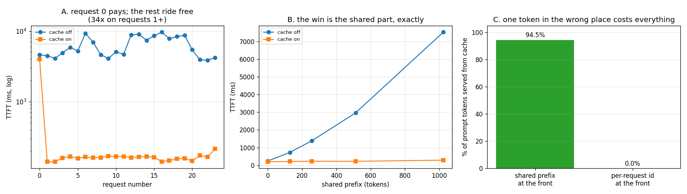

# Prefix-Share Benchmark

---

> If a thousand requests all start with the same [system prompt](/shared/glossary/#system-prompt), you should only pay to read it once. This project adds automatic [prefix caching](/shared/glossary/#prefix-cache) — a chained hash over 16-token blocks, on top of [project 11](../11-tiny-paged-cache/README.md)'s block pool — and serves 24 requests that share a 1,024-token opening. Findings: [TTFT](/shared/glossary/#ttft) drops from **5.34 s to 0.16 s** (**33x**), the memory to hold all 24 sessions at once drops from **621 MB to 42 MB** (**14.8x**), and the generated tokens are **identical**. The win scales exactly with how much is shared — 1.26x at zero shared tokens, 26x at 1,024 — because the saving *is* the skipped [prefill](/shared/glossary/#prefill). And two ways to lose all of it: putting a per-request id at the **front** of the prompt takes the hit rate to **0.0%**, and a shared prefix of 1,023 tokens instead of 1,024 quietly loses **15 tokens** to the block boundary.

---

## Key Insight

This project sends many requests that share a long [system prompt](/shared/glossary/#system-prompt) and measures [time to first token](/shared/glossary/#ttft) with the [prefix cache](/shared/glossary/#prefix-cache) turned on versus off. When requests share an opening, the engine can reuse the already-computed cache for those tokens instead of redoing the work.

## Why This Matters

Production chat apps reuse the same long system prompt on every request, so prefix caching can cut time to first token several-fold for free. Measuring the before/after yourself shows how large these "shared prefix" wins are and why engines build whole data structures just to capture them.

---

**This is project 12.**

### A note on vLLM

The guide's version of this project says "in [vLLM](/shared/glossary/#vllm)". vLLM will not run on this machine — its GPU is [compute capability](/shared/glossary/#compute-capability) 6.1, below what current PyTorch and vLLM builds support — so the same feature is implemented in the engine this phase has been building instead. The mechanism is exactly the one vLLM calls **automatic prefix caching** (`--enable-prefix-caching`), and every number below is measured on a real model, not simulated. What is *not* measured here is vLLM's GPU kernel performance; what is measured is the algorithm, its win, and its failure modes, which transfer directly.

### The words first

- **Prefix** — the beginning of a sequence. In serving, usually a [system prompt](/shared/glossary/#system-prompt), a few-shot example block, or a retrieved document, repeated across many requests.
- **[Prefix cache](/shared/glossary/#prefix-cache) / prefix sharing** — reusing the KV blocks already computed for a prefix instead of recomputing them. "Automatic" prefix caching means the engine detects the shared prefix itself, rather than making you declare it.
- **Chained hash** — the detection trick. Block *i* is keyed by `H(key of blocks 0..i-1, tokens of block i)`, so the key of a block encodes its entire history. Two requests collide on that key only if every token before it matched too, which turns "find the longest shared prefix" into one dictionary lookup per block.
- **[RadixAttention](/shared/glossary/#radixattention)** — [SGLang](/shared/glossary/#sglang)'s alternative: keep the prefixes in an actual radix tree ("radix" = a compressed prefix tree, where chains of single children are collapsed into one edge). The tree finds the same matches and makes better eviction decisions, at the cost of a more complicated structure. This project uses the hash because it is readable in 60 lines.
- **Hit rate** — fraction of requests that found *something* in the cache. **Token hit rate** — fraction of all prompt tokens that came from cache. The second is the one that predicts your TTFT; a request can be a "hit" and still have 90% of its prompt to prefill.
- **Reference count** — see [project 11](../11-tiny-paged-cache/README.md). A shared block is pointed at by several requests plus the index itself, so it survives until the last of them lets go.

### "The KV cache already avoids recomputation. Isn't prefix sharing the same thing?"

No, and the distinction is the whole project. They avoid recomputation along two different axes:

| | avoids recomputing | across | lives for |
|---|---|---|---|
| **KV cache** (project 09) | the *earlier tokens of this request*, on every later decode step | time, within one request | one request |
| **prefix cache** (this project) | the *prefill of the shared opening*, for every request after the first | requests | many requests, until evicted |

A per-request KV cache does nothing at all for request #2's [prefill](/shared/glossary/#prefill): request #1 finished, its cache was freed, and request #2 starts from an empty cache and pays for all 1,024 shared tokens again. **The gap the prefix cache fills is exactly that: keeping blocks alive past the end of the request that created them, and letting a different request adopt them.** Reference counting is what makes that safe.

### "Why can it reuse another request's cache at all — isn't attention different for each request?"

The query side is different; the key/value side is not. Recall from [project 09](../09-kv-cache-from-scratch/README.md) that attention is **causal**: token *t*'s K and V depend only on tokens 0…*t*. So if two requests begin with the identical token sequence, the K and V vectors for that opening are *bit-for-bit the same numbers*, computed from the same inputs by the same weights. Reusing them is not an approximation — section B checks that the generated tokens are identical, and they are.

This is also why sharing must be a **prefix**, not any old common substring. Two requests that share tokens 500–600 but differ at token 3 produce completely different K and V for tokens 500–600, because those vectors were computed in a context that included token 3.

---

## Running it

```bash
python3 run.py           # ~8 minutes on 6 CPU threads
python3 run.py --plot    # redraw the figure from the committed findings.json
```

Needs `torch`, `transformers`, `matplotlib`. Model: Qwen2.5-0.5B-Instruct, float32, CPU. The workload: **24 requests**, each **1,038 prompt tokens**, of which the first **1,024** are a shared policy-style system prompt and the rest is a per-request question that differs from its very first token.

> **About the numbers.** Everything below comes from the committed
> [`outputs/findings.json`](outputs/findings.json),
> [`outputs/ttft.csv`](outputs/ttft.csv) and
> [`outputs/scaling.csv`](outputs/scaling.csv).



---

## A. 33x on TTFT, 14.8x on memory, zero change to the output

| | cache off | cache on |
|---|---|---|
| [TTFT](/shared/glossary/#ttft) p50 | **5.343 s** | **0.162 s** |
| TTFT, request 0 | 4.607 s | 4.001 s |
| TTFT p50, requests 1+ | 5.442 s | **0.161 s** |
| request hit rate | — | 95.8% (23 of 24) |
| **token** hit rate | — | **94.5%** |
| blocks to hold all 24 sessions | 1,580 | **107** |
| same, in bytes | 621.3 MB | **42.1 MB** |
| generated tokens | *identical* | *identical* |

The left panel says it in one shape: request 0 pays full price under both settings, and from request 1 onward the "on" line drops by a factor of 34 and stays flat.

Three things worth separating:

- **The first request is not faster, and cannot be.** Nothing is in the cache yet. Prefix caching is a *warm*-path optimization; your p99 on a cold replica is unchanged, which matters after every deploy and every autoscale event.
- **The token hit rate is 94.5%, not 100%.** 1,024 shared of 1,038 total is 98.6% per request, times 23/24 requests that could hit at all. The metric to quote in a design doc is the token hit rate, because TTFT tracks *it*, not the request hit rate.
- **The memory win is bigger than it looks.** 24 requests × 66 blocks = 1,580 blocks if each owns its prefix; with sharing, 64 blocks of prefix are held **once** and each request adds only its own tail. 42 MB instead of 621 MB — and that ratio grows with concurrency, because the shared part is a constant while the per-request part is not.

## B. The win is the shared part, exactly

Same experiment, sweeping how many tokens are actually shared:

| shared prefix | prompt length | TTFT off | TTFT on | speed-up | token hit rate |
|---|---|---|---|---|---|
| 0 | 13 | 243 ms | 193 ms | 1.26x | 0.0% |
| 128 | 141 | 725 ms | 212 ms | 3.42x | 75.1% |
| 256 | 269 | 1,379 ms | 229 ms | 6.02x | 79.0% |
| 512 | 525 | 2,961 ms | 222 ms | 13.36x | 81.1% |
| 1,024 | 1,038 | 7,527 ms | 287 ms | **26.19x** | 82.3% |

The "on" column is nearly flat — 193 ms to 287 ms while the prompt grows 80x — because with the prefix cached, the only work left is prefilling the ~13 unshared tokens. The "off" column grows superlinearly, which is prefill's own quadratic attention cost.

**The plain-language version:** prefix caching does not make prefill faster. It makes prefill *shorter*. Your TTFT becomes a function of the part of the prompt that is actually new, and the shared part becomes free after the first payer. That is why the speed-up is not a fixed number you can quote — it is `total tokens ÷ new tokens`, and it is set by your prompt design, not by the engine.

(The 1.26x at zero shared tokens is noise on a 13-token prompt, not a win. Do not read a small positive number as an effect.)

## C. Two ways to lose the whole thing

### C1. A per-request id at the front: 94.5% → 0.0%

| prompt shape | token hit rate | TTFT p50 |
|---|---|---|
| `[system prompt 1024 tokens][question]` | **94.5%** | 0.16 s |
| `[session 00042] [system prompt 1024 tokens][question]` | **0.0%** | 7.39 s |

Five tokens, moved to the front, and the entire optimization is gone — because the chained hash of block 0 no longer matches, so no later block can match either. A 45x TTFT regression caused by a logging convenience.

This is the single most common real-world way prefix caching silently fails, and the failures all look the same: a timestamp, a user id, a request id, an A/B-test bucket, a "current date is …" line at the top of the system prompt. Each one is harmless-looking and each one takes your hit rate to zero.

**The rule that follows: everything constant goes first, everything variable goes last.** If you must include a timestamp, put it at the end of the system prompt, or coarsen it (`2026-08-16` instead of `2026-08-16T15:41:07.212Z`) so it changes once a day rather than once a request.

### C2. Block alignment: a prefix of 1,023 is not a prefix of 1,024

| shared tokens | tokens actually reused | lost |
|---|---|---|
| 1,024 | 1,024 | 0 |
| 1,023 | 1,008 | **15** |
| 1,020 | 1,008 | 12 |
| 1,008 | 1,008 | 0 |

Only **whole** blocks can be shared, for a reason worth stating: a partially-filled block is still being written to by whoever owns it, so its contents are not final and a second request cannot safely point at it. So the sharable length is always rounded down to a multiple of the block size.

At block 16 the loss is at most 15 tokens, which is negligible against a 1,024-token prefix — this is a *tidiness* problem, not a performance problem. It becomes a real one at large block sizes (a 256-token block can lose 255 tokens of sharing) which is the third force, alongside the two in [project 11](../11-tiny-paged-cache/README.md) section C, pushing production block sizes down to 16.

---

## What to take from this

1. **The saving is the skipped prefill, so it scales with the shared fraction of the prompt.** Quote `total ÷ new`, not a fixed multiplier.
2. **Prefix caching saves memory as well as time**, and the memory win grows with concurrency: 14.8x at 24 requests here.
3. **Reuse is exact, not approximate.** Identical tokens, because causal attention makes a shared prefix's K and V literally the same numbers.
4. **Prompt layout is now a performance decision.** Constant first, variable last. One misplaced id is a 45x TTFT regression that no profiler will point at.
5. **Cold starts do not benefit.** Every deploy resets the hit rate to zero; size your capacity for the cold path, not the warm one.

### Common traps this project walks into on purpose

- **Measuring "how much is shared" by reading your own prompt template.** Matching happens on *tokens*. An earlier version of this benchmark put the words `" Request 001. "` after the system prompt and the match ran happily *past* the nominal boundary, because `" Request"` was common to every request too. The engine shares whatever is genuinely identical, which may be more than you intended — or, after one tokenizer change, less.
- **Reporting request hit rate as if it were the win.** 95.8% of requests hit; 94.5% of tokens did. Only the second predicts TTFT.
- **Freeing shared blocks when the first owner finishes.** The index holds its own reference, which is why `publish()` calls `incref` — without it, request 1 would free the blocks request 2 was about to adopt.
- **Timing only the p50.** The distribution here is bimodal by construction: one slow cold request and 23 fast warm ones. A p50 hides the cold one completely, which is fine for a benchmark and dangerous for an SLO.

---

## Next

[Project 13 — KV-quantization study](../13-kv-quantization-study/README.md) attacks the same memory bill from the other side: instead of storing the cache once, store it in fewer bits — and find out what that costs in quality.
