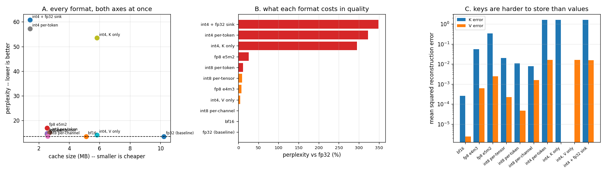

# KV-Quantization Study

---

> Storing the cache in 8 bits instead of 32 nearly quarters how many users fit — but *which* 8 bits you choose changes the quality cost by 73x. This project stores the [KV cache](/shared/glossary/#kv-cache) in eleven different formats and scores real text through each one. Findings: **int8 per-channel costs +0.35% [perplexity](/shared/glossary/#perplexity) for 4x less memory**, while int8 per-token — the granularity real engines actually use — costs **+11.68%** for the same bytes, so *granularity beats bit width*. [fp8](/shared/glossary/#fp8) e4m3 (+7.4%) beats e5m2 (+25.6%) at identical size, purely on how the bits are split between exponent and mantissa. And the phase's sharpest result: **all of int4's damage lives in the keys.** Quantizing only V to int4 costs **+4.8%**; quantizing only K costs **+295%**. Plus one honest negative: keeping the first four tokens in fp32 — the trick that rescues *eviction* in [project 14](../14-attention-sink-eviction/README.md) — made int4 slightly **worse**, not better.

---

## Key Insight

This project stores the [KV cache](/shared/glossary/#kv-cache) in a smaller number format — [FP8](/shared/glossary/#fp8) or [int8](/shared/glossary/#int8) instead of 32-bit — and measures two things: whether answer quality drops on a held-out test set, and how much memory is saved. This is [quantization](/shared/glossary/#quantization) applied to the cache rather than to the weights.

## Why This Matters

The cache is large, and [decode](/shared/glossary/#decode) speed is set by how many bytes it must read each step, so halving its size nearly halves that traffic. Because keys and values tolerate low precision well, this is one of the cheapest wins in serving — but only a real evaluation proves the quality actually held.

---

**This is project 13.**

### The words first

- **[Quantization](/shared/glossary/#quantization)** — mapping a wide range of real numbers onto a small set of levels. The word is from measurement: a *quantum* is a fixed smallest amount, so quantizing means "express this as a whole number of smallest amounts". int8 gives 256 levels, int4 gives 16.
- **[Scale](/shared/glossary/#scaling-factor)** (scaling factor) — the real number one level is worth. `value ≈ level × scale`. Everything interesting about quantization is a question about scales.
- **Granularity** — *how many separate scales you keep*, and along which axis:
  - **[per-tensor](/shared/glossary/#per-tensor-quantization)** — one scale for the entire cache tensor of a layer. Cheapest to store, most vulnerable to a single large value stretching the scale for everyone.
  - **per-token** — one scale for each (token, kv-head). What real engines use, for a reason given below.
  - **[per-channel](/shared/glossary/#per-channel-quantization)** — one scale for each *feature dimension*, shared across tokens.
- **[Symmetric](/shared/glossary/#symmetric-vs-asymmetric-quantization)** — the level set is centred on zero (−127…127 for int8), so 0.0 stays exactly 0.0. Costs one level, keeps the arithmetic simple, and keeps masked/padded entries exact.
- **[fp8](/shared/glossary/#fp8) e4m3 and e5m2** — two 8-bit floating-point layouts. The names are the layout: **e4m3** = 4 exponent bits, 3 mantissa bits; **e5m2** = 5 exponent, 2 mantissa. More exponent bits buy dynamic range (how big and small a number can be); more mantissa bits buy precision (how finely you can distinguish nearby numbers). Same total size, different bargain — and section B measures the bargain.
- **[Perplexity](/shared/glossary/#perplexity)** — the quality metric. Literally "how perplexed the model is": the exponential of its average negative log-probability on real text. A perplexity of 13.5 means the model is, on average, as uncertain as if it were choosing uniformly among 13.5 options. Lower is better; a *relative* change is the meaningful reading.
- **[Teacher forcing](/shared/glossary/#teacher-forcing)** — at each step, feed the token the corpus actually has rather than the one the model predicted. Every variant then sees exactly the same context, so a difference in the numbers can only come from the cache.
- **[Activation outlier](/shared/glossary/#activation-outlier)** — a value hundreds of times larger than its neighbours, sitting in a particular feature dimension. It is the reason granularity matters, and it is why keys are the hard half.

### "Why does the cache need quantizing? Aren't the weights the big thing?"

For a small model, yes. For a serving deployment, not for long — [project 10](../10-kv-size-calculator/README.md) worked out that on Llama-3.1-70B the cache passes the weights at 13.5k tokens per user at batch 32, and on Llama-2-13B at under a thousand. And the two are quantized for different reasons:

| | weights | KV cache |
|---|---|---|
| how big | fixed | grows with users × context |
| quantized to save | memory *and* decode bandwidth | memory *and* decode bandwidth |
| calibrated with | a calibration dataset, offline | nothing — the scale must be computed at write time, online |
| quality risk | permanent, affects everything | proportional to how much context you have |

The last row of that table is the practical difference: **weight quantization is something you do once, carefully, offline. Cache quantization happens in the hot path on data you have never seen.** That constraint is what forces per-token granularity, and section B measures what it costs.

### "If per-channel is 33x better, why does anybody use per-token?"

Because of *when* the scale can be chosen, and this is the most important idea in the project.

The integers already in the cache were divided by some scale. Nothing is going to go back and re-scale a million stored values because a new token arrived with a bigger maximum. So a scale, once used, is frozen for everything it applies to.

- **Per-channel** means "one scale per feature dimension, shared across all tokens". A new token arrives; its features must use the *existing* per-channel scales — which were computed from earlier tokens and might be far too small for this one. Our per-channel run freezes the scales from the prompt, which is exactly this situation, and it works here because the prompt (256 tokens) is representative of what follows. On a long, drifting conversation it would eventually clip badly.
- **Per-token** means "one scale per token". A new token computes its own scale from its own values, the moment it arrives, and never touches anything already stored. **That is the property that makes it implementable**, and it is why vLLM, TensorRT-LLM and SGLang all use per-token (or per-token-per-head) KV quantization.

So section B is not saying "engines chose wrong". It is saying: the cheap, safe, online-friendly granularity is also the one with the worst error on this axis, and knowing that tells you where to spend effort (on the keys — see section C).

---

## Running it

```bash
python3 run.py           # ~5 minutes on 6 CPU threads
python3 run.py --plot    # redraw the figure from the committed findings.json
```

Needs `torch`, `transformers`, `pandas`, `huggingface_hub`, `matplotlib`. Model: Qwen2.5-0.5B-Instruct, float32 baseline, CPU. Corpus: **wikitext-2 (test split)** — 256 tokens of prefill, then **160 tokens scored one at a time**, which is the honest measurement because every scored token is predicted from a cache that has been through the quantizer.

> **A note on speed.** The `median_step_s` column in `outputs/variants.csv` is flat at 89–96 ms for every format, which is *not* a result — our implementation dequantizes to fp32 before attention, so it moves the same bytes as fp32 plus extra work. A real engine's win comes from a kernel that reads int8 directly out of [HBM](/shared/glossary/#hbm). What this project measures honestly is **bytes stored and quality lost**; the bandwidth win is arithmetic from the byte count (halve the cache, halve its share of decode traffic).

> **About the numbers.** Everything below comes from the committed
> [`outputs/findings.json`](outputs/findings.json) and
> [`outputs/variants.csv`](outputs/variants.csv).



---

## A. Every format, both axes

| format | perplexity | vs fp32 | cache size | vs fp32 | top-1 agreement | first disagreement |
|---|---|---|---|---|---|---|
| fp32 (baseline) | 13.543 | — | 10.22 MB | 1.000 | 100% | — |
| **bf16** | 13.569 | **+0.19%** | 5.11 MB | 0.500 | 99.4% | step 52 |
| **int8 per-channel** | 13.590 | **+0.35%** | 2.58 MB | 0.252 | 95.6% | step 22 |
| int4, V only | 14.191 | +4.78% | 5.83 MB | 0.570 | 94.4% | step 25 |
| fp8 e4m3 | 14.547 | +7.41% | 2.56 MB | 0.250 | 91.9% | step 5 |
| int8 per-tensor | 14.772 | +9.07% | 2.56 MB | 0.250 | 86.9% | step 5 |
| int8 per-token | 15.125 | +11.68% | 2.72 MB | 0.266 | 88.8% | step 5 |
| fp8 e5m2 | 17.004 | +25.56% | 2.56 MB | 0.250 | 80.0% | step 5 |
| int4, K only | 53.481 | +294.89% | 5.83 MB | 0.570 | 46.9% | step 0 |
| int4 per-token | 57.242 | +322.67% | 1.44 MB | 0.141 | 51.2% | step 3 |
| int4 + fp32 sink | 60.766 | +348.69% | 1.44 MB | 0.141 | 48.1% | step 0 |

"Top-1 agreement" is the fraction of the 160 steps where the quantized cache picked the same next token as fp32; "first disagreement" is the step where they parted company. Both are useful next to perplexity because perplexity is an average — it can look acceptable while the model has already started saying different words.

**The safe zone is everything above +1%: bf16 and int8 per-channel.** bf16 is the free lunch (half the memory, 0.19%, and the format your model was probably trained in anyway). Below that, you are trading measurable quality for memory, and the trade only makes sense if the memory buys you concurrency you actually need.

## B. Same 8 bits, 26x different cost

Four formats, all exactly 1 byte per stored number:

| format | perplexity cost | mean squared error, K | mean squared error, V |
|---|---|---|---|
| int8 per-channel | **+0.35%** | 7.8e-03 | 1.6e-03 |
| fp8 e4m3 | +7.41% | 5.6e-02 | 6.3e-04 |
| int8 per-tensor | +9.07% | 2.0e-02 | 2.3e-04 |
| int8 per-token | +11.68% | 1.1e-02 | 4.8e-05 |
| fp8 e5m2 | +25.56% | 3.4e-01 | 2.5e-03 |

**From best to worst is 73x in perplexity cost, at identical bit width.** Two lessons:

**1. Where the scale lives matters more than how many bits you have.** int8 per-channel beats int8 per-token by 33x in perplexity cost. The reason is section C: keys carry [outliers](/shared/glossary/#activation-outlier) that sit in *particular feature dimensions*. A per-channel scale gives the outlier dimension its own large scale and leaves the other 63 dimensions with fine-grained small ones. A per-token scale is computed across all 64 dimensions at once, so one outlier stretches the scale for every dimension of that token, and 63 well-behaved features get crushed into a handful of levels.

**2. Exponent bits and mantissa bits are a real trade with a right answer here.** e4m3 (+7.4%) beats e5m2 (+25.6%) by 3.4x. e5m2 spends a bit on dynamic range that K and V do not need — cache values live in a fairly narrow band — and pays for it with only 2 mantissa bits of precision. This is why NVIDIA's KV-cache guidance and vLLM's `kv_cache_dtype="fp8_e4m3"` default land on e4m3: **for activations in a narrow range, precision beats range.** (Weights and gradients during *training* often want the opposite, which is why e5m2 exists at all.)

Note also the mismatch between MSE and perplexity: int8 per-token has a *lower* K error than int8 per-tensor (1.1e-02 vs 2.0e-02) and a *higher* perplexity cost. Reconstruction error is not the objective; the model's output is. Treat MSE as a diagnostic, never as the score.

*(A caution about resolution: the three mid-table int8/fp8-e4m3 variants sit within about 4% of each other on a 160-token sample. Their exact ordering is not something this sample size can resolve. The 33x gap to per-channel and the 73x spread across the group are far outside that noise, and those are the claims made here.)*

## C. The keys are the whole problem

Same format (int4 per-token), applied to one half of the cache at a time:

| what is quantized to int4 | perplexity | vs fp32 | top-1 agreement |
|---|---|---|---|
| **V only** (keys stay fp32) | 14.191 | **+4.78%** | 94.4% |
| **K only** (values stay fp32) | 53.481 | **+294.89%** | 46.9% |
| both | 57.242 | +322.67% | 51.2% |

**Quantizing values to 4 bits is nearly free. Quantizing keys to 4 bits destroys the model.** 62x difference in cost, same bit width, same granularity, same everything.

The reason is structural rather than accidental, and it is worth understanding because it predicts the fix:

- A **value** vector is *averaged* into the output, weighted by attention. An error in one V vector is diluted by every other V vector in the average. Errors are forgiving and roughly independent.
- A **key** vector goes through a *dot product and then a softmax*. Softmax exponentiates, so an error in a key's score is amplified before it is normalized — and because the weights must sum to 1, an error that inflates one token's score *takes weight away from every other token*. The damage is multiplicative and shared.
- On top of that, keys carry systematic per-dimension [outliers](/shared/glossary/#activation-outlier): a few feature dimensions with values far outside the rest. Section C's error column shows it directly — K's reconstruction error runs 10x–100x above V's in every single format.

**The design conclusion, which is exactly what production systems do:** treat the two halves separately. Values can go to int4; keys should stay at int8 or fp8, or use a finer granularity (per-channel), or have their outlier channels handled specially. A single `kv_cache_dtype` flag that applies the same format to both is leaving a large amount of memory on the table.

## D. An honest negative: protecting the sink did not help

| format | perplexity |
|---|---|
| int4 per-token | 57.242 |
| int4 per-token, first 4 tokens kept in fp32 | **60.766** |

The [attention sink](/shared/glossary/#attention-sink) — the first few tokens, which every head dumps its leftover attention mass on — is the single most important region to protect when you are *evicting* tokens. [Project 14](../14-attention-sink-eviction/README.md) measures a 31x perplexity difference from exactly that. So it is a natural guess that protecting the same tokens from *quantization* would help too.

It did not. The variant with an fp32 sink came out **6% worse**, which on this sample means "no effect, and certainly not a rescue".

The explanation is that the two problems have different shapes:

- **Eviction is positional.** It removes specific tokens completely. The sink tokens are irreplaceable, so losing them is catastrophic and keeping them fixes it.
- **Quantization is uniform.** Every one of the 1,152 cached tokens is degraded a little. Four perfect tokens out of 1,152 cannot compensate for 1,148 damaged ones — the damage is spread, not concentrated.

**The generalizable lesson: a fix that works on one failure mode does not transfer to another one just because they involve the same tokens.** The right axis for quantization damage is K-vs-V (section C) and feature-dimension-vs-token (section B), not first-tokens-vs-rest.

---

## What to take from this

1. **bf16 is free** (+0.19% for 2x). If your cache is fp32, that is the first change to make and it needs no discussion.
2. **Granularity beats bit width.** 33x between two int8 schemes; 73x across four 1-byte formats.
3. **e4m3 over e5m2 for caches.** Cache values live in a narrow range, so precision is worth more than dynamic range: 3.4x cheaper in quality at identical size.
4. **Keys and values are not the same material.** V to int4 costs 4.8%; K to int4 costs 295%. Quantize them separately or you are pricing both at the worse of the two.
5. **Score the thing you care about.** Reconstruction error ranked the int8 variants in the wrong order. Perplexity on real text, measured through the actual decode path, is the number that decides.

### Common traps this project walks into on purpose

- **Measuring quality with a single forward pass over a document.** That never exercises the cache, because a one-shot pass computes all K and V fresh. The measurement here prefills, then steps, so every scored token is predicted from quantized storage.
- **Re-deriving the scale on every write for a per-tensor scheme.** You cannot: the integers already stored used the old scale. `quantcache.py` freezes non-per-token scales after the prompt precisely because pretending otherwise gives a flattering, impossible result.
- **Counting the int4 container instead of the int4 data.** `stored_bytes()` counts 4-bit values at half a byte even though our tensors hold them in int8 slots — packing two per byte is mechanical and would only obscure the study. It *does* count the scales, which is why int8 per-token (2.72 MB) is measurably larger than int8 per-tensor (2.56 MB): one fp32 scale per token per head is not free.
- **Reading a 2% perplexity difference as a ranking.** On 160 scored tokens it is not one. State the resolution before stating the order.

---

## Next

[Project 14 — attention-sink eviction](../14-attention-sink-eviction/README.md) attacks the memory bill a third way: keep the format, keep the precision, and simply store fewer tokens — then find out which ones you can afford to lose.
