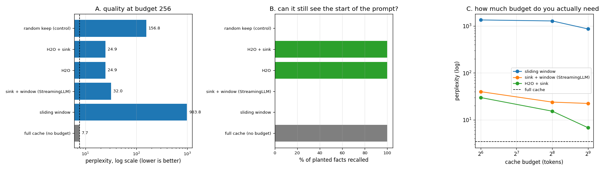

# Attention-Sink Eviction

---

> Most past tokens barely matter for the next word — but the first few always do, so never throw those away. This project caps the [KV cache](/shared/glossary/#kv-cache) at 256 of 1,152 tokens and compares six ways of choosing the survivors. Findings: a plain sliding window sends [perplexity](/shared/glossary/#perplexity) from **7.71 to 983.8** — **128x worse**, and worse than keeping 256 tokens *at random* (156.8). Adding just **four** protected tokens at the front — the [attention sink](/shared/glossary/#attention-sink) — takes it from 983.8 to **32.0**, a **31x** recovery bought with 1.6% of the budget. [H2O](/shared/glossary/#h2o), which picks survivors by measured attention, reaches **24.9**. But the sharpest result is the one perplexity cannot see: on a fact planted at the start of a long prompt, sliding window and StreamingLLM recall **0%** while H2O recalls **100%** — *the two policies whose perplexity is within 1.3x of each other differ by everything on the task a user would notice*. And explicit sink protection buys H2O **0.2%**, because attention already elects the sink tokens on their own.

---

## Key Insight

This project implements an [H2O](/shared/glossary/#h2o)-style eviction policy: when the [KV cache](/shared/glossary/#kv-cache) grows too large, it drops the tokens that have been getting little [attention](/shared/glossary/#attention) while always keeping the first few tokens — the [attention sink](/shared/glossary/#attention-sink) — and then measures answer quality at long [context](/shared/glossary/#context-window). The title names the two halves of the policy: *eviction* throws cache entries away to free memory, while the *attention sink* is the one region it must never evict.

## Why This Matters

For long contexts the cache becomes the memory bottleneck, yet most old tokens contribute almost nothing to the next prediction. Keeping only the important tokens plus the attention sink lets you serve much longer sequences in the same memory with little quality loss.

---

**This is project 14.**

### The words first

- **Eviction** — the operating-system word for removing something from a cache to make room. Note the difference from [project 15](../15-cpu-nvme-offload/README.md)'s *offload*: eviction throws the data away and accepts the loss; offload moves it somewhere slower with the intention of fetching it back.
- **[Attention sink](/shared/glossary/#attention-sink)** — the first few tokens of a sequence. Here is why they exist at all: [softmax](/shared/glossary/#softmax) forces attention weights to sum to exactly 1. A head that has nothing it particularly wants to look at cannot output "nothing" — it still has to put that 1.0 somewhere. Trained models learn to dump the leftover mass on the first tokens, which are always present and carry little information. So the sink tokens are *low in content and high in weight*, and deleting them forces all that mass onto tokens that do carry meaning — which corrupts the output far more than their contents would suggest. Section A measures 31x.
- **Heavy hitter** — a token that has attracted a lot of attention so far, and is therefore predicted to keep doing so. This is the source of the name **[H2O](/shared/glossary/#h2o)**: *Heavy-Hitter Oracle*. An "oracle" in algorithms means a component you consult for an answer you cannot compute directly — here, "which tokens will matter in the future", approximated by which ones mattered in the past.
- **StreamingLLM** — the sink-plus-window policy (Xiao et al., 2023). "Streaming" because its purpose is to let a model run *forever* on an endless input stream inside a fixed memory budget.
- **[Sliding window](/shared/glossary/#sliding-window-attention)** — keep only the last W tokens. The simplest possible policy, and section A shows it is also the worst.
- **[Perplexity](/shared/glossary/#perplexity)** — the quality metric. Literally "how perplexed the model is": the exponential of its average negative log-probability on real text. Lower is better.
- **[Teacher forcing](/shared/glossary/#teacher-forcing)** — feed the corpus's real next token at every step, so all six policies see identical context and only the cache differs.

### "If eviction is just a smaller cache, isn't sliding window obviously fine? It keeps the most recent tokens, which are the most relevant."

That is the natural intuition and it is **128x wrong** — section A measures it. The reason is the sink.

A sliding window drops the first tokens as soon as the window moves past them. Those tokens were absorbing a large, roughly constant share of every head's attention mass. With them gone, softmax still has to distribute 1.0, so all that mass lands on tokens that actually carry meaning — and the model's read of its own context is distorted at every layer, on every step. It is not "slightly less context"; it is a systematically wrong weighting of the context that remains.

The measured proof that it is the *sink specifically* and not "less context in general": keeping 256 tokens **at random** (which by luck usually includes something near the start) scores 156.8, six times *better* than keeping the 256 most recent. **A policy that keeps the most obviously relevant tokens loses to a policy that keeps tokens by coin flip.**

### "H2O already keeps high-attention tokens. Isn't the sink automatically included — why add a separate rule?"

Excellent question, and this project answers it with a measurement rather than an assumption: **H2O 24.914, H2O + explicit sink 24.859.** A 0.2% difference, which is nothing.

So yes — the sink tokens *are* the heavy hitters. That is what "sink" means: they receive the most attention. H2O's score-based selection elects them on its own, without being told, and the explicit rule is redundant here.

**Why do papers and engines include it anyway?** Because it is an insurance policy against the cases the score does not cover: the very first eviction, before enough attention has been accumulated to rank anything; a distribution shift where a new hot topic temporarily out-scores the sink; and numerical accumulation drift over tens of thousands of steps. The rule costs 4 slots out of 256 and removes a whole class of failure. Cheap insurance is still worth buying when it costs 1.6% — but it should be described as insurance, not as the source of the win.

### "Why measure retrieval as well as perplexity? Isn't perplexity the quality number?"

Because perplexity averages over every token, and the vast majority of tokens are predicted from *local* structure — the last few words, the grammar, the current sentence. A policy can throw away everything more than 256 tokens back and still predict "the" correctly.

Section B builds the case where distant context is the *only* thing that matters: a city name is planted at the start of a ~1,235-token prompt, then the question is asked at the end. The two policies whose perplexity differs by only 1.3x (StreamingLLM 32.0, H2O 24.9) score **0% and 100%** on it.

**The plain-language consequence: perplexity will not warn you before your long-context feature stops working.** If your product is retrieval, document QA, or an agent reading its own history, you need a task that actually depends on distant tokens in your eval, or you will ship an eviction policy that looks fine on the dashboard and cannot answer a question about page 1.

---

## Running it

```bash
python3 run.py           # ~8 minutes on 6 CPU threads
python3 run.py --plot    # redraw the figure from the committed findings.json
```

Needs `torch`, `transformers`, `pandas`, `huggingface_hub`, `matplotlib`. Model: Qwen2.5-0.5B-Instruct, float32, CPU. Section A: 1,024 tokens of wikitext-2 prefill, then **128 tokens scored one at a time**, cache budget **256** (22% kept). Section B: four planted facts, prompt fed in **128-token chunks** — which matters, see the traps below.

Eviction is applied **per layer**, because each layer attends to a different mix: early layers look locally, later layers at a few distant tokens. A single global choice of survivors would be wrong for most layers.

> **About the numbers.** Everything below comes from the committed
> [`outputs/findings.json`](outputs/findings.json),
> [`outputs/policies.csv`](outputs/policies.csv) and
> [`outputs/sweep.csv`](outputs/sweep.csv).



---

## A. Six policies, 256 of 1,152 tokens kept

| policy | what it keeps | perplexity | vs full | top-1 agreement |
|---|---|---|---|---|
| full cache (no budget) | everything (1,152 tokens, 28.3 MB) | **7.71** | 1.0x | 100% |
| **H2O + sink** | heavy hitters + recent + first 4 | **24.86** | 3.2x | 67.2% |
| **H2O** | heavy hitters + recent | 24.91 | 3.2x | 67.2% |
| sink + window (StreamingLLM) | first 4 + last 252 | 31.98 | 4.1x | 60.2% |
| random keep (control) | 256 at random | 156.83 | 20.3x | 35.9% |
| sliding window | last 256 | **983.76** | **127.7x** | 22.7% |

All five budgeted policies hold exactly 256 tokens and 6.29 MB — **4.5x less memory than the full cache**. The only thing that differs is which 256.

Three readings:

**1. The sink is worth 31x.** Sliding window 983.8 → StreamingLLM 32.0, and the entire difference is four tokens out of 256. That is the highest return per byte anywhere in this phase.

**2. The random control is what makes the result trustworthy.** Without it, "H2O beats sliding window" could just mean "any policy beats sliding window". The control shows sliding window is genuinely *bad* — 6x worse than coin flips — and that H2O at 24.9 is 6x better than the control, so its attention-based selection is doing real work rather than merely avoiding the sliding window's mistake.

**3. Top-1 agreement is the number to watch alongside perplexity.** Even the best budgeted policy picks a different next token 33% of the time. Perplexity says "3.2x more uncertain"; agreement says "one word in three is now a different word". Both are true, and the second is what a user sees.

## B. The retrieval probe: perplexity's blind spot

A city name is planted at the start of a ~1,235-token prompt; the question is asked at the end. Four facts, budget 256.

| policy | perplexity (section A) | facts recalled |
|---|---|---|
| full cache | 7.71 | **100%** |
| H2O + sink | 24.86 | **100%** |
| H2O | 24.91 | **100%** |
| sink + window (StreamingLLM) | 31.98 | **0%** |
| random keep | 156.83 | 0% |
| sliding window | 983.76 | 0% |

**StreamingLLM and H2O differ by 1.3x in perplexity and by 100 percentage points here.** That is the entire point of running two metrics.

The mechanism is simple once stated: StreamingLLM keeps the first 4 tokens and the last 252. The planted fact sits at roughly token 10 — past the sink, far outside the window — so it is deleted, and no amount of clever attention at question time can recover information that is no longer in memory. H2O keeps the first 4 *and* whichever middle tokens attracted attention, and a distinctive proper noun in a wall of boilerplate attracts attention, so it survives.

**The design rule this gives you:** a sink-plus-window policy is the right choice when your workload is a *stream* (endless chat, live transcription, monitoring) where old content is genuinely obsolete. It is the wrong choice when old content is the *payload* — retrieval, document QA, long agent histories. StreamingLLM's own paper says exactly this; it presents itself as enabling infinite-length streaming, not as a long-context method. The result above is that claim, measured.

## C. How much budget do you actually need?

Scored over a **64-token** window (shorter than section A, so these numbers are on their own scale — the full-cache reference is measured the same way):

| budget | sliding window | sink + window | H2O + sink | full cache reference |
|---|---|---|---|---|
| 64 | 1,346.18 | 39.95 | **29.94** | 3.46 |
| 256 | 1,283.42 | 23.93 | **15.34** | 3.46 |
| 512 | 866.66 | 22.42 | **6.82** | 3.46 |

- **H2O keeps improving with budget; sink+window plateaus.** From 256 to 512, H2O nearly halves (15.34 → 6.82) while StreamingLLM barely moves (23.93 → 22.42). A bigger window only reaches slightly further back; a bigger heavy-hitter budget lets more of the *actually useful* distant tokens survive. If you can afford more cache, the selection policy is what turns that budget into quality.
- **Sliding window is beyond rescue.** Even at 512 tokens — 44% of the context — it is 250x worse than the full cache. The sink problem does not shrink with budget, because the sink is always exactly the tokens a window excludes.
- **No policy reaches the full cache.** H2O + sink at 512 is 6.82 against 3.46, still 2.0x worse. Eviction is a real trade, not a free lunch. Anyone quoting "eviction is nearly lossless" should be asked at what budget and on which metric.

> **A note on comparing across sections.** Section A's full cache scores 7.71 and this section's scores 3.46 — the same configuration, different scored tokens (128 vs 64, starting at the same place). Perplexity is an average over whichever tokens you chose, so it is only comparable within one scoring window. An earlier draft of this table lacked its own reference line and appeared to show H2O at budget 512 *beating* the full cache, which was a units error, not a discovery. Always measure the baseline in the same window as the thing you are comparing to it.

---

## What to take from this

1. **Four tokens are worth 31x.** Never evict the start of the sequence. If you implement one thing from this project, implement that.
2. **A random control is not optional.** It is what proved sliding window was actively bad rather than merely constrained.
3. **Perplexity cannot see retrieval failure.** 1.3x apart on perplexity, 0% vs 100% on the task. Put a distant-dependency task in your eval.
4. **Match the policy to the workload.** Streams want sink+window. Payload-in-the-past workloads want attention-based selection.
5. **Eviction is a trade, and it stays a trade.** Even the best policy at 44% budget is 2x worse than keeping everything.

### Common traps this project walks into on purpose

- **Evicting on the way *into* attention.** `evict.py` runs its eviction inside `observe()`, after attention has been computed, for two reasons. H2O cannot rank tokens it has not yet seen attend. And evicting in the middle of a prompt's single forward pass would hide keys from queries that legitimately precede them — an early query would find every remaining key masked out by causality, and a softmax over an all-masked row is `NaN`.
- **Probing with a single-pass prefill.** The first version of section B fed the whole prompt in one forward pass, so the answer was predicted *before* eviction ran. Every policy scored 100% and the probe measured nothing. Feeding the prompt in 128-token chunks (which is also what real [chunked prefill](/shared/glossary/#chunked-prefill) does) puts eviction where it belongs — between the fact and the question.
- **A causal mask built from row indices.** After eviction the cache's rows are no longer positions 0, 1, 2, …. [Project 09](../09-kv-cache-from-scratch/README.md)'s runner builds its mask from *absolute positions* returned by `cache.positions()`, which costs nothing there and is the only reason this project works at all.
- **Comparing perplexities measured over different windows.** See the note at the end of section C. It produced a plausible, wrong, publishable-looking result.
- **Accumulated attention favours old tokens.** A token that has been in the cache for 800 steps has had 800 chances to accumulate score; a token added last step has had one. `evict.py` uses the plain running sum, as the H2O paper does, and protects a recent window separately to compensate. Normalising the score by age is a reasonable variation and would change the rankings — worth trying if you extend this.

---

## Next

[Project 15 — CPU/NVMe offload](../15-cpu-nvme-offload/README.md) takes the opposite approach to the same memory pressure: instead of deleting cold tokens, move them somewhere cheaper and fetch them back — and measures whether that is ever a good idea.
