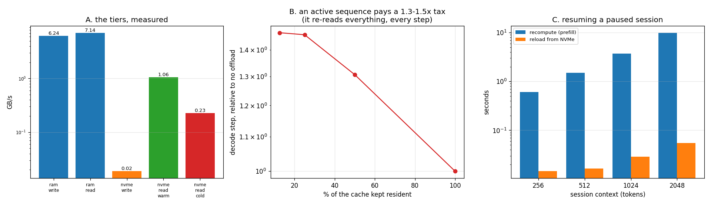

# CPU/NVMe Offload

---

> When the GPU runs out of room, push the rarely-touched cache down to cheaper memory instead of dropping the request. This project builds a real two-tier [KV cache](/shared/glossary/#kv-cache) with real disk I/O — the OS page cache dropped before every read, so no number here is secretly RAM. Findings: offloading blocks of an **active** sequence costs **1.31x–1.47x** per [decode](/shared/glossary/#decode) step, and the curve is nearly flat — offloading 87.5% of the cache costs barely more than offloading 50%, because attention re-reads *everything* every step either way. Offloading a **paused session** is a completely different deal: saving a 2,048-token session costs **0.19 s** and reloading it **0.054 s**, against **9.96 s** to recompute it — **183x cheaper to reload than to recompute.** The same arithmetic on an H100-class box, where prefill is thousands of times faster, still favours reloading by **3.8x–4.6x** over NVMe and **16x–19x** over host RAM — and the ratio is **independent of context length**, because both sides scale linearly. One measured surprise: a `fsync` on a small block costs **3.50 ms** — 12x a cold read of the same bytes, and 56x a warm one — so durability, not bandwidth, is the write-side bottleneck.

---

## Key Insight

This project adds a second tier to the [KV cache](/shared/glossary/#kv-cache): when the fast tier fills up, cold (rarely-used) cache blocks are moved out to slower storage and loaded back when a request needs them again. It measures the reload cost against the [throughput](/shared/glossary/#throughput) gained on long-running sessions.

## Why This Matters

Very long chats and agent sessions can hold more cache than fits on the GPU. Tiering to cheaper, slower memory lets those sessions survive instead of being dropped — but every reload adds latency, so measuring the trade-off tells you when offload helps and when it hurts.

---

**This is project 15.**

### A note on the hardware

On a GPU box the tiers are **[HBM](/shared/glossary/#hbm) → host RAM → NVMe**, connected by [PCIe](/shared/glossary/#pcie). This machine has no usable GPU, so the same structure is measured one level down: **process RAM** is the fast tier and the **NVMe SSD** is the slow tier. The *ratios* between tiers, and the reasoning they drive, are what transfer; the absolute GB/s do not. Section D repeats the key decision with H100-class numbers, clearly labelled as arithmetic rather than measurement.

### The words first

- **Offload** — move data out of an expensive tier to a cheaper one, *with the intention of bringing it back*. Contrast [project 14](../14-attention-sink-eviction/README.md)'s **eviction**, which throws data away and accepts the quality loss. Offload keeps quality identical and pays in latency; eviction keeps latency identical and pays in quality. Those are the two currencies, and you pick which one to spend.
- **Cold / hot** — not touched recently / touched recently. A cold block is the safe one to move out.
- **Tier** — a level of the memory hierarchy. Each step down is roughly 10x cheaper per byte and 10x slower.
- **Page cache** — the operating system keeps recently-read file data in RAM. **Read a file you just wrote and you are timing RAM, not the disk.** Every disk number here calls `posix_fadvise(POSIX_FADV_DONTNEED)` first, which tells the kernel to forget those pages, so the read really goes to the device.
- **`fsync`** — force the operating system to actually put the bytes on the device before returning, instead of buffering them. It is what makes a write *durable*, and section A shows it costs 12x more than a cold read of the same bytes.
- **Immutable** — never changes after it is created. KV blocks are immutable: attention only ever reads them. That single property is worth a large optimization, see the traps below.

### "Attention reads the whole cache every step. So how can offloading any of it possibly work?"

This is the right objection, and section B is built to make you feel it. The answer is that **it does not work for an active sequence, and works extremely well for an inactive one.** The distinction is the entire project:

| | active sequence (generating right now) | paused session (user is reading / thinking / gone) |
|---|---|---|
| how often the cache is read | every decode step, all of it, every layer | not at all until the next turn |
| what offload costs | a fetch of everything non-resident, per layer, per step | one bulk reload, once, when the user comes back |
| measured here | **1.3x–1.5x per step, forever** | **0.054 s once, vs 9.96 s to recompute** |

A chat product's sessions spend most of their life in the right-hand column. A user sends a message, reads a reply, thinks, types — and for those seconds or minutes the session's KV cache is sitting in [HBM](/shared/glossary/#hbm) doing nothing while occupying seats that paying, actively-generating requests could use. **That idle cache is what offload is for.**

### "If the session is idle, why keep its cache at all? Just recompute it when they come back."

That is a completely legitimate design, and it is what most engines did before KV offload existed — drop the cache, re-prefill the whole conversation on the next turn. Section C and D exist to price it, and the answer is decisive: **reloading is 3.8x–183x cheaper than recomputing**, across every scenario measured or computed here.

The reason is a difference in what the two operations are made of:

- **Recompute** = run every token of the conversation through every layer of the model. Cost ≈ tokens × model FLOPs.
- **Reload** = copy `tokens × KV-bytes-per-token` from storage. Cost ≈ tokens × bytes ÷ bandwidth.

Both are linear in the number of tokens, so **the ratio between them does not depend on how long the conversation is** — it is a fixed property of your model and your storage link. Section D shows exactly that: 3.81x at 2k tokens, 3.81x at 8k, 3.81x at 32k. Work the ratio out once for your deployment and the answer holds for every session.

(The *measured* ratios in section C do grow with context — 42.2x to 183.0x — because our CPU prefill has an unfused quadratic attention term, as [project 09](../09-kv-cache-from-scratch/README.md) section D explains. On real hardware with FlashAttention, section D's constant is the better model.)

---

## Running it

```bash
python3 run.py           # ~3 minutes on 6 CPU threads
python3 run.py --plot    # redraw the figure from the committed findings.json
```

Needs `torch`, `transformers`, `matplotlib`. Model: Qwen2.5-0.5B-Instruct, float32, CPU, **24.6 KB of cache per token**. Tier-2 backend: one file per block on the machine's NVMe SSD, written with `fsync` and read with the page cache dropped.

> **About the numbers.** Everything below comes from the committed
> [`outputs/findings.json`](outputs/findings.json),
> [`outputs/active.csv`](outputs/active.csv) and
> [`outputs/session.csv`](outputs/session.csv).



---

## A. The tiers, measured (one 64-token block = 64 KB of K and V)

| operation | latency | bandwidth |
|---|---|---|
| RAM write (copy) | 10.5 µs | 6.24 GB/s |
| RAM read (copy) | 9.2 µs | 7.14 GB/s |
| NVMe read, **warm** (page cache) | 61.9 µs | 1.06 GB/s |
| NVMe read, **cold** (real device) | **287.0 µs** | 0.23 GB/s |
| NVMe write + `fsync` | **3,497 µs** | 0.02 GB/s |

Three things this table is worth reading for:

**1. Warm and cold differ by 4.6x, and only one of them is a disk measurement.** If this benchmark had skipped `posix_fadvise`, it would have reported NVMe at 1.06 GB/s — a number that is really "RAM, with extra steps". Any storage benchmark that does not say how it dropped the cache should be assumed to be measuring RAM.

**2. The write is 12x slower than the cold read of the same bytes**, and the reason is `fsync`, not bandwidth. `fsync` is a per-call fixed cost (a device flush), so a small write is almost entirely flush. Section C writes 24 much larger blobs and gets 0.19 s for 50 MB — **263 MB/s**, an order of magnitude better than this row, purely from amortising the same number of flushes over more bytes.

**The practical rule: a KV offload tier should not be fsyncing at all.** If the machine dies, the session is gone anyway and can be recomputed — that is what makes it a *cache*. Fsyncing every block turns your cache into a database and pays for a durability guarantee nobody asked for. (This project keeps the `fsync` deliberately, so that the cold-read numbers are honest and this cost is visible rather than hidden.)

**3. RAM is 31x faster than cold NVMe here.** On a GPU box the equivalent gap is HBM vs host RAM over PCIe (roughly 3 TB/s vs 25 GB/s, or 120x) and host RAM vs NVMe (25 vs 6 GB/s, 4x). Every tier is worth having; each is a different point on the price/speed line.

## B. Offloading an *active* sequence: a 1.3x–1.5x tax that barely moves

512-token context, 64-token blocks (8 blocks per layer), 9 generated tokens, each configuration run twice round-robin with the better median kept:

| blocks resident | resident cache | median decode step | vs no offload | total fetches | total fetch time |
|---|---|---|---|---|---|
| 8 / 8 (none offloaded) | 12.8 MB | **96.0 ms** | 1.00x | 0 | 0.00 s |
| 4 / 8 | 6.5 MB | 125.4 ms | **1.31x** | 864 | 0.26 s |
| 2 / 8 | 3.3 MB | 140.1 ms | 1.46x | 1,296 | 0.38 s |
| 1 / 8 | 1.8 MB | 140.9 ms | **1.47x** | 1,512 | 0.43 s |

**The surprise is how quickly the curve flattens.** Halving the resident set the first time costs 1.31x; shrinking it a further 4x, all the way down to one block in eight, only takes it to 1.47x. Two mechanisms produce that, and both are worth understanding because they generalize:

- **Attention needs all of it, so the fetch volume is bounded by the total cache, not by how much you offloaded.** Going from 4 resident to 1 resident only moves 3 more blocks per layer per step; the other 4 were already being fetched every step anyway. The marginal cost of offloading more is small once you have offloaded any.
- **Bigger read batches amortize better.** At 4 resident, each fetch cost 303 µs; at 1 resident, 282 µs. More outstanding reads means the device queue stays fuller.

The honest headline is therefore *not* "offloading an active sequence is catastrophic" — on this hardware it is under 1.5x, which some workloads could survive. It is: **you pay the tax on every single step and it buys you nothing, because the data comes straight back.** The resident copy is not a cache in any useful sense; it is a staging buffer for a round trip you make anyway.

Where offload *does* work for an active sequence is when the storage tier is fast enough and the model slow enough that the fetch hides behind compute — which is the design of systems like FlexGen and DeepSpeed-Inference, and requires overlapping the transfer of layer *i+1* with the computation of layer *i*. This project deliberately does not overlap, so the cost is visible rather than hidden.

## C. Offloading a *paused session*: 183x cheaper than recomputing

Whole cache saved and restored at once:

| session context | cache size | recompute (prefill) | save to NVMe | reload from NVMe | reload vs recompute |
|---|---|---|---|---|---|
| 256 | 6.3 MB | 0.61 s | 0.115 s | 0.014 s | **42.2x cheaper** |
| 512 | 12.6 MB | 1.51 s | 0.111 s | 0.017 s | 91.3x |
| 1,024 | 25.2 MB | 3.75 s | 0.131 s | 0.029 s | 131.1x |
| 2,048 | 50.3 MB | 9.96 s | 0.191 s | **0.054 s** | **183.0x** |

Note also that **saving is 3.5–8x more expensive than loading** (0.191 s vs 0.054 s at 2k) — the `fsync` cost from section A. That asymmetry is the right shape for this workload, since you save once per pause and load once per resume, but it argues again for dropping the `fsync`.

**What this buys in capacity:** a paused session's cache is 50.3 MB of seats. Offloading it and reloading on the next turn costs the user 54 ms of extra [TTFT](/shared/glossary/#ttft) — well under the ~200 ms threshold where a delay stops feeling instantaneous — and frees the memory for the entire duration of the pause. On a chat product where users spend most of their session reading rather than generating, that is a large fraction of your cache reclaimed for a latency cost nobody notices.

## D. The same decision, on hardware this box does not have

**Arithmetic, not measurement.** Prefill throughput and link bandwidth are taken from published figures; the KV-per-token numbers come from [project 10](../10-kv-size-calculator/README.md).

| scenario | 2k context | 8k context | 32k context | reload advantage |
|---|---|---|---|---|
| Llama-3.1-8B, 1xH100, NVMe @ 6 GB/s | 171 ms → 45 ms | 683 → 179 ms | 2,731 → 716 ms | **3.81x** |
| Llama-3.1-8B, 1xH100, host RAM @ 25 GB/s | 171 → 11 ms | 683 → 43 ms | 2,731 → 172 ms | **15.9x** |
| Llama-3.1-70B, 4xH100, NVMe @ 6 GB/s | 512 → 112 ms | 2,048 → 447 ms | 8,192 → 1,790 ms | **4.58x** |
| Llama-3.1-70B, 4xH100, host RAM @ 25 GB/s | 512 → 27 ms | 2,048 → 107 ms | 8,192 → 429 ms | **19.1x** |

(Left number is recompute, right is reload.)

**The advantage column is constant down each row.** Both operations are linear in tokens, so the ratio is a property of the hardware and the model, not of the request. Compute it once:

```
reload advantage  =  (link bytes/second) / [ (prefill tokens/second) x (KV bytes per token) ]
```

Read the denominator as "bytes of KV the model manufactures per second". If your storage link can move bytes faster than the GPU can manufacture them, reloading wins. For Llama-3.1-8B on an H100: `6e9 B/s ÷ (12,000 tok/s × 131,072 B/tok)` = `6e9 ÷ 1.57e9` = **3.81**. If that number is above 1, storing the cache wins; below 1, recompute wins. On today's hardware it is comfortably above 1 for every mainstream model, which is why disk-backed KV caching (LMCache, vLLM's CPU offload, Mooncake's KV store) became a product category rather than a curiosity.

**When would recompute win?** When prefill gets much faster relative to storage, or when the cache per token gets much larger. Note which way [MLA](/shared/glossary/#mla) and aggressive KV [quantization](/shared/glossary/#quantization) push this: by shrinking bytes-per-token they make reloading *cheaper*, so they strengthen the case for offload rather than removing the need for it.

---

## What to take from this

1. **Offload is a session-level idea, not a token-level one.** Active sequences re-read everything every step; paused ones read nothing at all.
2. **Reloading beats recomputing, and the margin does not depend on context length.** Work out the one ratio for your deployment.
3. **Drop the page cache or your storage benchmark is a RAM benchmark.** 4.6x apart here.
4. **Do not `fsync` a cache.** 3.50 ms per small block, for a durability guarantee a cache does not need.
5. **Offload and eviction are the same problem paid for in different currencies.** Offload costs latency and keeps quality exact ([project 14](../14-attention-sink-eviction/README.md) costs quality and keeps latency). Knowing which one your product can afford to spend is the actual design decision.

### Common traps this project walks into on purpose

- **Rewriting an immutable block.** A KV block never changes after its token is finished, so a block that has been written to tier 2 once is still valid the next time it is pushed out. `tiered.py` tracks `on_disk` and skips the redundant write — worth **1,488 skipped write-backs** in the 1-resident run above, and at 3.50 ms each that is 5.2 seconds saved in a nine-step generation. Miss this and offload looks far worse than it is.
- **Evicting the newest block.** LRU is used because the obvious alternative — evict whatever was just added — guarantees you fetch it straight back on the next layer.
- **Timing a read you just wrote.** See section A. This is the single most common way storage benchmarks lie.
- **Forgetting to re-apply the budget after a fetch.** `_gather` fetches blocks back into the resident tier, which pushes it over budget; if you do not offload again afterwards, the resident set grows until the whole cache is back in RAM and the measurement quietly becomes a no-op.

---

## Phase 2 wrap-up

The seven projects attack one problem — the KV cache is the serving engine's working set — from every side:

| project | strategy | measured result |
|---|---|---|
| [09](../09-kv-cache-from-scratch/README.md) | store it at all | 5.89x faster, identical output |
| [10](../10-kv-size-calculator/README.md) | predict its size | formula exact; 100x spread across model shapes |
| [11](../11-tiny-paged-cache/README.md) | allocate it in blocks | 5.8x more tokens served than reserve-max |
| [12](../12-prefix-share-benchmark/README.md) | share it between requests | 33x TTFT, 14.8x memory |
| [13](../13-kv-quantization-study/README.md) | store it in fewer bits | 4x smaller for +0.35%, if you pick the granularity right |
| [14](../14-attention-sink-eviction/README.md) | store fewer tokens | 4.5x smaller for 3.2x perplexity — a real trade |
| [15](../15-cpu-nvme-offload/README.md) | store it somewhere cheaper | 183x cheaper to reload than recompute, for paused sessions |

Note that the first five are close to free and the last two are not. **Do them in that order.** Paging, prefix sharing and bf16 storage cost you essentially nothing; eviction costs quality and offload costs latency, so they are what you reach for after the free wins are already collected.

## Next

[Phase 3 — Batching and Scheduling](../../README.md#phase-3-batching-and-scheduling) asks the next question: given a cache you can now manage properly, which requests should share a forward pass, and in what order?
