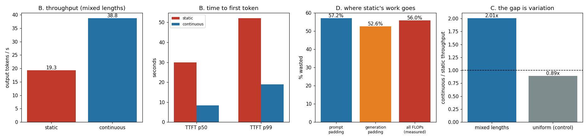

# Static vs. Continuous

---

> Static batching makes everyone wait for the slowest request; [continuous batching](/shared/glossary/#continuous-batching) lets each one leave the moment it is done. This project builds **both** schedulers around one real batched engine (Qwen2.5-0.5B, our own forward pass, a slot-based [KV cache](/shared/glossary/#kv-cache)) and runs the same 40-request traffic trace through each. Findings: continuous batching serves **2.01x** the tokens per second, cuts [TTFT](/shared/glossary/#ttft) p50 by **3.60x**, and does it while performing **exactly the same 2.84 TFLOPs of useful work** — static burns another **3.62 TFLOPs on [padding](/shared/glossary/#padding)**, 56.0% of everything it computes. Two honest inversions: on traffic where every request is the *same size*, static **wins** by 1.12x, so the whole advantage is variation and not batching; and continuous batching's [ITL](/shared/glossary/#itl--tpot) p99 is **3.29x worse** than static's, because a [prefill](/shared/glossary/#prefill) stalls the token stream — which is the exact disease [project 18](../18-chunked-prefill-simulator/README.md) cures.

---

## Key Insight

This project builds two batching strategies around a toy [decode](/shared/glossary/#decode) loop — *static* batching (gather a fixed group, run them together, and they all finish together) and [continuous batching](/shared/glossary/#continuous-batching) (add and drop requests every step) — then load-tests both under requests of varying lengths and arrival times.

## Why This Matters

Static batching wastes the GPU whenever requests differ in length, because short ones sit idle waiting for long ones. Continuous batching keeps the GPU full and is the single biggest [throughput](/shared/glossary/#throughput) win in modern serving — building both yourself makes the gap impossible to forget.

`batchlib.py` and `schedulers.py` are the shared foundation of this whole phase: projects 17, 19, 20 and 21 all import them.

---

**This is project 16.**

### The words first

Almost every term here is borrowed from queueing and operating systems, and each name says what the thing does once you unpack it.

- **[Batch](/shared/glossary/#batch)** — several requests processed in one forward pass. The reason to bother: reading the model's weights out of memory costs the same whether one row or thirty-two rows are riding along, so a wider batch gets more tokens for the same memory traffic.
- **[Static batching](/shared/glossary/#static-batching)** — *static* because the membership of the batch is fixed the moment it starts. Nobody joins, nobody leaves, until the whole group is finished.
- **[Continuous batching](/shared/glossary/#continuous-batching)** (also *in-flight batching*, or *iteration-level scheduling*) — *continuous* because the batch never stops and restarts; it is re-decided at every single iteration. A finished request's seat is refilled on the next forward pass.
- **[Padding](/shared/glossary/#padding)** — filler token positions added so that a rectangular tensor can hold sequences of different lengths. The accelerator does real arithmetic on them and the result is thrown away.
- **Slot / lane** — one request's reserved space in the KV cache. This project uses a fixed pool of them, so "the cache is full" is a real, countable condition.
- **[Poisson](/shared/glossary/#poisson-process) arrivals** — named after Siméon Poisson. It means "events happen at some average rate but with no coordination between them", which is exactly what independent users do. The consequence you can feel: gaps between arrivals are *exponentially* distributed, so bursts and long quiet stretches are both normal, not anomalies.
- **Lognormal lengths** — the **logarithm** of the length follows the familiar bell curve. That produces the shape real chat traffic has: most requests short, a long thin tail of pasted documents, and never a negative length.
- **[TTFT](/shared/glossary/#ttft)** — time to first token. What a user experiences as "did it hear me?"
- **[ITL](/shared/glossary/#itl--tpot)** — inter-token latency. The gap between consecutive streamed tokens; what a user experiences as "is it still typing?"

### "The GPU is already batching. Why does the scheduler matter?"

Because batching and scheduling answer different questions, and only one of them is about arithmetic.

`torch` will happily run a batch of 8 sequences in one call — that is batching, and it is one line of code. What it cannot tell you is *which* 8 sequences should be in that call, given that requests arrive at random times, have different prompt lengths, and stop generating at different moments. That decision is the scheduler, and it is where nearly all the throughput lives.

Concretely: the *same* `torch` batching primitive, driven by two different schedulers on the same trace, produced 19.29 and 38.77 output tokens per second below. The kernels were identical. Only the decision about who rides in each pass changed.

### "Why write a new engine? Phase 2 already has one."

[Project 09](../09-kv-cache-from-scratch/README.md)'s `kvlib.py` runs **one sequence at a time**, because Phase 2's question was "what does the cache hold?". Phase 3's question is "who shares each forward pass?", and that needs two things a single-sequence engine has no reason to have:

1. **A slot pool.** A fixed amount of KV space, handed out one lane per request. Without it there is no such thing as "the cache is full", and half of this phase (projects 20 and 21 especially) has nothing to measure.
2. **Per-row positions.** In a continuous batch, row 3 might be at token 12 while row 4 is at token 300. Every mask in `batchlib.py` is built from a *per-row* length, never from one shared `seq_len`. A single-sequence engine can get away with `torch.arange(seq_len)`; a heterogeneous batch cannot, and section A exists to prove ours does not.

`batchlib.py` reuses Phase 2's ideas (real Qwen2.5-0.5B weights, our own arithmetic, RoPE, GQA) and replaces the cache seam with a batched one.

---

## Running it

```bash
python3 run.py           # ~6 minutes on 6 CPU threads
python3 run.py --plot    # redraw the figure from the committed findings.json
```

Needs `torch`, `transformers`, `matplotlib`. There is no GPU in this environment that PyTorch can drive (the card reports compute capability 6.1; this build needs 7.0+), so everything runs on 6 CPU threads. That changes the absolute numbers and not the shape of the result — the mechanism being measured is "how many forward passes, carrying how many useful rows", which is hardware-independent.

**One thing to know about the clock.** Both schedulers run in *virtual time*: the clock advances by the measured duration of each forward pass, not by `time.time()`. A request that arrives at t = 3.2 s is admitted when the engine's own work has taken 3.2 s. This is deliberate — on a shared machine, wall-clock would have made "which scheduler is better" depend on what else happened to be running, and the two runs are minutes apart.

> **About the numbers.** Everything below comes from the committed
> [`outputs/findings.json`](outputs/findings.json).



The workload: 40 requests, Poisson arrivals at 5 requests/second, prompt lengths lognormal (median **54** tokens, max **192**), output lengths lognormal (median **29**, max **72**). Batch width 8 for both schedulers, so neither gets more memory than the other.

---

## A. Batching must not change what the model says

| check | result |
|---|---|
| three prompts of length 5, 8, 9 decoded **solo** vs in one **heterogeneous** batch | **identical tokens** |
| the same three prompts **right-padded** into one rectangle vs unpadded | **identical tokens** |

Both texts came out word for word:

```
" Paris. It is the largest city in Europe and"
" village. The village was very peaceful and quiet."
" being to walk on the moon was Neil Armstrong."
```

This is not a formality. Batching bugs are *silent*: they produce fluent, plausible text that is subtly the wrong text, and no exception is ever raised. The three ways a heterogeneous batch goes wrong are all position bugs:

- **Wrong rotary position.** If the code applies position `i` to every row of the batch at step `i`, then a row that started at token 300 gets position 12. The output is grammatical nonsense.
- **Reading another request's cache.** Slots are recycled. If the mask does not stop row 3 from reading columns beyond its own length, it attends to whatever the previous occupant of that lane left behind.
- **Padding leaking into a real row.** Right-padding is safe *only because* the causal mask already forbids a real token from reading later columns. That is an argument, not an obvious fact, so it needs a test — which is the second row of the table.

The `apply_rope_rows` function in `batchlib.py` takes positions of shape `(batch, tokens)` rather than `(tokens,)` for exactly this reason, and the mask in `_layer` combines *two* conditions — causal (`col > my_position`) and ownership (`col >= my_length`) — rather than one.

## B. One trace, two schedulers

| | static, batch 8 | continuous, 8 slots | ratio |
|---|---|---|---|
| wall time | 66.70 s | **33.19 s** | **2.01x** |
| output tokens / s | 19.29 | **38.77** | **2.01x** |
| TTFT p50 | 29.93 s | **8.32 s** | **3.60x** |
| TTFT p99 | 52.18 s | **18.82 s** | 2.77x |
| end-to-end p50 | 41.94 s | **14.64 s** | 2.86x |
| **ITL p50** | 0.140 s | 0.137 s | 1.02x |
| **ITL p99** | **0.216 s** | 0.709 s | **0.30x — static wins** |
| forward passes | 334 | **233** | 1.43x |
| useful TFLOPs | 2.84 | 2.84 | **1.00x** |
| padding TFLOPs | **3.62** | **0.00** | — |
| engine idle | 2.3% | 0.2% | |

Five things in that table, in order of how much they should change your mental model.

**1. The useful work is identical: 2.84 TFLOPs each.** Both schedulers produced the same 1,287 output tokens from the same 40 prompts. Continuous batching is not doing less real work — it is doing *only* real work. Static spends another 3.62 TFLOPs on padding, so it computes 2.27x the arithmetic to deliver the same answers. The 2.01x wall-clock gap is that 2.27x, minus a little, because a wider batch is slightly more efficient per row.

**2. TTFT improves more than throughput does (3.60x vs 2.01x).** This is the part that surprises people, and it is not a FLOPs effect at all. Under static batching a request that arrives first must wait for the eighth member of its batch to show up *and then* for the whole previous batch to finish. Continuous batching admits it on the next iteration. The user-visible improvement is therefore bigger than the accountant-visible one.

**3. Static batching's engine is barely idle (2.3%).** If you were watching a GPU-utilization dashboard you would see a green line for both runs. Utilization measures whether the accelerator is *busy*; it says nothing about whether the work is useful. 56.0% of static's busy time was padding. **A utilization graph cannot see this failure**, which is why the counters in `batchlib.py` measure useful vs. padded token-slots directly.

**4. The honest inversion: continuous batching's ITL p99 is 3.29x *worse*.** 0.709 s against 0.216 s. Median ITL is a tie (0.137 vs 0.140), so this is entirely about the tail. The cause is visible in the code: `run_continuous` spends a whole iteration on each new prefill, and during that iteration *nobody decodes*. Every request currently streaming sees its token clock stop for the duration of a prompt. Static batching does not have this problem because it prefills its whole group once, up front, and then does nothing but decode.

That is a real regression, not a measurement artifact, and it is exactly the problem *chunked prefill* was invented for. [Project 18](../18-chunked-prefill-simulator/README.md) picks it up from here.

**5. Fewer forward passes, not just fewer FLOPs (233 vs 334).** On a memory-bandwidth-bound decode step, a forward pass costs roughly the same whether it carries 3 rows or 8, because the dominant cost is dragging the weights out of memory once. So the pass count is often a better predictor of time than the FLOP count. [Project 17](../17-padding-waste-audit/README.md) turns this observation into a measurement that contradicts the naive "minimise padding FLOPs" objective.

## C. The control: same trace shape, no length variation

Every claim in section B could have a boring explanation — maybe continuous batching is just better, full stop. So the same experiment was run with every request forced to the *median* size: prompt 54 tokens, output 29 tokens, same arrival times.

| | static, batch 8 | continuous, 8 slots |
|---|---|---|
| output tokens / s | **52.38** | 46.57 |
| TTFT p50 | **7.70 s** | 8.02 s |
| ITL p99 | **0.128 s** | 1.084 s |
| forward passes | **145** | 186 |
| padding FLOPs | 0.0% | 0.0% |

**Static batching wins, 1.12x.** With no length variation there is no padding to waste — both report 0.0% — so continuous batching's entire advantage evaporates, and what is left is its one structural disadvantage: it prefills requests **one at a time**, while static batches all 8 prompts into a single prefill pass. That costs 41 extra forward passes (186 vs 145) and 12% of the throughput.

This is the sentence to remember: **continuous batching is not a faster way to batch. It is a way to stop paying for variation.** If your traffic really were uniform — a benchmark harness, a fixed-length embedding job, a batch-scoring pipeline — static batching is the better design, and it is much simpler. Real chat traffic is nowhere near uniform (section D), which is why every production engine ships the continuous version.

Note also that continuous batching's ITL p99 is *worse here too* (1.084 s vs 0.128 s, 8.5x) — worse than in the varied case, in fact, because uniform requests all finish together and free eight slots at once, producing a burst of eight consecutive prefill-only iterations.

## D. Where does static batching's time actually go?

Decomposing the same trace into the five groups of 8 that static batching forms:

| source of loss | measured |
|---|---|
| head-of-batch arrival wait, summed over 5 groups | **5.68 s** |
| prompt tokens that are padding | **57.2%** |
| decode slots that are padding | **52.6%** |

Three separate taxes, each with a different fix:

- **Arrival wait** (5.68 s of the 66.70 s run, 8.5%) is [head-of-line blocking](/shared/glossary/#head-of-line-blocking): request 1 of a group sits idle until request 8 arrives. This is the part continuous batching removes *completely* — it never waits to fill a batch.
- **Prompt padding, 57.2%.** Group 2 had 543 real prompt tokens stored in a 1,536-token rectangle. Paid once per request, and fixable by sorting the queue by prompt length ([project 17](../17-padding-waste-audit/README.md) section D).
- **Generation padding, 52.6%.** Group 1 had 251 real decode slots in a 568-slot rectangle. Paid *every step*, and not fixable by sorting, because the output length is not known when the batch is formed.

The two padding numbers are close (57.2% vs 52.6%), but they are not equally tractable, and confusing them leads to fixing the wrong one. The prompt length is printed on the request. The answer's length is decided by the model, one token at a time, and nobody knows it until it stops.

---

## What to take from this

1. **Continuous batching's win is 2.01x here and 0.89x on uniform traffic.** The number is a property of *your* length distribution, not of the technique. Measure your traffic before quoting anyone else's speedup.
2. **Useful work was identical (2.84 TFLOPs both ways).** Every serving optimisation in this phase is about removing waste, not about computing faster.
3. **Utilization is a broken metric.** Static batching kept the engine 97.7% busy while wasting 56.0% of it. Plot *useful* tokens per second instead.
4. **Continuous batching makes TTFT better and ITL p99 worse.** If you ship it and only watch throughput, you will ship a tail-latency regression with it.
5. **A heterogeneous batch is where position bugs hide**, and they are silent. Test against solo decoding before you trust any number a batched engine gives you.

### Common traps this project walks into on purpose

- **Comparing schedulers on wall-clock on a shared machine.** The virtual clock in `schedulers.py` exists because the two runs are minutes apart and this box has other tenants.
- **Letting the batch keep stepping for finished rows.** `run_static` deliberately keeps dead rows in the batch — that *is* generation padding, and removing it quietly would have turned static batching into a strawman that no longer matches what static batching means.
- **Measuring padding in slots instead of FLOPs.** They happen to agree here (55.9% vs 56.0%) because the contexts are short. At production context lengths they diverge; [project 17](../17-padding-waste-audit/README.md) keeps both columns for that reason.
- **Reporting only the median.** Median ITL was a tie. The whole story was in p99, in the opposite direction to everything else in the table.

---

## Next

[Project 17 — padding waste audit](../17-padding-waste-audit/README.md) takes the 56.0% number apart: which batch size, which length spread, and whether sorting the queue can recover it.
