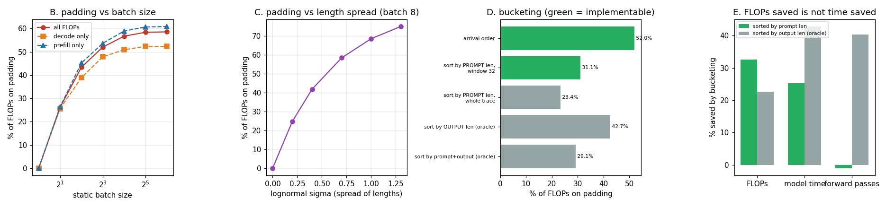

# Padding Waste Audit

---

> Every [padding](/shared/glossary/#padding) token is compute the GPU spends on a word that isn't even there. This project puts a number on it: **54.0%** of one 8-request [static batch](/shared/glossary/#static-batching)'s [FLOPs](/shared/glossary/#flops), rising to **58.6%** at batch 64 and **74.9%** when the length spread widens. Then it tests the standard fix — sorting the queue so similar-length requests batch together. Two honest inversions came out of it. First, sorting by the length you actually **know** (the prompt) saves **32.6%** of FLOPs, while sorting by the length only an oracle knows (the answer) saves just **22.6%** — you do not need to see the future. Second, and more useful: the oracle sort saves **less** arithmetic and **more** time — **42.8%** against 25.3% — because it removes **40.3% of the forward passes**, and on a memory-bound [decode](/shared/glossary/#decode) a pass costs nearly the same whether it carries three rows or eight. Minimising padding FLOPs is the wrong objective.

---

## Key Insight

This project instruments a static-batching server to measure what fraction of its [decode](/shared/glossary/#decode) [FLOPs](/shared/glossary/#flops) are spent on [padding](/shared/glossary/#padding) — the filler tokens added so every sequence in a [batch](/shared/glossary/#batch) reaches the same length.

## Why This Matters

Padding is pure waste: the GPU does real work on tokens that carry no information. Putting a number on that waste shows exactly why [continuous batching](/shared/glossary/#continuous-batching), which needs no padding, beats static batching on busy, mixed-length traffic.

---

**This is project 17.**

### The words first

- **[Padding](/shared/glossary/#padding)** — filler positions added so sequences of different lengths fit in one rectangular tensor. Named for exactly what it does: it pads a short thing out to the size of a long thing.
- **Pad *slot*** — one token-position of padding. Counting slots is easy to explain but misleading, because a pad slot at context 300 makes attention read 300 keys while one at context 12 reads 12. This project therefore reports **both** slots and FLOPs.
- **Length bucketing** — sorting the queue so requests of similar length land in the same batch. *Bucket* because you are pouring requests into bins by size before batching them.
- **Oracle** — a policy that is given information the real system cannot have. Used as an *upper bound*: if the oracle only beats you by a little, the information was not worth chasing.
- **Sigma (σ)** — the spread parameter of the lognormal that generates lengths. Larger σ means the tail of very long requests is longer. At σ = 0 every request is the same size.

### "Two kinds of padding? Isn't padding just padding?"

No — and treating them as one number is the usual reason a padding audit leads to the wrong fix. They are paid at different times, at different rates, and only one of them can be fixed.

**Prompt padding (prefill).** A batch of prompts of lengths [30, 76, 146, 192] is stored as a rectangle 192 wide. The short ones are padded out. This is paid **once** per request, and the lengths are **known** when the batch is formed — they are printed on the request.

**Generation padding (decode).** A static batch keeps stepping until its *longest* member finishes. A request that wanted 11 tokens, sitting next to one that wants 72, rides along for 61 extra steps. This is paid **every step**, and the lengths are **unknowable** — the answer's length is decided by the model, one token at a time.

The distinction has a direct consequence in section D: sorting by prompt length fixes prefill padding almost completely (53.7% → 3.3% with full lookahead) and does nothing at all for decode padding (47.9% → 47.6%).

### "If it's 54% wasted, won't removing it make the server twice as fast?"

That is the natural inference and section E shows it is wrong in both directions.

The assumption behind it is that time is proportional to FLOPs. On a **prefill** — thousands of tokens, one big matrix multiply — that is roughly true. On a **decode** step it is not, because the step is [memory-bound](/shared/glossary/#memory-bound): the dominant cost is dragging the model's weights out of memory, and that cost is paid once per forward pass regardless of how many rows are riding along. Three rows and eight rows cost nearly the same.

So the currency that matters for decode is **forward passes**, not FLOPs — and that is why the sort that saves the *fewest* FLOPs saves the *most* time.

---

## Running it

```bash
python3 run.py           # ~4 minutes on 6 CPU threads
python3 run.py --plot    # redraw from outputs/findings.json
```

Needs `torch`, `transformers`, `matplotlib`, and [project 16](../16-static-vs-continuous/README.md)'s `batchlib.py` / `schedulers.py`. Sections A–D are pure accounting over synthetic length traces and run in seconds; section E runs the real Qwen2.5-0.5B through three full static-batching passes.

> **About the numbers.** Everything below comes from the committed
> [`outputs/findings.json`](outputs/findings.json),
> [`outputs/batch_sweep.csv`](outputs/batch_sweep.csv) and
> [`outputs/spread_sweep.csv`](outputs/spread_sweep.csv).



---

## A. One batch of eight, taken apart

Lengths (prompt, output): `(30,21) (76,21) (146,38) (192,35) (81,68) (49,72) (32,11) (35,72)`

| | pad slots | total slots | % of slots | % of FLOPs |
|---|---|---|---|---|
| prefill | 895 | 1,536 | 58.3% | **58.5%** |
| decode | 238 | 568 | 41.9% | **42.0%** |
| **total** | | | **53.8%** | **54.0%** |

Two readings worth separating.

**More than half of this batch is filler**, and none of it produces a token anyone asked for. The prefill rectangle is 8 × 192 = 1,536 positions to hold 641 real ones.

**But prefill padding is 79.0% of the wasted FLOPs, not decode padding.** That surprises people who have internalised "decode dominates serving", and the reason is that this workload's prompts (median 76) are longer than its answers (median 36). Reverse that — long answers, short prompts, which is what a reasoning model looks like — and the split reverses too. There is no universal answer here; there is only your traffic.

Slots and FLOPs agree almost exactly (53.8% vs 54.0%) because these contexts are short. At production context lengths they diverge, which is why both columns exist.

## B. Batch size is the main dial

| batch | prefill pad | decode pad | overall |
|---|---|---|---|
| 1 | 0.0% | 0.0% | **0.0%** |
| 2 | 26.3% | 25.6% | 26.1% |
| 4 | 45.2% | 38.9% | 43.4% |
| **8** | 53.7% | 47.9% | **52.0%** |
| 16 | 58.9% | 50.9% | 56.7% |
| 32 | 60.7% | 52.3% | 58.4% |
| 64 | 60.9% | 52.3% | **58.6%** |

Batch 1 has no padding by definition — there is nothing to pad *to*. Every doubling after that adds waste, but with sharply diminishing damage: 0 → 26% → 43% → 52% → 57% → 58% → 59%.

The curve flattens because of what the rectangle's width is: the **maximum** of the batch. Going from 32 to 64 samples adds very little to the expected maximum of a lognormal — the tail is already well sampled — so the rectangle stops growing while the number of rows keeps doubling. The waste *fraction* converges to a constant set purely by the length distribution: roughly `1 - mean/max`.

The practical consequence is uncomfortable. Static batching's throughput argument is "wider batches amortise the weight read", and its cost is padding. The benefit saturates and so does the cost, so there is no batch size at which static batching stops wasting half the machine.

## C. It is the spread, not the size

Batch fixed at 8, sweeping the lognormal σ that controls how much lengths vary:

| σ | output median | output max | pad FLOPs |
|---|---|---|---|
| **0.0** | 32 | 32 | **0.0%** |
| 0.2 | 32 | 53 | 24.7% |
| 0.4 | 32 | 90 | 41.8% |
| 0.7 | 33 | 197 | 58.3% |
| 1.0 | 33 | 431 | 68.5% |
| 1.3 | 34 | 941 | **74.9%** |

The median barely moves (32 → 34) while the waste goes from nothing to three quarters. **Padding waste is a function of the tail, not of the typical request.** A traffic mix whose median is unchanged but whose p99 grew 30x has become 75% waste without anything visible happening to the average.

This is the mechanism behind [project 16](../16-static-vs-continuous/README.md)'s control experiment, where uniform-length traffic made static batching *win*: at σ = 0 the row above says padding is exactly 0.0%, so static batching has nothing to lose.

## D. Which length do you sort by?

All at batch 8 over 256 requests. Green rows are policies a real server can implement; grey rows need information it does not have.

| policy | implementable? | prefill pad | decode pad | total pad | total FLOPs |
|---|---|---|---|---|---|
| arrival order | ✅ | 53.7% | 47.9% | 52.0% | — |
| sort by **prompt** length, window 32 | ✅ | **21.0%** | 46.2% | 31.1% | **−30.4%** |
| sort by prompt length, whole trace | ❌ | **3.3%** | 47.6% | 23.4% | −37.3% |
| sort by **output** length (oracle) | ❌ | 51.7% | **2.5%** | 42.7% | −16.3% |
| sort by prompt + output (oracle) | ❌ | 21.6% | 41.5% | 29.1% | −32.2% |

**The implementable policy beats the oracle.** Sorting by prompt length inside a 32-request window — a real thing you can ship, using a number stamped on every request at admission — removes 30.4% of the arithmetic. Sorting by the answer's length, which requires seeing the future, removes 16.3%. That is a nearly 2x gap in favour of the information you already have.

The reason is in the middle two columns. Each sort only fixes *its own* kind of padding:

- Prompt-sorting drives prefill padding from 53.7% to 21.0% and leaves decode padding at 46.2%.
- Output-sorting drives decode padding from 47.9% to 2.5% and leaves prefill padding at 51.7%.

Because prefill padding is the bigger share in this workload (section A), the prompt sort wins. On a reasoning workload with 4,000-token answers and 50-token prompts, the ranking would flip — and the oracle would still be unavailable.

Note also what the **window** costs: 32-request lookahead gets prefill padding to 21.0%, unlimited lookahead gets it to 3.3%. So most of the theoretical gain needs a queue longer than any latency-sensitive service will tolerate. Bucketing is not free: a short request that arrives first now waits for its bucket to fill, which is a scheduling decision, not a data-layout trick.

## E. Do the saved FLOPs turn into saved time?

Three real runs of the engine, 32 requests, batch 8, same traffic in three orders:

| order | model time | total TFLOPs | forward passes | pad FLOPs |
|---|---|---|---|---|
| arrival order | 62.50 s | 6.07 | 283 | 53.3% |
| sorted by prompt length | 46.66 s | **4.09** | 286 | 30.7% |
| sorted by output length (oracle) | **35.73 s** | 4.70 | **169** | 39.7% |

| vs arrival order | FLOPs | model time | forward passes |
|---|---|---|---|
| sorted by prompt length | **−32.6%** | −25.3% | **+1.1%** |
| sorted by output length (oracle) | −22.6% | **−42.8%** | **−40.3%** |

**The sort that saves the most arithmetic is not the sort that saves the most time.** Prompt-sorting removes a third of the FLOPs and a quarter of the time. Output-sorting removes a fifth of the FLOPs and *nearly half* of the time.

The explanation is the forward-pass column. Output-sorting groups requests that finish together, so the batch's decode loop runs 169 passes instead of 283 — a 40.3% cut. Prompt-sorting changes the number of passes by +1.1%, i.e. not at all: it makes each prefill pass narrower without changing how many decode steps the group must take.

And a decode pass is *dominated by reading the weights*, not by the rows it carries. Cutting a pass saves the whole weight read. Cutting a row inside a pass saves almost nothing.

Two consequences worth carrying out of this project:

1. **"Percentage of FLOPs wasted on padding" is a bad optimisation target** for the decode phase, even though it is the number every padding audit reports (including sections A–D of this one). It is the right target for prefill, which is compute-bound, and the wrong one for decode, which is not.
2. **The oracle's advantage here is real but unobtainable.** You cannot sort by a length nobody knows. What you *can* do is stop needing the sort at all — which is [continuous batching](/shared/glossary/#continuous-batching), where a finished request leaves immediately and the pass count falls out for free. [Project 16](../16-static-vs-continuous/README.md) measured 233 passes against static's 334 on that trace, with no sorting at all.

---

## What to take from this

1. **Half of a static batch is filler** at realistic length spreads — 54.0% on one batch, 52.0% averaged over 256 requests at batch 8.
2. **The waste is set by the length tail, not the median.** σ 0.0 → 1.3 moves the median by 2 tokens and the waste from 0.0% to 74.9%.
3. **Sort by prompt length, not by anything cleverer.** It is knowable, it beats the answer-length oracle 30.4% to 16.3%, and a 32-request window captures most of it.
4. **Count forward passes, not FLOPs, when the phase is memory-bound.** The oracle sort saved 22.6% of FLOPs and 42.8% of time; the ranking inverts if you look at the wrong column.
5. **Batch 1 wastes nothing and serves nobody.** The dial does not have a good setting; it has a distribution-dependent plateau at about 58%.

### Common traps this project walks into on purpose

- **Reporting only pad slots.** They match pad FLOPs here (53.8% vs 54.0%) only because the contexts are short, which would not survive a production context length.
- **Calling a whole-trace sort a result.** Two of the five rows in section D are marked unimplementable on purpose; a bucketing benefit quoted without its lookahead window is not a number.
- **Assuming FLOPs and seconds are the same currency.** Section E exists entirely to break that assumption, and it breaks it in the direction that flatters the *worse-looking* policy.
- **Sorting requests but keeping their arrival times.** `run_static` sorts by `arrive`, so section E rewrites the arrival timestamps after sorting; forgetting that silently un-sorts the batches.

---

## Next

[Project 18 — chunked prefill simulator](../18-chunked-prefill-simulator/README.md) attacks the other half of the problem: what a single very long prompt does to everyone else's token stream, and the chunk size that fixes it.
