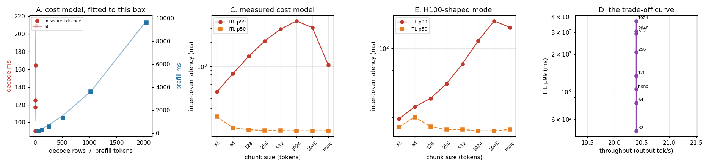

# Chunked Prefill Simulator

---

> One giant prompt should not be allowed to freeze everyone else's stream. This project measures this machine's real [prefill](/shared/glossary/#prefill) and [decode](/shared/glossary/#decode) timings, fits a cost model to them (**5.6%** decode / **16.4%** prefill mean error), and sweeps [chunked prefill](/shared/glossary/#chunked-prefill) over 1,200 simulated requests. The headline: without chunking, the worst gap between two streamed tokens is **143.4 seconds**; at chunk 32 it is **0.57 s** — a **252x** improvement — for **0.0%** throughput. But the honest reading is a metric lesson: [ITL](/shared/glossary/#itl--tpot) **p99** only improves **2.16x**, and is *worse* at chunk 1024 than with no chunking at all, because rare enormous stalls hide below the 99th percentile while frequent medium ones do not. The bill is [TTFT](/shared/glossary/#ttft) p99 at **2.60x**. Re-run on an H100-shaped cost model, the sweet spot moves from chunk 32 to chunk 128–512, and chunk 32 costs **16.0%** of throughput and a **51.6 s** median TTFT — so the tuning does not transfer, only the shape does.

---

## Key Insight

This project builds a small simulator — requests arrive at random times, each [prefill](/shared/glossary/#prefill) takes some time and each [decode](/shared/glossary/#decode) step a little more — to study [chunked prefill](/shared/glossary/#chunked-prefill): slicing a long prefill into pieces so it interleaves with decode steps. Sweeping the chunk size, it plots [tail latency](/shared/glossary/#tail-latency) ([TTFT](/shared/glossary/#ttft) at the 99th percentile) against [throughput](/shared/glossary/#throughput).

## Why This Matters

Without chunking, one 32k-token prompt stalls every other request for hundreds of milliseconds. The simulator lets you find the chunk size that keeps latency smooth without giving up much throughput — and you can explore the whole trade-off curve without ever touching a GPU.

`simlib.py` is the shared simulator for the rest of the phase: projects 20, 21 and 22 all import it.

---

**This is project 18.**

### The words first

- **[Chunked prefill](/shared/glossary/#chunked-prefill)** — splitting one prompt's prefill across several forward passes instead of doing it in one. *Chunk* is just "a piece"; the technique is also called *Sarathi-style* scheduling after the paper that popularised it.
- **Iteration** — one forward pass. The scheduler decides what rides in each one; that decision is the only thing this project varies.
- **[ITL](/shared/glossary/#itl--tpot)** — inter-token latency, the gap between two consecutive streamed tokens. What a user reads as "is it still typing?"
- **Stall** — an ITL far above the typical one, caused by the engine doing something other than decoding. All the stalls here are prefills.
- **Discrete-event simulation** — modelling a system as a sequence of events at explicit times rather than by running it. *Discrete* because time jumps from one event to the next instead of flowing.
- **[Percentile](/shared/glossary/#percentile) (p50, p99)** — p99 is the value 99% of samples fall below. It is a *rank* statistic, so it is deliberately blind to how extreme the worst 1% are — which turns out to matter a great deal here.

### "Why simulate? Project 16 has a real engine."

Because the questions here need a scale this machine cannot reach.

The effect being studied only shows up when a *long* prompt (thousands of tokens) arrives while *many* other requests are mid-answer. Project 16's real engine serves about 20 output tokens per second on 6 CPU threads; reaching a steady state with 1,200 requests and 4,000-token prompts would take days of wall-clock time per configuration, and there are 16 configurations here.

So the simulator borrows its **timing** from the real engine (section A fits its coefficients to measurements taken from `batchlib.py`) and its **logic** from real engines, and is explicit about what it does not model: kernel launch overhead, memory allocation, and anything the accelerator does that is not a linear function of the tokens in the batch.

### "The engine is already batching. Doesn't the prefill just join the batch?"

This is the crucial mechanism, and the answer is *no, not by default*.

A decode step processes **one** token per running request. A prefill processes **hundreds or thousands** of tokens for one request. Putting them in the same forward pass means building a batch whose rows have wildly different widths, which most engines historically did not do — so a prefill got a forward pass **to itself**, and every request currently streaming had its token clock stop for the whole duration.

Chunked prefill is what makes the mixed pass possible: cut the prompt into pieces small enough that a piece plus everyone's decode tokens is a reasonable amount of work for one pass. The gap it fills is not "prefill is slow" — prefill is *efficient*, it is the compute-bound phase. The gap is that **prefill is indivisible**, and an indivisible unit of work is a scheduling hazard no matter how efficient it is.

---

## Running it

```bash
python3 run.py           # ~4 minutes on 6 CPU threads
python3 run.py --plot    # redraw from outputs/findings.json
```

Needs `torch`, `transformers`, `matplotlib`, and [project 16](../16-static-vs-continuous/README.md)'s `batchlib.py`. Section A loads the real model to take timings; everything after that is simulation and runs in seconds.

> **About the numbers.** Everything below comes from the committed
> [`outputs/findings.json`](outputs/findings.json),
> [`outputs/sweep_measured.csv`](outputs/sweep_measured.csv) and
> [`outputs/sweep_h100.csv`](outputs/sweep_h100.csv).



---

## A. Calibrating the simulator on real timings

Decode, at a fixed 256-token context:

| batch | 1 | 2 | 4 | 8 | 16 |
|---|---|---|---|---|---|
| ms | 90.4 | 117.3 | 124.8 | 164.5 | 209.7 |

Prefill, one request at a time:

| tokens | 64 | 128 | 256 | 512 | 1024 | 2048 |
|---|---|---|---|---|---|---|
| ms | 206.8 | 294.5 | 558.4 | 1314.3 | 3602.1 | 9608.7 |
| tok/s | 309 | 435 | 458 | 390 | 284 | 213 |

Fitted model, mean error **5.6%** on decode and **16.4%** on prefill:

```
seconds = 0.0949                       ← fixed cost of any forward pass
        + 0.00686 x decode rows        ← weights + projections, per row
        + 0.00217 x prefill tokens     ← weights + projections, per token
        + 0.00000248 x key reads       ← attention, which is NOT linear
```

Three things in those coefficients are worth stopping on.

**The 94.9 ms fixed cost is enormous relative to the per-row cost (6.86 ms).** A pass carrying one row costs 102 ms; a pass carrying eight costs 150 ms. That is the memory-bound decode economics of [project 17](../17-padding-waste-audit/README.md) section E, stated as a formula: passes are expensive, rows are cheap.

**Attention needed its own term.** Look at the prefill tok/s column — it *rises* to 458 at 256 tokens and then falls to 213 at 2048. A purely linear model cannot produce that shape. The reason is that a prefill of `T` tokens makes attention read about `T²/2` (query, key) pairs, so its cost grows quadratically while everything else grows linearly. Without that term the model says a 2048-token prefill costs 8x a 256-token one; the measurement says 17x.

*(Why does this machine pay a quadratic cost at all? Because our attention materialises the full score matrix. A GPU running FlashAttention does the same arithmetic but never writes the matrix to memory, so at these sizes it is much closer to linear. This is one of the places where "measured on this box" and "true in production" diverge, which is what section E is for.)*

**The prefill fit is 16.4% off, and that is reported rather than tuned away.** The 2048-token point is the one pulling it. A better fit would need a cubic term or a piecewise model, and the conclusions below depend on the *shape* of the curves rather than the third decimal place of a coefficient.

The trace is then built at a **derived** arrival rate, not a chosen one: 0.0815 requests/second, the rate that loads this cost model to about 55%. A latency comparison between two policies only means something if both see the same load. 1,200 requests, prompt median **576** tokens, p99 and max **4,096** (capped there so the simulator is not extrapolating a quadratic far past the range it was fitted on), output median **183**.

## B/C. The sweep

| chunk | tok/s | TTFT p50 | TTFT p99 | ITL p50 | **ITL p99** | **ITL max** |
|---|---|---|---|---|---|---|
| 32 | 20.4 | 26.19 | 131.74 | 0.236 | **0.483** | **0.57** |
| 64 | 20.4 | 11.50 | 83.59 | 0.171 | 0.811 | 0.98 |
| 128 | 20.4 | 7.41 | 67.55 | 0.162 | 1.339 | 1.78 |
| 256 | 20.4 | 5.78 | 58.45 | 0.159 | 2.078 | 3.31 |
| 512 | 20.4 | 5.10 | 53.98 | 0.158 | 2.924 | 6.23 |
| 1024 | 20.4 | 4.76 | 52.88 | 0.157 | 3.699 | 11.56 |
| 2048 | 20.4 | 4.56 | 51.95 | 0.157 | 3.065 | 20.28 |
| **none** | 20.4 | **4.44** | **50.75** | 0.157 | 1.046 | **143.37** |

**The disease, first.** With no chunking, the longest gap a streaming user experiences between two tokens is **143 seconds**. Their answer simply stops for over two minutes while a 4,096-token prompt is prefilled. Chunk 32 cuts that to **0.57 s** — 252x — and chunk 128 to 1.78 s, 81x.

**Throughput is identical to three significant figures across the whole sweep: 20.4 tok/s.** Chunking a prefill does not change how much prefill work there is. On this machine the per-iteration fixed cost is small compared to the prefill chunks even at chunk 32, so the extra iterations cost nothing measurable. Chunked prefill is, here, a free latency fix.

**The cost is TTFT.** p50 goes 4.44 s → 26.19 s (5.9x) and p99 50.75 s → 131.74 s (2.60x) at chunk 32. That is the whole trade in one sentence: **the request being prefilled waits longer so that everyone already streaming does not stop.** Chunk 32 spreads a 4,096-token prefill over 128 iterations, and the requester sees none of their answer until the last one completes.

### The metric lesson: p99 is the wrong instrument here

Read the ITL p99 column downward and something is clearly wrong: it *worsens* from 0.483 at chunk 32 to 3.699 at chunk 1024, then **improves** to 1.046 with no chunking at all. If p99 were the right measure, "no chunking" would look like a reasonable setting.

It is not, and the ITL max column shows why. p99 is a **rank** statistic: it asks "what value do 99% of samples fall below?" and is deliberately blind to how bad the worst 1% are.

- With **no chunking**, a streaming request records **one** enormous gap per prefill it waits through. Few samples, each catastrophic. One 143-second gap is a single sample among tens of thousands — it lands *above* p99 and is invisible there.
- With **chunk 1024**, the same prefill becomes four iterations. The request now records **four** gaps of ~11 s each. More samples, each smaller — and now enough of them to drag p99 up.

So chunking converts a few catastrophic stalls into more moderate ones, which is exactly the right trade for a human reading a stream, and p99 scores it backwards. **Watch the maximum, or a percentile far out in the tail, when the thing you are afraid of is rare and huge.** The median (0.157 s, flat across the entire sweep) is even less use: it is identical whether the system stalls for 0.57 seconds or 143.

## D. The trade-off curve

Plotting ITL p99 against throughput (panel 4 of the figure) gives a nearly vertical line: throughput does not move, latency does. That is unusual and specific to this machine — the per-iteration fixed cost of 94.9 ms is small next to a prefill chunk of even 32 tokens, because 32 tokens of prefill cost 32 × 2.17 ms = 69 ms plus attention.

On hardware where prefill is fast, the fixed cost per iteration stops being negligible and the curve bends. Which is section E.

## E. Does the conclusion survive a machine 100x faster?

The same trace and the same sweep, re-run on a cost model shaped like one H100 serving a 7B-class model — roughly 10,000 prefill tokens/s and ~25 ms per decode iteration at batch 32. This is **arithmetic, not measurement**: no such hardware exists in this environment, and the coefficients come from published order-of-magnitude figures.

| chunk | tok/s | TTFT p50 | TTFT p99 | ITL p99 | ITL max |
|---|---|---|---|---|---|
| 32 | **520.1** | **51.55** | 95.12 | 0.019 | 0.02 |
| 64 | 618.6 | 1.04 | 4.29 | 0.025 | 0.03 |
| **128** | 618.9 | 0.33 | 1.93 | 0.031 | **0.03** |
| **256** | 619.0 | 0.19 | 1.26 | 0.044 | 0.05 |
| **512** | 619.1 | 0.14 | 0.96 | 0.070 | 0.07 |
| 1024 | 619.1 | 0.11 | 0.86 | 0.120 | 0.13 |
| 2048 | 619.1 | 0.11 | 0.79 | 0.190 | 0.23 |
| none | 619.0 | **0.10** | **0.72** | 0.164 | **1.63** |

Three changes, and one thing that stayed the same.

**Chunk 32 now costs 16.0% of throughput and a 51.6-second median TTFT.** The prefill chunks have become so cheap (32 × 0.1 ms = 3.2 ms) that the 8 ms fixed cost per iteration dominates: two thirds of every pass is overhead. The setting that was best on the CPU is now the worst available.

**The sweet spot moved to chunk 128–512.** Full throughput (619 tok/s, within 0.1% of the maximum), worst stall 0.03–0.07 s instead of 1.63 s (a 23–54x improvement), TTFT p99 0.96–1.93 s against an unchunked 0.72 s. Those are the numbers a production engine actually ships — vLLM's default chunked-prefill budget sits in this range for exactly this reason.

**The unchunked worst stall is 1.63 s, not 143 s.** On fast hardware the disease is much milder in absolute terms — but 1.63 seconds of a frozen stream is still a visible glitch, and 23x is still worth a percent of throughput.

**What did not change: chunking never costs throughput at a sane chunk size, and always collapses the worst stall.** The *shape* transfers between machines a hundred times apart in speed. The *tuning* does not — which is the argument for owning a calibrated simulator rather than copying someone else's chunk size.

---

## What to take from this

1. **Chunked prefill's product is the worst case, not the average.** 143.4 s → 0.57 s here, 1.63 s → 0.03 s on the H100 model. The median ITL is unchanged (0.157 s) across the entire sweep.
2. **p99 scores this backwards.** Rare catastrophic stalls hide above the 99th percentile; chunking replaces them with more frequent smaller ones, which p99 punishes. Watch the maximum.
3. **The bill is paid by the request being prefilled**, in TTFT: 2.60x at p99 on this machine, 2.7x on the H100 model at chunk 512.
4. **Attention is why prefill is not linear.** 64 → 2048 tokens is 32x the tokens and 46x the time; a linear cost model is wrong by 40% at the top of that range.
5. **Fit your cost model to your own hardware.** The optimal chunk moved from 32 to 128–512 between the two models here, and chunk 32 went from best to 16% throughput loss.

### Common traps this project walks into on purpose

- **Extrapolating a quadratic.** The first version of this project fitted on prompts up to 1,024 tokens and simulated up to 32,768 — a 30x extrapolation, which produced a confident 3,592-second stall. The calibration now goes to 2,048 and the trace is capped at 4,096.
- **Choosing a round arrival rate.** The rate is derived from the cost model to hit a target load. Two policies compared at different loads are not compared at all.
- **Sweeping a knob that another knob is silently clipping.** The token budget is set out of the way (10⁹) so that the chunk size alone is the variable; in a real engine the two are the same dial.
- **Reporting a fit without its error.** 16.4% on prefill is high, and it is printed rather than hidden, because it bounds how much any conclusion here is worth.

---

## Next

[Project 19 — disaggregated PoC](../19-disaggregated-poc/README.md) takes the other route to the same problem: instead of interleaving prefill with decode, put them on different machines entirely — and measure what it costs to move the cache between them.
