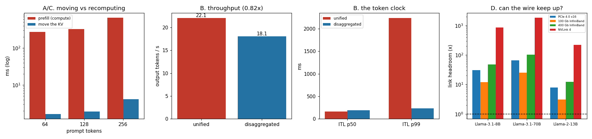

# Disaggregated PoC

---

> Let one machine read the prompt and another write the answer, and ship the cache between them. This project runs two real processes — a [prefill](/shared/glossary/#prefill) worker and a [decode](/shared/glossary/#decode) worker, each with its own copy of Qwen2.5-0.5B — passing [KV cache](/shared/glossary/#kv-cache) through [shared memory](/shared/glossary/#shared-memory). The core measurement: moving a 256-token prompt's cache costs **4.13 ms** against **660 ms** to recompute it — **160x cheaper to ship than to redo**. The honest inversion is that on **one** box disaggregation is a **loss**: throughput **0.82x**, TTFT p50 **2.07x worse**, because two model copies split six CPU threads three ways each. What it buys is the thing it is actually sold for — the decode worker never runs a prefill, so [ITL](/shared/glossary/#itl--tpot) p99 falls from **2240 ms to 232 ms** and jitter (p99/p50) from **14.1x to 1.23x**. Section D turns the measured KV rate into link requirements: an 8B model needs 1.05 GB/s and has 11.9x headroom on 100 Gb InfiniBand, while a 13B model *without* [GQA](/shared/glossary/#gqa) needs 4.10 GB/s and has only **3.05x**.

---

## Key Insight

This project builds a small [proof-of-concept](/shared/glossary/#poc) of [disaggregated serving](/shared/glossary/#disaggregated-serving): one process runs [prefill](/shared/glossary/#prefill), a second runs [decode](/shared/glossary/#decode), and they hand off the [KV cache](/shared/glossary/#kv-cache) between them. It then measures the transfer overhead against doing both phases in one process.

## Why This Matters

Prefill is compute-heavy while decode is memory-bandwidth-heavy, so giving each phase its own pool of GPUs lets you size hardware for each job independently. The proof-of-concept shows whether the cost of moving the cache between them is small enough to make that split worthwhile.

---

**This is project 19.**

### The words first

- **[Disaggregated serving](/shared/glossary/#disaggregated-serving)** — *disaggregate* means "to separate into parts". Here the two parts are the two phases of one request. Systems that do this in production include DistServe and Mooncake.
- **Prefill pool / decode pool** — the two sets of machines. Each can have its own hardware, its own [tensor-parallelism](/shared/glossary/#tensor-parallelism-tp) degree, and its own scaling policy.
- **[Shared memory](/shared/glossary/#shared-memory)** — a region of RAM mapped into two processes at once, so a write by one is immediately visible to the other with no copy through the kernel. It stands in here for the [RDMA](/shared/glossary/#rdma) or [NVLink](/shared/glossary/#nvlink) transfer a real cluster uses: same operation, bytes crossing an address-space boundary without going through the model, at a different speed.
- **Pack / unpack (serialise / deserialise)** — flattening the cache's many per-layer tensors into one contiguous run of bytes, and putting them back. A real transfer engine avoids this by registering the cache pages directly so the network card reads them in place; we cannot, so it is measured separately and reported as an artifact.
- **spawn vs. fork** — two ways to start a child process. `fork` clones the parent's memory, including PyTorch's thread pool in whatever state it happened to be in, which deadlocks on the first parallel operation. `spawn` starts a fresh interpreter. This project uses spawn, and that is not optional.
- **Jitter** — how much a latency varies, here measured as p99 ÷ p50. A stream with jitter 1.0 is perfectly smooth.

### "Prefill and decode already run in one engine. Why split them across machines?"

Because they are two different jobs that happen to share a model, and running them together forces one compromise on both.

**They want different hardware.** Prefill is a big matrix multiply per layer — it is [compute-bound](/shared/glossary/#roofline), and it wants FLOPs. Decode is one tiny matrix-vector product per layer that nonetheless drags the entire weight matrix out of memory — it is [memory-bound](/shared/glossary/#memory-bound), and it wants bandwidth. A single pool has to buy one machine that is mediocre at both.

**They want different parallelism.** Prefill scales well with [tensor parallelism](/shared/glossary/#tensor-parallelism-tp) because there is real arithmetic to split. Decode often does not, because at batch size 32 there is barely enough work to keep one GPU busy and splitting it adds more communication than compute.

**They interfere.** This is the measurable one, and it is the whole of section B. In a unified engine a prefill occupies a forward pass, and every request currently streaming stops. [Project 18](../18-chunked-prefill-simulator/README.md) fixes that by *interleaving*; this project fixes it by *separating*. Both are answers to the same question.

**But the cache has to move.** Whatever prefill computes, decode needs. That is the price, and section A measures it.

### "Isn't sending the cache over a network slower than just computing it again?"

It is the right question — the whole design rests on the answer being no — and section C measures it directly: **160x cheaper to ship**.

The intuition for why: prefill has to run the full model over every prompt token, which is billions of floating-point operations per token. The cache it produces is a few tens of kilobytes per token. Computation is expensive and the *result* of that computation is small. Moving small things is cheap.

The same arithmetic appears in [project 15](../15-cpu-nvme-offload/README.md), where reloading a paused session's cache from disk beat recomputing it by 183x. Different link, same conclusion, and the reason is a property of the model rather than of the storage.

---

## Running it

```bash
python3 run.py           # ~7 minutes on 6 CPU threads
python3 run.py --plot    # redraw from outputs/findings.json
```

Needs `torch`, `transformers`, `matplotlib`, and [project 16](../16-static-vs-continuous/README.md)'s `batchlib.py`. It starts two child processes, each of which loads its own copy of the model (about 2 GB of fp32 weights each), so peak memory is around 5 GB.

**The honest framing of the hardware.** A real disaggregated deployment has two *different pools of GPUs* and profits from sizing each one for its own job. This machine has one CPU. Splitting six threads into two lots of three cannot reproduce that benefit — it can only reproduce the *costs* (two model copies, a transfer, a queue hop) and one of the benefits (no prefill/decode interference). Section B is therefore a deliberately unflattering test, and it is labelled as one.

> **About the numbers.** Everything below comes from the committed
> [`outputs/findings.json`](outputs/findings.json).



---

## A. What actually has to move

The KV cache, and nothing else. For Qwen2.5-0.5B in fp32 that is **24,576 bytes per token** — the Phase 2 formula, `2 (K and V) × 24 layers × 2 kv-heads × 64 wide × 4 bytes`.

| prompt | KV size | prefill | raw shm copy | copy speed | copy ÷ prefill |
|---|---|---|---|---|---|
| 64 tok | 1.57 MB | 275.9 ms | 0.05 ms | 65.1 GB/s | **0.018%** |
| 128 tok | 3.15 MB | 323.8 ms | 0.16 ms | 39.3 GB/s | 0.049% |
| 256 tok | 6.29 MB | 660.2 ms | 1.02 ms | 12.3 GB/s | **0.155%** |

Including the pack and unpack steps — flattening the 48 per-layer tensors into one run of bytes and putting them back — the total overhead is a flat **0.6%** of the prefill at all three sizes.

The falling GB/s (65.1 → 12.3) is a cache-hierarchy effect, not a defect: 1.57 MB fits in this CPU's L2/L3 and 6.29 MB does not, so the larger copy is served from DRAM. This is the same effect that makes a KV transfer *over a network* behave differently from one within a machine, and it is why section D works in bytes-per-second rather than in the ratios above.

**Pack and unpack cost more than the copy itself** — 1.89 + 1.21 = 3.10 ms against 1.03 ms at 256 tokens. That is the artifact this implementation cannot avoid in Python, and it is the reason production transfer engines register the cache's pages directly with the network card. Reported here so that the 0.6% figure is not mistaken for a fundamental cost.

## B. One process vs. two, same total CPU

12 requests, 256-token prompts, 32 output tokens. Unified gets 6 threads; disaggregated gets 3 threads per worker.

| | unified | disaggregated | |
|---|---|---|---|
| wall time | **17.38 s** | 21.19 s | |
| output tok/s | **22.1** | 18.1 | **0.82x — unified wins** |
| TTFT p50 | **4.78 s** | 9.90 s | 0.48x — unified wins |
| ITL p50 | **159.4 ms** | 187.9 ms | 0.85x |
| **ITL p99** | 2240.3 ms | **231.9 ms** | **9.66x — disaggregated wins** |
| **jitter (p99/p50)** | 14.06x | **1.23x** | **11.4x better** |

**Disaggregation loses on throughput, and it should.** 0.82x is what you get when you run two copies of a model on hardware that was never going to be split into two specialised pools. Each worker has half the threads, the prefill worker sits idle whenever the decode worker is the bottleneck, and nothing about this machine rewards the separation. **If someone reports a throughput win from disaggregation on a single node, be suspicious.** The win in production comes from buying different hardware for the two pools, and that experiment cannot be run here.

**TTFT is also worse (9.90 s vs 4.78 s)** — the request now has to traverse a queue hop (median **107 ms**), a shared-memory write, and a read before its first token appears, and it does its prefill on 3 threads instead of 6 (median prefill 1,421 ms against the 660 ms measured at 6 threads in section A).

**What it does buy is the token clock.** Unified ITL p99 is 2,240 ms — one request's stream freezing for over two seconds while another request's prompt is prefilled. Disaggregated ITL p99 is 232 ms, barely above its own median. The decode worker in `disagg.py` literally cannot run a prefill; there is no code path for it. So the stall does not exist.

Jitter (p99 ÷ p50) is the cleanest way to see it: **14.06x → 1.23x**. A jitter of 1.23 means the stream is essentially metronomic.

That is the entire product of disaggregation on a single node, and it is the same product [chunked prefill](/shared/glossary/#chunked-prefill) delivers by a different route. The two are alternatives, not complements: choose interleaving when you have one pool, separation when you have two.

## C. Ship the cache, or recompute it?

| prompt | recompute (prefill again) | ship (pack + write + read + unpack) | ratio |
|---|---|---|---|
| 64 tok | 276.0 ms | 1.65 ms | **167.3x** |
| 128 tok | 324.0 ms | 1.93 ms | **167.9x** |
| 256 tok | 660.0 ms | 4.13 ms | **159.8x** |

Roughly **160x cheaper to move the bytes than to produce them again**, and — importantly — the ratio is nearly flat across prompt length. Both sides grow with the prompt, so there is no crossover point at which recomputing becomes the better idea. (At very long prompts the ratio actually *improves*, because prefill grows quadratically with attention while the cache grows linearly.)

This is why disaggregation is architecturally viable at all. If shipping the cache cost 0.8x of a prefill instead of 0.006x, the decode pool would simply re-prefill and the prefill pool would not exist.

## D. What link does a real cluster need?

Arithmetic, not measurement — no such hardware exists in this environment. The question: a prefill pool producing tokens at some rate emits KV bytes at `prefill tok/s × KV bytes/token`. Can the wire carry it?

| model | KV / token | prefill rate | KV rate | PCIe 4.0 x16 (32 GB/s) | 100 Gb IB (12.5 GB/s) | 400 Gb IB (50 GB/s) | NVLink 4 (900 GB/s) |
|---|---|---|---|---|---|---|---|
| Llama-3.1-8B (32L, 8 kv-heads) | 128 KB | 8,000 tok/s | 1.05 GB/s | 30.5x | 11.9x | 47.7x | 858x |
| Llama-3.1-70B (80L, 8 kv-heads) | 320 KB | 1,500 tok/s | 0.49 GB/s | 65.1x | 25.4x | 102x | 1831x |
| **Llama-2-13B (40L, 40 kv-heads, MHA)** | **800 KB** | 5,000 tok/s | **4.10 GB/s** | 7.8x | **3.05x** | 12.2x | 220x |

Each cell is headroom: link bandwidth ÷ bytes the prefill pool produces. Below 1.0 the *network*, not the GPU, sets your prefill rate.

**Every modern model has comfortable headroom, and the reason is [GQA](/shared/glossary/#gqa).** The 70B model is nine times the size of the 8B and produces *less* KV per second, because its slower prefill rate more than offsets its deeper stack. Meanwhile Llama-2-13B — a *smaller* model, but one built with full multi-head attention, 40 KV heads instead of 8 — produces 800 KB per token and leaves only 3.05x of headroom on a 100 Gb link.

The lesson generalises past this table: **the architectural choice that made the KV cache small enough to serve (GQA, Phase 2) is the same choice that made disaggregation practical.** Had the field stayed on MHA, the KV transfer would be a first-order design constraint rather than a rounding error, and 5x more models would sit in the bottom row of that table.

---

## What to take from this

1. **Shipping a prompt's cache is ~160x cheaper than recomputing it**, and the ratio does not degrade with prompt length. That is the fact the whole architecture stands on.
2. **On one node, disaggregation is a throughput loss (0.82x).** Its production benefit is buying different hardware for the two pools, which a single-node test cannot show.
3. **What a single node *can* show is the interference removal**: ITL p99 2240 ms → 232 ms, jitter 14.06x → 1.23x. That is a real, user-visible win with a real, user-visible cost in TTFT.
4. **GQA is what makes the KV transfer affordable.** 128 KB/token with it, 800 KB/token without — and the without case is the only row in section D under 5x headroom.
5. **Pack/unpack dominated the actual copy** (3.10 ms vs 1.03 ms). If you build one of these, the serialisation path is the thing to eliminate, not the link.

### Common traps this project walks into on purpose

- **Forking a process that has already touched PyTorch.** `disagg.py` uses the `spawn` start method; `fork` inherits the thread pool in an undefined state and hangs on the first parallel operation, with no error message.
- **Giving the disaggregated arm more CPU than the unified one.** Two workers at 3 threads each, against one at 6. Anything else would be comparing hardware, not architecture.
- **Quoting the shared-memory copy as "the transfer cost".** It is 0.03–0.57 ms; the pack and unpack around it are 2–3 ms. Reporting only the fast part would overstate the result by 5x.
- **Reading `raw_GB_s` as a bandwidth spec.** It falls from 65.1 to 12.3 GB/s purely because the larger buffer stops fitting in cache.

---

## Next

[Project 20 — priority queue](../20-priority-queue/README.md) goes back to a single engine and asks a different question: when the server is busy, who gets served first, and what does the answer cost everyone else?
