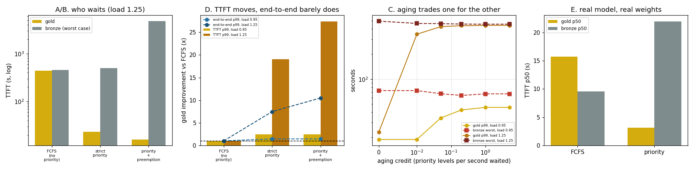

# Priority Queue

---

> When the server is busy, the requests that matter most should be able to jump the line. This project gives 20% of a 900-request trace a "gold" class and measures what strict priority buys them at two load levels, then confirms it on the real engine. At 0.95x capacity, gold [TTFT](/shared/glossary/#ttft) p99 improves **2.43x**; at 1.25x it improves **19.08x** — priority is worth almost nothing until the queue is real. Three honest inversions came out of it. **Gold's end-to-end p99 improves only 7.47x where its TTFT improves 19.08x**, because reordering a queue cannot help a request that is already decoding — every running request shares every forward pass. **Strict priority starved nobody**: bronze's worst-case wait grew just **1.09x** at both loads, so the textbook cure — [aging](/shared/glossary/#aging-scheduling) — is fixing a disease this workload does not have, and it costs gold **15.0x** of its gain to buy bronze **6%** of theirs. And **[preemption](/shared/glossary/#preemption) is the wrong price**: it adds 1.44x for gold on top of strict priority, and costs bronze **10.5x** its worst-case wait plus **33.1%** of every token the server generated, thrown away and produced again.

---

## Key Insight

This project adds priority classes to a [continuous-batching](/shared/glossary/#continuous-batching) [scheduler](/shared/glossary/#scheduler) so high-priority requests are picked before others, then checks that their [TTFT](/shared/glossary/#ttft) stays low even while the server is under heavy load.

## Why This Matters

Real services mix urgent and background work — paid versus free, interactive versus batch. A priority queue lets the important requests move ahead so they meet their [latency](/shared/glossary/#latency) targets, while cheaper work waits its turn instead of crowding them out.

---

**This is project 20.**

> **A note on the tooling.** The guide's version of this project says "add a priority class to [vLLM](/shared/glossary/#vllm)". vLLM does not run in this environment — its kernels require compute capability 7.0 and the GPU here reports 6.1 — so the priority class goes into the scheduler this phase already owns: [project 18](../18-chunked-prefill-simulator/README.md)'s simulator for the load levels, [project 16](../16-static-vs-continuous/README.md)'s real engine for the confirmation in section E. The mechanism is the same one vLLM's `priority` field drives: sort the waiting queue by a key before choosing whom to admit.

### The words first

- **Priority class** — a label attached to a request that says how far forward it may jump. By convention *lower number = more urgent*, which reads backwards until you remember it is a rank: priority 0 is first place.
- **Gold / bronze** — the two tenants here. Gold is interactive (short prompts, short answers, a human waiting); bronze is background work. Named after service tiers, the way airlines and cloud vendors do.
- **[Starvation](/shared/glossary/#starvation)** — a low-priority request that never gets served because higher-priority work keeps arriving. The classic failure of strict priority, and the reason aging exists.
- **[Aging](/shared/glossary/#aging-scheduling)** — giving a waiting request extra effective priority the longer it waits, so a bronze request that has waited long enough eventually outranks a freshly arrived gold one. *Aging* because the request's credit grows with its age.
- **[Preemption](/shared/glossary/#preemption)** — throwing a *running* request out to make room, as opposed to just reordering the queue. The victim's [KV cache](/shared/glossary/#kv-cache) is dropped and it starts over.
- **[Goodput](/shared/glossary/#goodput)** — throughput counting only work that was actually delivered. A server that generates 100 tokens/s and throws 33 away has 67 tokens/s of goodput; the distinction exists entirely because of preemption.

### "The scheduler already sorts by arrival time. Isn't priority just a different sort key?"

Mechanically yes — one line changes in `admit_key`. But that one line only reaches requests that are *still waiting*, and that turns out to be a much smaller lever than it looks.

An iteration-level scheduler makes two decisions each pass: **who to admit** (drawn from the queue) and **who to decode** (everyone currently running, all of them, every pass). Priority reorders the first decision and has no effect at all on the second — a gold request that has been admitted decodes at exactly the same rate as the bronze requests beside it, because a decode step processes the whole batch.

So priority moves the *waiting* part of a request's life and leaves the *generating* part untouched. Section D measures the consequence: TTFT p99 improves 19.08x while end-to-end p99 improves 7.47x. If most of a request's latency is decode — a long answer — priority has very little to work with.

### "If reordering only helps the queue, why not preempt? Then gold gets the batch too."

You can, and section A/B/D measures it. The answer is that the accounting is brutal.

The gap preemption fills is real: once bronze requests occupy all 8 slots, a gold request waits behind them however the queue is sorted. Evicting one makes room immediately.

But eviction in an inference engine is *recompute* preemption. There is nowhere to park a half-finished request's KV cache, so it is discarded and the request re-enters the queue as if new. Every token it had generated must be produced again. Measured here: **33.1% of all tokens the server generated were thrown away**, goodput fell from 31.4 to 23.0 tokens/s, and bronze's worst-case wait went from 457 s to 4,793 s.

What gold got for that: TTFT p99 from 23.12 s to 16.09 s. A 1.44x improvement on a metric that strict priority had already improved 19.08x, paid for with a third of the machine.

---

## Running it

```bash
python3 run.py           # ~4 minutes on 6 CPU threads
python3 run.py --plot    # redraw from outputs/findings.json
```

Needs `torch`, `transformers`, `matplotlib`, [project 16](../16-static-vs-continuous/README.md)'s `batchlib.py` / `schedulers.py` and [project 18](../18-chunked-prefill-simulator/README.md)'s `simlib.py`. Sections A–D are simulation; section E loads the real model.

The server's capacity is **measured**, not assumed: 300 requests are dumped on the simulated engine at once and what comes out is counted — **0.1492 requests/s** at batch ≤ 8. Every load below is a fraction of that, so "load 0.95" means the same thing in every run. 900 requests, 20.1% of them gold.

> **About the numbers.** Everything below comes from the committed
> [`outputs/findings.json`](outputs/findings.json) and
> [`outputs/policies.csv`](outputs/policies.csv).



---

## A/B/D. FCFS, strict priority, and preemptive priority

**At 0.95x capacity:**

| policy | gold TTFT p50 | gold TTFT p99 | bronze TTFT p99 | bronze worst | preemptions | goodput | wasted |
|---|---|---|---|---|---|---|---|
| [FCFS](/shared/glossary/#fcfs) | 1.20 s | 45.77 s | 56.07 s | 66.55 s | 0 | 25.6 | 0.0% |
| **strict priority** | 1.05 s | **18.85 s** | 61.44 s | 72.80 s | 0 | 25.6 | 0.0% |
| priority + preemption | 0.99 s | 18.78 s | **1592 s** | **6009 s** | 172 | 22.3 | **32.9%** |

**At 1.25x capacity (overloaded):**

| policy | gold TTFT p50 | gold TTFT p99 | bronze TTFT p99 | bronze worst | preemptions | goodput | wasted |
|---|---|---|---|---|---|---|---|
| FCFS | 285.07 s | 441.14 s | 445.23 s | 456.97 s | 0 | 31.4 | 0.0% |
| **strict priority** | **5.24 s** | **23.12 s** | 488.65 s | 496.86 s | 0 | 31.4 | 0.0% |
| priority + preemption | 0.99 s | 16.09 s | **2538 s** | **4793 s** | 178 | 23.0 | **33.1%** |

Four readings.

**1. Priority is worth 2.43x at 0.95 load and 19.08x at 1.25.** Under FCFS at overload, a gold request waits 285 seconds at the median just to start; with priority it waits 5.24. The lever is enormous — but only once there is a queue to reorder. At 0.95 load gold's median TTFT under FCFS is already 1.20 s, and no amount of priority can improve on "almost immediately". **A priority scheduler's value is entirely a function of how saturated you are.**

**2. Strict priority starved nobody.** Bronze's worst-case wait went from 66.55 → 72.80 s at 0.95 load and 456.97 → 496.86 s at 1.25 — **1.09x at both**. Goodput was identical to one decimal place (25.6 and 31.4).

This is the result that surprises, because "strict priority starves the low class" is stated as a law. It is a law *when the high class can consume all the capacity*. Gold is 20% of this trace and its requests are small, so the server absorbs all of it and still has most of its capacity for bronze. Starvation needs the urgent class to be big enough to fill the machine — check that before building a cure.

**3. End-to-end improves much less than TTFT.** At 1.25 load, gold TTFT p99 improves 19.08x and gold end-to-end p99 improves **7.47x**. The gap is the decode phase, which priority cannot touch: once admitted, gold decodes one token per pass exactly like everyone else. The longer the answers, the smaller priority's share of the total. For a workload of 2,000-token answers it would be nearly invisible.

**4. Preemption is a bad trade at both loads.** It buys gold 1.004x at 0.95 load (18.85 → 18.78 s — statistical noise) and 1.437x at 1.25 (23.12 → 16.09 s). It costs:
- bronze's worst case **90.3x** at 0.95 load and **10.5x** at 1.25 (from a 66-second wait to a 100-minute one);
- **32.9–33.1% of every token generated**, discarded and regenerated;
- 13–27% of goodput (25.6 → 22.3 and 31.4 → 23.0).

A third of the machine's output, deleted, to move a metric that was already 19x better. If you need more than strict priority can give, the answer is more capacity or fewer admissions ([project 21](../21-cache-aware-admission/README.md)), not eviction.

## C. Aging: a cure looking for a disease

Aging gives a waiting request `aging × (seconds waited)` of extra effective priority.

**At 0.95x capacity:**

| aging | gold TTFT p99 | bronze worst case |
|---|---|---|
| 0.00 | **18.85 s** | 72.80 s |
| 0.01 | 18.85 s | 72.80 s |
| 0.05 | 34.22 s | 66.75 s |
| 0.20 | 42.65 s | 63.66 s |
| 1.00 | 45.77 s | 66.55 s |
| 5.00 | 45.77 s | 66.55 s |

**At 1.25x capacity:**

| aging | gold TTFT p99 | bronze worst case |
|---|---|---|
| 0.00 | **23.12 s** | 496.86 s |
| 0.01 | 346.07 s | 466.01 s |
| 0.05 | 426.98 s | 462.93 s |
| 0.20 | 437.57 s | 458.03 s |
| 1.00 | 441.59 s | 456.77 s |
| 5.00 | 441.95 s | 456.98 s |

**The trade is terrible in this workload, and the overloaded table is the clearer one.** Going from no aging to the *smallest non-zero* setting tested (0.01 priority levels per second) costs gold **15.0x** of its TTFT p99 — 23.12 s to 346.07 s, nearly all of the benefit priority provided — and buys bronze **6%**: 496.86 s down to 466.01 s.

At aging ≥ 1.0 both tables converge exactly to the FCFS row (45.77 / 66.55 and 441.59 / 456.77). That is the sanity check that the knob does what it says: enough aging credit and the priority class stops existing.

The reason the trade is so bad is section B's second finding. Aging pays gold to protect bronze from starvation, and **bronze was never starving** — its worst case under strict priority was 1.09x its FCFS worst case. Buying protection against a 9% problem with a 1400% payment is a bad deal at any exchange rate.

**When aging *is* right:** when the urgent class is large enough to consume the machine. Then bronze's worst case is unbounded, and any finite price for bounding it is worth paying. The lesson is not "aging is bad" — it is **measure bronze's worst-case wait under strict priority before you decide you need aging**, because that measurement is the entire justification.

## E. The same ordering on the real model

32 requests through the real Qwen2.5-0.5B engine (`schedulers.py`, 6 slots), 25% gold:

| | wall | gold TTFT p50 | gold TTFT p99 | bronze TTFT p50 | bronze worst |
|---|---|---|---|---|---|
| FCFS | 40.19 s | 15.71 s | 25.18 s | **9.55 s** | 23.71 s |
| **priority** | 40.16 s | **3.14 s** | **6.07 s** | 21.96 s | 29.01 s |

**Gold TTFT p50 improves 5.0x on real weights**, and the qualitative picture matches the simulator exactly:

- gold's improvement is large (5.0x median, 4.1x p99);
- **bronze's median gets worse** (9.55 → 21.96 s, 2.3x) — this is the real cost, paid by the typical bronze request, not by the worst one;
- **bronze's worst case barely moves** (23.71 → 29.01 s, 1.22x) — no starvation, same as the simulator;
- **wall time is unchanged** (40.19 vs 40.16 s). Reordering a queue does not create or destroy work. Everything priority does is redistribution.

That last row is the honest summary of the entire project. Priority is not a performance optimisation. It is a decision about who absorbs the delay that already exists.

---

## What to take from this

1. **Priority's value scales with saturation**: 2.43x at 0.95 load, 19.08x at 1.25, ~1x on an idle server. Measure your queue before building one.
2. **Reordering only helps the waiting.** TTFT p99 19.08x, end-to-end p99 7.47x, and the gap widens with answer length because decode is shared across the whole batch.
3. **Check for starvation before curing it.** Strict priority cost bronze 1.09x its worst-case wait here; aging cost gold 15.0x to improve that by 6%.
4. **Preemption costs a third of the machine.** 33.1% of generated tokens thrown away for a 1.44x gold gain on top of what strict priority already delivered.
5. **Wall time was identical with and without priority** (40.19 vs 40.16 s on the real engine). Priority redistributes latency; it does not remove any.

### Common traps this project walks into on purpose

- **Testing at one load.** At 0.95 load the priority result is 2.43x and the preemption result is 1.004x; both conclusions change at 1.25.
- **Making gold and bronze the same shape.** Gold is deliberately short-prompt and short-answer, because an interactive tenant is, and because a short request is the one most damaged by waiting behind a long one.
- **Reporting throughput instead of goodput for a preempting scheduler.** The preemptive run generated *more* tokens per second than it delivered; the difference is the 33% it deleted.
- **Assuming a textbook failure mode is present.** Strict priority starving the low class is a real phenomenon and it does not happen here, and the numbers say so before the fix does.
- **Quoting only TTFT.** It is the metric priority moves most and the one that overstates what the user receives.

---

## Next

[Project 21 — cache-aware admission](../21-cache-aware-admission/README.md) asks the question underneath all of this: not who goes first, but who gets in at all — and what happens to a server that never says no.
