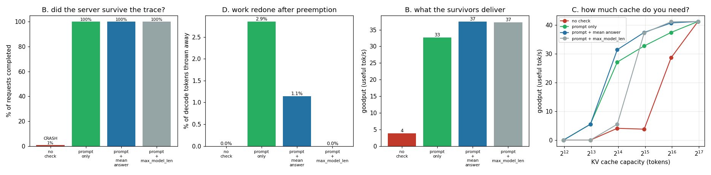

# Cache-Aware Admission

---

> Don't let a request in the door if there is no room left for its cache. This project shows the failure first — feeding a 136-token prompt into a 128-token cache lane raises a real `RuntimeError` from the real engine — and then measures four [admission](/shared/glossary/#admission-control) policies over 800 simulated requests. With **no check**, the server dies **191.6 s** into the trace with **21 requests in flight**, having completed **0.8%** of the work. Every policy with a check completes **100%**. But the interesting results are the differences between them: booking only the prompt survives at the cost of **410 [preemptions](/shared/glossary/#preemption)** and **2.9%** of all generated tokens thrown away and regenerated, for **0.87x** the [goodput](/shared/glossary/#goodput) of booking room for the answer too. And the honest inversion — reserving the model's **entire** `max_model_len`, the policy [project 11](../11-tiny-paged-cache/README.md) showed wasting 5.8x of memory, costs **0.995x** here, essentially nothing. It only collapses when the cache is small relative to that limit: at a 8,000-token cache it delivers **0.0** against 5.5.

---

## Key Insight

This project implements [admission control](/shared/glossary/#admission-control) that estimates how much [KV cache](/shared/glossary/#kv-cache) a new request will need and refuses it when the GPU cannot fit it — then verifies the server never runs out of memory.

## Why This Matters

If a [scheduler](/shared/glossary/#scheduler) admits more requests than the cache can hold, the whole server can crash with an out-of-memory error and drop everyone's work at once. Checking the projected cache size *before* admitting keeps the system stable even when traffic spikes past what it can handle.

---

**This is project 21.**

### The words first

- **[Admission control](/shared/glossary/#admission-control)** — deciding at the door whether to let a request in at all, as opposed to deciding what order to serve the ones already inside. Borrowed from telephone networks, where refusing a call was preferable to degrading every call in progress.
- **Reservation** — booking cache space for tokens that do not exist yet. The core difficulty: a request's final size is unknown when it arrives.
- **`max_model_len`** — the longest sequence the model will accept, usually 8k–128k. It is a *limit*, not a prediction: the median request is nowhere near it.
- **[Preemption](/shared/glossary/#preemption)** — throwing a running request out of the batch to make room. vLLM's default form is *recompute* preemption: the victim's cache is dropped and it re-enters the queue as if it had just arrived, so every token it generated must be produced again.
- **[Goodput](/shared/glossary/#goodput)** — throughput that counts only *useful* work. A server that generates 100 tokens/s and throws 30 away has 70 tokens/s of goodput. The distinction exists precisely because of preemption.
- **OOM** — out of memory. On a GPU this is not a graceful degradation; the allocation fails, the process dies, and every in-flight request dies with it.

### "Why not just let the scheduler run out and handle it? Software handles errors all the time."

Because an accelerator OOM is not a recoverable error in the way a full disk is.

When a request's next KV block cannot be allocated, the engine is in the middle of a forward pass with 30 other requests' state resident in memory. There is no partial result to return and no safe point to unwind to. In practice the process aborts, and the 21 in-flight requests measured in section B are simply gone — including ones that were 95% finished. A client that had received 400 tokens of a 420-token answer gets a dropped connection.

That asymmetry is the entire argument. Refusing one request costs one client a retry. Failing to refuse it costs every client currently connected.

### "The paged cache already prevents fragmentation. Isn't the memory problem solved?"

No — [project 11](../11-tiny-paged-cache/README.md) solved a different problem, and it is worth being precise about which.

Paging removed **external fragmentation**: the situation where enough free bytes exist but no single hole is the right shape. After paging, any free block will do, so a request never fails for want of a *contiguous* region.

It did nothing about the total. Paging lets you use every byte of the cache; it does not create more bytes. When 40 concurrent requests genuinely need more tokens of cache than the GPU has, paging has no answer and the allocator returns nothing. **The gap admission control fills is the decision about how many requests to have at once**, which is upstream of how their memory is laid out.

The two also fail differently, which is why both exist: fragmentation fails a request while the memory dashboard shows free space; capacity exhaustion fails when the dashboard shows full.

### "If reserving the maximum is safest, why not always do that?"

That is the question section B answers, and the answer is genuinely surprising if you have read project 11.

There, `reserve_max` was catastrophic — an allocator that booked 8,192 tokens for a 615-token median request served 5.8x fewer tokens than paging. Here, the same policy costs **0.995x**. Nothing.

The difference is *what is being reserved*. Project 11's allocator physically claimed the memory, so a request holding 8,192 tokens' worth of blocks made those blocks unavailable. This project's reservation is a **decision rule at the door**: the scheduler declines to admit a request unless the pessimistic total would still fit, but the memory is only consumed as tokens are actually produced. An over-cautious door policy admits fewer requests concurrently, and on a server that is already throughput-bound, fewer-but-not-starved is almost free.

It stops being free when the cache is small relative to `max_model_len` — section C measures exactly where.

---

## Running it

```bash
python3 run.py           # ~2 minutes on 6 CPU threads
python3 run.py --plot    # redraw from outputs/findings.json
```

Needs `torch`, `transformers`, `matplotlib`, [project 16](../16-static-vs-continuous/README.md)'s `batchlib.py` and [project 18](../18-chunked-prefill-simulator/README.md)'s `simlib.py`. Section A loads the real model to trigger a real failure; sections B–C are simulation.

> **About the numbers.** Everything below comes from the committed
> [`outputs/findings.json`](outputs/findings.json) and
> [`outputs/capacity_sweep.csv`](outputs/capacity_sweep.csv).



---

## A. What "the cache is full" actually looks like

A real pool: 4 lanes × 128 tokens = **13 MB** at 24 KB/token.

| what was tried | what happened |
|---|---|
| acquire a 5th lane from a 4-lane pool | `acquire()` returns `None` |
| prefill a **136**-token prompt into a **128**-token lane | `RuntimeError: shape mismatch: value tensor of shape [2, 136, 64] cannot be broadcast to indexing result` |
| the same request, through a cache-aware admission check | rejected, before anything can fail |

The two failures are different in kind and that is the point of showing both.

**Running out of lanes is graceful.** `acquire()` returns `None`, the caller can queue the request, nothing is damaged. This is the failure a well-built engine is designed to have.

**Running out of *room in a lane* is not.** It is a raw tensor-shape error thrown from the middle of a forward pass, 24 layers deep, with three other requests' state resident. There is no sensible recovery. In a real deployment on a real GPU the equivalent is `CUDA out of memory`, and the process is finished.

The admission check is three lines — `pool.n_free() > 0 and prompt_len + max_new <= max_len` — and it converts the second failure into the first.

## B. Four policies, 800 requests, 32,000 tokens of cache

Traffic: prompts median **682** tokens up to `max_model_len` = **8,192**, answers averaging **375** tokens up to 2,048.

| policy | outcome | completed | goodput | preemptions | tokens wasted | TTFT p99 |
|---|---|---|---|---|---|---|
| **no check** | **CRASHED at 191.6 s, 21 requests lost** | **0.8%** | 3.8 tok/s | 0 | 0 | 28.9 s |
| reserve prompt only | survived | 100% | 32.7 | **410** | **2.9%** | 2054 s |
| **reserve prompt + mean answer** | survived | 100% | **37.4** | 102 | 1.1% | **975 s** |
| reserve prompt + `max_model_len` | survived | 100% | 37.2 | **0** | 0.0% | 1006 s |

**The no-check server died 191.6 seconds in, having completed 6 of 800 requests.** Its "goodput" of 3.8 tok/s is meaningless — there is no throughput number after an OOM, which is exactly why the row reports the crash rather than a rate. Note its TTFT p99 of 28.9 s, the *best* in the table: right up until it died it looked like the fastest server. **A latency dashboard cannot distinguish "healthy" from "about to fall over".**

**Booking only the prompt survives, but pays for it 410 times.** The check passes at admission — the prompt fits today — and then the request keeps generating. Eventually the cache overflows and something has to be evicted. 2.9% of every token this server generated was thrown away and produced again, and the resulting churn costs **13% of the goodput** (32.7 vs 37.4) and **doubles TTFT p99** (2054 s vs 975 s), because preempted requests re-enter the queue and go round again.

**Booking the prompt plus a *guess* at the answer is best.** Not a prediction of this request's length — just the fleet-wide mean, 375 tokens. That single number cuts preemptions from 410 to 102 and recovers the goodput. Reserving on an average is enough; you do not need per-request prediction.

**And the honest inversion: booking `max_model_len` costs 0.995x.** Zero preemptions, zero waste, 37.2 tok/s against the best policy's 37.4. The maximally paranoid policy is, at this cache size, free. It only ever declines to *admit*; it never holds memory it is not using, so all it does is keep concurrency slightly lower — and this server is throughput-bound, not concurrency-bound.

This is the opposite of [project 11](../11-tiny-paged-cache/README.md)'s result about the same words, and the reason is in the "Why not always reserve the maximum?" section above: an *allocator* that reserves the maximum wastes memory; a *doorman* that reserves the maximum wastes a little concurrency.

## C. Sweeping the cache size

Goodput in useful tokens/s. `*` marks a run that crashed.

| cache (tokens) | no check | reserve prompt | + mean answer | + `max_model_len` |
|---|---|---|---|---|
| 4,000 | 0.0* | 0.0 | 0.0 | 0.0 |
| 8,000 | 0.0* | **5.5** | **5.5** | **0.0** |
| 16,000 | 4.1* | 27.1 | **31.4** | 5.5 |
| 32,000 | 3.8* | 32.7 | **37.4** | 37.2 |
| 64,000 | 28.6* | 37.4 | **40.7** | **41.1** |
| 128,000 | **41.2** | 41.2 | 41.2 | 41.2 |

Four readings, and they matter more than the single row in section B.

**The cost of paranoia is a function of `cache ÷ max_model_len`.** Reserving `max_model_len` = 8,192:
- at 8,000 tokens of cache it can **never admit anything** (0.0), because one hypothetical maximum-length request already exceeds the whole cache;
- at 16,000 it admits one request at a time (5.5, a sixth of the best policy);
- at 32,000 (4x) it is within 0.5% of the best;
- at 64,000 (8x) it is the best.

So the same policy is catastrophic and optimal depending on one ratio. **Size the cache at several multiples of `max_model_len`, or do not use worst-case reservation.**

**At 4,000 tokens nothing works at all**, including the no-check server — prompts go up to 8,192, so some requests simply cannot be served by this configuration under any policy. That is a capacity-planning failure, not a scheduling one, and no admission policy repairs it.

**At 128,000 tokens every policy converges to 41.2**, including the one with no check — the cache is large enough that it never fills, so the check never fires. Admission control is a load-dependent safety mechanism: it costs nothing and does nothing when you have headroom, and it is the only thing standing between you and an outage when you do not.

**The no-check column crashes at every capacity below 128,000.** Not "degrades" — crashes. The row above it (64,000, goodput 28.6 before dying) is the dangerous one: it got 70% of the way through the trace looking healthy.

---

## What to take from this

1. **No admission check means an outage, not a slowdown.** 191.6 s in, 21 requests lost mid-answer, 0.8% completed.
2. **Reserve room for the answer, using the fleet mean.** 375 tokens of pessimism cut preemptions 4x and recovered 13% of goodput. Per-request length prediction was not needed.
3. **Preemption is real work thrown away.** 2.9% of generated tokens in the prompt-only policy, plus a 2x TTFT p99 penalty from requeueing.
4. **Worst-case reservation costs 0.995x — if your cache is ≥ 4x `max_model_len`.** Below that it falls off a cliff to 0.0. Check the ratio before copying anyone's policy.
5. **A latency dashboard cannot see this coming.** The server that crashed had the best TTFT in the table until the moment it stopped existing.

### Common traps this project walks into on purpose

- **Modelling "no admission control" as graceful preemption.** It is not: a server with no check that also preempts will preempt a request and immediately re-admit it, forever. Modelling the crash is both more honest and terminating.
- **Reporting goodput for a crashed run.** The 3.8 tok/s in row 1 of section B is printed next to `CRASHED` for a reason; on its own it is a number about a server that no longer exists.
- **Counting throughput instead of goodput.** The prompt-only policy generated more tokens than the mean-answer policy and delivered fewer.
- **Testing at one cache size.** Section B alone would have concluded "worst-case reservation is free". Section C shows the same policy scoring 0.0.

---

## Next

[Project 22 — SLO-aware scheduler](../22-slo-aware-scheduler/README.md) closes the phase by giving every request a deadline and asking which ordering meets the most of them — with an answer that contradicts the textbook.
