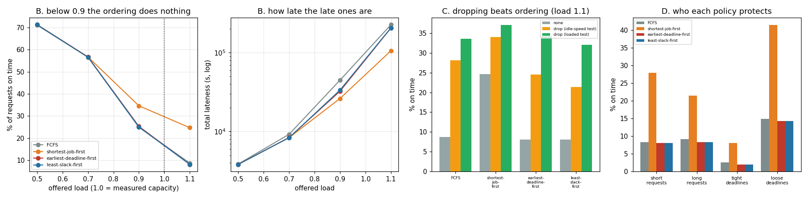

# SLO-Aware Scheduler

---

> Meeting the deadline matters more than being fast on average. This project gives 700 requests individual deadlines and compares four orderings — [FCFS](/shared/glossary/#fcfs), shortest-job-first, earliest-deadline-first, least-slack-first — as offered load rises from half of the measured capacity to 1.1x it. Two results overturn the textbook. **Below 0.9 load the ordering is worth 0.1–0.2 percentage points**: all four score ~71% and ~57%, so a deadline-aware [scheduler](/shared/glossary/#scheduler) on a server that is not saturated buys nothing at all. And at 1.1x load, **earliest-deadline-first is the *worst* policy** — 8.1% on time against shortest-job-first's **24.7%**, a 3.05x gap in favour of the policy that ignores deadlines entirely. The fix is not a better ordering: refusing requests that can no longer make it takes EDF from 8.1% to **34.3%** (4.23x) and collapses the spread between all four orderings from **16.6 points to 5.0**. Total lateness falls **20.5x**. **The admission decision dominates the ordering decision.**

---

## Key Insight

This project builds a [scheduler](/shared/glossary/#scheduler) that knows each request's deadline — its [SLO](/shared/glossary/#slo) — and orders work to finish as many requests on time as possible, then compares it against plain [first-come, first-served](/shared/glossary/#fcfs) ordering.

## Why This Matters

A good average speed can still hide many missed deadlines. A deadline-aware scheduler can complete far more requests within their [latency](/shared/glossary/#latency) targets than naive ordering — which is exactly what users notice and what service contracts are written against.

---

**This is project 22.**

### The words first

Three of the four policies are named after the rule they apply, and one is named after a quantity you have to compute.

- **[FCFS](/shared/glossary/#fcfs)** — first-come, first-served. The default, and the only one that needs no information about the request at all.
- **SJF, shortest-job-first** — serve the smallest request next. Notice it uses **no deadline information whatsoever**. It is in this comparison as a control, and it wins.
- **[EDF, earliest-deadline-first](/shared/glossary/#edf-earliest-deadline-first)** — serve whichever request's deadline arrives soonest. The classic result from real-time systems is that EDF is *optimal* when the workload is feasible: if any ordering can meet all deadlines, EDF does. The word doing the work in that sentence is **feasible**.
- **Least-slack-first** — *slack* is how much spare time a request has: `deadline − now − work still owed`. Serve whoever has the least. A refinement of EDF that accounts for the fact that a request with a distant deadline but an enormous amount of work left may be in more trouble than one with a near deadline and nothing left to do.
- **[SLO](/shared/glossary/#slo)** — service level objective, the latency target a service promises. Written into contracts as "p99 under 2 seconds", which is why a scheduler that is fast on average and misses 5% of deadlines can still be a contract breach.
- **Slowdown** — end-to-end time ÷ time the same request would take on an idle server. The measured number here goes from 8.5x at half load to 80.9x at 1.1x load.

### "EDF is provably optimal. Why would anything beat it?"

Because the proof has a precondition, and production servers routinely violate it.

EDF's optimality theorem says: *if a feasible schedule exists*, EDF finds one. When the workload cannot all be served — when more work arrives than the server can do — the theorem says nothing, and EDF's behaviour becomes actively harmful.

The mechanism is called the **domino effect**, and it is easy to picture. EDF always works on whatever is closest to its deadline. Under overload, that request is usually one that is *already doomed*: its deadline is near precisely because it has been waiting so long. EDF pours capacity into finishing it, misses the deadline anyway, and in the meantime every other request's deadline has also crept closer. Now the next-most-urgent request is also doomed. The scheduler spends the whole overload period working on requests that will miss, in the order they will miss them.

Shortest-job-first has no such failure mode. It simply retires as many requests as possible per unit of work, and a retired request cannot be late. It does not know or care about deadlines — which is why it needs no theorem, and why section B shows it 3.05x ahead when the theorem's precondition fails.

### "If the request can't make its deadline, why not just run it anyway? The work is already paid for."

Because it is not paid for — it is *about to be* paid for, and the payment comes out of somebody else's deadline.

A server at 1.1x load has less capacity than demand. Every second spent on a request that will miss its deadline is a second not spent on one that could still make it. Running the doomed request produces a late answer *and* creates a second late answer. Refusing it produces one rejection and saves the second answer.

This is why section C's dropping test moves the numbers 4x while the ordering moves them 3x — and why the two combine to only 5 points of spread rather than the 16.6 the ordering alone produced.

The subtlety is *when* to declare a request doomed, and section C measures two different tests. The optimistic one asks "could it finish with the whole server to itself?" — almost never true to reject, so it lets doomed work in. The realistic one asks "could it finish at the batch size we actually run?" — fires much earlier, and is worth 5–10 more points.

---

## Running it

```bash
python3 run.py           # ~3 minutes, no model needed
python3 run.py --plot    # redraw from outputs/findings.json
```

Needs [project 18](../18-chunked-prefill-simulator/README.md)'s `simlib.py` and `matplotlib`. Everything is simulation on the cost model project 18 fitted to this machine, because the interesting regime needs hundreds of concurrent requests and hours of simulated time.

> **About the numbers.** Everything below comes from the committed
> [`outputs/findings.json`](outputs/findings.json) and
> [`outputs/load_sweep.csv`](outputs/load_sweep.csv).



---

## A. Making the experiment able to say something

Two calibration decisions have to be made before any policy is compared, and both can silently make the result meaningless.

**Capacity is measured, not derived.** The server is drowned — 300 requests all arriving at once — and what comes out is counted: **0.1271 requests/s, 34.8 output tokens/s** at batch ≤ 8. Every load below is a fraction of that number, so "load 0.9" means the same thing in every run. A closed-form estimate would have had to guess the average batch size, and with a 79.7 ms fixed cost per forward pass the answer depends on that guess strongly.

| offered load | arrival rate | engine busy | end-to-end p50 | slowdown p50 | slowdown p90 |
|---|---|---|---|---|---|
| 0.5 | 0.0635/s | 86.1% | 32.4 s | **8.5x** | 14.4x |
| 0.7 | 0.0890/s | 95.0% | 43.4 s | 11.0x | 20.9x |
| 0.9 | 0.1144/s | 98.8% | 114.8 s | 22.9x | 63.6x |
| 1.1 | 0.1398/s | 99.7% | 374.6 s | **80.9x** | 268.9x |

**Deadlines scale with the request's own size**: `arrive + slack × (time on an idle server)`, with slack drawn uniformly from 5x to 20x.

Both halves of that rule need defending, because the wrong choice would have decided the result in advance:

- *Why scale with size?* A flat deadline ("everyone gets 5 seconds") quietly turns the experiment into shortest-job-first: the smallest request is always the most likely to fit a fixed budget, so any policy favouring short requests wins for a reason that has nothing to do with scheduling. Real users also expect a long answer to take longer.
- *Why 5x–20x and not 1x?* Because the slowdown column above says nothing runs at idle speed on a loaded server — the median is already 8.5x at half load. A 1x deadline would be missed by every request under every policy, and the comparison would return four zeros. The 5x–20x band brackets the measured slowdown, which is the only range in which the policies disagree.

## B. Four orderings, rising load

Percentage of all 700 requests finishing before their deadline:

| offered load | FCFS | shortest-job-first | earliest-deadline-first | least-slack-first | spread |
|---|---|---|---|---|---|
| 0.5 | 71.1% | 71.3% | 71.3% | 71.3% | **0.2 pts** |
| 0.7 | 56.6% | 56.7% | 56.7% | 56.6% | **0.1 pts** |
| 0.9 | 24.9% | **34.6%** | 25.3% | 25.0% | 9.7 pts |
| 1.1 | 8.7% | **24.7%** | **8.1%** | 8.1% | **16.6 pts** |

**Below 0.9 load, the ordering is worth nothing.** 0.1 to 0.2 percentage points across four completely different policies. The queue is short enough that there is usually only one candidate to pick, so there is nothing to reorder. If your server is comfortably provisioned, an SLO-aware scheduler is a feature that will never fire — and the engineering effort belongs in capacity instead.

**At 1.1x load, EDF is the worst policy in the table.** 8.1% against shortest-job-first's 24.7% — the deadline-aware policy is beaten 3.05x by one that has never heard of a deadline. Least-slack-first ties EDF at 8.1%, and both are marginally *worse* than plain FCFS (8.7%). This is the domino effect measured: at overload, "closest to its deadline" and "already doomed" are the same set of requests.

**Look at the lateness totals too**, because they say something the on-time percentage cannot:

| load | FCFS | SJF | EDF |
|---|---|---|---|
| 1.1 | 225,947 s | **105,822 s** | 205,144 s |

SJF is not just meeting more deadlines; the ones it misses, it misses by less than half as much. It gets there by clearing small requests quickly, which shortens the queue, which shortens everyone's wait.

## C. Dropping what can no longer make it

At 1.1x load, with two flavours of the "is it hopeless?" test:

| ordering | no dropping | + drop (idle-speed test) | + drop (loaded test) | gain | dropped |
|---|---|---|---|---|---|
| FCFS | 8.7% | 28.1% | **33.6%** | 3.86x | 178 |
| shortest-job-first | **24.7%** | 34.0% | **37.1%** | 1.50x | 116 |
| earliest-deadline-first | 8.1% | 24.6% | **34.3%** | **4.23x** | 82 |
| least-slack-first | 8.1% | 21.4% | **32.1%** | 3.96x | 92 |
| **spread across orderings** | **16.6 pts** | 12.6 pts | **5.0 pts** | | |

Three conclusions, in order of how much they should change what you build.

**1. The admission decision is worth more than the ordering decision.** Dropping is worth 3.9x on FCFS and 4.2x on EDF. The best ordering without dropping (24.7%) is beaten by the *worst* ordering with it (32.1%). If you can only build one of these, build the dropper.

**2. Dropping collapses the difference between orderings from 16.6 points to 5.0.** Once the doomed requests are refused at the door, EDF's domino effect has nothing to feed on, and all four policies land within five points of each other. EDF recovers from worst (8.1%) to essentially tied (34.3%) — its failure was never about the ordering rule, it was about being handed work that could not be done.

**3. The test's pessimism is worth 5–10 points.** The idle-speed test ("could it finish alone?") gets EDF to 24.6%; the loaded test ("could it finish at our real batch size?") gets it to 34.3%. The optimistic test rejects only 74 requests where the realistic one rejects 82 — a small difference in count, but it fires *earlier*, freeing capacity while it still has value. **An admission test calibrated to an idle server is barely an admission test.**

And the total lateness, at load 1.1: FCFS goes from **225,947 s to 11,009 s** — a **20.5x** reduction — while completing 178 fewer requests. That is the trade stated plainly: 178 clients get a fast, honest refusal instead of everyone getting a late answer.

## D. Who does each policy protect?

At 1.1x load, splitting the completed requests at the median:

| ordering | short requests | long requests | tight deadlines | loose deadlines |
|---|---|---|---|---|
| FCFS | 8.3% | 9.2% | 2.6% | 14.9% |
| **shortest-job-first** | **27.9%** | **21.5%** | **8.0%** | **41.5%** |
| earliest-deadline-first | 8.0% | 8.3% | 2.0% | 14.3% |
| least-slack-first | 8.0% | 8.3% | 2.0% | 14.3% |

**SJF wins every bucket, including the long requests.** This is the counter-intuitive part. Shortest-job-first is normally described as trading long requests away for short ones, and here it serves 21.5% of long requests on time against FCFS's 9.2%. Nobody loses.

The reason is that under overload the dominant cost is *queueing*, and queueing is shared. Retiring the short requests quickly drains the queue, and a shorter queue means every request — long ones included — starts sooner. When the server is the bottleneck, being efficient is a fairer policy than being fair.

**Tight deadlines are hopeless under every policy** (2.0–8.0%), and this is where EDF and least-slack-first fail most visibly: they score 2.0% on exactly the bucket they were designed to protect. Chasing urgent deadlines under overload means chasing the requests that were always going to miss.

**EDF and least-slack-first are identical to two decimal places in every cell.** Their orderings differ — one uses the deadline, the other the deadline minus remaining work — but at this overload the ranking they produce is effectively the same, because remaining work correlates with how long a request has already waited.

---

## What to take from this

1. **An SLO-aware ordering does nothing on a server with headroom.** 0.1–0.2 points of difference below 0.9 load. Verify you are actually saturated before building one.
2. **EDF's optimality proof assumes the workload is feasible.** When it is not, EDF is the worst policy measured here — 8.1% against SJF's 24.7%.
3. **Refuse what cannot be served.** Dropping is worth 3.9–4.2x, more than any ordering, and it cuts total lateness 20.5x.
4. **Calibrate the rejection test to a loaded server, not an idle one.** 24.6% vs 34.3% for the same ordering, from the same test with a different assumption.
5. **Under overload, efficiency is fairness.** Shortest-job-first served more long requests on time than the policy that treated everyone equally.

### Common traps this project walks into on purpose

- **Picking a round arrival rate.** Capacity is measured by drowning the server; every load is a fraction of it. Two policies at different loads are not being compared.
- **Flat deadlines.** They turn any deadline experiment into a size experiment, and the "winner" is then decided by the deadline rule rather than by the scheduler.
- **Deadlines set from idle-server time.** The measured slowdown is 8.5x at half load; a 1x deadline scores zero for everyone and looks like a bug in the simulator.
- **Reporting only the on-time percentage.** SJF and FCFS differ by 16 points on that metric and by 2.1x on total lateness — the second number is the one a customer feels.
- **Stopping at "EDF is optimal".** It is, under a precondition that this project spends four load levels violating.

---

## What Phase 3 adds up to

Seven projects, one theme: **the scheduler is where serving throughput comes from, and almost none of it is visible in a kernel profile.**

- [16](../16-static-vs-continuous/README.md): the same 2.84 TFLOPs of useful work took 66.7 s or 33.2 s depending only on who shared each forward pass.
- [17](../17-padding-waste-audit/README.md): half of a static batch is filler, and the currency that buys it back is forward passes, not FLOPs.
- [18](../18-chunked-prefill-simulator/README.md): one indivisible prefill froze a stream for 143 seconds; chunking it cost 0% throughput.
- [19](../19-disaggregated-poc/README.md): moving a cache is 160x cheaper than recomputing it — but on one node, splitting the phases is a throughput loss that buys a smooth token clock.
- [20](../20-priority-queue/README.md): reordering the queue moves TTFT and barely moves end-to-end, because decode is shared.
- [21](../21-cache-aware-admission/README.md): no admission check is an outage, not a slowdown.
- **22**: and when the server is genuinely out of capacity, the only decision left that matters is which requests you decline.

## Next

Phase 4 — [speculative decoding](../../README.md#phase-4-speculative-decoding) — changes what a single decode step *is*: instead of one token per pass, a draft model proposes several and the target verifies them all at once, for free, out of the memory bandwidth this phase spent all its time queueing around.
