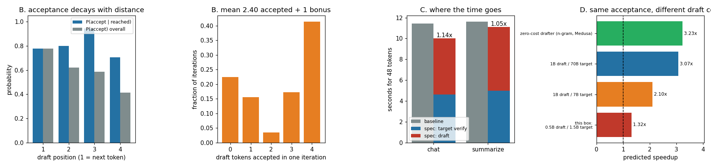

# Greedy Speculative Decoding

---

> A small model guesses the next few tokens; the big model checks them all in **one** forward pass and keeps the ones it agrees with. This project pairs Qwen2.5-**0.5B** (draft) with Qwen2.5-**1.5B** (target), writes the verify loop from scratch, and proves the promise: on all four workloads the speculative output is **token-for-token identical** to ordinary [greedy decoding](/shared/glossary/#greedy-decoding). Acceptance runs **0.47–0.79** depending on the workload, and one target forward pass emits **2.9–4.3 tokens** instead of 1. The honest part is the wall clock: on this box the speedup is only **1.14x** (chat) and **1.05x** (summarize), because our draft costs **34.5%** of a target pass — a ratio a real 1B-draft/70B-target pairing beats by 24x. A three-number cost model predicts the measured speedup to within **11%**, and that same model says the *identical* acceptance would be worth **3.07x** on a 70B target. Control: a drafter proposing random token ids still produces **identical text** — and runs at **0.87x**, which is the speculation tax with none of the reward.

---

## Key Insight

[Speculative decoding](/shared/glossary/#speculative-decoding) is the rare optimization that is genuinely free: same output, no retraining, no quality loss. Building the verify loop yourself is the only way to believe that, and to see that the speedup is set by three numbers you can measure in ten seconds.

## Why This Matters

[Decode](/shared/glossary/#decode) is memory-bandwidth-bound, which means the accelerator spends most of each step *waiting* for weights to arrive. Speculation spends that idle compute on checking guesses. Every production engine ships it; the difference between a 1.1x and a 3x deployment is entirely in the three numbers this project measures.

`speclib.py` is the shared foundation of this whole phase: projects 24, 25, 26, 27 and 29 all import it.

---

**This is project 23.**

### The words first

Every term here is named after what it does, once you unpack the name.

- **[Speculative](/shared/glossary/#speculative-decoding)** — from the Latin *speculari*, "to look ahead / spy out". The system does work on a guess about the future *before* knowing whether the guess is right, and is ready to throw that work away. Same idea as a CPU's *speculative execution*: run down the likely branch, roll back if you guessed wrong.
- **[Draft model](/shared/glossary/#draft-model)** — the small, fast model that writes the rough version. Like a junior writer who produces a first pass quickly.
- **[Target model](/shared/glossary/#target-model)** — the big model whose output you actually want. It is called the *target* because it defines the goal: the whole exercise is worthless unless the final text is exactly what this model would have said on its own.
- **[Acceptance rate](/shared/glossary/#acceptance-rate)** — `accepted ÷ proposed`. What fraction of the junior writer's words survived the editor.
- **`k`** — how many tokens the draft proposes per round. Also written `γ` (gamma) in the original paper.
- **[Bonus token](/shared/glossary/#bonus-token)** — the one extra token the target contributes for free at the end of each round. Explained in its own section below, because it is the reason speculation can never emit *zero* tokens.
- **Rollback** — undoing the [KV-cache](/shared/glossary/#kv-cache) writes made for a token that got rejected.
- **α (alpha) / tokens per iteration** — how many real tokens leave the loop per target forward pass. This is the number that actually predicts speedup, not the acceptance rate.

### "The target model already predicts the next token. Why add a second model that predicts the next token?"

This is the right question to ask, and the answer is not "two models are smarter than one" — the second model adds **zero** intelligence. The final text is decided by the target alone, and the draft's opinion is thrown away whenever the two disagree.

What the draft adds is **parallelism**, and it works because of an asymmetry in how a transformer runs:

- Generating token *n+1* requires knowing token *n*. That is a **serial** dependency, and it is why decode is one-token-at-a-time.
- *Checking* whether tokens *n+1 … n+4* are what the model would have said requires only one forward pass, because the [causal mask](/shared/glossary/#causal-mask) lets each position be scored against its own prefix simultaneously. That is **parallel**.

So the draft model exists to break the serial dependency cheaply. The target still does all the deciding; it just gets handed four candidate futures at once instead of being asked to invent them one at a time. The gap being filled is *"who supplies a plausible continuation cheaply"* — not *"who decides what the answer is."*

And the reason checking four positions costs almost nothing more than checking one: at [batch](/shared/glossary/#batch) size 1, a decode step is dominated by *reading the model's weights out of memory*, not by arithmetic. Reading 6 GB of weights takes the same time whether you multiply them by a 1-row matrix or a 5-row one. Measured here: **238.4 ms** for a 1-token pass and **284.8 ms** for a 5-token pass — 5x the arithmetic for **1.195x** the time.

### "Why write a third engine? Phases 2 and 3 already have one each."

They do, and this project imports Phase 2's `Qwen2Runner` **unchanged**. Only the cache is new, because speculation needs one operation neither earlier cache can express: **taking tokens back out**.

| | Phase 2 `ContiguousCache` | Phase 3 `SlotKV` | Phase 4 `SpecCache` |
|---|---|---|---|
| grows by | `torch.cat` | fixed lane, one token/step | write into preallocated buffer |
| can shrink? | no | no | **yes — `truncate(n)`** |
| cost of undoing 3 tokens | re-slice 28 tensors | not possible | `self.length -= 3` |

When the target rejects a draft token, that token's keys and values are already sitting in the cache — written during the verification pass, before anyone knew it was wrong. They must become invisible. `SpecCache` allocates its storage once and keeps a `length` counter; attention only ever reads `[:, :, :length, :]`, so rollback is one subtraction and zero copying. Production engines do the same thing: the KV blocks stay allocated, the sequence-length field moves backwards.

---

## Running it

```bash
python3 run.py           # ~4 minutes on 6 CPU threads
python3 run.py --plot    # redraw the figure from the committed findings.json
```

Needs `torch`, `transformers`, `matplotlib`. Both checkpoints are already in the HuggingFace cache. There is no GPU here that PyTorch can drive (the card reports compute capability 6.1; this build needs 7.0+), so everything runs on 6 CPU threads.

**What the CPU changes and what it doesn't.** The *mechanism* — one target pass emitting several tokens — is hardware-independent, and so is the acceptance rate, which depends only on how well the two models agree. What the CPU changes is the **cost ratio**: our draft is 0.5B against a 1.5B target, so it costs 34.5% of a target pass, where a production 1B/70B pairing costs about 1.4%. Section D measures the ratio and then re-runs the arithmetic at production ratios, so you can see both the honest local number and the number the technique is famous for.

> **About the numbers.** Everything below comes from the committed
> [`outputs/findings.json`](outputs/findings.json).



---

## A. Speculation must not change the text

This is the whole promise, so it is the first thing tested. Four workloads, 48 generated tokens each, `k = 4`, greedy in both cases:

| workload | prompt tokens | identical to plain greedy? | acceptance | tokens per target pass |
|---|---|---|---|---|
| chat | 44 | **yes** | 0.547 | 3.25 |
| summarize | 136 | **yes** | 0.471 | 2.94 |
| code | 75 | **yes** | 0.792 | 4.25 |
| json | 61 | **yes** | 0.654 | 3.69 |

Real text, not a similarity score — for example the `code` workload produced, from both paths, character for character:

```python
def normalise_scores(scores):
    total = sum(scores)
    if total == 0:
        return [0.0 for s in scores]
    return [s / total for s in scores]
```

**Why "identical" is provable and not just lucky.** In greedy mode the target's answer at every position is `argmax(logits)`, a deterministic function of the prefix. The verify step accepts draft token *i* **only if** it equals that argmax. So an accepted token is by definition the token the target would have produced, and a rejected one is replaced by the target's own argmax. There is no path through the loop that emits a token the target did not choose. (Project 24 does the much harder version of this argument for random [sampling](/shared/glossary/#sampling), where "identical" has to mean *identically distributed*.)

**Why it is worth testing anyway.** Three off-by-one bugs produce fluent, plausible, *wrong* text and raise no exception:

- **Forgetting to roll back the target cache.** The rejected token's KV entries stay, so the next round's tokens attend to a token that was never emitted.
- **Forgetting to roll back the *draft's* cache.** Easier to miss, because the output stays grammatical — the draft just starts conditioning on a history the target already deleted, and acceptance quietly collapses.
- **Misaligning the verification logits by one.** The logits at input position *j* predict position *j+1*. Comparing `preds[i]` against `drafts[i+1]` gives a system that accepts about as often as chance and still produces valid text, because the bonus token repairs the sequence every round.

## B. Anatomy of acceptance

58 speculative iterations across the four workloads:

| draft position | 1 (next token) | 2 | 3 | 4 |
|---|---|---|---|---|
| P(accepted \| the loop got this far) | 0.776 | 0.800 | 0.944 | 0.706 |
| P(accepted) overall | 0.776 | 0.621 | 0.586 | 0.414 |

The two rows say different things and the difference matters.

The **overall** row falls steadily — 0.78 → 0.41 — which is the well-known "acceptance decays with distance". But it decays for a boring reason: position 4 is only *examined* when positions 1–3 were all accepted, and verification stops at the first mismatch. Most of the decline is the loop not getting that far.

The **conditional** row asks the sharper question: *given* that we reached position *i*, how likely is it to survive? That row does **not** decay — it wobbles between 0.71 and 0.94. The consequence is worth stating plainly: **the draft is not getting confused as it looks further ahead.** What is happening instead is that runs of easy text (boilerplate, code indentation, a JSON key) are accepted wholesale, and runs of hard text are rejected at position 1. Acceptance is a property of *where you are in the text*, not of *how far ahead you are guessing*.

The histogram of accepted-per-iteration makes that concrete:

| accepted | 0 | 1 | 2 | 3 | 4 |
|---|---|---|---|---|---|
| fraction of iterations | 0.224 | 0.155 | 0.034 | 0.172 | **0.414** |

It is **U-shaped**, not bell-shaped. The single most common outcome is "all four accepted" (41%), and the second most common is "none accepted" (22%). The average, 2.40 accepted, describes almost no actual iteration. This is why a scheduler that budgets time per iteration using the *mean* will be wrong nearly every time — and it is exactly the ragged behaviour project 28 has to fit into a batch.

### The bonus token, and why speculation has a floor

Each round feeds the target `[last_token] + k drafts` = `k+1` positions, and gets back `k+1` next-token predictions — one per input position. Even if **every** draft is rejected, the prediction made at the first position is still valid: it is the target's own next token, computed from a prefix that contains no draft tokens at all.

So the loop always emits `accepted + 1` tokens. That "+1" is free in the strict sense — the target computed it as a side effect of the verification pass it was doing anyway. It is also why **α (tokens per target pass) is at least 1**, and why the *mechanism* can never be slower than plain decoding. The draft model's cost can still make the wall clock slower, which is section E.

## C. Where the wall-clock time goes

Timed round-robin (baseline, speculative, baseline, speculative) keeping the **minimum** of each. This box is shared with other jobs; running one method to completion and then the other charges any background spike entirely to whichever happened to be running.

| workload | baseline decode | speculative decode | speedup | draft's share of speculative time |
|---|---|---|---|---|
| chat | 11.44 s | 10.03 s | **1.14x** | 53.9% |
| summarize | 11.62 s | 11.10 s | **1.05x** | 55.0% |

For 48 tokens that is 4.19 → 4.78 tokens/s on chat.

**The draft is more than half the bill.** That is the entire story of this box. Four draft passes at 82.2 ms each = 329 ms, against one 5-wide target pass at 284.8 ms. We are paying more for the guessing than for the checking. In a production pairing the same four draft passes would cost 1.4% of a target pass each, and the bar would be invisible.

Notice also that `summarize` does worse than `chat` on *both* axes — lower acceptance (0.47 vs 0.55) and lower speedup. Its prompt is a passage the answer must compress rather than copy, so the draft has to guess genuinely new wording. Project 25 shows the opposite extreme, where the answer *is* mostly a copy and a free drafter beats a model.

## D. Three numbers predict the speedup

Speculation's wall-clock behaviour follows from three measurable quantities:

| number | meaning | measured here |
|---|---|---|
| **α** | tokens emitted per target forward pass | 2.94–3.25 |
| **cost_ratio** | one draft pass ÷ one target pass | 82.2 / 238.4 = **0.345** |
| **verify_overhead** | how much more a `k+1`-wide target pass costs than a 1-wide one | 284.8 / 238.4 − 1 = **0.195** |

```
                                    α
    speedup  ≈  ─────────────────────────────────────────
                (1 + verify_overhead)  +  k · cost_ratio
```

Read it in words: the baseline spends **one** target pass per token. Speculation spends **one slightly-fatter target pass plus k draft passes** and gets **α** tokens for it. Everything else is bookkeeping.

| workload | α | predicted | measured | error |
|---|---|---|---|---|
| chat | 3.25 | 1.26x | 1.14x | 10.7% |
| summarize | 2.94 | 1.14x | 1.05x | 9.2% |

The model runs ~10% optimistic, which is honest: it prices only forward passes, and the real loop also spends time on Python bookkeeping, tensor construction, and the draft's catch-up pass. Close enough to *design* with.

### The same acceptance on production-shaped hardware

Hold α at the measured 3.40 and `k` at 4, and change only the draft's cost:

| pairing | cost_ratio | predicted speedup |
|---|---|---|
| this box: 0.5B draft / 1.5B target | 0.345 | **1.32x** |
| 1B draft / 7B target | 0.143 | **2.10x** |
| 1B draft / 70B target | 0.014 | **3.07x** |
| zero-cost drafter (n-gram, Medusa) | 0.000 | **3.23x** |

The non-obvious consequence: **the draft's cost, not its accuracy, is what separates a 1.3x deployment from a 3x one here.** Every row has the identical acceptance rate. All that changed is how much the guessing cost.

This is also the strategic argument for the rest of the phase. Going from a 70B target to a *free* drafter buys only 3.07 → 3.23 (+5%) — the draft cost is already almost gone. But going from *our* ratio to free buys 1.32 → 3.23 (2.4x). Small targets need free drafters. That is exactly why [Medusa](/shared/glossary/#eagle--medusa) ([project 27](../27-medusa-heads/README.md)) and prompt lookup ([project 25](../25-n-gram-lookup/README.md)) exist, and why they matter most for the smaller models most people actually serve.

## E. Control: a drafter that knows nothing

Replace the 0.5B model with a random-number generator that emits plausible-looking token ids. Everything else is unchanged.

| | baseline | random drafter |
|---|---|---|
| output text | — | **identical to baseline** |
| acceptance rate | — | 0.000 |
| tokens per target pass | 1.00 | 1.021 |
| decode time (48 tokens) | 11.84 s | 13.56 s |
| speedup | 1.00x | **0.87x** |

Two things fall out of this, and both are load-bearing.

**The correctness guarantee does not depend on the draft being good.** The text is identical with a drafter that is wrong 100% of the time. Speculation's safety comes from the *verification rule*, not from the draft's quality. A production consequence: you can swap drafters, retrain them badly, or ship a stale one, and you will lose throughput without ever corrupting output. That makes speculation unusually safe to deploy — the failure mode is a bill, not a bug.

**Speculation is not free of cost, only free of risk.** At zero acceptance we still paid the 19.5% verify overhead on every pass, and the loop ran 13% slower than plain decoding. (The 1.021 tokens/pass, rather than exactly 1.000, is the occasional random id that happens to be right.) The "free lunch" in the guide's Key Insight is about *quality*; the throughput is very much paid for.

---

## What to take away

1. **Greedy speculation is exactly equivalent, and that is a theorem, not an experiment.** Accepting only tokens equal to the target's argmax means no other token can ever be emitted. Test it anyway — the three common bugs all produce plausible text.
2. **Report α (tokens per target pass), not acceptance rate.** Acceptance is the input; α is what predicts the wall clock, and the bonus token means α ≥ 1 always.
3. **Acceptance does not really decay with distance.** Conditional on being reached, position 4 is about as likely to be accepted as position 1 (0.71 vs 0.78). What decays is the *chance of getting there*. The per-iteration distribution is U-shaped — mostly all-or-nothing — so any per-iteration budget built on the mean is wrong most of the time.
4. **Draft cost, not draft quality, decides whether it is worth it.** Our 0.345 cost ratio caps the win at ~1.3x with identical acceptance that would be worth 3.07x on a 70B target.
5. **Small targets need free drafters.** The 2.4x gap between our ratio and a zero-cost drafter is the reason the rest of this phase exists.
6. **A useless drafter is slower, never wrong.** 0.87x and byte-identical output.

## Next

- [Project 24 — sampling-mode rejection](../24-sampling-mode-rejection/README.md): make the same guarantee hold when you are not decoding greedily.
- [Project 25 — n-gram lookup](../25-n-gram-lookup/README.md): the zero-cost drafter row of section D, measured for real.
- [Project 26 — tune `k`](../26-tune-k/README.md): section D's formula has a maximum in `k`. Find it.

## Resources

- [Leviathan, Kalman, Matias — *Fast Inference from Transformers via Speculative Decoding* (2022)](https://arxiv.org/abs/2211.17192) — the original; section 3 is the proof this project tests empirically
- [Chen et al. — *Accelerating Large Language Model Decoding with Speculative Sampling* (DeepMind, 2023)](https://arxiv.org/abs/2302.01318)
- [vLLM speculative-decoding docs](https://docs.vllm.ai/en/latest/features/spec_decode.html)
- [Inference-systems Phase 4](../../README.md#phase-4-speculative-decoding) — the phase this project opens
