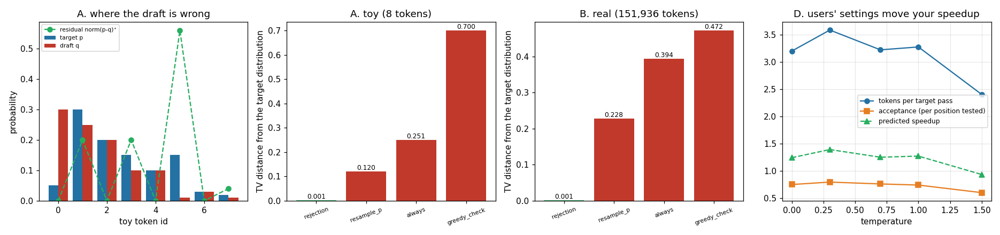

# Sampling-Mode Rejection

---

> [Greedy](/shared/glossary/#greedy-decoding) speculation can just ask "is this the token the big model would pick?". Random [sampling](/shared/glossary/#sampling) has no single right answer, so verification has to preserve a whole *distribution*. This project implements the [rejection-sampling](/shared/glossary/#rejection-sampling) accept/reject step and then tries to break it. Four verification rules, 400,000 draws each: the correct one lands **0.0008** total-variation distance from the target distribution (Monte-Carlo noise); the three plausible-looking wrong ones land at **0.228**, **0.394** and **0.472** — and every one of them still produces fluent English. The most tempting shortcut, reusing the greedy verifier, is not "slightly biased": it emits the single most likely token **100% of the time**, silently turning temperature 1.0 into temperature 0. The [acceptance rate](/shared/glossary/#acceptance-rate) is not a tunable — it equals `1 − TV(p, q)`, confirmed to within 0.04 in the running loop. And an inversion worth knowing: at temperature 0.3, **sampling accepts more than greedy does** (α **3.59** vs **3.20**), because a probabilistic test forgives near-misses that an exact-match test rejects.

---

## Key Insight

The accept/reject step is four lines of code and one of them is easy to get wrong in a way that no test suite catches — the output stays grammatical, only its *distribution* moves. This project builds the measurement that catches it.

## Why This Matters

Almost no production traffic is greedy: chat endpoints ship `temperature=0.7, top_p=0.95` by default. If your speculative path is biased, every user gets subtly different text than the model card promises, forever, and no error is ever logged.

---

**This is project 24.**

### The words first

- **[Rejection sampling](/shared/glossary/#rejection-sampling)** — a general statistics trick, older than machine learning: draw from an easy distribution, then throw some draws away with exactly the right probability so that the survivors follow a harder distribution. Named for the throwing-away step.
- **`p`** — the *target* model's probability for a token. **`q`** — the *draft* model's probability for the same token.
- **[Total-variation (TV) distance](/shared/glossary/#total-variation-distance)** — one number for "how different are these two distributions?". It is half the sum of the absolute differences, `½·Σ|p−q|`. The halving makes the range exactly 0 (identical) to 1 (no overlap at all). Plain reading: **the biggest disagreement the two distributions could ever have about the probability of any single event.**
- **Residual distribution** — `norm(max(0, p − q))`, the distribution you draw from after a rejection. Section A explains why it has to be this and not something simpler.
- **Bias** (statistical sense) — the output distribution is systematically shifted, not just noisy. Averaging over more requests does **not** make it go away.

### "The greedy verifier already works. Why write a second, harder one?"

Because the greedy verifier is not a simplified version of the sampling one — it answers a different question, and using it under sampling is a *bug*, not an approximation.

- Greedy asks: **is `x` the token the target would have picked?** There is exactly one right answer per position, so an equality test is complete.
- Sampling has no single right answer. Asking "is `x` what the target would have sampled?" is meaningless — the target would have sampled *many* different tokens, each with its own probability.

So the sampling verifier answers a different question: **how often should I keep `x`, so that the tokens leaving this loop are distributed exactly like the target's own samples?** That is a question about frequencies over many requests, and it needs a randomized test.

Section A measures what happens if you use the greedy rule anyway: the output collapses onto the single most likely token. Not "a bit peaky" — literally `p(argmax) = 1.0`. Your `temperature=1.0` endpoint silently became `temperature=0`.

### The rule, in one box

```
   draft proposes x, drawn from q
       │
       ├── with probability min(1, p(x) / q(x))  ──►  ACCEPT x
       │
       └── otherwise ─────────────────────────────►  REJECT,
                                                     draw a replacement from
                                                     norm(max(0, p − q))
```

**Why `min(1, p/q)`?** The draft proposes `x` at rate `q(x)`. You want it emitted at rate `p(x)`. So keep a fraction `p(x)/q(x)` of the proposals: `q(x) · p(x)/q(x) = p(x)`. When the target wants `x` *more* than the draft proposed it (`p > q`), you cannot keep more than 100% of what you were given — hence the `min(1, ·)` — and the shortfall is made up by the rejection branch.

**Why the residual `max(0, p − q)` and not just `p`?** Accepting at rate `min(p, q)` already delivered part of `p`. Exactly which part? The overlap `min(p, q)`. What is still owed is `p − min(p, q) = max(0, p − q)`. Drawing from `p` again on rejection would deliver tokens that were *already* fully paid for by the accept branch, so those tokens end up over-represented. That is the `resample_p` bug, and it is measured below.

---

## Running it

```bash
python3 run.py           # ~3 minutes on 6 CPU threads
python3 run.py --plot    # redraw from the committed findings.json
```

Needs `torch`, `transformers`, `matplotlib`. Imports [`speclib.py`](../23-greedy-speculative-decoding/speclib.py) from [project 23](../23-greedy-speculative-decoding/README.md).

> **About the numbers.** Everything below comes from the committed
> [`outputs/findings.json`](outputs/findings.json).



---

## A. Four rules, on a toy where the exact answer is computable

Eight tokens. The draft is over-confident about token 0 (`q = 0.30` vs `p = 0.05`) and almost blind to token 5 (`q = 0.01` vs `p = 0.15`) — disagreement in both directions, on purpose.

| token | 0 | 1 | 2 | 3 | 4 | 5 | 6 | 7 |
|---|---|---|---|---|---|---|---|---|
| target `p` | 0.05 | 0.30 | 0.20 | 0.15 | 0.10 | 0.15 | 0.03 | 0.02 |
| draft `q` | 0.30 | 0.25 | 0.20 | 0.10 | 0.10 | 0.01 | 0.03 | 0.01 |
| residual | 0.00 | 0.20 | 0.00 | 0.20 | 0.00 | **0.56** | 0.00 | 0.04 |

Read the residual row: it puts **56%** of its mass on token 5, the one the draft almost never proposes. That is the repair job the rejection branch exists to do.

400,000 draws through each rule, scored by TV distance from `p`:

| rule | TV measured | TV in closed form | what it is |
|---|---|---|---|
| **rejection** (correct) | **0.00122** | **0.00000** | accept `min(1, p/q)`, else residual |
| `resample_p` | 0.11951 | 0.12000 | accept `min(1, p/q)`, else draw from `p` |
| `always` | 0.25088 | 0.25000 | no verification — output is just `q` |
| `greedy_check` | 0.70000 | 0.70000 | accept only if `x == argmax(p)` |

The measured column is Monte-Carlo; the closed-form column is exact arithmetic on the distributions, included so the result does not rest on 400,000 lucky coin flips. They agree to three decimals, and the correct rule's `0.00122` is exactly the sampling noise you expect from 400,000 draws over 8 tokens.

**And the acceptance rate is not a free parameter.** For a tested position, the chance of accepting is `Σₓ q(x)·min(1, p(x)/q(x)) = Σₓ min(p, q) = 1 − TV(p, q)`. Predicted **0.7500**; measured **0.7504**. You do not get to tune acceptance under sampling — it is fixed by how much the two models already agree.

### Reading `greedy_check` correctly

TV = 0.700 is not "a bit off". Work through the rule: if the draft's token *is* the target's argmax, emit it; otherwise emit the argmax. Either way you emit the argmax. The rule outputs `argmax(p)` with probability **1**, so its TV from `p` is `1 − p(argmax) = 1 − 0.30 = 0.70`.

Consequence for a real service: your endpoint accepts a `temperature` parameter, appears to honour it (the number is in the request log, the code path runs), and returns greedy text. Every user gets the same answer to the same prompt. The bug is only visible if you compare *distributions over many requests*, which no unit test does.

## B. The same four rules on a real 151,936-token distribution

Prompt: the chat workload from project 23, at temperature 1.0. The target's top-5, next to the draft's numbers for the same tokens:

| token | target `p` | draft `q` |
|---|---|---|
| `The` | 0.528 | **0.841** |
| `During` | **0.410** | 0.025 |
| `When` | 0.040 | 0.055 |
| `On` | 0.006 | 0.002 |
| `In` | 0.003 | 0.009 |

This is the toy's disagreement pattern happening for real: the 0.5B model is far more sure about `The` than the 1.5B model is, and it barely considers `During`, which the target rates almost as likely as `The`. `TV(p, q) = 0.393`, so acceptance here should be about **0.607**.

| rule | TV from the target distribution |
|---|---|
| **rejection** | **0.00078** |
| `resample_p` | 0.22813 |
| `always` | 0.39419 |
| `greedy_check` | 0.47223 |

Same ordering, larger gaps. Note `always` = 0.394, which is exactly `TV(p, q)` — with no verification the output *is* the draft's distribution, so a "speculative" endpoint with the accept step accidentally disabled is simply serving you the 0.5B model. It would pass every smoke test.

One number worth pausing on: the target puts non-negligible mass on **189** distinct tokens here, the draft on **966**. The small model is *less* certain overall but *more* certain about its favourite. Both facts push acceptance down.

## C. The acceptance rate is `1 − TV`, in the running loop too

Sections A and B tested one position with fixed distributions. Section C runs the real loop and compares, at every verified position, the measured acceptance against `1 − TV(p, q)` computed from that step's own two distributions (mean of 3 seeds, 32 tokens each):

| temperature | acceptance (per position tested) | `1 − TV(p, q)` |
|---|---|---|
| 0.3 | 0.795 | 0.762 |
| 0.7 | 0.761 | 0.788 |
| 1.0 | 0.740 | 0.762 |
| 1.5 | 0.601 | 0.635 |

Agreement within 0.04 across the range, with the residual gap being small-sample noise (a few hundred verified positions per row).

**Why "per position tested" and not "accepted ÷ proposed".** Verification stops at the first mismatch, so positions after a rejection are proposed but never looked at. Dividing by everything proposed measures a mixture of "how often the draft is right" and "how deep the loop got" — and it will not match the theory. This is the same marginal-vs-conditional distinction as [project 23](../23-greedy-speculative-decoding/README.md) section B, and it bites twice as hard here because the theory makes an exact prediction to check against.

The practical consequence: **acceptance is a property of the model pair, not a dial on your server.** If you want more acceptance, you change the draft model, not the config.

## D. Users' sampling settings move your speedup

Same sweep, now with α (tokens per target forward pass) and the speedup predicted by project 23's cost model at `cost_ratio = 0.345, verify_overhead = 0.195`:

| temperature | α (tokens/target pass) | predicted speedup | first words generated |
|---|---|---|---|
| 0.0 (greedy) | 3.20 | 1.24x | "The sky appears blue during the day due to…" |
| 0.3 | **3.59** | **1.39x** | "During the day, the sky appears blue due to…" |
| 0.7 | 3.22 | 1.25x | "During the day, sunlight is scattered by the Earth's…" |
| 1.0 | 3.28 | 1.27x | "During the day, sunlight is not a uniform color;…" |
| 1.5 | 2.40 | 0.93x | "Surface materials such as oceans and dust are rich with…" |

Two findings, one expected and one not.

**Expected: high temperature destroys speculation.** At T = 1.5 the target's distribution flattens, `TV(p, q)` grows, acceptance falls to 0.60 and α to 2.40 — enough to put the predicted speedup *below 1.0* on this hardware. A creative-writing endpoint and a code endpoint on the same model will have measurably different speculative throughput, and the difference is not your fault or fixable by tuning.

**Not expected: sampling at T = 0.3 accepts *more* than greedy does.** α 3.59 vs 3.20. The reason is that the tests are structurally different. Greedy verification demands an exact argmax match: if the draft says `The` and the target's argmax is `During`, that is a hard rejection even when the target rated `The` at 0.53. The probabilistic test only asks `p(x)/q(x)`, so a token the target genuinely liked usually survives. **A softer test can be a more permissive one.** So "switch users to greedy to make speculation faster" is not sound advice — measure it.

Wall clock at T = 1.0, three seeds, 32 tokens:

| | baseline sampling | speculative sampling |
|---|---|---|
| mean decode time | 7.97 s | 6.08 s (**1.31x**) |
| individual runs | — | 7.44 s, 4.71 s, 6.08 s |

The three speculative runs span **1.58x** between fastest and slowest, on the same prompt with the same settings. That spread is the algorithm, not the machine: how many tokens each iteration accepts is a random variable, so per-request latency under speculation is *inherently* more variable than without it. Two operational consequences: quote speculative gains as a mean over many requests, and expect your [ITL](/shared/glossary/#itl--tpot) p99 to improve less than your p50. (These numbers are averaged, not minimised, for exactly this reason — taking the best of three runs would have flattered speculation with its own luck.)

## E. The mismatch trap

The `q` in `min(1, p/q)` must be **the distribution the token was actually drawn from**, including every logit transform you applied. It is easy to violate this by accident: apply [top-p](/shared/glossary/#top-p) when sampling the draft, then score against the raw softmax you happen to still have in a variable.

Same real distributions as section B, draft filtered at `top_p = 0.9`:

| case | TV from the target distribution |
|---|---|
| matched — `q` is the distribution sampled from | **0.00198** |
| sampled from top-p 0.9, scored against raw `q` | 0.04815 |
| sampled from raw `q`, scored against top-p 0.9 | 0.07721 |

A 24x and 39x increase in bias from a mismatch that raises no error, changes no shape, and looks like a harmless cleanup in code review.

The magnitude is worth calibrating: `top_p = 0.9` on this draft keeps only **3** tokens out of the 966 it gives non-negligible mass to — because `The` alone is 0.84. That is a violent transform, and it moves the output distribution by 0.05–0.08 TV. A gentler filter gives a smaller bias, which makes the bug *harder* to notice, not less real.

The rule to remember: **compute `q` once, use that same object to sample and to score.** If they are two variables, they will eventually drift apart.

---

## What to take away

1. **Greedy verification under sampling is not an approximation, it is a different algorithm.** It emits the argmax 100% of the time. TV 0.70 on the toy.
2. **On rejection, draw from the residual `norm(max(0, p − q))`, never from `p`.** Drawing from `p` double-counts the mass the accept branch already delivered: TV 0.228 on a real distribution.
3. **Acceptance is `1 − TV(p, q)` and nothing else.** Confirmed to 0.04 in the loop. You cannot tune it; you can only pick a better-matched draft.
4. **Divide by positions *tested*, not positions *proposed*,** or the number will not match any theory.
5. **Temperature is your users' throughput dial, whether you like it or not.** T = 1.5 pushed the predicted speedup below 1.0 on this box.
6. **Sampling can accept more than greedy.** 3.59 vs 3.20 tokens per pass at T = 0.3, because a probabilistic test forgives near-misses that an exact-match test rejects.
7. **Every wrong rule produced fluent English.** Correctness here is only visible in aggregate statistics — build the TV measurement before you ship the feature.

## Next

- [Project 25 — n-gram lookup](../25-n-gram-lookup/README.md): a drafter with no model at all, so `q` is not even a distribution — how does verification work then?
- [Project 26 — tune `k`](../26-tune-k/README.md): now that acceptance is fixed by the model pair, `k` is the only dial you have left.

## Resources

- [Leviathan, Kalman, Matias — *Fast Inference from Transformers via Speculative Decoding* (2022)](https://arxiv.org/abs/2211.17192) — Theorem 3.5 is the `1 − TV` result measured in section C
- [Chen et al. — *Accelerating Large Language Model Decoding with Speculative Sampling* (DeepMind, 2023)](https://arxiv.org/abs/2302.01318) — Appendix A.1 gives the modified-rejection proof in three lines
- [Inference-systems Phase 4](../../README.md#phase-4-speculative-decoding)
