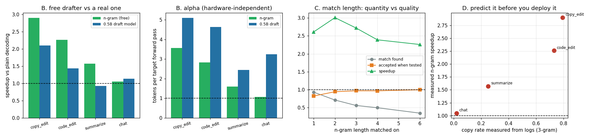

# N-Gram Lookup (Prompt-Lookup Decoding)

---

> The drafter with no model in it: to guess the next few tokens, take the last few tokens you just wrote, find where that same short phrase appeared earlier in the prompt, and propose whatever followed it there. A list scan — **0.012%** of decode time, against **55%** for the 0.5B draft model. On a copy-heavy edit task it reaches **2.90x**, beating the real draft model's 2.10x — even though the model has the *higher* [acceptance rate](/shared/glossary/#acceptance-rate) (100% vs 94.6%) and the *higher* α (5.10 vs 3.57 tokens per target pass). **A perfect drafter loses to a good free one.** On summarization the free drafter gets 1.57x while the 0.5B model is an outright **slowdown** (0.93x); on open chat, where there is nothing to copy, the ordering flips back (1.05x vs 1.14x). Match length has an interior optimum: matching on 1-gram finds a candidate 93% of the time but only 82% survive, 6-grams are accepted **100%** of the time but found only 35% — the best speedup is at **n = 2**. And the whole thing is predictable before deployment: rank four workloads by a "copy rate" computed offline from logs and you get **exactly** the measured speedup ordering.

---

## Key Insight

[Speculative decoding](/shared/glossary/#speculative-decoding)'s cost model has two terms — how good the guesses are, and how much the guessing costs. Project 23 showed the second term dominating. This project drives it to zero and watches what happens.

## Why This Matters

Summarization, RAG, code editing, and "rewrite this with X changed" are enormous fractions of real serving traffic, and in all of them the answer is largely a *copy* of the input. Prompt lookup needs no training, no second checkpoint, no extra memory, and no [KV cache](/shared/glossary/#kv-cache) of its own. It is the highest ratio of speedup to engineering effort in this entire phase.

---

**This is project 25.**

### The words first

- **[N-gram](/shared/glossary/#n-gram)** — a run of `n` tokens sitting next to each other. *Gram* comes from Greek *gramma*, "something written", so it just means "one written item"; the *n* says how many in a row. "the cat sat" is a 3-gram.
- **[Prompt lookup](/shared/glossary/#prompt-lookup-decoding)** — the name of the technique: look the continuation *up* in the prompt instead of computing it.
- **Hit rate** — how often the lookup finds any match at all. Different from acceptance, which is how often a found match turns out to be right. Section C is about the tension between them.
- **Copy rate** — the fraction of generated tokens that an n-gram lookup *could* have predicted. Measurable from finished generations, which makes it a forecast rather than a result.

### "The model already saw the prompt. Why look things up in it again?"

This is the right question and the answer is about *cost*, not information.

Yes — the target model has the whole prompt in its [KV cache](/shared/glossary/#kv-cache), and yes, when it decides to copy a phrase, it does so by attending back to that phrase. Nothing here tells the model anything it did not know.

What the lookup provides is a **cheap guess about what the model is going to do next**, available *before* the model runs. That is the resource speculation needs and cannot get from the target itself: the target only reveals its next token by doing a full forward pass, which is the expensive thing we are trying to avoid.

So the division of labour is:

| | supplies | costs |
|---|---|---|
| target model | the *decision* — the actual tokens | one full forward pass per round |
| n-gram lookup | a *candidate* to check | a list scan |

The lookup is allowed to be wrong. Its output is never trusted; every proposed token is verified against the target exactly as in [project 23](../23-greedy-speculative-decoding/README.md), so the final text is byte-identical to plain decoding. It only has to be right *often enough* to be worth checking.

### How the drafter works

```
   context so far:  ... the Greek island of Antikythera , and its complexity ...
                                                            └───────┬───────┘
                                                       last 2 tokens I wrote

   scan backwards through everything (prompt + output) for those 2 tokens:

   ... coast of the Greek island of Antikythera , and its complexity was not
                                                    └──┬──┘ └────────┬──────┘
                                                     match      what followed

   propose:  "was", "not", "matched", "by"     (k = 4)
```

Two design choices in `NgramDrafter` (in [`speclib.py`](../23-greedy-speculative-decoding/speclib.py)):

- **Search backwards, most recent first.** Later text predicts what comes next better than the top of the document does, and in an edit task the model's *own* recent output is the best guide to its next output.
- **Try long matches first, then shorter ones.** A 4-token match is rarer but more trustworthy than a 2-token match. Falling back means the drafter proposes *something* far more often than a fixed-length matcher would. Section C measures what this costs and buys.

---

## Running it

```bash
python3 run.py           # ~4 minutes on 6 CPU threads
python3 run.py --plot    # redraw from the committed findings.json
```

Needs `torch`, `transformers`, `matplotlib`. Imports [`speclib.py`](../23-greedy-speculative-decoding/speclib.py) from [project 23](../23-greedy-speculative-decoding/README.md). Target Qwen2.5-1.5B-Instruct, greedy, `k = 4`, 48 generated tokens per run.

> **About the numbers.** Everything below comes from the committed
> [`outputs/findings.json`](outputs/findings.json).



---

## A. It works, and it does not change the output

All four workloads, both drafters, produced text **token-identical** to plain [greedy decoding](/shared/glossary/#greedy-decoding). That is expected — verification is unchanged from project 23, and the correctness argument never depended on where the drafts came from — but it is the first thing to check, because a drafter that proposes tokens from the *wrong* offset in the prompt is a very easy bug to write.

The `copy_edit` output, from all three paths:

> "The Antikythera mechanism is an ancient **Hellenic** hand-powered device that has been described as the oldest known analogue computer. It was used to predict astronomical positions and eclipses decades i…"

## B. Four workloads, three drafters

| workload | prompt tokens | plain decode | n-gram | 0.5B draft model |
|---|---|---|---|---|
| `copy_edit` (rewrite a paragraph, one word changed) | 158 | 15.30 s | **5.28 s — 2.90x** | 7.30 s — 2.10x |
| `code_edit` (change a default in a function) | 105 | 12.54 s | **5.55 s — 2.26x** | 8.73 s — 1.44x |
| `summarize` (re-word a passage) | 138 | 12.77 s | **8.15 s — 1.57x** | 13.81 s — **0.93x** |
| `chat` (nothing to copy from) | 44 | 11.98 s | 11.42 s — 1.05x | **10.53 s — 1.14x** |

### The headline: a perfect drafter can lose

Look at `copy_edit` closely.

| | n-gram | 0.5B draft model |
|---|---|---|
| acceptance (per position tested) | 0.946 | **1.000** |
| α (tokens per target pass) | 3.57 | **5.10** |
| drafting's share of decode time | **0.012%** | 56.5% |
| **wall clock** | **5.28 s** | 7.30 s |

The draft model was **never wrong** on this task — every single proposal accepted, α at the theoretical maximum of `k+1 = 5`. It still lost by 38%, because producing those perfect guesses cost four 0.5B forward passes per round and the n-gram scan cost nothing measurable.

This is the concrete form of project 23 section D's arithmetic, and it is worth restating as a rule: **α tells you how good a drafter is; `α ÷ (1 + k·cost_ratio)` tells you whether to use it.** Ranking drafters by acceptance rate — which is what most papers report — would have picked the loser here.

### And the free drafter is not always the right one

On `chat` the ordering flips: 1.05x for n-gram against 1.14x for the model. With no source document, the only text to look up in is the model's own 44-token prompt and its own output, so matches are rare and mostly wrong — α falls to **1.07**, which is barely above the 1.00 you get with no speculation at all. The 0.012% drafting cost means it never becomes a *slowdown*, but there is nothing to win either.

The complementary result on `summarize` is the sharper one: the free drafter gets **1.57x** while the paid one gets **0.93x** — an actual regression. A summarizer re-words rather than copies, so the model's α drops to 2.45, not enough to cover four draft passes. **On this hardware the choice is not "which drafter is better" but "which drafter is better *for this route*".** Production engines let you set the speculation method per request for exactly this reason.

## C. How long an n-gram to match on

Same `copy_edit` workload, forcing an exact match length (no fallback to shorter n):

| n | match found | accepted when tested | α | speedup |
|---|---|---|---|---|
| 1 | **0.93** | 0.82 | 3.27 | 2.61x |
| **2** | 0.71 | 0.95 | **3.57** | **3.01x** |
| 3 | 0.56 | 0.97 | 3.19 | 2.72x |
| 4 | 0.50 | 0.97 | 2.89 | 2.39x |
| 6 | 0.35 | **1.00** | 2.45 | 2.26x |

Two monotone curves pulling in opposite directions, and an optimum in between.

- **Longer match = better quality.** At n = 6, every proposal that was found was accepted — 100%. A six-token phrase that occurred before is essentially a guarantee about what comes next.
- **Longer match = less often available.** At n = 6 the drafter had nothing to say on 65% of iterations, and on those iterations it degenerates to ordinary one-token-at-a-time decoding.

The n = 6 row is the one to internalize: **acceptance 1.00 and the worst speedup in the table.** A drafter that is always right but usually silent is worth less than one that is often right and always speaks. This is the same lesson as section B from the other direction — the metric that matters is α, which multiplies quality by availability.

The n = 1 row is the trap in the other direction. Matching on a single token means "the last token I wrote was `the`; here is what followed the last `the`". That fires almost every time (0.93) and is right 82% of the time, which sounds fine, but each wrong guess ends its iteration early. It still beats plain decoding by 2.61x — a free drafter is hard to make actively bad — but it leaves 13% on the table versus n = 2.

**Why the default in `speclib.py` tries long matches first and falls back to shorter ones:** it aims to buy the top-left of both curves — n = 6's precision when a 6-gram exists, n = 2's availability when it does not.

## D. You can predict this from logs, before you deploy it

**Copy rate**: replay a finished generation and ask, at each generated token, "would a 3-gram lookup over the text available *at that moment* have predicted this token?" It needs no model, no serving change, and runs over request logs you already have.

| workload | copy rate (3-gram) | copy rate (2-gram) | measured n-gram speedup |
|---|---|---|---|
| `copy_edit` | 0.79 | 0.81 | 2.90x |
| `code_edit` | 0.73 | 0.73 | 2.26x |
| `summarize` | 0.25 | 0.35 | 1.57x |
| `chat` | 0.02 | 0.04 | 1.05x |

Ranked by copy rate: `copy_edit, code_edit, summarize, chat`.
Ranked by measured speedup: `copy_edit, code_edit, summarize, chat`.

**Identical ordering.** Four points is not a validated model, and the relationship is clearly not linear (0.02 → 1.05x, 0.79 → 2.90x). But as a go/no-go screen it is enough: a route whose copy rate is 0.02 will not be rescued by prompt lookup, and one at 0.79 almost certainly will. That is the decision you actually need to make, and this measurement costs one afternoon of log processing rather than a serving deployment.

## E. The negative case, stated plainly

On `chat`, prompt lookup bought **1.05x** — within noise of nothing. Two things follow.

**It did not hurt.** Drafting was 0.012% of decode time, so even at α = 1.07 there is no meaningful tax. Compare project 23's random drafter, which cost **0.87x** because its useless guesses still had to be verified by the target: the verification overhead (~19.5% per pass) is charged whether or not the drafter is free. The n-gram drafter escapes that only because when it finds no match it proposes *nothing*, and the loop falls back to a plain 1-token pass. That behaviour is worth building deliberately — a drafter that must always emit `k` tokens has no way to opt out of a bad round.

**Enable it everywhere, expect it nowhere.** Because the downside is bounded at roughly 1.0x and the upside is ~3x, prompt lookup is one of the few optimizations that is safe to turn on by default. But do not let a 2.90x number from a document-editing benchmark set expectations for a chat product.

---

## What to take away

1. **Drafting cost, not draft quality, decided three of four workloads.** A drafter with 100% acceptance and α 5.10 lost to one with 94.6% and α 3.57.
2. **Rank drafters by α ÷ (1 + k·cost_ratio), never by acceptance rate.**
3. **Match length has an interior optimum.** n = 6 is accepted 100% of the time and is the *worst* configuration, because it is silent 65% of the time.
4. **The best drafter is workload-dependent, and the gap is large enough to flip the sign.** `summarize`: 1.57x free vs 0.93x paid.
5. **A free drafter that can decline to guess never becomes a slowdown.** 1.05x on chat, versus 0.87x for project 23's always-guessing random drafter.
6. **Copy rate is a real pre-deployment screen.** Computed offline from logs, it reproduced the measured speedup ordering exactly.

## Next

- [Project 26 — tune `k`](../26-tune-k/README.md): `k` is the last dial. Section C found an optimum in match length; there is one in `k` too.
- [Project 27 — Medusa heads](../27-medusa-heads/README.md): the other way to get a near-free drafter — train tiny extra heads on the target itself, so it works even when there is nothing to copy.
- [Project 29 — workload sensitivity](../29-workload-sensitivity/README.md): this section-B table, done properly across more workloads.

## Resources

- [Saxena — *Prompt Lookup Decoding*](https://github.com/apoorvumang/prompt-lookup-decoding) — the original ~30-line implementation
- [Leviathan, Kalman, Matias — *Fast Inference from Transformers via Speculative Decoding* (2022)](https://arxiv.org/abs/2211.17192)
- [`transformers` docs — prompt lookup decoding](https://huggingface.co/docs/transformers/en/generation_strategies) — `prompt_lookup_num_tokens=`
- [Inference-systems Phase 4](../../README.md#phase-4-speculative-decoding)
