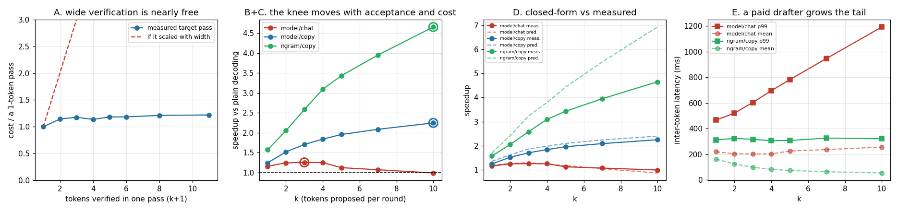

# Tune `k`

---

> `k` is how many tokens the drafter proposes per round — the one dial you control after the model pair is fixed. Sweeping `k ∈ {1,2,3,4,5,7,10}` three ways shows there is no single right answer: with the 0.5B [draft model](/shared/glossary/#draft-model) on chat the curve **peaks at k = 3 (1.25x) and falls to 0.99x at k = 10** — over-tuning turns speculation into a slowdown; on a copy-heavy edit where the draft is accepted **100%** of the time, the same drafter is still climbing at k = 10 (2.25x); and with the free n-gram drafter it climbs much faster to **4.66x**. A closed-form model built from three measured numbers picks the **correct optimal k in all three cases** — while over-predicting the free drafter's peak by 49%, because its errors are not independent. And the tail: raising k from 1 to 10 improves mean [ITL](/shared/glossary/#itl--tpot) by 4% and makes **p99 ITL 2.55x worse** with a paid drafter — but leaves p99 **flat within 7%** with a free one.

---

## Key Insight

Every extra proposed token has a falling chance of being accepted and a fixed cost. Somewhere those cross. Where they cross depends on your drafter and your workload — not on a number from a paper.

## Why This Matters

`k` (also called `num_speculative_tokens`) is usually a single config value applied to a whole fleet. This project shows the correct value differs by more than 3x across two routes on the *same model pair*, and that the wrong value can put you below 1.0x.

---

**This is project 26.**

### The words first

- **`k`** — tokens proposed per round. `γ` in Leviathan et al.
- **Knee** — the point on a curve where the returns stop being worth the cost. Named from the shape: the curve bends like a leg at the knee.
- **α (alpha)** — tokens emitted per target forward pass, always between 1 and `k+1`.
- **[ITL](/shared/glossary/#itl--tpot)** — inter-token latency, the gap a user sees between consecutive tokens.
- **p99** — the 99th [percentile](/shared/glossary/#percentile): the value 99% of samples fall below. It is the standard way to describe "the bad case that still happens often enough to matter".

### "If bigger k means more tokens per pass, why not set k = 50?"

Three separate brakes, and only the first is obvious.

1. **Falling acceptance.** Proposal *i* is only used if proposals 1…*i−1* were all accepted. If each has an independent chance `a`, the expected yield is `1 + a + a² + … + aᵏ`, which converges to `1/(1−a)` — at `a = 0.76`, that ceiling is **4.2 tokens**, no matter how large `k` gets. Extra proposals past that point are pure cost.
2. **Draft cost, which is linear and never stops.** Each proposal is one draft forward pass. Yield saturates; cost does not. At `k = 10` on this box the drafter consumed **73.9%** of the loop's time.
3. **Verification width, which grows slowly but really.** Section A measures it: 1.14x at width 2, 1.22x at width 11. Small — but it is what stops even a *free* drafter from wanting infinite `k`.

The whole project is measuring where those three brakes balance.

---

## Running it

```bash
python3 run.py           # ~4 minutes on 6 CPU threads
python3 run.py --plot    # redraw from the committed findings.json
```

Needs `torch`, `transformers`, `matplotlib`. Imports [`speclib.py`](../23-greedy-speculative-decoding/speclib.py) from [project 23](../23-greedy-speculative-decoding/README.md).

**One measurement choice worth explaining.** Speed is reported as **tokens per second**, not "seconds for 48 tokens". A round emits up to `k+1` tokens, so a loop that stops at "48 or more" overshoots — at `k = 10` by up to 10 tokens, a fifth of the generation. Charging that overshoot against large `k` would invent a penalty that a real request (hundreds of tokens) never pays. Steady-state throughput is the honest measure.

> **About the numbers.** Everything below comes from the committed
> [`outputs/findings.json`](outputs/findings.json).



---

## A. Is a wide verification pass really almost free?

The claim the whole technique rests on. Measured directly: one target forward pass over `w` tokens, timed round-robin against a 1-token pass, minimum of 3 rounds.

| width (k+1) | 1 | 2 | 3 | 4 | 5 | 6 | 8 | 11 |
|---|---|---|---|---|---|---|---|---|
| ms | 249.5 | 285.3 | 293.6 | 283.7 | 295.0 | 295.3 | 302.2 | 304.5 |
| vs 1 token | 1.000 | 1.144 | 1.177 | 1.137 | 1.182 | 1.184 | 1.212 | **1.220** |

**Eleven times the arithmetic for 1.22x the time.** The jump from 1 to 2 tokens (+14%) is bigger than the entire climb from 2 to 11 (+7%), and the wobble in between (1.177 at width 3, 1.137 at width 4) is measurement noise larger than the trend.

Why: at [batch](/shared/glossary/#batch) size 1 a decode step is dominated by *reading the weights out of memory*, not by multiplying them. That read happens once per pass regardless of width. What actually grows with width is the attention score matrix and the `lm_head` projection, both small relative to the weight read.

This is the whole reason speculation exists. If verification scaled with width — the red dashed line in the figure — checking `k` guesses would cost exactly as much as generating them and there would be nothing to gain.

The measured draft pass is **84.1 ms** against the target's 249.5 ms, so `cost_ratio = 0.337`. That number drives everything below.

## B. The 0.5B draft model on chat: a real knee at k = 3

The draft is imperfect here — per-position acceptance sits around 0.76–0.80 regardless of `k`, exactly as [project 23](../23-greedy-speculative-decoding/README.md) section B predicted it would.

| k | 1 | 2 | **3** | 4 | 5 | 7 | 10 |
|---|---|---|---|---|---|---|---|
| α (tokens/pass) | 1.81 | 2.38 | 2.83 | 3.25 | 3.31 | 3.93 | 4.67 |
| acceptance | 0.78 | 0.76 | 0.78 | 0.76 | 0.77 | 0.80 | 0.78 |
| tokens/s | 4.64 | 4.99 | **5.03** | 5.02 | 4.50 | 4.30 | 3.97 |
| speedup | 1.16x | 1.24x | **1.25x** | 1.25x | 1.12x | 1.07x | **0.99x** |
| drafting's share of time | 25.3% | 38.0% | 47.7% | 54.2% | 59.3% | 66.5% | **73.9%** |

Read the last two rows together. α is still *rising* at k = 10 — 4.67 tokens per pass, more than twice what k = 1 achieves — and the speedup has nonetheless fallen below **1.0**. More tokens per pass, less throughput.

The reason is in the bottom row: at k = 10 the loop spends three quarters of its time running the draft model. You are paying for ten guesses to harvest 4.67 tokens, when the acceptance ceiling `1/(1−0.76) = 4.2` says guesses past the fifth are almost never reached.

**The practical warning:** α going up is not evidence that your tuning is working. It goes up monotonically with `k` by construction. Tune on throughput.

## C. The same dial, two other settings

### C1 — the draft is perfect (copy-heavy edit, same 0.5B model)

| k | 1 | 2 | 3 | 4 | 5 | 7 | **10** |
|---|---|---|---|---|---|---|---|
| acceptance | 1.00 | 1.00 | 1.00 | 1.00 | 1.00 | 1.00 | 1.00 |
| α | 2.04 | 3.06 | 4.08 | 5.10 | 6.12 | 8.17 | **11.20** |
| speedup | 1.24x | 1.52x | 1.70x | 1.84x | 1.96x | 2.09x | **2.25x** |

Acceptance is 1.000 at every `k` — the small model reproduces a copy task perfectly — so α is exactly `k+1` and brake #1 never engages. The curve is still climbing at k = 10, flattening only because of draft cost. The theoretical ceiling here is `1/cost_ratio = 2.97x`: even with a perfect drafter, spending 0.337 of a target pass per proposal caps you at about 3x.

**Same model pair, same `k` dial, and the best setting is 3 on one route and ≥10 on another.** A single fleet-wide `num_speculative_tokens` is leaving money on the table in one direction or losing it in the other.

### C2 — the drafter is free (n-gram lookup, same copy task)

| k | 1 | 2 | 3 | 4 | 5 | 7 | **10** |
|---|---|---|---|---|---|---|---|
| acceptance | 0.91 | 0.90 | 0.94 | 0.95 | 0.95 | 0.95 | 0.95 |
| α | 1.81 | 2.40 | 3.00 | 3.57 | 3.92 | 4.58 | **5.33** |
| speedup | 1.57x | 2.05x | 2.58x | 3.09x | 3.43x | 3.95x | **4.66x** |
| drafting's share of time | 0.01% | 0.01% | 0.01% | 0.02% | 0.02% | 0.02% | **0.02%** |

Note this beats C1 at every single `k`, despite **lower** α at every single `k` (5.33 vs 11.20 at k = 10) and lower acceptance. Brake #2 is simply gone. The only thing left slowing it down is verification width — which section A measured at 1.22x — so the curve keeps climbing.

**The rule that falls out:** how far you should push `k` is set by how much the drafter costs, not by how good it is. Free drafter → push `k` until verification width bites. Paid drafter → stop early, and stop *much* earlier when acceptance is imperfect.

## D. A closed-form model picks the right `k` in all three cases

From three measured numbers — per-position acceptance `a`, the measured width cost curve, and `cost_ratio` — predict:

```
                       1 + a + a² + … + aᵏ
    speedup(k)  ≈  ─────────────────────────────
                   width_cost(k+1)  +  k · cost_ratio
```

The numerator is the expected tokens per round *if* each position is accepted independently with probability `a`. The denominator is what a round costs, in units of one 1-token target pass.

| sweep | `a` (at k=4) | cost_ratio | predicted best k | measured best k | predicted peak | measured peak |
|---|---|---|---|---|---|---|
| model / chat | 0.76 | 0.337 | **3** | **3** | 1.29x | 1.25x |
| model / copy_edit | 1.00 | 0.337 | **10** | **10** | 2.40x | 2.25x |
| n-gram / copy_edit | 0.95 | 0.000 | **10** | **10** | 6.93x | 4.66x |

**The argmax is right every time**, which is the only thing you need it for — you are choosing a config value, not forecasting a number.

**The magnitude is right twice out of three,** and the miss is instructive. For the n-gram drafter the model predicts α = 8.46 at k = 10 where the truth is 5.33 (a 49% over-prediction of the peak). The independence assumption fails, in two ways that both push the same direction:

- **Correlated errors.** When the lookup lands on the *wrong* earlier occurrence of a phrase, every token after it is wrong too. A model drafter degrades gracefully; a copier is either in the right place or in the wrong place.
- **Refusals.** When no match exists the drafter proposes *nothing* — the round yields exactly one token, which the geometric formula has no way to represent.

So: trust the closed form to choose `k`, do not trust it to promise a speedup. And be suspicious of it specifically for retrieval-style drafters, where "accepted with probability `a`, independently" is not what is happening.

## E. The tail moves in the opposite direction from the mean

Speculation delivers tokens in **bursts**: nothing arrives for a whole round, then several tokens land at once. So one round of duration `d` yielding `n` tokens produces one gap of `d` and `n−1` gaps of about zero. Averaging them gives the familiar mean ITL; the tail is where `k` shows up.

| k | 1 | 2 | 3 | 4 | 5 | 7 | 10 |
|---|---|---|---|---|---|---|---|
| **model / chat** — mean ITL | 220 ms | 205 ms | **203 ms** | 203 ms | 227 ms | 237 ms | 257 ms |
| **model / chat** — p99 ITL | **467 ms** | 521 ms | 604 ms | 696 ms | 782 ms | 947 ms | **1192 ms** |
| **n-gram / copy** — mean ITL | 164 ms | 125 ms | 99 ms | 83 ms | 75 ms | 65 ms | **55 ms** |
| **n-gram / copy** — p99 ITL | 313 ms | 324 ms | 317 ms | **307 ms** | 308 ms | 327 ms | 322 ms |

Two contrasting stories in one table.

**With a paid drafter, `k` buys mean latency with tail latency.** Mean ITL improves by 8% between k = 1 and k = 3 and then gets worse; p99 gets monotonically worse the whole way, **2.55x** from k = 1 to k = 10. A round at k = 10 costs ten draft passes plus a verify pass before it emits anything, so a user watching the stream sees a **1.2-second freeze** followed by a burst. Users experience the freeze, not the average.

**With a free drafter, the tail is flat.** p99 stays within 7% across the whole sweep (307–327 ms) while mean ITL falls 3.0x. A round costs one verification pass whatever `k` is, so the freeze does not grow.

This is a strong argument for zero-cost drafters that has nothing to do with throughput: **they are the only ones you can tune aggressively without hurting the streaming experience.** If you must use a paid drafter under an ITL p99 [SLO](/shared/glossary/#slo), the `k` your SLO permits may be well below the `k` your throughput wants — and [project 28](../28-speculation-batching/README.md) shows the same tension appearing again once other requests are sharing the batch.

---

## What to take away

1. **There is no fleet-wide right `k`.** Best was 3 on chat and ≥10 on a copy task, with the *same* model pair.
2. **α rising is not progress.** It rises with `k` by construction. At k = 10 on chat, α was 2.6x the k = 1 value and throughput was **worse than not speculating at all**.
3. **Acceptance sets a hard ceiling on yield: `1/(1−a)`.** At `a = 0.76` that is 4.2 tokens, so proposals past ~5 are almost never reached and are pure cost.
4. **Verification width is nearly free — 1.22x for 11 tokens** — which is why the technique works, and why even a free drafter eventually stops improving.
5. **Draft cost decides how far to push `k`; draft quality decides how high the curve goes.** The free drafter beat the perfect one at every `k` despite lower α throughout.
6. **The closed form picks the right `k` and over-promises the payoff,** badly so for lookup-style drafters whose failures are correlated.
7. **Tune `k` against your p99, not your mean.** With a paid drafter, k = 10 made mean ITL 17% worse and p99 **2.55x** worse; with a free one, p99 did not move at all.

## Next

- [Project 27 — Medusa heads](../27-medusa-heads/README.md): make the drafter nearly free *without* needing text to copy from.
- [Project 28 — speculation + batching](../28-speculation-batching/README.md): `k` interacts with batch composition, and the tail problem gets worse.
- [Project 29 — workload sensitivity](../29-workload-sensitivity/README.md): the systematic version of "the right setting depends on the route".

## Resources

- [Leviathan, Kalman, Matias — *Fast Inference from Transformers via Speculative Decoding* (2022)](https://arxiv.org/abs/2211.17192) — section 3.2 derives the `1 + a + … + aᵏ` yield and the optimal `γ`
- [vLLM speculative-decoding docs](https://docs.vllm.ai/en/latest/features/spec_decode.html) — `num_speculative_tokens` is this project's `k`
- [Inference-systems Phase 4](../../README.md#phase-4-speculative-decoding)
