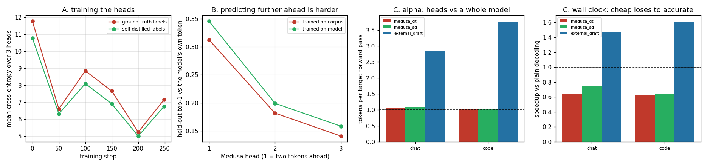

# Medusa Heads

---

> Instead of running a second model to guess ahead, bolt extra prediction heads onto the target itself: the base head answers "what is the next token?", a [Medusa](/shared/glossary/#eagle--medusa) head answers "what is the token *after* that?", reading the same hidden state the target already computed. This project trains three real heads on Qwen2.5-1.5B in **3.4 minutes** on a CPU and measures both halves of the trade. The mechanism works exactly as advertised on cost: **all three heads together cost 102 ms against 240 ms for the three 0.5B draft passes they replace — 2.35x cheaper per draft token.** The honest inversion is on the other half. The guide says self-speculation gives "much higher acceptance rates"; at this training budget it gives **0.064** against the external draft's **0.780**, and the heads run at **0.74x** — slower than not speculating. A probe isolates why: the heads score **0.35** top-1 on held-out text of the kind they were trained on and **0.067** on an actual chat reply, a **5.2x** train/serve gap — and that probe number matches the in-loop acceptance to within 0.003, so the loop is right and the heads are simply weak. The break-even arithmetic says they would need acceptance **0.565** to tie; Medusa's published head-1 accuracy is around 0.6. **The technique is sound; a three-minute training budget is not.** Self-distilled labels beat corpus labels by **10.6%** on the metric that matters, for free.

---

## Key Insight

Self-speculation removes the second model, which removes almost all of the drafting cost. It does not remove the need for the drafter to be *good* — and a head trained for minutes is competing with a 0.5B model pretrained on trillions of tokens.

## Why This Matters

Every deployed speculative system eventually asks "can we drop the draft model?". The answer is arithmetic, and this project sets up that arithmetic with measured numbers on both sides: what a head costs, what it must achieve, and how far a small training budget actually gets you.

---

**This is project 27.**

### The words first

- **[Medusa](/shared/glossary/#eagle--medusa)** — named after the mythological figure with many heads. One model, many prediction heads.
- **Head** — a small output layer that maps the model's internal state to a distribution over tokens. Your model already has exactly one (the `lm_head`); Medusa adds more, aimed further ahead.
- **Self-speculation** — the drafter is part of the target model, so there is no second checkpoint, no second [KV cache](/shared/glossary/#kv-cache), and no possibility of the two disagreeing about what token id 9707 means.
- **Hidden state** (`h`) — the vector at the end of the transformer stack, one per position, just before the output projection. It is what the base head reads, and what a Medusa head reads too.
- **Residual block** — `h + W₂·SiLU(W₁·h)`. Called *residual* because it adds a correction to `h` rather than replacing it, so a zero-initialised `W₂` makes the block start out as "do nothing".
- **Self-distillation** — training on labels produced by the model itself rather than by a corpus. *Distillation* because the student is being poured a copy of the teacher's own behaviour; *self* because teacher and student are the same network.

### "The model already predicts the next token. What does a second head add?"

The base head predicts the token at position *t+1* from `h_t`. A Medusa head predicts the token at *t+2* from the **same** `h_t`. That is a genuinely different question, and it cannot be answered by running the base head twice — running it twice would require knowing the token at *t+1* first, which is the serial dependency the whole exercise exists to break.

So the heads fill a specific gap: **several plausible tokens at once, from one forward pass, without a second model.** Compare the three drafters this phase has now built:

| drafter | where the guess comes from | cost per draft token (measured) |
|---|---|---|
| external model ([project 23](../23-greedy-speculative-decoding/README.md)) | a whole separate 0.5B network | 80.0 ms = **0.339** of a target pass |
| n-gram lookup ([project 25](../25-n-gram-lookup/README.md)) | a string search over text already written | ~0 |
| **Medusa heads** (here) | extra output layers on the target | 34.0 ms = **0.144** of a target pass |

Medusa sits between the two, and unlike the n-gram drafter it works when there is nothing to copy.

### "Why tie the heads to the model's existing output projection?"

Real Medusa gives each head its **own** output projection. We reuse the frozen one, and the reason is arithmetic you can check:

| | parameters |
|---|---|
| three independent output projections (1536 × 151,936 × 3) | **700,121,088** |
| three residual blocks sharing the frozen projection | **14,155,776** |

That is a **49x** difference, and the larger version is a bigger training job than the 1.5B model itself. On a CPU with a three-minute budget it is not a choice.

What the sharing costs: the head can only produce vectors that the *existing* projection knows how to turn into tokens — it must express "the token after next" in the same embedding space the model already uses for "the next token". That is a real restriction, and it is part of why our heads underperform published numbers. It is also why `W₂` starts at **zero**: with `W₂ = 0` the block is the identity and each head is an exact copy of the base next-token head, so training only has to learn the *shift* from "next" to "the one after", not a distribution from scratch.

### The loop is different, and it has one trap

```
   ordinary speculation          self-speculation
   ────────────────────          ─────────────────
   draft model runs FIRST        heads need h from the target's LAST pass,
   (it needs no target output)   so drafting is downstream of verification
```

Each round reuses the hidden state produced by the previous round's verification pass — and it must be the one at the last **accepted** position. The hidden states computed for *rejected* draft tokens were conditioned on tokens that no longer exist; using one of them silently corrupts every subsequent proposal without ever raising an error. In `medusa.py` that is the line `h_use = hh[n_acc]`.

---

## Running it

```bash
python3 run.py           # ~8 minutes on 6 CPU threads
python3 run.py --plot    # redraw from the committed findings.json
```

Needs `torch`, `transformers`, `matplotlib`. Imports [`speclib.py`](../23-greedy-speculative-decoding/speclib.py) from [project 23](../23-greedy-speculative-decoding/README.md).

The trained weights are **not** committed: three heads × two matrices × 1536² in fp32 is 56 MB per label set, which does not belong in a teaching repository. `run.py` retrains them in about 3.4 minutes.

> **About the numbers.** Everything below comes from the committed
> [`outputs/findings.json`](outputs/findings.json).



---

## A. Training the heads

One pass of the frozen target over 16,450 positions of wikitext (132 s) yields everything training needs — hidden states, and **two** label sets for free:

- **ground-truth labels** — the next token the corpus actually contains (the Medusa-1 recipe)
- **self-distilled labels** — the next token the *model* would emit at that position, which is just the argmax of logits we computed anyway (the Medusa-2 idea, without any generation)

The two disagree **53.8% of the time** — the model's own next token matches the corpus only 46.2% of the time. That disagreement is the whole reason the ablation is worth running.

One detail that matters more than it looks: each passage is wrapped in the model's **chat template**, as an assistant turn. Without it the heads learn to continue raw encyclopedia prose and are then asked, at serving time, to predict tokens inside a chat reply. It costs nothing to fix and section C shows the residual gap is still the dominant error.

Training: 250 steps, batch 24, AdamW at 1e-3, about 105 s per label set.

| step | 0 | 50 | 100 | 150 | 200 | 249 |
|---|---|---|---|---|---|---|
| loss (ground-truth labels) | 11.77 | 6.60 | 8.85 | 7.66 | 5.24 | 7.16 |
| loss (self-distilled labels) | 10.78 | 6.32 | 8.10 | 6.90 | 5.01 | 6.77 |

The curve is **violently noisy**, and that is not a bug to hide: with a 151,936-entry vocabulary and a batch of 24, a single step's loss is dominated by whether those 24 positions happened to be easy. It starts near `ln(151936) = 11.93` (a uniform guess) as the zero-initialised `W₂` guarantees, and the self-distilled run sits below the ground-truth run throughout — the model's own tokens are, unsurprisingly, easier for the model to predict than a human's.

## B. Held-out accuracy: the ablation, and the decay

Top-1 accuracy on 512 held-out positions:

| | head 1 (2 ahead) | head 2 (3 ahead) | head 3 (4 ahead) |
|---|---|---|---|
| trained on corpus, scored against **corpus** | **0.330** | **0.211** | **0.186** |
| trained on model, scored against corpus | 0.244 | 0.127 | 0.109 |
| trained on corpus, scored against **the model's own tokens** | 0.313 | 0.182 | 0.141 |
| trained on model, scored against **the model's own tokens** | **0.346** | **0.199** | **0.158** |

**Each head set wins on its own label distribution.** That is the clean confirmation that the ablation did what it claims — nothing else in the setup changed.

**And the row that matters at serving time is the last one.** A drafter's job is to guess what *the target* will emit, not what a human wrote. On that metric self-distillation wins **0.346 vs 0.313 — 10.6% better** — for exactly zero extra compute, since both label sets came out of the same forward pass. If you build one of these, use the model's own tokens.

**The decay with distance is steep**: 0.35 → 0.20 → 0.16. Contrast [project 23](../23-greedy-speculative-decoding/README.md) section B, where the *external draft's* conditional acceptance did **not** decay with distance (0.78 → 0.71). The difference is structural. The draft model, having accepted position 1, actually consumes that token and re-conditions on it; every Medusa head reads the *same* hidden state and never learns what the earlier heads decided. Predicting four ahead from one vector really is harder than predicting one ahead, four times. (Tackling that is exactly what [tree speculation](/shared/glossary/#tree-speculation) and EAGLE's feature-level prediction are for.)

## C. In the real loop: the heads lose badly

`k = 3` for both drafters, 48 tokens, greedy.

| workload | drafter | acceptance | α | speedup | drafting's share of time |
|---|---|---|---|---|---|
| chat | Medusa (corpus labels) | 0.043 | 1.07 | 0.63x | 26.2% |
| chat | Medusa (self-distilled) | 0.064 | 1.09 | **0.74x** | 26.5% |
| chat | **0.5B external draft** | **0.780** | **2.83** | **1.47x** | 47.9% |
| code | Medusa (corpus labels) | 0.021 | 1.04 | 0.63x | 26.7% |
| code | Medusa (self-distilled) | 0.021 | 1.04 | 0.64x | 26.6% |
| code | **0.5B external draft** | **0.946** | **3.77** | **1.61x** | 48.9% |

All six runs produced text **token-identical** to plain decoding — the correctness guarantee is untouched by a bad drafter, exactly as [project 23](../23-greedy-speculative-decoding/README.md) section E showed with a random one.

**This directly contradicts the phase overview**, which says self-speculation gives "much higher acceptance rates" than an external draft. At this training budget it is 12x *lower*. The rest of this section is about establishing that the contradiction is real and locating it.

### Is the loop broken, or are the heads bad?

Those two failures look identical from an acceptance rate, so they need separating. The probe runs one teacher-forced pass over `prompt + answer` and asks directly: *would head i have named the token i+2 places ahead of this position?* No speculative loop involved.

| workload | head top-1 on this exact text | in-loop acceptance | 0.5B draft's top-1 agreement |
|---|---|---|---|
| chat | 0.067, 0.022, 0.000 | 0.064 | **0.771** |
| code | 0.022, 0.022, 0.022 | 0.021 | **0.917** |

**The probe and the loop agree to within 0.003.** The loop extracts exactly as much as the heads contain; there is no bug to find. And the same probe scores the external draft at 0.771 and 0.917, matching *its* measured acceptance (0.780, 0.946). One offline pass predicts both drafters correctly — which is the technique [project 29](../29-workload-sensitivity/README.md) builds on.

### Where the accuracy went

| head 1 top-1, measured on… | value |
|---|---|
| held-out text of the kind it was trained on | **0.346** |
| an actual chat reply from the target | **0.067** |

A **5.2x** drop. The heads did learn something real — 0.346 against a 151,936-way choice is roughly 52,000x better than chance — but they learned it about wikitext-shaped prose, and a chat answer is not that, even wrapped in the same template. This is the ordinary train/serve skew that every deployed model has, made unusually visible because the head is small enough to overfit its narrow slice.

Published Medusa trains on tens of thousands of real conversations, for hours, on GPUs. Ours trains on 16k tokens of encyclopedia text for 105 seconds. The gap between 0.067 and the ~0.6 in the paper is that difference, not a flaw in the idea.

## D. The cost side, where Medusa wins outright

| | measured | as a fraction of a target pass |
|---|---|---|
| one target forward pass | 235.9 ms | 1.000 |
| one 0.5B draft forward pass | 80.0 ms | **0.339** |
| all three Medusa heads together | 101.9 ms | 0.432 |
| **per draft token** (heads) | 34.0 ms | **0.144** |

**2.35x cheaper per draft token**, and that is the pessimistic end of the range. A Medusa head's cost is one output projection — `d_model × vocab` — which grows with the *hidden size*, while a whole draft model's cost grows with the target's full parameter count. Scale the target up and the gap widens fast.

### What acceptance would the heads need to tie?

Both drafters pay the same verification overhead, so it cancels and only the draft cost differs:

```
       α_medusa                α_external
   ─────────────────  =  ─────────────────────
   vo + k · c_medusa      vo + k · c_external
```

| deployment | Medusa cost/token | external cost/token | acceptance the heads need to tie |
|---|---|---|---|
| this box (1.5B target, 0.5B draft) | 0.144 | 0.339 | **0.565** |
| 7B target, 1B draft | 0.031 | 0.143 | 0.615 |
| 70B target, 1B draft | 0.003 | 0.014 | 0.754 |

Two non-obvious readings.

**The bar is around 0.6, and published Medusa clears it.** Our 0.064 does not come close, but the target is not far away — this is a training problem with a known solution, not a dead end.

**The bar goes *up* as the target gets bigger, not down.** That looks backwards until you see what is happening: on a 70B target the external draft is *already* nearly free (0.014 of a target pass), so removing the last 1.4% buys almost nothing and the heads have to win on accuracy alone. Medusa's real advantages at that scale are the ones this arithmetic does not price — no second checkpoint to version, no second set of weights in HBM, no separate [KV cache](/shared/glossary/#kv-cache) competing for the same memory, and no tokenizer-compatibility constraint on which draft model you may use.

## E. What this project does and does not prove

**Does prove.** The self-speculation mechanism is implementable in ~150 lines and correct: token-identical output, the rollback-to-the-accepted-hidden-state rule works, and the heads really do learn (0.346 top-1 against a 151,936-way choice). Drafting is 2.35x cheaper per token than a small external model. Self-distilled labels beat corpus labels by 10.6% for free. Accuracy decays sharply with distance, unlike an external draft's.

**Does not prove.** Nothing about Medusa's ceiling. The heads were trained for 105 seconds on 16k tokens of the wrong domain; the published recipe uses tens of thousands of conversations. The right conclusion from the 0.74x is "our heads are undertrained", which the probe establishes independently, and not "self-speculation does not work".

**If you wanted to close the gap** on hardware that could afford it, in order of expected value: train on the model's own generated replies rather than a corpus (the probe says this is worth ~5x by itself); give each head its own output projection instead of sharing the frozen one; train for hours rather than minutes; and add [tree speculation](/shared/glossary/#tree-speculation), which is where Medusa's published numbers actually come from — with heads this decayed, verifying several candidates per position matters more than it would for an external draft.

---

## What to take away

1. **Self-speculation is a cost win, not an accuracy win.** 2.35x cheaper per draft token, measured; the accuracy has to be trained in separately.
2. **A drafter competing with a pretrained model is competing with trillions of tokens.** Our heads saw 16,450 positions.
3. **Always run the offline probe.** It matched in-loop acceptance to 0.003 and turned "speculation is broken" into "the heads are undertrained" in one forward pass.
4. **Use self-distilled labels.** Free (same forward pass) and 10.6% better on the only metric that matters at serving time.
5. **Medusa heads decay with distance where an external draft does not** — every head reads the same hidden state and cannot see what the earlier heads chose.
6. **Compute the break-even acceptance before you build.** 0.565 here; published Medusa is around 0.6; our heads reached 0.064.
7. **The bar rises with target size.** On a 70B target the external draft is already almost free, so Medusa's case there rests on memory and operational simplicity, not on the speedup arithmetic.

## Next

- [Project 28 — speculation + batching](../28-speculation-batching/README.md): what happens to all of this once other requests share the forward pass.
- [Project 29 — workload sensitivity](../29-workload-sensitivity/README.md): the offline probe from section C, turned into a deployment tool.

## Resources

- [Cai et al. — *Medusa: Simple LLM Inference Acceleration Framework with Multiple Decoding Heads* (2024)](https://arxiv.org/abs/2401.10774) — sections 3.1 (the heads) and 3.2 (tree attention)
- [Li et al. — *EAGLE: Speculative Sampling Requires Rethinking Feature Uncertainty* (2024)](https://arxiv.org/abs/2401.15077) — predicts the feature vector instead of the token
- [Medusa reference implementation](https://github.com/FasterDecoding/Medusa)
- [Inference-systems Phase 4](../../README.md#phase-4-speculative-decoding)
