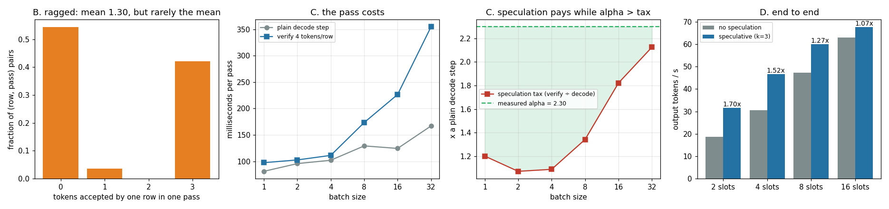

# Speculation + Batching

---

> Projects 23–27 ran one sequence at a time. A real server runs dozens, and speculation changes the shape of every forward pass: the batch now carries `k+1` query tokens **per row**, and after verification every row has advanced by a **different** amount. This project adds speculation to Phase 3's [continuous-batching](/shared/glossary/#continuous-batching) engine and finds the fact that decides whether you ship it. Speculation spends *spare* compute, and a bigger batch has less spare compute: verifying 4 tokens per row costs **1.07x** a plain [decode](/shared/glossary/#decode) step at batch 2 and **2.13x** at batch 32. With α held **exactly constant at 2.30** across every configuration — the same 16 requests, the same drafter — end-to-end speedup falls from **1.70x at 2 slots to 1.07x at 16**. Nothing about the drafter changed; only the price of the pass did. Raggedness is extreme: the per-row accepted count is **54% zeros and 42% full**, and **45.6%** of proposals are padding for rows that had nothing to say. And the tempting shortcut — advance every row by the batch minimum so the rows stay aligned — is correct (byte-identical output) but throws away **520 already-verified tokens**, more than it produces, for a **1.13x** throughput loss.

---

## Key Insight

Speculation converts idle memory-bandwidth time into work. [Batching](/shared/glossary/#batching) converts the same idle time into work. They compete for one resource, and the batch usually wins.

## Why This Matters

Almost every published speculative-decoding speedup is measured at batch size 1. Production runs at batch 32 or more. This project measures the gap, and it is the difference between "ship it" and "turn it off above a load threshold" — which is exactly what production engines do.

---

**This is project 28.**

### The words first

- **Ragged** — rows of a batch at different lengths. A rectangle of numbers with a different amount of real data in each row. Here it happens *within one step*, because row 3 may accept 3 drafts while row 4 accepts none.
- **Speculation tax** — what one verification pass costs relative to one plain decode step, at the same batch size. Speculation pays off exactly while `α > tax`.
- **Slot** — one request's reserved lane in the [KV cache](/shared/glossary/#kv-cache), from Phase 3's `SlotKV`. `n_slots` is the batch width.
- **Rollback** — undoing the cache writes for a rejected token. In a slot pool this is free: a slot's length is a number in the scheduler, so un-accepting three tokens is `lengths[i] -= 3`. The stale keys stay in the pool and are masked out.

### "Speculation was worth 3x on its own. Why would batching change that?"

Because they are two ways of spending the same idle resource, and only one of them can spend it.

At batch size 1, a decode step is almost entirely *waiting*: the accelerator reads the whole model out of memory to multiply it by a single row of numbers. The arithmetic units are nearly idle. Speculation fills that idle time — checking 4 tokens instead of 1 reads the same weights once and does 4x the (tiny) arithmetic, so it is nearly free.

At batch size 32, the same weight read is already being amortised across 32 rows. The arithmetic units are much busier, and the marginal token now costs real time. Verifying `k+1` tokens per row means `32 × 4 = 128` token-slots of arithmetic instead of 32 — and that is no longer hiding in the shadow of a memory read.

```
   batch 1                          batch 32
   ┌──────────────────────────┐     ┌──────────────────────────┐
   │ read weights   ████████  │     │ read weights   ████████  │
   │ arithmetic     ▓         │     │ arithmetic     ▓▓▓▓▓▓▓   │
   └──────────────────────────┘     └──────────────────────────┘
     lots of room to add work         very little room left
```

Section C puts the number on it: the tax is **1.07x** at batch 2 and **2.13x** at batch 32.

### "Phase 3 already has a batched engine. What is actually new?"

Two things, and only two. `specbatch.py` is 120 lines because Phase 3's `batchlib.py` built the hard part already:

| | `batchlib.SlotKV` (Phase 3) | `specbatch.SpecSlotKV` (here) |
|---|---|---|
| decode write | one token per row, at that row's position | **`k+1` tokens per row, each at its own position** |
| positions | `(B,)` — one per row | **`(B, T)`** |
| mask | causal AND ownership, from per-row lengths | **unchanged — already correct** |

The mask needed no work at all, because Phase 3 built it from *per-row* positions rather than one shared `seq_len`. That decision, made for continuous batching, is exactly what a multi-token query block needs. The KV write did need work: `write_rows` indexes with a `(B,)` position vector because a decode step advances every row by one; here row 3 might write positions 41–44 while row 4 writes 300–303, so the index has to be two-dimensional.

And **rollback needed no code**. A rejected token's keys and values sit in the pool, past the row's recorded length, and the ownership condition (`col >= kv_len`) already hides them. That is precisely how a production paged engine handles rejection: the blocks stay allocated, the sequence-length field moves back.

---

## Running it

```bash
python3 run.py           # ~3 minutes on 6 CPU threads
python3 run.py --plot    # redraw from the committed findings.json
```

Needs `torch`, `transformers`, `matplotlib`. Imports [`batchlib.py`](../16-static-vs-continuous/batchlib.py) from [project 16](../16-static-vs-continuous/README.md). Model Qwen2.5-**0.5B**-Instruct (Phase 3's batched engine), `k = 3`, 32 tokens per request, prompt-lookup drafting from [project 25](../25-n-gram-lookup/README.md).

**Why prompt lookup and not a draft model here.** Running a second *model* inside a batched engine means a second batched engine, a second slot pool, and a second scheduler — and the question this project asks is about batch mechanics, not about drafters. A zero-cost drafter isolates the batching effect: any change in speedup across batch sizes is the *pass*, not the drafting.

**Why the workload is deliberately copy-heavy.** Prompt lookup proposes nothing when there is nothing to copy, α collapses to 1.0, and there is no raggedness left to study. All four prompts are edit/echo tasks of differing difficulty, so the rows accept *different* amounts — which is the thing section B exists to measure.

Time is **virtual**: the clock advances by the measured duration of each forward pass, never by `time.time()`. On a shared machine that is the only way two configurations minutes apart can be compared.

> **About the numbers.** Everything below comes from the committed
> [`outputs/findings.json`](outputs/findings.json).



---

## A. A speculative batch must not change any row

Four prompts (94, 87, 51 and 64 tokens), decoded three ways: alone, in an ordinary batch of 4, and in a speculative batch of 4.

| row | batched == solo | speculative == solo |
|---|---|---|
| 0 (paragraph edit) | **yes** | **yes** |
| 1 (code edit) | **yes** | **yes** |
| 2 (list repeat) | **yes** | **yes** |
| 3 (JSON echo) | **yes** | **yes** |

Real text, e.g. row 0:

> "The Antikythera mechanism is an ancient **Hellenic** hand-powered device t…"

This test is doing more work than it looks. Batched speculation has three ways to be silently wrong, and none of them raises an exception:

- **A row reading another row's drafts.** All rows write into one pool in the same pass. If the position index is off by a row, row 3 attends to row 4's rejected guesses.
- **A row reading its own rejected drafts.** Rollback is "move the length back", so anything that recomputes `kv_len` from the wrong variable resurrects tokens that were thrown away.
- **The block's first column.** Every row's block starts with a token *already in the cache*, re-run so that the pass produces a prediction at the position right after the last accepted token — the [bonus token](/shared/glossary/#bonus-token). Drop it and the loop still runs, still produces fluent text, and quietly loses one token per round.

## B. How ragged is it?

One speculative batch of 4, 21 verification passes, 171 proposals:

| tokens accepted by one row in one pass | 0 | 1 | 2 | 3 |
|---|---|---|---|---|
| fraction of (row, pass) pairs | **0.544** | 0.035 | 0.000 | **0.421** |

**96.5% of the mass is at the two extremes.** The mean, 1.30, describes almost no actual (row, pass) pair. This is [project 23](../23-greedy-speculative-decoding/README.md)'s U-shaped histogram again, now happening *across rows within a single forward pass* — which is what "ragged" means here and why the engine cannot assume anything about how far the batch advanced.

Two waste numbers fall out:

- **45.6% of proposals were padding.** A batch must be a rectangle, so a row whose lookup found no match still occupies `k` query columns. Those columns are verified like any other and are guaranteed to be rejected (a pad token never matches), so they cost time and can never produce a token.
- **57.5% of verified token-slots became output tokens.** The other 42.5% is padding plus genuinely rejected drafts.

That second number is the one to carry into capacity planning. Speculation does not make a batch *smaller*; it makes it wider and hopes the width pays for itself. On this workload, at batch 4, it did: **1.36x** (28.5 → 38.6 tokens/s).

## C. The scaling law: what a verification pass costs

Measured directly — one plain decode step against one 4-token-per-row verification pass, at the same batch size, timed round-robin, minimum of 3:

| batch | 1 | 2 | 4 | 8 | 16 | 32 |
|---|---|---|---|---|---|---|
| plain decode step | 81.1 ms | 95.7 ms | 102.1 ms | 129.2 ms | 124.4 ms | 167.0 ms |
| verify 4 tokens/row | 97.4 ms | 102.6 ms | 111.3 ms | 173.5 ms | 226.7 ms | 355.0 ms |
| **speculation tax** | 1.20x | **1.07x** | 1.09x | 1.34x | 1.82x | **2.13x** |

Read the two rows separately and the mechanism is obvious.

**The plain decode step barely grows**: 81 ms at batch 1 to 167 ms at batch 32 — 32x the rows for 2.1x the time. That is the whole reason batching works; the weight read is shared.

**The verification pass grows much faster**: 97 ms to 355 ms, 3.6x. It carries `4 × batch` token-slots, and past some width that arithmetic stops hiding behind the memory read.

The tax is therefore **U-shaped**, with its minimum around batch 2–4. At batch 1 there is a fixed per-pass overhead that a 4-token block cannot amortise; from batch 8 onward, arithmetic takes over and the tax climbs steadily.

**The decision rule**: speculation pays exactly while `α > tax`. With α = 2.30 on this workload, the crossover is somewhere above batch 32 (tax 2.13) — the green region in the figure. A better drafter raises α and pushes the crossover right; a bigger `k` raises the tax and pulls it left.

## D. End to end, with α held fixed

The same 16 requests through servers of different widths. A narrow server just takes more waves — so the *workload* is identical everywhere and only the batch width changes.

| slots | no speculation | speculative (k=3) | speedup | α | tax at this batch | decode passes |
|---|---|---|---|---|---|---|
| 2 | 18.6 tok/s | 31.6 tok/s | **1.70x** | 2.30 | 1.07x | 248 → 117 |
| 4 | 30.6 tok/s | 46.6 tok/s | **1.52x** | 2.30 | 1.09x | 124 → 67 |
| 8 | 47.3 tok/s | 60.0 tok/s | **1.27x** | 2.30 | 1.34x | 62 → 41 |
| 16 | 63.0 tok/s | 67.7 tok/s | **1.07x** | 2.30 | 1.82x | 31 → 21 |

**α is 2.298 in every single row.** Same requests, same drafter, same acceptance — the drafter is doing exactly as well at 16 slots as at 2. The speedup still collapses from 1.70x to 1.07x. **Nothing about the speculation got worse; the pass got more expensive.** That is the cleanest possible statement of the result, and it is only possible because the workload was held fixed.

Reading it as an engineer: the two columns you can control are `α` (better drafter, bigger `k`) and `tax` (smaller `k`, narrower batch). The α/tax quotient predicts the direction correctly at every width, and runs about 25% optimistic in magnitude — 2.30/1.34 = 1.72 predicted against 1.27 measured at 8 slots — because the tax was measured at a 64-token context while the real runs sit at 150–250 tokens, and because the end-to-end number also carries prefill.

**And notice the absolute numbers.** The *fastest* configuration in the table is 16 slots with speculation (67.7 tok/s), and the *second* fastest is 16 slots without it (63.0). Speculation never made anything slower here — it just stopped mattering. The right operational conclusion is not "turn speculation off", it is "do not count on it under load, and do not let it push you to a narrower batch." A 2-slot speculative server (31.6 tok/s) is less than half as fast as a 16-slot plain one.

## E. The shortcut that keeps the rows aligned

Ragged rows are annoying. The obvious simplification is to advance every row by the *minimum* number of tokens any row accepted, so the batch stays rectangular and every row is at the same position. It is perfectly **correct** — you are just declining to keep tokens you already verified.

| | ragged (correct) | synced (aligned) |
|---|---|---|
| throughput | **59.5 tok/s** | 52.5 tok/s (**1.13x worse**) |
| decode passes | 41 | 44 |
| accepted tokens kept | 296 | **144** |
| accepted tokens **thrown away** | 0 | **520** |
| output identical? | — | **yes** |

The shortcut discarded **520** correctly-verified tokens — more than the 512 tokens the run produced, and **78%** of every draft it ever got right.

The throughput loss is only 1.13x, and the reason is worth understanding rather than glossing: most of the output was coming from the free [bonus token](/shared/glossary/#bonus-token) anyway (352 of the synced run's ~496 tokens). Sync cannot take the bonus token away — every row gets one per pass regardless — so it only destroys the *accepted* half of the yield. **The penalty therefore scales with α**: at α = 2.30 it costs 13%; with a drafter at α = 4 it would cost far more, because a larger share of the yield would be sitting in the part sync throws out.

The structural point is the familiar one from [project 16](../16-static-vs-continuous/README.md), one level down. Static batching makes the whole batch wait for its slowest *request*; syncing acceptance makes every row advance at the speed of the batch's *unluckiest row this step*. Same disease, same cure: let each row move at its own pace, and pay for it with per-row bookkeeping.

---

## What to take away

1. **Speculation and batching compete for the same idle resource.** The tax on a 4-token-per-row pass goes 1.07x at batch 2 → 2.13x at batch 32.
2. **The speedup collapses with batch width even when the drafter is unchanged.** α was 2.298 at every width; the speedup went 1.70x → 1.07x.
3. **Ship the decision rule, not the number.** Speculate while `α > tax`; measure both on your own hardware, at your own batch sizes.
4. **Benchmark numbers at batch 1 are not deployment numbers.** Most published speculative speedups are single-stream.
5. **Raggedness is extreme, not merely present.** 54% of rows accept nothing and 42% accept everything; the mean describes nobody.
6. **A rectangular batch makes speculation pay for silence.** 45.6% of proposals here were padding for rows with nothing to propose — a drafter that can decline needs a batch layout that lets it.
7. **Do not sync the rows to keep the batch tidy.** Correct, and it threw away 78% of every draft it got right for a 1.13x throughput loss that grows with α.
8. **Rollback in a slot pool is free.** Un-accepting three tokens is `lengths[i] -= 3`; the ownership mask already hides the stale keys.

## Next

- [Project 29 — workload sensitivity](../29-workload-sensitivity/README.md): the last variable, and the one you control least — what your users are asking for.

## Resources

- [Leviathan, Kalman, Matias — *Fast Inference from Transformers via Speculative Decoding* (2022)](https://arxiv.org/abs/2211.17192)
- [vLLM speculative-decoding docs](https://docs.vllm.ai/en/latest/features/spec_decode.html) — see the note about disabling speculation under high load
- [Inference-systems Phase 3](../../README.md#phase-3-batching-and-scheduling) — the batching engine this builds on
- [Inference-systems Phase 4](../../README.md#phase-4-speculative-decoding)
