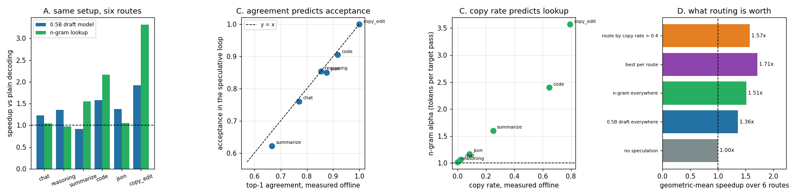

# Workload Sensitivity

---

> The same model pair, the same `k`, the same code — six routes, and speedups from **0.92x to 3.31x**. This project measures the spread and then explains it with two numbers you can compute **offline, from logs, without touching the serving path**. One teacher-forced pass over text the model has already produced gives the draft model's top-1 agreement, which predicts its [acceptance rate](/shared/glossary/#acceptance-rate) with correlation **+0.996** and a mean absolute error of **0.015** — the offline number and the in-loop number are the same number. A "copy rate" from the same pass predicts the n-gram drafter's α at **+0.970**. Target entropy predicts model acceptance at **−0.971**: **predictable text is fast text.** And the payoff is real: picking the drafter per route beats the best single fleet-wide setting **1.72x vs 1.51x** geometric mean, and turns a **0.92x regression** on summarization into a **1.55x** win. The routing rule is one threshold on copy rate — but the obvious threshold (0.4) is wrong, keeps the regression, and gives away half the gain; **0.1–0.2 matches the oracle exactly**.

---

## Key Insight

Speculative speedup is not a property of your system. It is a property of your **traffic**, and it varies by more than 3x across ordinary routes on the same deployment.

## Why This Matters

"Speculative decoding gives us 2x" is not a quotable number for a capacity plan — it is an average over a traffic mix that will change next quarter. This project builds the measurement that makes the claim defensible, and the routing rule that makes it bigger.

---

**This is project 29.**

### The words first

- **Workload / route** — one kind of request. A chat endpoint, a summarizer, a code-completion sidecar. Same model, different traffic.
- **Entropy** — how uncertain the model is about its next token, in bits. 0 bits means "completely sure"; 1 bit means "torn between two equally likely options". Named by Shannon after the thermodynamic quantity, because both measure disorder — here, disorder in a probability distribution.
- **Top-1 agreement** — how often the draft's most likely token is the target's most likely token. It is the *definition* of greedy acceptance at draft position 1, which is why section C's correlation is not a coincidence.
- **Copy rate** — the fraction of generated tokens an n-gram lookup could have predicted from text already available. From [project 25](../25-n-gram-lookup/README.md).
- **Geometric mean** — multiply the values and take the *n*-th root. The right average for ratios: a route that goes 4x and one that goes 0.25x average to exactly 1.0x, which is the truth. An arithmetic mean would call that pair 2.1x.

### "Projects 23–28 already measured speedups. What is left to measure?"

Those projects each held the workload roughly fixed and varied the machinery — the drafter, `k`, the batch. This one holds the machinery fixed and varies the **traffic**, which is the variable an operator controls least and a capacity plan depends on most.

It also does something the earlier projects could not: it makes the speedup **predictable in advance**. Every earlier number required actually running the speculative loop. Here the prediction comes from one ordinary forward pass over a finished generation — something you can run over yesterday's request logs on a laptop, before you decide whether to build any of this.

```
   expensive (projects 23-28)        cheap (here)
   ─────────────────────────         ────────────
   run the speculative loop          one teacher-forced pass over
   measure acceptance, alpha,        prompt + answer you already have
   wall clock                        read agreement, entropy, copy rate
                                     -> predicts acceptance to ±0.015
```

---

## Running it

```bash
python3 run.py           # ~4 minutes on 6 CPU threads
python3 run.py --plot    # redraw from the committed findings.json
```

Needs `torch`, `transformers`, `matplotlib`. Imports [`speclib.py`](../23-greedy-speculative-decoding/speclib.py) from [project 23](../23-greedy-speculative-decoding/README.md). Target Qwen2.5-1.5B-Instruct, draft Qwen2.5-0.5B-Instruct, greedy, `k = 4`, 48 tokens per run.

> **About the numbers.** Everything below comes from the committed
> [`outputs/findings.json`](outputs/findings.json).



---

## A. Six routes, one setup

All twelve speculative runs produced text **token-identical** to plain [greedy decoding](/shared/glossary/#greedy-decoding). The baseline is essentially flat — 3.91 to 4.21 tokens/s — so every difference below is speculation, not the model.

| route | what it does | 0.5B draft model | n-gram lookup |
|---|---|---|---|
| `chat` | explain why the sky is blue | 1.23x | 1.04x |
| `reasoning` | a step-by-step arithmetic word problem | 1.35x | **0.97x** |
| `summarize` | compress a passage into two sentences | **0.92x** | 1.54x |
| `code` | complete a Python function | 1.58x | 2.16x |
| `json` | emit a small JSON object | 1.38x | 1.06x |
| `copy_edit` | repeat a paragraph with one word changed | 1.92x | **3.31x** |

**A 3.4x spread within one column, and the two columns disagree about which route is worst.** The 0.5B draft is a *slowdown* on summarization; the free drafter is (within noise) a slowdown on reasoning. Any single fleet-wide configuration is wrong for somebody.

The two drafters fail for opposite reasons, and both are visible in the table:

- **`summarize`** re-words rather than repeats, so the draft model's acceptance falls to 0.62, α to 2.45 — not enough to pay for four 0.5B forward passes. But it still *quotes* enough of the passage that lookup finds material: copy rate 0.25, α 1.60, 1.54x.
- **`reasoning`** is original text with nothing to copy (copy rate **0.00**), so lookup proposes nothing and degrades to plain decoding. But it is highly *predictable* text — entropy 0.50 bits — so the draft model gets 0.85 acceptance and 1.35x.

## B. Two predictors, from one offline pass

For each route, feed `prompt + answer` through both models once, teacher-forced, and read four numbers off the logits at the answer positions. No speculative loop, no timing, no serving change.

| route | target entropy | target top-1 confidence | draft top-1 agreement | mean TV(p, q) | copy rate |
|---|---|---|---|---|---|
| `copy_edit` | **0.03 bits** | 0.994 | **1.000** | 0.034 | **0.79** |
| `code` | 0.18 | 0.956 | 0.917 | 0.069 | 0.65 |
| `reasoning` | 0.50 | 0.880 | 0.854 | 0.113 | 0.00 |
| `json` | 0.51 | 0.895 | 0.875 | 0.102 | 0.08 |
| `chat` | 0.92 | 0.788 | 0.771 | 0.261 | 0.02 |
| `summarize` | **1.12 bits** | 0.758 | **0.667** | 0.238 | 0.25 |

Read the entropy column first, because it is the thing underneath everything else. `copy_edit` at **0.03 bits** means the target is essentially certain of every token — it is transcribing. `summarize` at **1.12 bits** means it is choosing between roughly two plausible next words at each step. A drafter's job is to guess the target's choice; when the target is not making a choice, guessing is easy.

## C. Do the predictors work?

Correlation across the six routes:

| predictor | predicts | r |
|---|---|---|
| draft top-1 agreement | model-draft acceptance | **+0.996** |
| target entropy | model-draft acceptance | **−0.971** |
| copy rate | n-gram α | **+0.970** |
| `1 − mean TV(p, q)` | model-draft acceptance | +0.896 |
| target entropy | n-gram α | −0.696 |

**Agreement does not merely correlate with acceptance — it *is* acceptance.** Mean absolute gap **0.015**, and every route within 0.045:

| route | offline agreement | in-loop acceptance | gap |
|---|---|---|---|
| `chat` | 0.771 | 0.761 | −0.010 |
| `reasoning` | 0.854 | 0.854 | −0.001 |
| `summarize` | 0.667 | 0.622 | −0.045 |
| `code` | 0.917 | 0.905 | −0.012 |
| `json` | 0.875 | 0.850 | −0.025 |
| `copy_edit` | 1.000 | 1.000 | 0.000 |

That is not luck, it is a definition: greedy acceptance at draft position 1 asks "is the draft's argmax the target's argmax?", which is exactly what the offline pass measured. The small negative bias is real and worth knowing — in the loop, later draft positions are conditioned on a prefix the *draft* built, and the loop's acceptance averages over those slightly harder positions too.

**Entropy is the weaker but more portable predictor** (−0.971). It needs only the target model, so you can compute it before choosing a draft model at all — useful for the "is speculation worth building here?" decision, where you do not yet have a candidate draft.

**`1 − TV(p, q)` scores worst of the three (+0.896)** even though [project 24](../24-sampling-mode-rejection/README.md) proved it is *exactly* the acceptance rate. There is no contradiction: it is exact for **sampling**-mode speculation, and these runs are greedy, where acceptance is an argmax match. The two coincide only when the distributions are peaky. Use the predictor that matches your decoding mode.

**Entropy is a poor predictor of the n-gram drafter (−0.696)**, and the failure is instructive. `reasoning` has low entropy (0.50 bits — very predictable) and copy rate 0.00, so lookup gets nothing. Predictable is not the same as **repetitive**, and the free drafter only eats repetition. Each drafter needs its own predictor.

## D. What routing is worth

Five strategies over the six routes, scored by geometric mean and by worst case:

| strategy | geometric mean | worst route |
|---|---|---|
| no speculation | 1.000x | 1.00x |
| 0.5B draft everywhere | 1.361x | **0.92x** (`summarize`) |
| n-gram everywhere | 1.510x | 0.97x (`reasoning`) |
| **best per route (oracle)** | **1.715x** | **1.23x** |
| route by copy rate > 0.4 | 1.572x | **0.92x** |

**Routing is worth 1.72x against 1.51x for the best single setting — a 13.6% throughput gain from a config change with no new machinery.** And it fixes the worst case: every route is at least 1.23x, where both fixed strategies leave a regression on the table.

### The threshold is not obvious, and the obvious choice is wrong

The routing rule is one line: *if this route's copy rate is above T, use lookup; otherwise use the draft model.* Sweeping T over the same measured table (pure arithmetic, no model runs — exactly how you would tune it from logs):

| T | > 0.00 | > 0.05 | **> 0.10** | **> 0.20** | > 0.30 | > 0.40 | > 0.60 | > 0.80 |
|---|---|---|---|---|---|---|---|---|
| geometric mean | 1.596x | 1.640x | **1.715x** | **1.715x** | 1.572x | 1.572x | 1.572x | 1.361x |
| worst route | 1.04x | 1.05x | **1.23x** | **1.23x** | 0.92x | 0.92x | 0.92x | 0.92x |

At **T = 0.1–0.2 the simple rule matches the oracle exactly** — 1.715x, worst case 1.23x. At T = 0.4, a number that sounds like a reasonable "mostly copying" bar, it gives back **half the gain over n-gram-everywhere** and re-introduces the 0.92x regression.

The route responsible is `summarize`, with copy rate 0.25. It does not look copy-heavy — three quarters of its tokens are genuinely new — and yet lookup beats the draft model on it 1.54x to 0.92x. **You do not need a route to be mostly copying for a free drafter to win; you need it to be barely copying at all, because the free drafter costs nothing to be wrong.** A threshold set by intuition about what "copy-heavy" means will land far too high.

## E. What you can and cannot promise a capacity planner

**Cannot**: a single number. "Speculative decoding gives us 2x" is an average over a traffic mix, and the mix moves. The routes here span 0.92x to 3.31x with identical machinery; a product launch that shifts traffic from code completion to open chat would quietly delete most of the gain, with no deploy and no alert.

**Can**, and should:

1. **A per-route number with the measurement attached.** Six rows, each with the offline predictor next to the measured speedup.
2. **A floor.** With per-route routing the worst route is 1.23x. That is the number a plan should be built on, not the 3.31x.
3. **A monitor.** Agreement and copy rate are computable from production logs continuously, and they predict acceptance to ±0.015. If a route's agreement drops, its speedup has already dropped — you can see the capacity change *before* the traffic bill does.
4. **A re-measurement trigger.** Any change to the model, the draft model, the system prompt, or the traffic mix invalidates the table. All four happen routinely.

And the cheapest useful habit from this whole phase: **before building any speculative system, run the offline probe on a sample of real traffic.** It costs one forward pass per request, needs no serving change, and it told us in advance that `summarize` would regress with a draft model and that `reasoning` had nothing for a free one.

---

## What to take away

1. **The same setup spans 0.92x to 3.31x across ordinary routes.** Speedup is a property of traffic, not of the system.
2. **Offline top-1 agreement *is* greedy acceptance** — r = +0.996, mean error 0.015. One teacher-forced pass over logs replaces the whole speculative benchmark.
3. **Predictable text is fast text.** Entropy predicts model-draft acceptance at −0.971, and it needs only the target, so you can run it before choosing a draft model.
4. **Each drafter needs its own predictor.** Entropy scores −0.696 against the n-gram drafter, because *predictable* and *repetitive* are different things — `reasoning` is the counterexample: 0.50 bits and copy rate 0.00.
5. **`1 − TV(p, q)` is exact for sampling, not for greedy** (+0.896 here). Match the predictor to the decoding mode.
6. **Per-route drafter selection beats the best single setting 1.72x vs 1.51x** and lifts the worst route from 0.92x to 1.23x.
7. **Tune the routing threshold from data.** 0.1–0.2 matches the oracle; the intuitive 0.4 costs half the gain and keeps the regression.
8. **Quote the floor, not the headline.** 1.23x is defensible; 3.31x is a benchmark.

## Resources

- [Leviathan, Kalman, Matias — *Fast Inference from Transformers via Speculative Decoding* (2022)](https://arxiv.org/abs/2211.17192)
- [Saxena — *Prompt Lookup Decoding*](https://github.com/apoorvumang/prompt-lookup-decoding)
- [vLLM speculative-decoding docs](https://docs.vllm.ai/en/latest/features/spec_decode.html)
- [Inference-systems Phase 4](../../README.md#phase-4-speculative-decoding) — the phase this project closes
- [Inference-systems Phase 9](../../README.md#phase-9-observability-slos-and-cost-economics) — where the per-route monitoring in section E gets built properly
