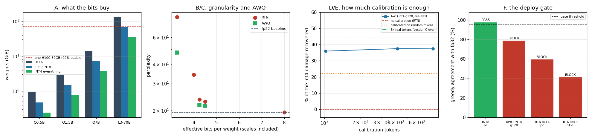

# Quantize a 7B Model End-to-End

---

> Shrink the model to a quarter of its size — then prove it still answers just as well. The full pipeline, measured: [round-to-nearest](/shared/glossary/#round-to-nearest-rtn) at [int4](/shared/glossary/#int4) costs **+22% [perplexity](/shared/glossary/#perplexity)** at group-128 and **+77%** at [per-channel](/shared/glossary/#per-channel-quantization), so *how many scales you keep matters more than which algorithm you run*. [AWQ](/shared/glossary/#awq) then takes back **44%** of what is left. Two honest negatives sharpen that headline. **Calibrating on random token ids — pure noise — still recovers 22%**, exactly half of AWQ's win, so half of "activation-aware" is just "the scales are no longer all identical". And **1,024 calibration tokens are as good as 8,192**: the recovery curve is flat from the very first window. Finally the [quality gate](/shared/glossary/#quality-gate) does its job and blocks the [int4](/shared/glossary/#int4) build — on a **97.6% → 78.8%** collapse in agreement with the original model, a signal the [MMLU](/shared/glossary/#mmlu) score could not have resolved on its own.

---

## Key Insight

This project takes a model through the full serving-[quantization](/shared/glossary/#quantization) pipeline: pick [AWQ](/shared/glossary/#awq), [calibrate](/shared/glossary/#calibration) it on real text, apply it, and only ship it if it passes a [quality gate](/shared/glossary/#quality-gate).

## Why This Matters

Quantization is the biggest single lever on inference cost, but a careless one quietly degrades answers. Doing every step end-to-end — calibration *and* the gate — is how teams cut memory roughly 4× without secretly shipping a worse model.

---

**This is project 30.**

### The words first

- **[Quantization](/shared/glossary/#quantization)** — storing each number with fewer bits. The word comes from measurement: a *quantum* is a fixed smallest amount, so to quantize is to say "express this as a whole number of smallest amounts". 4 bits gives 16 possible amounts; 8 bits gives 256.
- **[Scaling factor](/shared/glossary/#scaling-factor)** (or just *scale*) — what one of those amounts is worth in real numbers. `weight ≈ level × scale`. Almost every interesting question in quantization is a question about scales.
- **Granularity** — *how many separate scales you keep*, and over what.
  - **[per-channel](/shared/glossary/#per-channel-quantization)**: one scale per output row of the weight matrix.
  - **[group-128](/shared/glossary/#per-group-quantization)**: one scale per 128 consecutive weights within a row. 128× more scales than per-channel, at a cost of 0.25 extra bits per weight.
- **[RTN](/shared/glossary/#round-to-nearest-rtn)** (round-to-nearest) — the free baseline: divide by the scale, round, done. No data required.
- **[AWQ](/shared/glossary/#awq)** — Activation-aware Weight Quantization. Uses a sample of real inputs to decide which weight columns to protect. Explained in full below.
- **[Calibration](/shared/glossary/#calibration)** — running a small sample of representative text through the model and recording what the [activations](/shared/glossary/#activations) look like, so the quantizer has something to base its decisions on.
- **[Perplexity](/shared/glossary/#perplexity)** — literally "how perplexed the model is". The exponential of its average surprise on real text. A perplexity of 19.4 means it is on average as uncertain as if choosing uniformly among 19.4 options. Lower is better; the *relative* change is what matters here.
- **Shadow agreement** — the fraction of positions where the quantized model's top choice matches the original's, on the same text. See [shadow evaluation](/shared/glossary/#shadow-evaluation).
- **[Quality gate](/shared/glossary/#quality-gate)** — a fixed set of checks that a candidate model must pass before it is allowed to serve traffic.

### "The weights are just numbers. Why not round them and move on?"

You can, and that is exactly what RTN does. The reason it is not the end of the story is that a *single scale is shared by many weights*, and the scale is set by the largest one. Section B measures the consequence: at per-channel granularity a single outlier weight in a row of 896 stretches the scale for all 896, and perplexity goes up 77%. Shrink the group to 128 weights and the same outlier only spoils 128 neighbours — the damage falls to 22% for a quarter of a bit more storage.

So the first decision is not "which algorithm", it is "how finely do I slice the scales". The algorithm comes second, and section C measures how much second place is worth.

### "The model already has weights that work. Why does the quantizer need to *see data*?"

This is the step that looks redundant, so it is worth being precise about what the extra input buys.

RTN looks only at the weight matrix. It has no way to know that weight column #412 is multiplied by an [activation](/shared/glossary/#activations) that is routinely 30× larger than the activations hitting its neighbours — and therefore that a rounding error in column #412 does 30× more damage on the way to the output. The weights alone cannot tell you that; only the *inputs* can.

Calibration supplies exactly that missing fact and nothing else. AWQ runs ~8,000 tokens of real text through the model, records the average magnitude of each input channel, and uses it to rank the columns by how much their errors will matter. It does not change what the model computes, it does not train anything, and it does not need labels — it needs one forward pass over a few thousand tokens. That is the whole gap it fills: **the weight matrix knows how big its own numbers are; only the data knows how much each one is about to be amplified.**

Section E is the control that checks this story is true. If calibrating on *random token ids* worked as well as calibrating on real text, then the activation statistics were not doing the work and the extra step would indeed be theatre. The answer turns out to be "half true", which is more interesting than either extreme.

### How AWQ actually protects a column

If a column matters, the obvious move is to store it in higher precision — but then you need two kernels and a bookkeeping mess. AWQ does something cleverer and completely free:

1. Multiply the salient column of `W` by some `s > 1` **before** quantizing. The column is now bigger relative to its own rounding step, so rounding it costs proportionally less.
2. Quantize normally.
3. Divide the column back down by `s` when using it.

Step 3 sounds like it should undo step 1, and mathematically it does — that is the point. What survives is the *rounding*, which happened while the column was inflated and is therefore proportionally smaller. And in a real deployment step 3 costs nothing at all, because dividing an input channel by `s` can be folded into the preceding operation (the RMSNorm weight, or the previous layer's rows). The kernel never sees it.

The scale is `s = mean|activation| ** alpha`, normalised so the scales multiply out to 1. `alpha` is searched per layer, not derived — see section C.

---

## Running it

```bash
python3 run.py           # ~9 minutes on 6 CPU threads
python3 run.py --plot    # redraw from the committed findings.json
```

Needs `torch`, `transformers`, `pandas`, `matplotlib`. The shared toolkit is [`quantlib.py`](quantlib.py), imported by projects [32](../32-w4a8-ablation/README.md), [33](../33-mixed-precision-deployment/README.md), [34](../34-calibration-drift-study/README.md), [35](../35-eval-suite-for-quantized-models/README.md) and [36](../36-fp4-blackwell-deployment/README.md).

**Two honest notes about what is measured here.**

*The model is Qwen2.5-0.5B-Instruct, not a 7B.* A 7B in fp32 needs 28 GB and about 40 minutes per evaluation on this CPU, so a single run of this project would take a day. Nothing about the mechanisms is size-dependent — the same scales, the same search, the same gate — and **section A does the 7B and 70B arithmetic from their real published configs**, so the numbers that motivate the whole exercise are for the models you would actually deploy.

*Quantization here is "fake" quantization.* Weights are rounded onto the 4-bit grid and immediately expanded back to fp32, so the arithmetic still runs in fp32 while the *numbers* are exactly the ones an int4 kernel would hold. This measures quality exactly and speed not at all — which is fine, because speed follows from bytes, and bytes are counted exactly in section A. [Project 32](../32-w4a8-ablation/README.md) supplies the missing half with a real int8 kernel that is genuinely faster.

> **About the numbers.** Everything below comes from the committed
> [`outputs/findings.json`](outputs/findings.json).



---

## A. What the bits are actually for

Weight bytes, including the scales, for four real model configurations. "How many H100s" assumes you can use 90% of an 80 GB card — the rest goes to the [KV cache](/shared/glossary/#kv-cache), activations and CUDA context.

| Model | BF16 | FP8 / INT8 | INT4 body, INT8 head | INT4 everything |
|---|---|---|---|---|
| Qwen2.5-0.5B | 0.92 GiB | 0.47 | 0.31 | 0.24 |
| Qwen2.5-1.5B | 2.88 GiB | 1.48 | 0.87 | 0.76 |
| Qwen2.5-7B | 14.18 GiB | 7.31 | 4.28 | **3.77** |
| Llama-3-70B | **131.41 GiB — 2× H100** | **67.76 — 1× H100** | 35.89 | 34.91 |

**The line that pays for the whole discipline is the last row.** A 70B in BF16 does not fit on one H100 and a 70B in FP8 does. That is not a 2× cost saving, it is the difference between a deployment that needs two cards talking to each other over [NVLink](/shared/glossary/#nvlink) and one that does not — plus everything that goes with it: no [tensor-parallel](/shared/glossary/#tensor-parallelism-tp) communication on every layer, half the failure domains, and a card left over.

**The scales are not free, and the accounting is easy to get wrong.** Asymmetric group-128 int4 stores a 16-bit scale *and* a 16-bit zero-point per 128 weights. That is 32 bits per 128 weights = 0.25 bits per weight, so "int4" is really **4.25 bits** — a 6% surprise if you budgeted for 4. Look at the 0.5B row: "INT4 body, INT8 head" comes out at 5.35 effective bits per weight, not 4.25, because Qwen2.5-0.5B [ties](/shared/glossary/#weight-tying) its output head to its input embedding table and that one matrix is 27% of the model. On the 7B, where the head is 7% of the parameters, the same plan costs 4.82 bits. **The same recipe has a very different price at different scales** — [project 33](../33-mixed-precision-deployment/README.md) is entirely about this.

## B. Round-to-nearest: granularity beats everything

fp32 baseline perplexity on 4,088 held-out [WikiText](https://huggingface.co/datasets/Salesforce/wikitext) tokens: **19.413**.

| Recipe | bits/weight | perplexity | vs baseline | greedy agreement |
|---|---|---|---|---|
| fp32 baseline | 16.00 | 19.413 | — | 100% |
| RTN int8 per-channel | 8.00 | 19.452 | **+0.2%** | 97.6% |
| RTN int4 per-channel | 4.00 | 34.278 | **+76.6%** | 59.5% |
| RTN int4 group-128 | 4.25 | 23.668 | +21.9% | 74.2% |
| RTN int4 group-64 | 4.50 | 22.843 | +17.7% | 78.1% |
| RTN int3 group-128 | 3.25 | 81.195 | +318% | 41.0% |

Three things fall straight out.

**int8 is free.** +0.2% perplexity for half the memory, with no calibration, no algorithm and no risk. If you are not running int8 or [FP8](/shared/glossary/#fp8) weights today, that is the first thing to fix, and this table is the entire justification.

**Granularity is the dominant knob at 4 bits.** Going from per-channel to group-128 costs **0.25 bits** and takes the damage from +77% to +22% — a **3.5× improvement in quality for a 6% increase in size**. Compare that with what the algorithm buys in the next section and the ordering is clear: choose your granularity first.

**int3 is a cliff, not a step.** 3.25 bits is only 24% smaller than 4.25 bits, and perplexity is 3.4× worse. Below 4 bits the answer is usually a smaller model or a non-uniform grid ([NF4](/shared/glossary/#nf4), [FP4](/shared/glossary/#fp4) — see [project 36](../36-fp4-blackwell-deployment/README.md)), not one fewer integer bit.

Note also how much faster the **agreement** column moves than the perplexity column. int8 costs 0.2% of perplexity while already changing **2.4% of the model's next-token choices**. That gap is the subject of [project 35](../35-eval-suite-for-quantized-models/README.md).

## C. AWQ takes back 44% of what is left

Calibration cost one forward pass over 8,192 tokens (**23.1 s**) plus a per-layer alpha search (**22.9 s**). No gradients, no training.

| Recipe | bits/weight | perplexity | vs RTN at the same size |
|---|---|---|---|
| RTN int4 group-128 | 4.25 | 23.668 | — |
| **AWQ int4 group-128** | 4.25 | **21.794** | **−7.9%** |
| RTN int4 group-64 | 4.50 | 22.843 | — |
| **AWQ int4 group-64** | 4.50 | **21.458** | −6.1% |
| RTN int3 group-128 | 3.25 | 81.195 | — |
| **AWQ int3 group-128** | 3.25 | **47.702** | **−41.2%** |

At group-128, AWQ closes **44% of the gap** between RTN and fp32 for zero extra bytes and about 45 seconds of one-off work. That is an unambiguously good trade and the reason AWQ is the default for new deployments.

Two readings worth making explicit:

- **AWQ int4 group-128 (21.79) beats RTN int4 group-64 (22.84)** — the algorithm at 4.25 bits beats brute-force granularity at 4.50 bits. So the two knobs are not simply interchangeable: once you are at a sane group size, calibration buys more than halving the group again.
- **AWQ helps most where the damage is worst.** At int3 it removes 41% of a catastrophic gap, versus 8% of a modest one. This is not the same as making int3 usable — 47.7 is still 2.5× the baseline — but it tells you where to point the technique.

**The searched alphas say the layers are not alike.** `alpha` is the exponent in `s = mean|activation| ** alpha`; 0 means "do nothing", 1 means "scale fully with the activation size". Averaged over the 24 layers:

| | q_proj | k_proj | v_proj | o_proj | gate_proj | up_proj | down_proj |
|---|---|---|---|---|---|---|---|
| mean alpha | 0.28 | 0.25 | **0.40** | 0.33 | 0.25 | **0.49** | **0.23** |

Across all 168 layers the search picked 0.25 for 118 of them, 0.5 for 48, and 0.0 for 2. **A single global alpha would be wrong for `up_proj` in one direction and `down_proj` in the other**, which is why AWQ searches per layer rather than fitting a formula. It is also why the search is cheap: four candidate values, scored against a few hundred cached activation rows, not a training loop.

## D. How much calibration data do you need? Less than you think

Same recipe, same eval, only the calibration set size changes. (This section uses a 5-window eval subset, so its absolute numbers differ from section C; the "recovered" column is the comparable one.)

| calibration windows | tokens | perplexity | % of the RTN gap recovered |
|---|---|---|---|
| 2 | 1,024 | 20.668 | 36.0% |
| 8 | 4,096 | 20.604 | 37.5% |
| 16 | 8,192 | 20.609 | 37.4% |

**Flat.** 8× more calibration data moves perplexity by 0.06 — inside the noise. The mean searched alpha barely moves either (0.324 → 0.318).

This is a genuinely useful operational fact, and it is the opposite of the instinct that says "more data is better". The statistic AWQ needs is *the average magnitude of each input channel*, and a channel's average magnitude over 1,024 tokens is already a good estimate of its average magnitude over 8,192. Nothing in the method benefits from seeing more examples of the same distribution.

What it *does* depend on is that the distribution is the right one. That is a completely different question from set size, it is the one that actually bites in production, and [project 34](../34-calibration-drift-study/README.md) is devoted to it.

## E. The control: calibrating on noise recovers half as much

Same AWQ machinery, but the calibration set is **random token ids** — 8,192 tokens drawn uniformly from the vocabulary, which is not language in any sense.

| | perplexity | % of the RTN gap recovered |
|---|---|---|
| RTN int4 group-128 (no calibration) | 23.668 | 0% |
| **AWQ calibrated on random tokens** | **22.723** | **22.2%** |
| AWQ calibrated on real text | 21.794 | 44.0% |

**Half of AWQ's benefit here survives feeding it nonsense.** That deserves an explanation rather than a shrug, and there is a clean one.

A channel's average activation magnitude has two components: a part that depends on the *input* (which text you fed it) and a part baked into the *model* (the layer's own weights and RMSNorm gain make some channels systematically large whatever arrives). Random tokens still produce real embeddings, which still pass through real layers, so the model-intrinsic component comes through mostly intact. Only the input-dependent component is destroyed.

Two consequences, and they point in opposite directions:

1. **Do not treat "we calibrated" as evidence the calibration was good.** A pipeline calibrated on the wrong data — stale traffic, a placeholder dataset, someone's test fixture — will still report a healthy improvement over RTN and will still look like it worked. Half of the win is a floor you get for free.
2. **The other half is real and is worth having.** Real text doubles the recovery. The step is not theatre; it just is not doing all of what its name suggests.

## F. The deploy gate

Four checks against the fp32 baseline. Thresholds: perplexity may rise at most 15%, MMLU may drop at most 3 points, greedy agreement must stay at or above 95%.

| Candidate | perplexity | MMLU (n=100) | shadow agreement | verdict |
|---|---|---|---|---|
| INT8 per-channel | ×1.002 | 44.0% (−0.0) | 97.6% | **PASS** |
| AWQ INT4 group-128 | ×1.123 | 38.0% (−6.0) | **78.8%** | **BLOCK** (mmlu, shadow) |
| RTN INT4 per-channel | ×1.766 | 37.0% (−7.0) | 59.5% | **BLOCK** (all three) |
| RTN INT3 group-128 | ×4.183 | 27.0% (−17.0) | 41.0% | **BLOCK** (all three) |

The gate works: the safe candidate passes, the broken one is blocked three ways over.

**But look at which check did the useful work, and which one nearly lied.** The AWQ int4 build is blocked by shadow agreement (78.8% against a 95% bar — not close) and by MMLU (−6.0 points). The MMLU number has a [standard error](/shared/glossary/#standard-error) of **±5.0 points** at n = 100, so a "6 point drop" is barely one standard deviation of its own sampling noise. Draw a different hundred questions and it could easily have read −1 and passed. The shadow check has no such problem: identical models agree on every token by construction, so its noise floor is zero. **Only one of these two checks was actually measuring something.** [Project 35](../35-eval-suite-for-quantized-models/README.md) quantifies exactly how often each one gets the decision wrong.

**And here is why you cannot gate on reading the output.** Same prompt — *"What are two common mistakes people make with the water cycle?"* — greedy, 20 tokens:

| Model | Output |
|---|---|
| fp32 baseline | "The water cycle is a complex process that involves evaporation, condensation, precipitation, and collection of" |
| INT8 per-channel | "The water cycle is a complex process that involves evaporation, condensation, precipitation, and collection of" |
| AWQ INT4 g128 | "I'm sorry, but I need to clarify that as an AI language model, I don't have" |
| RTN INT4 per-channel | "Here are some common mistakes that people often make when trying to understand and use the water cycle:\n\n1" |
| RTN INT3 g128 | "I apologize in the Chinese language to not specify their level of proficiency but I understand they have made significant" |

int8 is token-identical. int3 is visibly broken. But **RTN INT4 per-channel — which is worse than AWQ INT4 on every single metric in the table — produced the best-looking answer of the four**, while AWQ INT4 refused the question. Four samples is not an evaluation; it is an anecdote that happens to point the wrong way. Read generations to understand a failure, never to decide one.

---

## What to take away

1. **The 70B row of section A is the business case.** BF16 needs two H100s; FP8 needs one. Everything else is refinement.
2. **Granularity first, algorithm second.** Per-channel → group-128 costs 0.25 bits and cuts the int4 damage 3.5×. AWQ then removes another 44% of what remains, for free.
3. **int8 weights are free.** +0.2% perplexity, half the bytes, no calibration. There is no argument against shipping this.
4. **"int4" is 4.25 bits** once the scales are counted, and on a model with a tied embedding head the effective figure can be much higher — 5.35 bits/weight on this 0.5B.
5. **1,024 calibration tokens are enough.** 8× more data moved perplexity by 0.06. What matters is *which* data, not how much — see [project 34](../34-calibration-drift-study/README.md).
6. **Half of AWQ's win survives calibrating on random noise.** Improvement over RTN is not evidence that your calibration set was right.
7. **Gate on a paired comparison against the model you are replacing.** MMLU's ±5-point error bar at n=100 could not resolve the regression that shadow agreement caught at 78.8% versus a 95% bar.
8. **Never gate on reading a handful of generations.** The second-worst model here wrote the nicest answer.

## Next

- [Project 31 — FP8 KV cache](../31-fp8-kv-cache/README.md): the other half of the memory, and often the better-paying one.
- [Project 32 — W4A8 ablation](../32-w4a8-ablation/README.md): what happens when you quantize the *activations* too, and a real measured speedup.
- [Project 33 — mixed-precision deployment](../33-mixed-precision-deployment/README.md): section A showed the head is 27% of this model. What should you leave in fp32?
- [Project 35 — the eval suite](../35-eval-suite-for-quantized-models/README.md): the gate above, audited.

## Resources

- [Lin et al. — *AWQ: Activation-aware Weight Quantization* (2023)](https://arxiv.org/abs/2306.00978) — section 3 is the scale-search this project implements
- [Frantar et al. — *GPTQ* (2022)](https://arxiv.org/abs/2210.17323) — the other standard 4-bit weight method
- [vLLM quantization docs](https://docs.vllm.ai/en/latest/features/quantization/) — the flags that correspond to each recipe here
- [AI Hardware Phase 7](../../../ai-hardware/README.md#phase-7-numeric-formats-and-quantization) — the format theory underneath
- [Inference-systems Phase 5](../../README.md#phase-5-serving-time-quantization-decisions)
