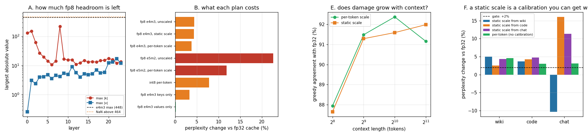

# FP8 KV Cache

---

> Store the cache in 8 bits instead of 16 — almost free speed, almost no quality cost. Measured, the "almost"s move in interesting directions. Memory is exactly as advertised: **24,576 → 6,144 bytes per token**, and on a 7B at 8k context that is **132 → 264 concurrent users on one H100** — *more concurrency than quantizing the weights buys* (147). Quality costs **+3.7% [perplexity](/shared/glossary/#perplexity)**, and **all of it is in the keys**: quantizing values alone costs **+0.13%** and 0.9% of token choices, quantizing keys alone costs +3.3% and 9.7%. [FP8](/shared/glossary/#fp8) e4m3 beats [int8](/shared/glossary/#int8) at identical size by **2.1×**. Three results contradict the folklore. **The damage does not grow with context — it shrinks**, from +4.0% at 256 tokens to +1.5% at 2048. **The decode speedup at batch 1 is exactly 1.00×**; you only reach the advertised ~1.4× at batch 32 and long context, because at batch 1 the cache is 0.8% of the bytes read. And a **static scale calibrated on the wrong traffic made perplexity 10% *better*** while changing 6.8% of the model's answers — the one cell in the whole grid that passes a perplexity gate, and it is not better.

---

## Key Insight

This project switches a deployment's [KV cache](/shared/glossary/#kv-cache) from 16-bit ([bfloat16](/shared/glossary/#bfloat16)) to [FP8](/shared/glossary/#fp8), measures the [decode](/shared/glossary/#decode) speedup, and then confirms with a [quality gate](/shared/glossary/#quality-gate) that the answers did not change.

## Why This Matters

Decode speed is set by how many bytes the cache streams from [HBM](/shared/glossary/#hbm) each step, so halving the cache nearly halves that traffic. Because keys and values tolerate low precision well, FP8 KV is one of the safest big wins in serving.

---

**This is project 31.**

### "Didn't [project 13](../13-kv-quantization-study/README.md) already do this?"

Project 13 asked a *research* question — of eleven storage formats, which damages quality least — and answered it with perplexity on a fixed context. This project asks the *operational* question that comes next: you are about to set `--kv-cache-dtype fp8` on a service that is currently serving traffic. Specifically:

- **What has to be calibrated first**, and what happens if you skip it (section A and F). Project 13 measured unscaled casts; real engines ship a *scale*, and the scale is a thing you can get wrong.
- **How many more users fit** (section C) — the number that actually pays for the change, computed for models this box cannot hold.
- **How much faster decode really gets** (section D), including the regime where the honest answer is "not at all".
- **Whether the change holds up at long context** (section E) and across workloads (section F), rather than at one fixed length on one corpus.

The overlap is deliberate on one point only: section B re-measures format quality so that everything else in this project rests on numbers produced by the same runner and the same windows.

### The words first

- **[KV cache](/shared/glossary/#kv-cache)** — the keys and values already computed for every earlier token, kept so that generating the next token does not redo the whole prompt. See [project 09](../09-kv-cache-from-scratch/README.md).
- **[FP8](/shared/glossary/#fp8) e4m3 / e5m2** — two 8-bit floating-point layouts. The names *are* the layout: **e4m3** = 4 exponent bits + 3 mantissa bits, **e5m2** = 5 + 2. More [exponent](/shared/glossary/#exponent) bits buy *range* (how large and small a number can be); more [mantissa](/shared/glossary/#mantissa) bits buy *precision* (how finely nearby numbers are told apart). Same size, different bargain — section B prices it.
- **Saturation** — when a value is too big for the format, clamping it to the largest representable value instead of failing. Conversion hardware does this. `torch`'s raw cast does not, which section A turns into a demonstration.
- **Scale mode** — *what* shares a [scaling factor](/shared/glossary/#scaling-factor). `unscaled` (no scale at all), `static` (one frozen number per layer, calibrated once), `per-token` (each token computes its own as it is written).
- **Seat** — one concurrent user's [KV cache](/shared/glossary/#kv-cache) at a given context length. "How many seats fit on a card" is the concurrency budget.
- **Shadow agreement** — the fraction of positions where the quantized model's top choice matches the fp32 model's on the same text. See [shadow evaluation](/shared/glossary/#shadow-evaluation).

### "The cache is just numbers the model already computed. Why does storing it need a *scale*?"

Because fp8's window is narrow and fixed. e4m3 represents numbers between about 0.002 and 448, full stop. If your keys happen to live between 0 and 219 — which section A measures, and they do — you can cast them straight in and it works. If a different model, a different layer, or a different prompt produces keys of 900, the cast does not round them down; in torch it produces **NaN**, and a single NaN inside a softmax row destroys every attention weight in that row.

A scale is the fix: divide by `s` before storing, multiply by `s` after reading, and choose `s` so the biggest value you expect lands near 448. The multiply back is free — it factors straight out of the attention dot product — so the only real cost is *knowing what `s` should be*, which is what calibration is for.

So the extra step is not redundant with "the model already produced these numbers". The model produced them on whatever scale its training left them on; fp8 has its own, much smaller scale, and something has to move one onto the other. Section F is entirely about what happens when that something is fitted to the wrong traffic.

---

## Running it

```bash
python3 run.py           # ~5 minutes on 6 CPU threads
python3 run.py --plot    # redraw from the committed findings.json
```

Needs `torch`, `transformers`, `pandas`, `matplotlib`. Uses [`kvlib.py`](../09-kv-cache-from-scratch/kvlib.py) from [project 09](../09-kv-cache-from-scratch/README.md) (the runner with the pluggable cache seam), [`quantcache.py`](../13-kv-quantization-study/quantcache.py) from [project 13](../13-kv-quantization-study/README.md) for the int8 comparison, and [`quantlib.py`](../30-quantize-a-7b-model-end-to-end/quantlib.py) from [project 30](../30-quantize-a-7b-model-end-to-end/README.md) for the corpora and the model-size arithmetic. The new code is [`fp8kv.py`](fp8kv.py).

**One measurement convention.** The reference cache here holds fp32, because that is what project 09's runner uses, so the *measured* byte saving reads as 4×. A real deployment's baseline is bf16, where the saving is **2×** — which is the number every table in section C and D uses, since those are computed from real model configs rather than from this runner.

> **About the numbers.** Everything below comes from the committed
> [`outputs/findings.json`](outputs/findings.json).



---

## A. Is an unscaled cast even legal?

The format's own cliff, measured rather than quoted:

| value cast to e4m3 | 447.0 | 449.0 | 463.0 | **465.0** | 1000.0 |
|---|---|---|---|---|---|
| comes back as | 448.0 | 448.0 | 448.0 | **NaN** | **NaN** |

e4m3's maximum is 448. Values up to 464 round *down* to it, and everything above becomes NaN — because the "fn" variant of e4m3 that every GPU implements has **no encoding for infinity**, so there is nothing for an overflow to become except "not a number". This is unlike every other float format you have used, where too-big quietly becomes `inf` and keeps going.

Now the model's own numbers, over three windows of real text:

| | largest absolute value | headroom to 448 |
|---|---|---|
| keys | **219.0** (layer 8) | 2.05× |
| values | 17.0 | 26.4× |

An unscaled cast is legal for this model — but only just, for the keys, and only for the text we happened to measure. **Two-fold headroom is not a safety margin**, it is one unusual prompt away from being none. Note too how differently the two halves behave: values never exceed 17, so they have 26× of room, while keys reach 219. Keys and values are not the same problem and section B shows they do not cost the same either.

**And the failure is not graceful.** Setting a static scale deliberately 2× too small — a plausible calibration mistake — produces:

| conversion behaviour | 0.18–1.0% of values out of range | logits |
|---|---|---|
| raw `torch` cast | → NaN | **NaN — the whole request is garbage** |
| saturating (what hardware does) | → clamped to 448 | finite, still usable |

Real conversion hardware saturates, and `fp8kv.py` clamps to reproduce that. If you ever hand-roll an fp8 path, **clamp before the cast**; the difference between "slightly degraded" and "returns NaN" is one `.clamp()`. (The clip counts differ between the two rows because in the NaN case the poison spreads: once layer 8's output is NaN, later layers receive NaN inputs, and `NaN > 448` is `False`, so the counter stops seeing them. A silent failure that also disables its own alarm.)

## B. What each storage plan costs

fp32 cache baseline perplexity on 3,066 held-out tokens: **18.4575**.

| Plan | perplexity | vs fp32 | shadow agreement |
|---|---|---|---|
| fp32 cache (baseline) | 18.4575 | — | 100% |
| **fp8 e4m3, values only** | **18.4820** | **+0.13%** | **99.12%** |
| fp8 e4m3 keys only | 19.0628 | +3.28% | 90.28% |
| fp8 e4m3, per-token scale | 19.1486 | **+3.74%** | 90.08% |
| fp8 e4m3, static scale | 19.2555 | +4.32% | 90.80% |
| fp8 e4m3, unscaled | 19.2629 | +4.36% | 89.86% |
| int8 per-token | 19.9033 | +7.83% | 89.07% |
| fp8 e5m2, per-token scale | 20.6405 | +11.83% | 82.03% |
| fp8 e5m2, unscaled | 22.6266 | +22.59% | 80.37% |

**All of the damage is in the keys.** Quantizing values alone costs 0.13% of perplexity and changes 0.9% of the model's token choices. Quantizing keys alone costs 3.28% and changes 9.7%. Together: +3.74%. The keys account for essentially the whole bill.

Why: a key's job is to be dotted with a query and then pushed through a softmax. Softmax is *exponential* in its input, so an error of ε in a score becomes a factor of e^ε in the attention weight — small errors in keys get amplified before they are used. A value's job is to be averaged with a few dozen other values using those weights, which *attenuates* error instead. This is the same asymmetry [project 13](../13-kv-quantization-study/README.md) found at int4, where keys-only cost +295% and values-only +4.8%; at fp8 the split is milder but the ratio is the same shape. The practical consequence: **if you ever need a mixed plan, quantize the values harder than the keys, never the reverse.**

**e4m3 beats int8 at exactly the same size, by 2.1×** (+3.74% vs +7.83%). Same one byte per number, very different bargain. int8's 256 levels are *evenly spaced*, so half of them sit in the top half of the range where almost no values live; e4m3's levels are spaced logarithmically, packing fine resolution near zero where the bulk of the distribution is. Key and value distributions are bell-shaped with long tails, which is precisely the shape a floating-point grid is built for. This is why serving engines default to fp8 rather than int8 for the cache even though int8 is older and more widely supported.

**e5m2 is 3.2× worse than e4m3** (+11.83% vs +3.74%). It trades a mantissa bit for an exponent bit, buying range from 448 up to 57,344 — range that section A already showed we do not need, since the largest key is 219. You pay in precision for headroom you will never use. **e5m2 is for gradients during training, not for a KV cache.**

**The scale mode barely matters here** — unscaled 4.36%, static 4.32%, per-token 3.74%. That is not a general result; it is a consequence of section A, where this model's keys already sit comfortably inside e4m3's window, so there is little for a scale to fix. On a model with larger keys the unscaled column would be the NaN row from section A. Section F shows the static scale failing for a different reason.

## C. The number that pays for the change

Measured, for 512 tokens through the real model:

| cache | MiB for 512 tokens | bytes/token |
|---|---|---|
| fp32 (this runner's baseline) | 12.00 | 24,576 |
| fp8, unscaled or static | 3.00 | 6,144 |
| fp8, per-token scale | 3.19 | **6,528** |

The formula is `2 (K and V) × layers × kv-heads × head-width × bytes` = 2 × 24 × 2 × 64 × 1 = 6,144 bytes per token, and the measurement matches exactly.

**The per-token scale costs 6.2%, and this is the number nobody budgets for.** One fp32 scale per (token, kv-head) sits on top of 64 bytes of payload: 4/64 = 6.25%. That is small, but it scales with `1/d_head`, so it is 6.2% on this model and 3.1% on a model with 128-wide heads — and it comes straight off your concurrency. Given that section B measured the per-token scale buying only 0.6 percentage points of perplexity over the static one, **for this model the static scale is the better deal**: same quality within noise, 6% more seats.

### Seats on an H100-80GB (arithmetic, from real configs)

Assuming 90% of 80 GB is usable after weights, activations and CUDA context.

**Qwen2.5-7B at 8k context (fits on one card in every plan):**

| plan | seats |
|---|---|
| W16 / KV16 | 132 |
| W8 / KV16 (quantize the weights) | 147 |
| **W16 / KV8 (quantize the cache)** | **264** |
| W8 / KV8 (both) | 295 |

**Quantizing the cache is worth 1.8× more concurrency than quantizing the weights** (264 vs 147). This inverts the order most teams reach for the two levers in, and the reason is simple arithmetic: the weights are a fixed 14.2 GiB paid once, so halving them frees 7.1 GiB *in total*, while the cache is 48 KiB per token per user — halving it frees memory *per seat*, which compounds with every user you add. On a card that is mostly cache, the cache is the lever.

**Llama-3-70B — where the same reasoning produces a trap:**

| plan | cards | seats | seats **per card** |
|---|---|---|---|
| W16 / KV16 @ 8k | 2 | 5 | 2.5 |
| W16 / KV8 @ 8k | 2 | 10 | 5.0 |
| **W8 / KV16 @ 8k** | **1** | **1** | **1.0** |
| W8 / KV8 @ 8k | 1 | 3 | 3.0 |
| W8 / KV8 @ 32k | 1 | **0** | 0.0 |

FP8 weights get a 70B onto a single card — 67.8 GiB against 72 GiB usable — which sounds like the win of the century until you notice what is left for the cache: **4.2 GiB, which is one seat at 8k and none at all at 32k.** "It fits" and "it serves" are different claims. The two-card bf16 deployment serves 2.5 users per card; the heroic one-card fp8 deployment serves 1.0. Only W8/KV8 on one card (3.0 per card) actually beats it, and even that dies at 32k context. **Before celebrating a plan that removes a GPU, check what the removed GPU's memory was doing.**

## D. Speed: the honest measurement and the honest arithmetic

Measured on this CPU, one decode step, interleaved round-robin, minimum of four rounds:

| context | fp32 cache | fp8 per-token | fp8 static |
|---|---|---|---|
| 512 | **90.7 ms** | 96.9 ms | 97.8 ms |
| 2048 | **132.0 ms** | 138.5 ms | 138.4 ms |

**FP8 KV is 1.07× slower here, and that is the correct result.** This CPU has no instruction that loads an fp8 value and converts it, so every read costs an explicit widening pass that fp32 does not pay — and the memory it saves does not help, because the whole cache already fits in cache-and-RAM that is not the bottleneck. The speedup from a narrower format is a *bandwidth* effect, and it only appears on hardware where bandwidth is the constraint and the conversion is free. That is [Hopper](/shared/glossary/#hopper) and later, and it is not this box.

So the speed side is arithmetic, from bytes moved per decode step at 3.35 TB/s of HBM3:

| model | context | batch | KV as % of bytes read | fp8 KV speedup |
|---|---|---|---|---|
| Qwen2.5-7B | 2048 | 1 | 0.8% | **1.00×** |
| Qwen2.5-7B | 2048 | 32 | 19.8% | 1.11× |
| Qwen2.5-7B | 2048 | 128 | 49.7% | 1.33× |
| Qwen2.5-7B | 32768 | 1 | 11.0% | 1.06× |
| Qwen2.5-7B | 32768 | 32 | 79.8% | 1.66× |
| Qwen2.5-7B | 32768 | 128 | 94.0% | **1.89×** |
| Llama-3-70B | 32768 | 32 | 70.9% | 1.55× |
| Llama-3-70B | 32768 | 128 | 90.7% | 1.83× |

**At batch 1 the speedup is 1.00×, to two decimal places.** A single user at 2k context has 96 MiB of cache next to 14.2 GiB of weights — 0.8% of the traffic. Halving 0.8% of something changes nothing.

The reason the numbers climb so fast along the batch axis is that **the two terms scale differently**. A decode step reads the weights *once* regardless of batch size, but reads *every request's* cache. So the cache's share is `B·C·kv_bytes / (W + B·C·kv_bytes)`, which starts near zero and approaches 1. At batch 128 and 32k context the cache is 94% of everything the step reads, and halving it is nearly a 2× step.

The [Phase 5 guide table](../../README.md#where-each-format-pays-you-back) quotes "FP8 KV cache ~1.4× faster". That is a fair summary of the busy-server regime and a serious over-promise for a low-traffic one. **Which number you get is set by your batch size and context length, not by the format** — and you can compute yours from the two byte counts before you change anything.

## E. Does the damage grow with context? No — it shrinks

The intuitive worry is that errors accumulate: each quantized key is slightly wrong, a long context has more of them, so long conversations should degrade further. Measured:

| context | per-token scale | static scale |
|---|---|---|
| 256 | +4.00% | +4.02% |
| 512 | +1.92% | +3.88% |
| 1024 | **+0.58%** | +2.55% |
| 2048 | +1.45% | +4.38% |

**The per-token damage falls by roughly 3× from 256 to 1024 tokens.** Errors do not accumulate here because they do not compound: attention is an *average* over the keys and values in the cache, and each token's quantization error is independent of its neighbours'. Averaging `n` independent errors shrinks their effect like `1/√n`. A longer context is more terms in the same average, not a longer chain of dependent steps.

**The static scale does not get the same benefit** — it hovers around 4% at every length. Its error is not independent per token: every token in a layer was divided by the *same* slightly-wrong constant, so the errors share a direction and do not average away. This is the clearest practical argument for per-token scaling, and it is invisible at short context where the two are within 0.02 percentage points of each other.

(Absolute perplexity swings a lot across this table — 23.0 at 256 tokens, 9.3 at 1024 — because each row is a different amount of text and longer windows give the model more to condition on. The percentage column is the comparable one.)

## F. A static scale is a calibration you can get wrong

Three domains, three static scales (one calibrated on each domain), plus per-token as the no-calibration-needed control. Every cell is perplexity relative to the fp32 cache on the *same* text.

| serving ↓ / scale from → | wiki | code | chat | per-token |
|---|---|---|---|---|
| **wiki** (fp32 19.255) | ×1.0502 | ×1.0252 | ×1.0437 | ×1.0462 |
| **code** (fp32 8.084) | ×1.0370 | ×1.0423 | ×1.0475 | ×1.0306 |
| **chat** (fp32 4.582) | **×0.8970** | ×1.1604 | ×1.1135 | ×1.0310 |

**The diagonal is not the best cell in a single row.** On wiki, the *code* scale beats the wiki scale (1.025 vs 1.050). On code, the *wiki* scale beats the code scale (1.037 vs 1.042). This is not a subtle statistical point — it says the matched scale is not reliably the right scale, because a per-layer maximum measured on 4 windows is a noisy estimate of a maximum, and a scale fitted to one sample's outlier is worse than a slightly looser one. The measured per-layer max|k| ratios bear this out: chat's keys run from 0.83× to 1.56× of wiki's depending on the layer, with a mean of 1.08. There is no single number that is right everywhere.

**And then the cell that should stop you writing perplexity gates.** Serving chat with the wiki scale gives **×0.897 — 10% *better* than not quantizing at all**, while changing 6.8% of the model's token choices. It is the only cell in the entire grid that passes a "perplexity may rise 2%" gate, and it passes by being *wrong in a lucky direction*.

The mechanism is not mysterious. The chat corpus is templated, highly repetitive, and has a perplexity of 4.58 — the model is already very confident. The wiki scale is far coarser than chat's activations require, so it rounds the cache hard, which flattens the attention distribution slightly, which nudges already-confident predictions a little further toward the frequent token. On low-entropy text that reads as an improvement. It is not one: 6.8% of the answers changed.

**A metric that can improve when you damage the model cannot decide whether you damaged the model.** Perplexity is a good instrument and a bad judge. The [shadow agreement](/shared/glossary/#shadow-evaluation) column would have caught this immediately — 93.1% against a 98% bar — because an unchanged model agrees with itself on every token and there is no lucky direction to drift in. [Project 35](../35-eval-suite-for-quantized-models/README.md) puts numbers on how often each kind of check gets the decision wrong.

**The recommendation that falls out:** prefer the per-token scale unless the 6.2% byte overhead is genuinely the binding constraint. It costs one number per token per head, needs no calibration file, cannot go stale, is the only variant whose error shrinks with context, and was within 0.006 of the best static cell on both of the domains where "best" was not an artifact.

---

## What to take away

1. **Concurrency is where FP8 KV pays.** 132 → 264 seats on a 7B at 8k — and that is **1.8× more than quantizing the weights buys** (147), because the cache is per-user and the weights are not.
2. **All the damage is in the keys.** Values-only: +0.13% and 99.1% agreement. Keys-only: +3.28% and 90.3%. Softmax amplifies key error; averaging attenuates value error.
3. **e4m3, not e5m2, not int8.** e4m3 beats int8 by 2.1× and e5m2 by 3.2× at exactly the same one byte per number. e5m2 buys range this model never uses.
4. **The batch-1 speedup is 1.00×.** You reach 1.9× at batch 128 and 32k context. Compute your own from `B·C·kv_bytes / (W + B·C·kv_bytes)` before you promise anyone a number.
5. **Damage shrinks with context, not grows** — +4.0% at 256 tokens, +0.6% at 1024 — because independent per-token errors average out. Only the *static* scale escapes that averaging, and it is the one that stays at 4%.
6. **Check the headroom before an unscaled cast.** This model's keys peak at 219 against a ceiling of 448. Above 464 the raw cast returns NaN, not a clamped value, and the NaN then hides itself from your overflow counter.
7. **A static scale is a calibration, so it is a thing that can be wrong** — and the wrong one made perplexity 10% better while changing 6.8% of the answers. Gate on a paired comparison, not on a score.
8. **Budget the per-token scale's 6.2%.** It is real memory, it scales as `1/d_head`, and on this model it bought only 0.6 points of perplexity over the static scale.

## Next

- [Project 32 — W4A8 ablation](../32-w4a8-ablation/README.md): quantizing the activations, where the outliers actually live, and a real measured speedup.
- [Project 34 — calibration drift](../34-calibration-drift-study/README.md): section F's failure, at weight scale and over twelve weeks.
- [Project 35 — the eval suite](../35-eval-suite-for-quantized-models/README.md): how often a perplexity gate makes the wrong call.
- [Project 13 — KV-quantization study](../13-kv-quantization-study/README.md): the eleven-format sweep this project builds on.
- [Project 10 — KV size calculator](../10-kv-size-calculator/README.md): where the bytes-per-token formula comes from.

## Resources

- [Micikevicius et al. — *FP8 Formats for Deep Learning* (2022)](https://arxiv.org/abs/2209.05433) — the e4m3/e5m2 specification, including why e4m3fn has no infinity
- [vLLM — FP8 KV cache](https://docs.vllm.ai/en/latest/features/quantization/quantized_kvcache.html) — `--kv-cache-dtype fp8` and the calibration flag this project's section F is about
- [Hooper et al. — *KVQuant* (2024)](https://arxiv.org/abs/2401.18079) — the per-channel-keys / per-token-values asymmetry, measured at lower bit widths
- [Inference-systems Phase 5](../../README.md#phase-5-serving-time-quantization-decisions)
