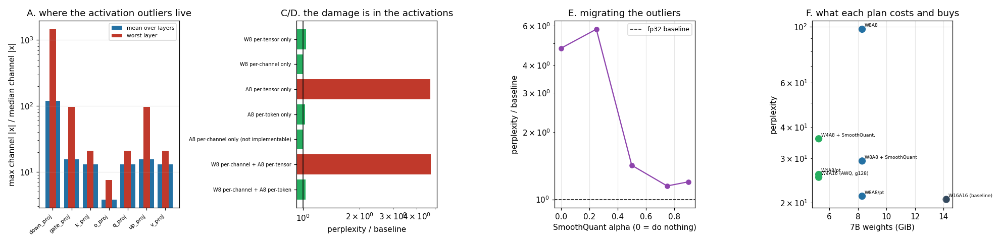

# W4A8 Ablation

---

> Compare 4-bit weights alone against 4-bit weights plus 8-bit activations. The headline is a real, measured [int8](/shared/glossary/#int8) kernel that makes [decode](/shared/glossary/#decode) **2.43× faster** on this CPU and makes [perplexity](/shared/glossary/#perplexity) **8.4× worse** — a completely usable speedup wrapped around a completely unusable model. Splitting the damage shows it is **entirely in the activations, and specifically in one line of the recipe**: an 8-bit activation with one scale per tensor costs **×4.72**, and the same 8 bits with one scale per *token* costs **×1.03**. That is a **4.6× difference from a choice that costs nothing on hardware**. The reason is a single number: [`down_proj`](/shared/glossary/#activation-outlier)'s worst input channel is **1,457× larger than its median channel**. And the honest inversion: [SmoothQuant](/shared/glossary/#smoothquant), the standard fix, is **non-monotonic** (alpha 0.25 is *worse* than doing nothing) and at its best setting still loses to per-token scaling — ×1.15 against ×1.03, with a calibration pass against none. Finally the ablation itself: **W4A8 costs 0.03 more than W4A16** (×1.26 vs ×1.22), so the activations are close to free once the weights are already at 4 bits.

---

## Key Insight

This project measures the difference between [quantizing](/shared/glossary/#quantization) only the [weights](/shared/glossary/#weights) to 4 bits and also quantizing the [activations](/shared/glossary/#activations) to 8 bits ([W4A8](/shared/glossary/#w4a8)) — tracking both answer quality and tokens per second.

## Why This Matters

Weight quantization saves memory; activation quantization is what unlocks fast integer math on the GPU. They pay off in different regimes and carry different risks, so a serving team has to decide them separately instead of reaching for one "quantize the model" switch.

---

**This is project 32.**

### The words first

- **[W4A8](/shared/glossary/#w4a8)** — **W**eights at 4 bits, **A**ctivations at 8. The same shorthand gives W8A8, W4A16, W16A16 (nothing quantized).
- **[Activation](/shared/glossary/#activations)** — the numbers flowing *between* layers, as opposed to the weights stored inside them. They change with every input; weights do not.
- **[Activation outlier](/shared/glossary/#activation-outlier)** — a channel whose values are tens or hundreds of times larger than its neighbours', reliably, in every trained transformer. They are the whole reason A8 is hard.
- **Granularity** — how many values share a [scaling factor](/shared/glossary/#scaling-factor). For activations: *per-tensor* (one for everything), *per-token* (one per row), *per-channel* (one per column).
- **[SmoothQuant](/shared/glossary/#smoothquant)** — divide the activation by a per-channel factor and multiply the weight column by the same factor. The product is unchanged; the difficulty moves from the activation into the weight.
- **[Tensor Core](/shared/glossary/#tensor-core)** — the matrix-multiply unit inside a modern NVIDIA GPU. It has separate, faster paths for int8 and [FP8](/shared/glossary/#fp8) operands.
- **Dynamic quantization** — computing the activation's scale at run time from the activation itself, rather than from a calibration set. Torch's `quantize_dynamic` does this, per tensor.

### "If 4-bit weights already made decode faster, why bother with the activations?"

Because they speed up different things, and one of them is not speed at all.

**Weight quantization is a memory move.** At [batch](/shared/glossary/#batch) size 1, a decode step is limited by how fast the weights stream out of [HBM](/shared/glossary/#hbm), not by arithmetic — the GPU finishes multiplying long before the next weights arrive. A 4× smaller weight file is therefore close to a 4× faster step, even though the *math* runs at exactly the same precision. That is [weight-only quantization](/shared/glossary/#weight-only-quantization), and it is what [project 30](../30-quantize-a-7b-model-end-to-end/README.md) measured.

**Activation quantization is an arithmetic move, and it is the only way in.** An integer multiplier needs *both* of its inputs to be integers. If the weights are int8 and the activations are still bf16, the kernel has to expand the weights back to bf16 and use the ordinary float unit — the int8 Tensor Core, with roughly twice the throughput, sits idle. You cannot reach it by quantizing one operand. So A8 is not "more of the same compression": it is the switch that changes which silicon runs the matmul.

That makes it worth exactly where weight-only quantization is worth least — in the **compute-bound** regimes: [prefill](/shared/glossary/#prefill) on long prompts, and decode at large batch, where the weights are read once and used many times so arithmetic is the constraint again. Section B measures both sides of that on this CPU: prefill (compute-bound) speeds up 1.57×, decode (memory-bound) 2.43×.

And it is much riskier, for a reason that has nothing to do with bit width: weights are a fixed, well-behaved, inspectable matrix, while activations are different for every input and are full of outliers. Sections A, C and D are about that difference.

### "Isn't per-channel obviously the best granularity? Why isn't it just used?"

This is the crux of the project, and the answer is not "it is more expensive" — it is that **a per-channel activation scale cannot be used at all**.

Write out one output element of a linear layer:

```
    out[i]  =  Σ_j  x[j] · W[i, j]
```

Quantizing `x` means storing `x[j] ≈ q[j] · s`, so:

- **per-tensor** (`s` is one number): `out[i] = s · Σ_j q[j]·W[i,j]`. The scale comes outside the sum. The whole sum can run in integers and be rescaled once at the end. ✅
- **per-token** (`s` is one number for this whole row of `x`): identical situation — `s` is constant across `j`, so it factors out the same way. One extra multiply per output element. ✅
- **per-channel** (`s[j]` differs per term): `out[i] = Σ_j q[j]·s[j]·W[i,j]`. The scale is *inside* the sum, so every term needs its own multiply before it can be added — which is exactly the float arithmetic you were trying to avoid. ❌

`j` is the dimension the matmul **reduces over**, and anything that varies along a reduced dimension cannot be pulled out of it. That is the entire constraint, and it explains the shape of everything below: per-token is free, per-channel is off the table, and [SmoothQuant](/shared/glossary/#smoothquant) exists precisely to smuggle per-channel information into the *weights*, where the same axis is not reduced at run time and the factor can be folded in offline.

Section C measures the per-channel row anyway — labelled "not implementable" — because it puts a number on what the constraint is costing you.

---

## Running it

```bash
python3 run.py           # ~7 minutes on 6 CPU threads
python3 run.py --plot    # redraw from the committed findings.json
```

Needs `torch`, `transformers`, `pandas`, `matplotlib`. Imports [`quantlib.py`](../30-quantize-a-7b-model-end-to-end/quantlib.py) from [project 30](../30-quantize-a-7b-model-end-to-end/README.md).

**Where the measurements are real and where they are simulated.** Section B is a genuinely quantized model: `torch.ao.quantization.quantize_dynamic` produces int8 weights and a real fbgemm int8 kernel, so its speed numbers are wall-clock and its quality number comes out of actual int8 arithmetic. Everything else is *fake* quantization — values rounded onto the low-precision grid and expanded back to fp32 — which reproduces the numbers a real kernel would compute, exactly, but not its speed. The split is deliberate: torch offers exactly one int8 recipe, and the point of the project is to compare seven.

> **About the numbers.** Everything below comes from the committed
> [`outputs/findings.json`](outputs/findings.json). fp32 baseline perplexity on
> 10 × 512 held-out [WikiText](https://huggingface.co/datasets/Salesforce/wikitext)
> tokens: **20.631**.



---

## A. Where the activation outliers live

For each linear layer: the largest per-channel `max|x|`, divided by the median channel's `max|x|`. A ratio of 1 would mean every input channel is the same size; a ratio of 100 means one channel is a hundred times larger than a typical one, and a single shared scale has to stretch over both.

| linear | mean ratio over 24 layers | worst layer |
|---|---|---|
| **down_proj** | **118.5×** | **1,456.9×** |
| gate_proj | 15.6× | 96.4× |
| up_proj | 15.6× | 96.4× |
| q_proj / k_proj / v_proj | 13.0× | 20.9× |
| **o_proj** | **3.8×** | 7.5× |

The worst single layer is `layers.2.down_proj`: one input channel reaches **1,908.4** while the median channel reaches **1.31**.

Think about what that does to a per-tensor int8 scale. int8 has 256 levels, and the scale must be large enough to represent 1908. That makes one level worth about 15 — and the median channel's entire range is 1.31, which is **less than a tenth of one level**. Every value in a typical channel rounds to zero. This is not "a bit lossy"; it is a layer whose ordinary inputs have been deleted so that one channel can be represented.

Notice the structure, because it is not random:

- `q_proj`, `k_proj` and `v_proj` have *identical* ratios, and `gate_proj` and `up_proj` have identical ratios. They share an input — the same post-[RMSNorm](/shared/glossary/#rmsnorm) tensor feeds all three attention projections, and another feeds both MLP projections. Outliers are a property of the *tensor*, not the layer that consumes it.
- `down_proj` is by far the worst because its input is the SwiGLU product `silu(gate) * up` — a product of two activations, so their tails multiply rather than add.
- `o_proj` is the calmest at 3.8×, because its input is the attention output, which is a *weighted average* of value vectors. Averaging suppresses extremes.

That last point matters later: the layer with the mildest activations, `o_proj`, is the one [project 33](../33-mixed-precision-deployment/README.md) is asked to protect. Section A already suggests that advice is aimed at the wrong place for activation quantization.

## B. The real int8 kernel: fast, and broken

`torch.ao.quantization.quantize_dynamic` with the default configuration: **per-tensor** int8 weights, **per-tensor dynamic** int8 activations, applied to every `nn.Linear` in the model (including `lm_head`). Conversion took 5.0 s.

| | fp32 | int8 | change |
|---|---|---|---|
| decode step (1 token, 512 ctx) | 88.2 ms | **36.4 ms** | **2.43× faster** |
| prefill (512 tokens) | 1,429 ms | 912 ms | 1.57× faster |
| weight bytes | 2,521 MB | 1,039 MB | 2.43× smaller |
| **perplexity** | **20.631** | **172.782** | **8.38× worse** |
| shadow agreement with fp32 | 100% | **31.5%** | — |

Both halves of this are true and both matter. **The speedup is real** — this is a genuine int8 kernel doing genuine int8 arithmetic, and it is 2.43× faster at decode. **The model is destroyed** — a perplexity of 173 is not a degraded assistant, it is noise, and it agrees with the original model on less than a third of its token choices.

Note the shape of the speedups. Decode gains 2.43× and prefill only 1.57×, which is the roofline argument in one line: decode is bandwidth-bound so it gains almost the full weight-size ratio, while prefill is compute-bound so it gains only what the int8 arithmetic path is worth on this CPU.

The default recipe is unusable, but "int8 is unusable" would be the wrong conclusion. Section C finds out which part of the recipe did the damage.

## C/D. Splitting the damage: it is all in the activations, and all in the granularity

Each row quantizes one thing to 8 bits and leaves everything else in fp32.

| what is quantized | perplexity | vs baseline | shadow agreement |
|---|---|---|---|
| **W8 per-channel** (weights) | 20.683 | **×1.00** | 97.7% |
| W8 per-tensor (weights) | 21.460 | ×1.04 | 88.0% |
| **A8 per-token** (activations) | 21.153 | **×1.03** | 91.2% |
| A8 per-channel *(not implementable)* | 20.675 | ×1.00 | 97.6% |
| **A8 per-tensor** (activations) | **97.336** | **×4.72** | **38.9%** |
| W8 per-channel + A8 per-tensor | 97.918 | ×4.75 | 39.1% |
| **W8 per-channel + A8 per-token** | **21.252** | **×1.03** | 90.6% |

**The weights are innocent.** int8 weights cost ×1.00 per-channel and ×1.04 per-tensor. Whatever went wrong in section B, it was not the weights.

**A8 per-tensor is the entire failure.** On its own it costs ×4.72; adding int8 weights on top moves it to ×4.75, a difference of 0.6%. One line of the recipe accounts for essentially all of the damage.

**And the fix is a granularity change that is free.** A8 per-token costs ×1.03 — a **4.6× improvement** over per-tensor, using the same 8 bits, with a scale that (as the reduction argument above showed) factors straight out of the matmul and costs one multiply per output element. Nothing was traded for it.

Why per-token works when per-tensor does not: an outlier lives in a *channel*, so it appears in every token's row. A per-tensor scale is set by the single largest value anywhere in the batch, and every token pays for it. A per-token scale is set by the largest value in *that token's* row — still stretched by the outlier channel, but only by that one row's version of it, and rows differ. The result is not perfect (91.2% agreement, against 97.6% for the impossible per-channel variant) but it is 4.6× better than the alternative, and the impossible variant tells us the remaining 6.5 points of agreement are what the reduction constraint costs.

**Which also explains section B completely.** Torch's default is per-tensor on both operands *and* it quantizes `lm_head`, which section C does not touch. ×4.75 from the recipe, the rest from the output head — a layer [project 33](../33-mixed-precision-deployment/README.md) shows is unusually sensitive. If torch offered a per-token dynamic activation observer, its default path would land near ×1.03 instead.

## E. SmoothQuant: the standard fix, and where it stops

SmoothQuant divides each activation channel by `s_j = amax(|x_j|)^α / amax(|W_:,j|)^(1−α)` and multiplies the corresponding weight column by the same `s_j`. The product is unchanged; the dynamic range moves out of the activation and into the weight. `α` controls how much moves: 0 means nothing, 1 means all of it.

All rows here are W8 per-channel + **A8 per-tensor** — the regime SmoothQuant was invented for.

| α | perplexity | vs baseline | shadow agreement |
|---|---|---|---|
| 0.00 (do nothing) | 97.918 | ×4.75 | 39.1% |
| **0.25** | **119.203** | **×5.78** | 35.5% |
| 0.50 | 29.325 | ×1.42 | 68.4% |
| **0.75** | **23.701** | **×1.15** | **78.3%** |
| 0.90 | 24.737 | ×1.20 | 75.4% |

**It works, and it is not monotonic.** α = 0.25 is *worse than doing nothing*. Migrating a quarter of the range is enough to spoil the weights — which were previously easy to quantize — without flattening the activation outliers enough to help. You have to commit. Between 0.5 and 0.75 the method delivers, and by 0.9 it has pushed too much into the weights and starts giving the gain back.

**The honest comparison, though, is not against α = 0.** It is against the alternative from section D:

| plan | perplexity ratio | needs calibration? |
|---|---|---|
| A8 per-tensor + SmoothQuant at its best α | ×1.15 | **yes** |
| **A8 per-token, no SmoothQuant** | **×1.03** | **no** |

**Per-token scaling beats a tuned SmoothQuant, and needs no calibration data, no α search, and no offline weight rewrite.** SmoothQuant is an excellent answer to the question "how do I make *per-tensor* activations work", and per-token scaling makes that question unnecessary. This is why modern int8 and [FP8](/shared/glossary/#fp8) serving kernels are built around per-token activation scales, and it is a good example of a technique being superseded by a hardware capability rather than by a better algorithm.

Where SmoothQuant still earns its place: hardware or export paths that genuinely only support a per-tensor activation scale (many edge NPUs, some ONNX/TensorRT configurations), and static per-tensor scaling where the scale must be a compile-time constant. If you have per-token, use per-token.

## F. The ablation

| plan | perplexity | vs baseline | agreement | 7B weights | H100 dense TFLOP/s |
|---|---|---|---|---|---|
| W16A16 (baseline) | 20.631 | ×1.00 | 100% | 14.18 GiB | 989 |
| W8A8, per-tensor acts | 97.918 | ×4.75 | 39.1% | 8.30 GiB | 1979 |
| W8A8 + SmoothQuant | 29.325 | ×1.42 | 68.4% | 8.30 GiB | 1979 |
| **W8A8, per-token acts** | **21.252** | **×1.03** | 90.6% | 8.30 GiB | **1979** |
| W4A16 (AWQ g128) | 25.263 | ×1.22 | 74.0% | **5.26 GiB** | 989 |
| **W4A8, per-token acts** | **25.920** | **×1.26** | 72.4% | **5.26 GiB** | **1979** |
| W4A8 + SmoothQuant, per-tensor acts | 35.937 | ×1.74 | 61.2% | 5.26 GiB | 1979 |

**The question the project was set — "what does adding A8 to W4 cost?" — has a clean answer: 0.03.** W4A16 is ×1.22 and W4A8 with per-token activations is ×1.26. Same weight bytes, same memory-bound decode speed, and now the matmul can run on the int8 Tensor Core path, which on an H100 is twice the dense throughput. **If you are already shipping W4, adding per-token A8 is close to free quality-wise and is the only way to get the prefill and large-batch arithmetic speedup.**

Two more readings:

- **W8A8 per-token (×1.03) is better quality than W4A16 (×1.22) and 58% larger.** These are different points on a frontier, not a ranking. Choose W8A8 when you are compute- or prefill-bound and memory is not the constraint; choose W4 when the model has to *fit*.
- **The bottom row is the trap.** W4A8 with SmoothQuant and per-tensor activations comes to ×1.74 — worse than either W4A16 or W4A8-per-token. Stacking two techniques that both rewrite the weight columns (AWQ's saliency scale, then SmoothQuant's migration scale) does not compose: the second one undoes the first one's careful placement, and then int4's coarse grid has to absorb both. **Pick one weight-column transform.**

A note on the TFLOP/s column: those are NVIDIA's published dense figures for an H100-SXM, included so the cost side of the comparison is complete. They are not measured here — this box has no Tensor Cores of any kind — and they only bite in the compute-bound regime. Section B's measured 1.57× prefill speedup is the CPU's version of the same effect.

---

## What to take away

1. **A real int8 kernel is 2.43× faster at decode and 8.4× worse at perplexity.** The speedup and the breakage are separate facts, and only one of them is the recipe's fault.
2. **The damage is 100% in the activations.** int8 weights cost ×1.00. int8 activations at per-tensor granularity cost ×4.72, and adding the weights on top moves that to ×4.75.
3. **Activation granularity is worth 4.6×, for free.** Per-tensor ×4.72, per-token ×1.03, same 8 bits. If you change one thing after reading this, change that.
4. **Per-channel activation scales are not merely expensive, they are impossible** — the scale would sit inside the matmul's reduction. That single constraint explains per-token, and explains why SmoothQuant works the way it does.
5. **`down_proj` is the problem layer**: one input channel 1,457× the median, because its input is a *product* of two activations. `o_proj` is the calmest at 3.8×, because its input is an average.
6. **SmoothQuant is non-monotonic** — α = 0.25 is worse than α = 0 — and at its best (×1.15) it still loses to per-token scaling (×1.03) while requiring calibration. Reach for it only when your hardware forces per-tensor.
7. **W4A8 costs 0.03 over W4A16.** Once the weights are at 4 bits, the activations are nearly free, and they are the only route to the int8 Tensor Cores.
8. **Do not stack two weight-column transforms.** AWQ + SmoothQuant at int4 was worse than either alone.

## Next

- [Project 33 — mixed-precision deployment](../33-mixed-precision-deployment/README.md): section B's damage included `lm_head`, which section C never touched. How much is that worth?
- [Project 34 — calibration drift](../34-calibration-drift-study/README.md): SmoothQuant's `s` is a calibration, so it can go stale.
- [Project 30 — quantize end-to-end](../30-quantize-a-7b-model-end-to-end/README.md): the weight-only half of the story.
- [Project 31 — FP8 KV cache](../31-fp8-kv-cache/README.md): the same granularity argument, on the cache.

## Resources

- [Xiao et al. — *SmoothQuant* (2022)](https://arxiv.org/abs/2211.10438) — the migration this project sweeps, including the α = 0.5 default
- [Dettmers et al. — *LLM.int8()* (2022)](https://arxiv.org/abs/2208.07339) — the paper that first documented the outlier channels section A measures
- [PyTorch dynamic quantization](https://docs.pytorch.org/docs/stable/quantization.html#dynamic-quantization) — the real int8 path used in section B
- [Inference-systems Phase 5](../../README.md#phase-5-serving-time-quantization-decisions)
