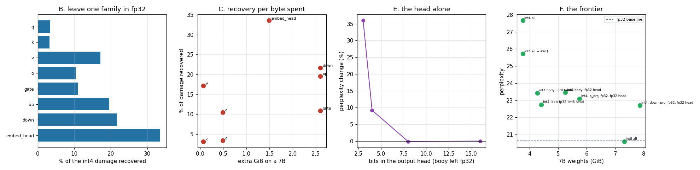

# Mixed-Precision Deployment

---

> Keep the sensitive layers in high precision and [quantize](/shared/glossary/#quantization) the rest — then find out which layers those actually are. The standard advice is "attention output projections plus `lm_head`". Measured against a greedy allocator built from this model's own sensitivity numbers, **the standard recipe loses: 42.1% of the [int4](/shared/glossary/#int4) damage recovered for 5.75 GiB on a 7B, against 51.5% for 5.40 GiB** — more quality, fewer bytes. The reason is `v_proj`, which [GQA](/shared/glossary/#gqa) has shrunk to **0.67% of a 7B's parameters** while it still recovers **17.2%** of the damage: **2.45% of recovery per GiB, 12× more efficient than `o_proj`**. The output head is the other surprise. At [int8](/shared/glossary/#int8) it is **free** (−0.11% [perplexity](/shared/glossary/#perplexity), 99.1% agreement); at int4 it costs **+9.2%** on its own — and because Qwen [ties](/shared/glossary/#weight-tying) it to the input embedding table, that one decision moves **27.6% of a 0.5B and 3.0% of a 70B**, so the same recipe has a wildly different price at different scales. Depth matters too but weakly: protecting the last four layers recovers 22.9% against 17.0% for the first four.

---

## Key Insight

This project leaves selected weight families in high precision while quantizing everything else, and measures both halves of the bargain: how much quality comes back, and how many extra bytes it costs.

## Why This Matters

Real deployments never quantize uniformly. A handful of layers carry most of the quality loss, so protecting exactly those is the cheapest way to buy back accuracy — but "exactly those" is a measurement, not a rule of thumb.

---

**This is project 33.**

### The words first

- **Weight family** — all the layers of one kind across the whole model. `q_proj` means "the query projection in every one of the 24 blocks". Quantization decisions are made per family because that is the granularity a serving engine's config exposes.
- **[GQA](/shared/glossary/#gqa)** (grouped-query attention) — several query heads share one key/value head. Qwen2.5-0.5B has 14 query heads and **2** KV heads, so `k_proj` and `v_proj` are seven times narrower than `q_proj`. This is why they are tiny and, as it turns out, why they matter.
- **`lm_head`** — the final matrix that turns the last hidden state into one score per vocabulary token. Here it is [tied](/shared/glossary/#weight-tying) to the input embedding table: they are literally the same tensor, so quantizing one quantizes both.
- **Leave-one-out** — quantize everything *except* family X. Answers "what does protecting X buy me?"
- **Only-one** — quantize *only* family X. Answers "what does quantizing X cost me?"
- **Recovery** — the fraction of the all-int4 damage that a plan takes back: `(ppl_all_int4 − ppl_plan) / (ppl_all_int4 − ppl_fp32)`. 0% means no better than int4 everywhere, 100% means as good as fp32.

### "If some layers are sensitive, why not just use more bits everywhere? Isn't picking layers a lot of work for a small win?"

Because the bytes are not evenly distributed and neither is the sensitivity, so the two can be matched up. Section A measures the first half: on a 7B, `k_proj` and `v_proj` together are **1.3% of the parameters**, while the three MLP matrices are **75%**. Section B measures the second half: `v_proj` alone recovers 17.2% of the int4 damage.

Put those together and protecting `v_proj` costs 0.07 GiB on a 7B and buys more than protecting `o_proj`, which costs 0.49 GiB. That is not a small win from fiddly work; it is a 7× difference in price for the same effect, sitting in plain sight in a config file.

The work is also cheap. Section B is 16 evaluations — one per family, in each direction — and it is the same measurement you would run anyway to decide whether to ship at all.

### "Why measure sensitivity twice, in two directions? Isn't one enough?"

They answer different questions and they can disagree, which is the point.

- **Leave-one-out** ("int4 everything but X") is the *deployment* question. You are going to quantize the model; the only choice is what to hold back. Its answer already includes the interaction with everything else being at 4 bits.
- **Only-one** ("fp32 everything but X") is the *diagnostic* question. It isolates one family's contribution with nothing else interfering, which is what you want when you are trying to understand *why* a family is fragile.

The two rankings mostly agree here, and where they diverge it is informative: `v_proj` is 4th by leave-one-out but 3rd by only-one, and `k_proj` is the *least* damaging family to quantize on its own (+0.94%) while still recovering 3.2% when held back. Errors in different families are not independent, so "how bad is X alone" does not perfectly predict "how much does protecting X help".

Running only the second one — which is the easier experiment and the one people reach for — would rank `o_proj` above `k_proj` and get the allocation wrong.

---

## Running it

```bash
python3 run.py           # ~8 minutes on 6 CPU threads
python3 run.py --plot    # redraw from the committed findings.json
```

Needs `torch`, `transformers`, `pandas`, `matplotlib`. Imports [`quantlib.py`](../30-quantize-a-7b-model-end-to-end/quantlib.py) from [project 30](../30-quantize-a-7b-model-end-to-end/README.md).

**Two measurement conventions.** The 16-configuration sensitivity sweep in section B uses a 6-window eval subset (fp32 perplexity **18.458**) to keep the run inside its budget; sections E and F use the full 10 windows (fp32 perplexity **20.631**). Percentages and recovery fractions are comparable across both; raw perplexities are not. And all byte figures are for a **7B**, computed from its real published config, because that is the size where the trade-off is a real decision — this box runs a 0.5B.

> **About the numbers.** Everything below comes from the committed
> [`outputs/findings.json`](outputs/findings.json).



---

## A. Where the parameters actually are

Share of total parameters, from real configs:

| model | q_proj | k_proj | v_proj | o_proj | gate/up/down (each) | **embed + head** |
|---|---|---|---|---|---|---|
| Qwen2.5-0.5B | 3.9% | 0.6% | 0.6% | 3.9% | 21.2% | **27.6%** |
| Qwen2.5-7B | 4.7% | 0.7% | 0.7% | 4.7% | 25.0% | **14.3%** |
| Llama-3-70B | 7.6% | 1.0% | 1.0% | 7.6% | 26.6% | **3.0%** |

`lm_head` is tied to the embedding table on this model — confirmed at run time by comparing the two tensors' data pointers, not assumed.

**Two facts to carry forward.**

**The MLP is three quarters of the model.** `gate_proj`, `up_proj` and `down_proj` are 75% of a 7B between them. Anything you decide to protect there is expensive by construction, whatever its sensitivity.

**The output head shrinks by 9× as the model grows** — 27.6% of a 0.5B, 14.3% of a 7B, 3.0% of a 70B. The vocabulary is a constant 152k rows whatever the model, so as the body grows the head's share collapses. **"Keep `lm_head` in fp32" is therefore a completely different proposal at different scales**: a 27% memory increase on a small model, a rounding error on a large one. This is the single biggest reason recipes copied from a paper about one model size mislead at another.

## B. Sensitivity, both directions

Base: int4 group-128 on everything including the head → perplexity **24.610** (fp32: 18.458). "Extra GiB" is what protecting that family costs on a 7B.

| family | **leave-one-out**: % of damage recovered | extra GiB (7B) | **only-one**: perplexity cost |
|---|---|---|---|
| **embed_head** | **33.6%** | 1.49 | +8.68% |
| down_proj | 21.7% | 2.60 | +6.00% |
| up_proj | 19.5% | 2.60 | +3.08% |
| **v_proj** | **17.2%** | **0.07** | +3.79% |
| gate_proj | 10.9% | 2.60 | +2.51% |
| o_proj | 10.4% | 0.49 | +1.70% |
| q_proj | 3.4% | 0.49 | +1.03% |
| k_proj | 3.2% | 0.07 | +0.94% |

**`v_proj` is the anomaly, and it is a large one.** It recovers 17.2% — more than `gate_proj` or `o_proj` — while being **37× smaller than an MLP matrix** and **7× smaller than `o_proj`**.

Two things make it that leveraged, and both come from [GQA](/shared/glossary/#gqa):

1. **It is shared.** With 14 query heads and 2 KV heads, each value head feeds **seven** attention heads. One damaged output channel of `v_proj` is broadcast into seven heads' outputs, so its error has seven times the reach of an equally damaged `q_proj` channel.
2. **Its error is not filtered.** `q_proj` and `k_proj` errors perturb attention *scores*, which then go through a softmax that mostly preserves the ranking of a few dominant keys. `v_proj` errors are the *content* being averaged — they land in the residual stream directly, at full strength.

The same two arguments predict `k_proj` should be relatively harmless, and it is: the least damaging family to quantize on its own.

**And `o_proj` — the family the guide names — is unremarkable.** 10.4% recovered for 0.49 GiB. It is neither the most sensitive nor the cheapest.

## C. The standard recipe against a measured allocator

Rank the families by **recovery per GiB spent on a 7B**:

| rank | family | recovery per GiB | (recovery, cost) |
|---|---|---|---|
| **1** | **v_proj** | **2.45** | 17.2% for 0.07 GiB |
| 2 | k_proj | 0.45 | 3.2% for 0.07 GiB |
| 3 | embed_head | 0.23 | 33.6% for 1.49 GiB |
| 4 | o_proj | 0.21 | 10.4% for 0.49 GiB |
| 5 | down_proj | 0.08 | 21.7% for 2.60 GiB |
| 6 | up_proj | 0.08 | 19.5% for 2.60 GiB |
| 7 | q_proj | 0.07 | 3.4% for 0.49 GiB |
| 8 | gate_proj | 0.04 | 10.9% for 2.60 GiB |

`v_proj` is **5.4× more efficient than the runner-up and 12× more efficient than `o_proj`.**

Now spend the same budget two ways. The guide's recipe is `o_proj` + `lm_head` in fp32, which costs 1.98 GiB above all-int4 on a 7B. Give a greedy allocator that same budget and let it take families in efficiency order:

| plan | perplexity | % of damage recovered | 7B weights | effective bits/weight |
|---|---|---|---|---|
| int4 everything | 24.610 | 0.0% | 3.77 GiB | 4.25 |
| guide: `o_proj` + head fp32 | 22.020 | 42.1% | 5.75 GiB | 6.49 |
| **greedy: `v_proj` + `k_proj` + head fp32** | **21.441** | **51.5%** | **5.40 GiB** | **6.09** |

**The measured allocator recovers 22% more of the damage while using 0.35 GiB less.** It gets there by swapping `o_proj` (0.49 GiB, 10.4%) for `v_proj` + `k_proj` (0.14 GiB, 20.4% between them) and spending the change on nothing at all.

This is not a claim that the conventional recipe is wrong in general — it predates GQA, and on a model with full multi-head attention `v_proj` would be as large as `o_proj` and the ranking would look different. It is a claim that **the recipe encodes an architecture assumption that most 2025-era models no longer satisfy**, and that the 16 evaluations in section B are enough to notice.

## D. Is sensitivity positional?

Protect whole layers instead of whole families, leaving everything else at int4:

| plan | % of the body left in fp32 | % of damage recovered |
|---|---|---|
| first 2 layers | 8.3% | 8.1% |
| last 2 layers | 8.3% | 11.2% |
| first 4 layers | 16.7% | 17.0% |
| **last 4 layers** | 16.7% | **22.9%** |

**Depth matters, and the late layers matter more** — 22.9% against 17.0% for the same 16.7% of the body. The last layers sit closest to the output head, so their errors have the fewest subsequent layers to be absorbed or corrected by.

**But per byte this is a bad deal.** The last four layers cost 16.7% of the body for 22.9% recovery; `v_proj` + `k_proj` cost **1.3%** of the body for 20.4%. Depth is real and it is 13× less efficient than family selection. If you can only express one kind of exception in your serving config, make it the family kind.

## E. The output head on its own

Body left entirely in fp32, only the head quantized:

| head precision | perplexity | change | shadow agreement |
|---|---|---|---|
| fp32 | 20.631 | — | 100% |
| **int8 group-128** | **20.608** | **−0.11%** | **99.1%** |
| int4 group-128 | 22.527 | +9.19% | 82.1% |
| int3 group-128 | 28.057 | +36.00% | 68.1% |

**int8 is free** — the 0.11% "improvement" is noise, and 99.1% of token choices are unchanged. **int4 is not**: +9.19% from one matrix, which is more damage than quantizing any other single family in section B does.

The cliff between int8 and int4 is much steeper here than elsewhere in the model, and there is a structural reason. The head's job is to produce 152,000 logits whose *ranking* is the output — and the top few are usually separated by a fraction of a logit. Everywhere else in the network, a rounding error becomes one small contribution to a hidden state that later layers can absorb. Here it directly perturbs a comparison that decides the answer, with nothing downstream to smooth it.

**Practical rule: quantize the head to 8 bits, never to 4.** And confirm the frontier in section F agrees: `int4 body, int8 head` (23.428) is indistinguishable from `int4 body, fp32 head` (23.458) while being **0.98 GiB smaller on a 7B**. The int8 head is not a compromise, it is the right answer.

## F. The frontier

| plan | perplexity | shadow agreement | 7B weights | bits/weight |
|---|---|---|---|---|
| int4 all | 27.662 | 68.9% | 3.77 GiB | 4.25 |
| int4 all + AWQ | 25.710 | 72.4% | 3.77 GiB | 4.25 |
| **int4 body, int8 head** | **23.428** | 78.3% | **4.28 GiB** | 4.82 |
| int4 body, fp32 head | 23.458 | 78.3% | 5.26 GiB | 5.93 |
| **int4, k+v fp32, int8 head** | **22.754** | **81.8%** | **4.42 GiB** | 4.98 |
| int4, o_proj fp32, fp32 head | 23.100 | 79.4% | 5.75 GiB | 6.49 |
| int4, down_proj fp32, fp32 head | 22.713 | 81.5% | 7.86 GiB | 8.87 |
| int8 all | 20.598 | 98.0% | 7.31 GiB | 8.25 |

(fp32 baseline 20.631, bf16 7B = 14.18 GiB.)

Read the middle of the table carefully, because two rows there settle the whole project:

- **`int4, k+v fp32, int8 head` (4.42 GiB) matches `int4, down_proj fp32, fp32 head` (7.86 GiB)** on perplexity — 22.754 against 22.713, and it is *better* on agreement, 81.8% against 81.5%. **Same quality, 44% less memory.**
- It also beats `int4, o_proj fp32, fp32 head` (23.100 at 5.75 GiB) on both axes, at 77% of the size.

And the row that should not be forgotten: **`int8 all` costs 7.31 GiB and lands at 20.598 — indistinguishable from fp32, with 98.0% agreement.** Every mixed int4 plan in this table sits between 22.7 and 27.7. If your model fits at int8, no amount of clever mixed-precision at int4 will get you back to int8's quality; mixed precision is a tool for when it *does not* fit.

---

## What to take away

1. **A measured allocator beat the standard recipe on both axes** — 51.5% recovery for 5.40 GiB against 42.1% for 5.75 GiB — by protecting `v_proj` + `k_proj` instead of `o_proj`.
2. **`v_proj` is the best byte you can spend**: 0.67% of a 7B, 17.2% of the damage, 12× more recovery per GiB than `o_proj`. [GQA](/shared/glossary/#gqa) made it tiny and left it leveraged, because each value head feeds seven query heads and its error lands in the residual stream unfiltered.
3. **The head goes to int8, never int4.** int8 is free (−0.11%, 99.1% agreement); int4 costs +9.2% from one matrix. And int8-head matches fp32-head at 0.98 GiB less on a 7B.
4. **The same head recipe costs 27.6% of a 0.5B and 3.0% of a 70B.** Recipes copied across model sizes are copied across a 9× difference in price.
5. **Measure sensitivity in both directions.** Only-one ranks `o_proj` above `k_proj`; leave-one-out, which is the question you are actually answering, does not.
6. **Depth is real and inefficient.** Late layers matter more than early ones (22.9% vs 17.0%), but family selection buys the same recovery for 13× fewer bytes.
7. **`int4, k+v fp32, int8 head` at 4.42 GiB equalled a 7.86 GiB plan.** The frontier is not smooth, and the cheap points are on the small families.
8. **If int8 fits, ship int8.** 98.0% agreement at 7.31 GiB. Mixed-precision int4 is for the case where it does not.

## Next

- [Project 34 — calibration drift](../34-calibration-drift-study/README.md): the allocation above was measured on one corpus. Does it survive a change of traffic?
- [Project 35 — the eval suite](../35-eval-suite-for-quantized-models/README.md): how many of the differences in section F's table are actually resolvable?
- [Project 36 — FP4](../36-fp4-blackwell-deployment/README.md): what a non-uniform 4-bit grid does to the same frontier.
- [Project 30 — quantize end-to-end](../30-quantize-a-7b-model-end-to-end/README.md): where the int4 baseline and the AWQ scales come from.

## Resources

- [Ainslie et al. — *GQA* (2023)](https://arxiv.org/abs/2305.13245) — why `k_proj` and `v_proj` became tiny, which is the root of section C's result
- [Dettmers & Zettlemoyer — *The case for 4-bit precision* (2022)](https://arxiv.org/abs/2212.09720) — bit-allocation trade-offs across model scales
- [llama.cpp K-quants](https://github.com/ggml-org/llama.cpp/blob/master/tools/quantize/README.md) — a production mixed-precision scheme that assigns different bit widths per family
- [Inference-systems Phase 5](../../README.md#phase-5-serving-time-quantization-decisions)
