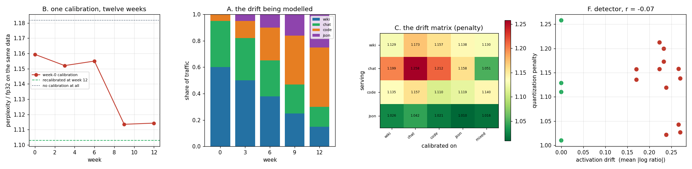

# Calibration Drift Study

---

> [Calibrate](/shared/glossary/#calibration) on week-0 traffic, then watch quality slip as the traffic changes. Measured, the slip does not happen. Twelve weeks of realistic mixture drift — from 60% prose to 45% code — moved the [quantization](/shared/glossary/#quantization) penalty from **×1.159 to ×1.114**, in the *good* direction, and recalibrating at week 12 bought **1.0%**. The mismatch that does cost something is not time, it is *domain*: within one workload the choice of calibration set spans **×1.05 to ×1.26**. And three results turn the intuition inside out. **The matched calibration is only best in 2 of 4 domains** — on chat, calibrating on chat is the **worst** of five choices. **A deliberately mixed calibration set beats the matched one on average (0.968×) and by 20% on chat.** And a cheap [drift detector](/shared/glossary/#distribution-shift) built from activation statistics, the kind you would put on a dashboard, correlates with the actual damage at **r = −0.07** — it predicts nothing. One more number worth carrying: with no calibration at all, the penalty is ×1.23 on prose and ×1.04 on JSON, so **which workload you serve changes your exposure to quantization by 6×**.

---

## Key Insight

This project [calibrates](/shared/glossary/#calibration) a quantized model on one week's traffic and then measures how much quality it loses as the traffic distribution moves away over the following twelve weeks.

## Why This Matters

Calibration is fitted to a snapshot of production data, but production data keeps changing. If nobody re-runs it, quality can decay silently long after the deploy that "passed" — so knowing how fast that happens tells you how often to recalibrate.

---

**This is project 34.**

### The words first

- **[Calibration](/shared/glossary/#calibration)** — running a sample of representative text through the model and recording what the [activations](/shared/glossary/#activations) look like, so the quantizer knows which weights to protect. [AWQ](/shared/glossary/#awq) is the method used here; [project 30](../30-quantize-a-7b-model-end-to-end/README.md) explains it.
- **[Distribution shift / drift](/shared/glossary/#distribution-shift)** — the traffic slowly becoming different from what you fitted to. Here it is modelled as a changing *mixture* of four workloads.
- **Quantization penalty** — quantized [perplexity](/shared/glossary/#perplexity) divided by fp32 perplexity **on the same text**. ×1.10 means the quantized model is 10% more uncertain than the original on that data.
- **Matched / mismatched calibration** — calibrated on the same domain you serve, or on a different one.
- **Drift signal** — a number summarising how far apart two traffic samples' activation statistics are. Defined below.

### "Why measure a *ratio*? Why not just watch perplexity on the dashboard?"

This is the methodological trap the whole project turns on, and it is worth being blunt about.

The evaluation data changes from week to week — that is the entire premise. Code and JSON are far more predictable than encyclopedia prose, so as traffic shifts toward them the *raw* perplexity of both the fp32 model and the quantized model falls. Section B measures it falling from **11.87 to 5.80**.

A dashboard plotting raw quantized perplexity would show a line going steadily down and everyone would conclude things were improving. Meanwhile the actual question — "how much worse is the quantized model than the one it replaced?" — is answered by the *ratio*, and only by the ratio. Everything else in this project is comparisons of ratios for this reason.

The same trap applies to any absolute quality metric on shifting traffic: an eval score that moves because the traffic moved tells you about the traffic, not about the model.

### "The traffic changed, but the *weights* did not. Why would old calibration data hurt anything?"

Because calibration is not a property of the weights alone; it is a decision about which weights to protect, and that decision depends on which input channels are large. AWQ multiplies a weight column up before quantizing it in proportion to `mean|activation|` on that channel, so the column that gets protected is the column that *the calibration traffic* excited.

If the traffic changes, a different set of channels becomes large, and the protection is now pointed at the wrong columns — the weights are unchanged but the *rounding* of them was optimised for a distribution that no longer arrives.

That is the mechanism, and it is real. What this project measures is its **magnitude**, which turns out to be much smaller than the mechanism suggests, for a reason section E makes concrete.

---

## Running it

```bash
python3 run.py           # ~9 minutes on 6 CPU threads
python3 run.py --plot    # redraw from the committed findings.json
```

Needs `torch`, `transformers`, `pandas`, `matplotlib`. Imports [`quantlib.py`](../30-quantize-a-7b-model-end-to-end/quantlib.py) from [project 30](../30-quantize-a-7b-model-end-to-end/README.md).

**How the four workloads are built.** `wiki` is WikiText-2. `code` is the Python standard library that ships with this interpreter. `chat` is instruction prompts wrapped in the model's own chat template — the wrapping matters, because an instruct model's activations inside `<|im_start|>user … <|im_start|>assistant` are noticeably different from those on bare text. `json` is generated structured records, standing in for the tool-calling and structured-output traffic that [Phase 8](../../README.md#phase-8-long-context-structured-output-and-multi-tenant-tricks) is about. All four are real token streams through the real model; none of the activation statistics are synthetic.

> **About the numbers.** Everything below comes from the committed
> [`outputs/findings.json`](outputs/findings.json). Quantization is [AWQ](/shared/glossary/#awq)
> int4 group-128 throughout, on Qwen2.5-0.5B-Instruct.



---

## A. The drift being modelled, and how far it actually moves

Traffic mixture — an assistant that starts out answering prose questions and gradually becomes a coding and tool-calling endpoint:

| week | wiki | chat | code | json |
|---|---|---|---|---|
| 0 | 60% | 35% | 5% | 0% |
| 3 | 50% | 32% | 13% | 5% |
| 6 | 38% | 27% | 25% | 10% |
| 9 | 25% | 22% | 37% | 16% |
| 12 | 15% | 15% | 45% | 25% |

The **drift signal** is how far apart two samples' activation statistics are: for every input channel of every linear, take the ratio of its mean |activation| under the two samples, take `|log|` of that ratio, and average. A log-ratio rather than a difference because these quantities span orders of magnitude across channels — a plain difference would be dominated by the handful of biggest channels, whereas `|log(a/b)|` asks "by what *factor* did this channel move?", and a factor is exactly what a scale is.

| pair | drift signal |
|---|---|
| wiki ↔ code | 0.151 |
| wiki ↔ chat | 0.226 |
| wiki ↔ json | 0.265 |
| **week 0 ↔ week 12** | **0.109** |

**Twelve weeks of drift is a smaller move than any pair of pure domains** — smaller even than wiki-versus-code, despite the mixture going from 5% code to 45% code. Mixtures average, so two mixtures of the same four ingredients in different proportions stay close together in activation space no matter how much the proportions change. This is the first hint at why section B finds so little.

## B. One calibration, twelve weeks: nothing happens

Calibrated once on week-0 traffic, then evaluated against each week's traffic.

| week | fp32 perplexity | quantized | **penalty** | shadow agreement |
|---|---|---|---|---|
| 0 | 11.871 | 13.763 | **×1.1594** | 83.24% |
| 3 | 11.415 | 13.150 | ×1.1520 | 83.20% |
| 6 | 8.823 | 10.190 | ×1.1550 | 85.16% |
| 9 | 7.513 | 8.366 | ×1.1135 | 85.88% |
| 12 | 5.800 | 6.463 | **×1.1143** | 87.25% |

**The penalty went *down*.** ×1.159 at week 0, ×1.114 at week 12 — the stale calibration is doing slightly *better* against drifted traffic than against the traffic it was fitted to. Agreement improves too, 83.2% → 87.3%.

Look at the fp32 column to see why, and to see the trap from the introduction in action. Raw perplexity halves from 11.87 to 5.80 because the traffic became more predictable. Quantization damage scales roughly with how uncertain the model is — there is more to get wrong when the distribution over next tokens is broad — so a workload that shifts toward code and JSON is a workload that shifts toward *less exposure to quantization*, faster than it shifts away from its calibration.

And the recalibration that this project exists to recommend:

| week-12 traffic, served with | penalty |
|---|---|
| the stale week-0 calibration | ×1.1143 |
| **a fresh week-12 calibration** | **×1.1029** |
| no calibration at all (plain [RTN](/shared/glossary/#round-to-nearest-rtn)) | ×1.1817 |

**Recalibrating bought 1.0%** — 14% of the distance between the stale calibration and having no calibration at all. Real, measurable, and not the silent catastrophe the framing implies.

**The honest conclusion for an operations plan:** on a workload that drifts as a *mixture*, quarterly recalibration is a hygiene task, not a safety-critical one. Budget it accordingly, and do not build alerting around it. What follows is the case where the mismatch *does* cost something.

## C. The domain matrix: the mismatch that matters is not time

Every cell is the penalty for serving one domain with a calibration fitted to another. "mixed" is a calibration set built from two windows of each of the four domains. "none" is plain round-to-nearest.

| serving ↓ / calibrated on → | wiki | chat | code | json | **mixed** | *none* |
|---|---|---|---|---|---|---|
| **wiki** (fp32 17.99) | **1.129** | 1.173 | 1.157 | 1.138 | 1.130 | *1.233* |
| **chat** (fp32 4.71) | 1.199 | **1.258** | 1.212 | 1.158 | **1.051** | *1.316* |
| **code** (fp32 8.29) | 1.135 | 1.157 | **1.110** | 1.119 | 1.140 | *1.172* |
| **json** (fp32 1.75) | 1.026 | 1.042 | 1.021 | **1.010** | 1.016 | *1.042* |

(Diagonal — the matched calibration — in bold.)

**Some calibration always beats none.** In 11 of 12 mismatched cells the wrong calibration still beats plain RTN, and the twelfth (`json` served with a chat calibration, 1.0425 against 1.0419) is a tie to three decimal places. **Mis-calibrating is not a way to make things worse than not calibrating** — which is reassuring, and also means "we recalibrated" is not evidence of anything, exactly as [project 30's random-token control](../30-quantize-a-7b-model-end-to-end/README.md#e-the-control-calibrating-on-noise-recovers-half-as-much) found.

**The matched calibration is best in only two of four rows.** On `code` and `json` the diagonal wins, as expected. On `wiki` it wins by 0.001 over the mixed set — a tie. And on `chat` it is the **worst of all five options**: ×1.258, against ×1.158 for a *JSON* calibration and ×1.051 for the mixed set.

**Why calibrating on chat is bad for serving chat.** The chat corpus is templated: the same handful of system-prompt and instruction tokens appear in every sample, and its perplexity is 4.71 against wiki's 17.99. Activation statistics gathered from it are dominated by a narrow, repetitive set of channels, which produces *extreme* AWQ scales — strongly protecting a few columns and neglecting everything else. Those scales fit the calibration sample very well and generalise badly, even to more of the same kind of text. A broader calibration set produces moderate scales that are nearly right everywhere. **This is ordinary overfitting**, and the fix is the ordinary one: more variety in the fitting set, not more data from the same narrow source (which [project 30 section D](../30-quantize-a-7b-model-end-to-end/README.md#d-how-much-calibration-data-do-you-need-less-than-you-think) already showed buys nothing).

**And the column nobody plans for: the *none* column spans 1.042 to 1.316.** Serving JSON, an uncalibrated int4 model costs 4%. Serving prose, it costs 23% — **6× the exposure, same model, same bits.** Structured output is near-deterministic (fp32 perplexity 1.75, the model is barely choosing at all), so there is very little for quantization error to change. Before you budget effort for calibration, check which side of that 6× your traffic is on.

## D/E. What to actually do: calibrate on a mixture

| serving | matched | **mixed** | worst mismatched | none |
|---|---|---|---|---|
| wiki | ×1.1285 | ×1.1301 | ×1.1726 | ×1.2328 |
| **chat** | ×1.2580 | **×1.0514** | ×1.2124 | ×1.3159 |
| code | ×1.1100 | ×1.1402 | ×1.1572 | ×1.1724 |
| json | ×1.0099 | ×1.0163 | ×1.0425 | ×1.0419 |

**Averaged over the four domains, the mixed calibration is 3.2% better than the matched one** (mean ratio 0.968) — and it is a *single* calibration serving all four, where "matched" means maintaining four separate quantized models.

Look at the per-row detail, because the average understates the case. On the three domains where matched wins, it wins by 0.002 to 0.030. On the one where it loses, it loses by 0.207. **The mixed set is never much worse and is sometimes enormously better** — the payoff shape you want from a default.

The practical recipe that falls out is short:

1. **Build the calibration set from a stratified sample of every route you serve**, not from the biggest one. A few hundred prompts per route is plenty ([project 30](../30-quantize-a-7b-model-end-to-end/README.md) measured 1,024 tokens as sufficient).
2. **Do not maintain per-route calibrations** unless you have measured that route's matched calibration beating the mixed one. Here that would have been true twice out of four, by margins too small to justify four deployments.
3. **Recalibrate on a schedule, not on an alarm.** Twelve weeks of drift cost nothing measurable, and section F shows you cannot build a useful alarm anyway.

## F. The drift detector does not work

The obvious ops idea: sample live traffic, recompute the activation statistics, compare them with the calibration set's, and alert when the divergence grows. It is cheap — one forward pass, no labels, no reference model — and if it tracked the damage it would let you skip evaluations entirely.

Sixteen (calibration, serving) pairs, drift signal against measured penalty:

> **Pearson r = −0.070**

**No relationship, and if anything the wrong sign.** The scatter in the figure shows why: the four zero-drift points (the matched diagonal) are spread over penalties from 1.010 to 1.258 — the *entire* vertical range of the plot — while every mismatched point sits in a narrow band of drift between 0.15 and 0.27 with penalties that overlap the diagonal completely.

The reason is that the penalty is dominated by something the detector cannot see: **how much room the serving workload leaves for quantization to do damage**. JSON penalises at ×1.01–1.04 whatever it was calibrated on, because the model is near-deterministic on it; chat penalises at ×1.05–1.26. That is a property of the *evaluation* distribution, and a signal computed from the *distance between distributions* is structurally blind to it.

A detector could be rescued by conditioning on the serving domain — comparing drift within one route rather than across routes — but that is a different and much weaker claim than "watch this number", and it needs the same per-route eval baseline you were trying to avoid computing.

**The takeaway is not "monitoring is useless". It is that the cheap unsupervised signal is not a substitute for running the gate.** Keep a small held-out set per route, run the actual comparison on a schedule, and spend the saved dashboard effort on [project 35](../35-eval-suite-for-quantized-models/README.md)'s question instead: making sure the gate you run can resolve what it is looking for.

---

## What to take away

1. **Twelve weeks of mixture drift cost nothing.** The penalty moved ×1.159 → ×1.114, in the good direction, because the traffic became more predictable faster than it became unfamiliar.
2. **Recalibrating recovered 1.0%** — 14% of the gap to having no calibration at all. Schedule it; do not page for it.
3. **Always measure the ratio to fp32 on the same data.** Raw perplexity halved over the same twelve weeks. A dashboard tracking it would have shown steady improvement while the model was unchanged.
4. **Mixtures drift less than domains.** Week 0 → week 12 scored 0.109 against 0.151 for wiki-versus-code, because averaging four ingredients in different proportions keeps you near the middle.
5. **The matched calibration is best in only 2 of 4 domains**, and on chat it is the worst of five options — templated traffic produces overfitted scales.
6. **Calibrate on a stratified mixture of your routes.** 3.2% better on average than per-route matching, one deployment instead of four, and 20% better on the route where matching fails.
7. **A wrong calibration is essentially never worse than none** (11.5 of 12 cells) — so "we calibrated and it improved" is not evidence the set was right.
8. **Your workload sets your exposure.** Uncalibrated int4 costs 4% on JSON and 23% on prose: a 6× difference from the traffic alone.
9. **The cheap activation-drift detector predicts nothing (r = −0.07).** It is blind to how much room the serving distribution leaves for damage, which is what actually sets the penalty.

## Next

- [Project 35 — the eval suite](../35-eval-suite-for-quantized-models/README.md): if you cannot detect drift cheaply, the gate has to work. How often does it?
- [Project 30 — quantize end-to-end](../30-quantize-a-7b-model-end-to-end/README.md): where AWQ and the calibration-size result come from.
- [Project 31 — FP8 KV cache](../31-fp8-kv-cache/README.md): the same wrong-calibration question, for a KV-cache scale, with a sharper answer.
- [Project 29 — workload sensitivity](../29-workload-sensitivity/README.md): the same "the right setting depends on the route" theme, for speculative decoding.

## Resources

- [Lin et al. — *AWQ* (2023)](https://arxiv.org/abs/2306.00978) — section 4.3 discusses calibration-set robustness, which this project tests directly
- [Williams & Aletras — *On the Impact of Calibration Data in Post-training Quantization* (2024)](https://arxiv.org/abs/2311.09755) — the same question at larger scale, with compatible conclusions
- [vLLM — quantization calibration](https://docs.vllm.ai/en/latest/features/quantization/) — where the calibration set enters a real pipeline
- [Inference-systems Phase 5](../../README.md#phase-5-serving-time-quantization-decisions)
