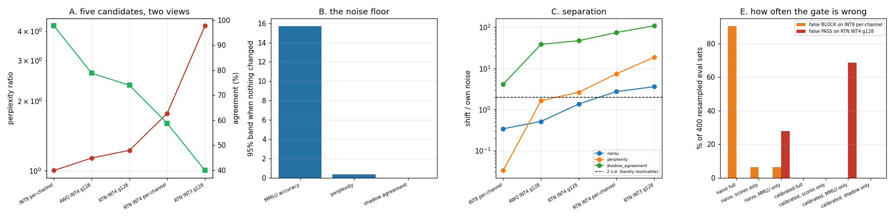

# Eval-Suite for Quantized Models

---

> Build a gate that blocks a [quantized](/shared/glossary/#quantization) model if any eval regresses too far — then audit the gate, which is the part everyone skips. Writing it takes twenty lines; the audit finds that **the obvious thresholds block a harmless model 90.5% of the time**. Two measurements fix it, and both are surprising. First, the noise floor: [MMLU](/shared/glossary/#mmlu) on 140 questions has a **95% band of 15.7 points when nothing has changed**, so a "block if it drops 3 points" rule is 0.72 [standard deviations](/shared/glossary/#standard-error) — a coin flip with a clipboard. Resolving a genuine 1-point drop would need **9,900 questions**. Second, [shadow agreement](/shared/glossary/#shadow-evaluation) — the fraction of tokens where the candidate picks what production picks — separates the mildest candidate at **4.1 [standard errors](/shared/glossary/#standard-error) against MMLU's 0.34**, on forward passes it shares with the perplexity check, for **3.2× less compute**. Retuning the thresholds from those two facts takes the gate from **90.5% false blocks to 0.0%, with false passes still at 0.0%**. And the counter-example that settles the argument: an **MMLU-only gate, correctly calibrated, waves the damaged model through 68.8% of the time.**

---

## Key Insight

This project builds an automated [quality gate](/shared/glossary/#quality-gate): a script that runs several evaluations on a quantized model and refuses the deploy if any of them regresses by more than a set amount.

## Why This Matters

[Quantization](/shared/glossary/#quantization) regressions are silent — the model still answers, just slightly worse. A gate in CI is the only thing that reliably catches that before customers do, and it has to be automatic to actually run every time.

---

**This is project 35.**

### The words first

- **[Quality gate](/shared/glossary/#quality-gate)** — a fixed set of checks a candidate model must pass before it is allowed to serve traffic.
- **False block** — the gate refuses a model that was fine. Costs you the deploy and, eventually, people's trust in the gate.
- **False pass** — the gate approves a model that was damaged. Costs you a customer ticket three weeks later.
- **[Standard error](/shared/glossary/#standard-error)** — how much a measured score would move if you re-drew the eval set. Not a mistake; the width of the ruler.
- **[Bootstrap](/shared/glossary/#bootstrap-statistics)** — estimating that width by resampling your one eval set, with replacement, thousands of times. Named from "pulling yourself up by your own bootstraps", because you get a distribution out of a single sample.
- **Paired comparison** — comparing two systems *on the same items*, and scoring whether they agreed, rather than comparing two aggregate scores. [Shadow agreement](/shared/glossary/#shadow-evaluation) is the paired version of "is the model still good".
- **Separation** — how far a metric moves when the model is damaged, divided by how far it moves when nothing changed. Below about 2, the metric cannot see the thing it is being asked to detect.

### "The gate already runs MMLU and perplexity. Why add a comparison against the old model — isn't that measuring the same quality twice?"

No, and the difference is the point of the project.

MMLU and perplexity are **absolute** scores: each model gets a number, and you subtract. Both numbers carry sampling error, because both were computed on a *sample* of questions or text, and the errors do not cancel — they add. That is where the 15.7-point band in section B comes from.

Shadow agreement is **paired**: it goes through the same items and asks, item by item, *did these two models make the same choice here?* If the candidate is identical to production, the answer is "yes" on every single item, and the score is exactly 1.000 with no error bar at all. All the shared difficulty — which questions were hard, which text was unusual — cancels out, because both models saw exactly the same things and are compared on each one.

That is the gap the extra check fills. It is not a second opinion on quality; it is the only check in the suite whose *null distribution is a point*. Sections B and C put numbers on the difference, and section E shows it is the difference between a gate that works and one that does not.

It is also nearly free. The candidate's greedy predictions come out of the same forward passes that compute perplexity, so shadow agreement costs no additional compute at all.

### "If it costs nothing and works better, why keep MMLU?"

Because agreement measures *similarity to the incumbent*, not *quality*. It cannot tell you the new model is good, only that it behaves like the old one. If the baseline is bad, or if the candidate is deliberately different (a new fine-tune, not just a quantization), agreement is the wrong instrument.

For a **quantization** gate, though, "behaves like the model it replaces" is exactly the property you want, which is why it dominates here. Section E measures what MMLU is contributing on top: a 68.8% false-pass rate on its own, and nothing the other checks did not already catch when combined.

---

## Running it

```bash
python3 run.py           # ~8 minutes on 6 CPU threads
python3 run.py --plot    # redraw from the committed findings.json
```

Needs `torch`, `transformers`, `pandas`, `matplotlib`. Imports [`quantlib.py`](../30-quantize-a-7b-model-end-to-end/quantlib.py) from [project 30](../30-quantize-a-7b-model-end-to-end/README.md). The gate itself is [`gate.py`](gate.py) and is meant to be read.

**The one design decision that makes the audit possible.** `gate.py` stores the **per-item** record — was question 47 right, what was the loss on window 3, did token 219 match production — and computes aggregate scores from it on demand, rather than storing the aggregates. Once you have the per-item record, resampling the eval set costs microseconds, so "how often would this gate be wrong?" becomes a question you can answer in a loop instead of a thing you assume. Sections B and E are both just resampling; neither runs the model at all.

> **About the numbers.** Everything below comes from the committed
> [`outputs/findings.json`](outputs/findings.json). Baseline: Qwen2.5-0.5B-Instruct
> in fp32, perplexity **20.631**, MMLU **45.0%** on 140 questions.



---

## A. Five candidates, four evals, every item kept

| candidate | perplexity | ratio | MMLU | drop (pts) | **shadow agreement** | identical generations |
|---|---|---|---|---|---|---|
| INT8 per-channel | 20.683 | ×1.003 | 43.6% | 1.4 | **97.73%** | 62% (5/8) |
| AWQ INT4 g128 | 23.409 | ×1.135 | 42.9% | 2.1 | 78.77% | 12% (1/8) |
| RTN INT4 g128 | 25.263 | ×1.225 | 39.3% | 5.7 | 73.97% | 0% |
| RTN INT4 per-channel | 36.493 | ×1.769 | 33.6% | 11.4 | 58.75% | 0% |
| RTN INT3 g128 | 87.181 | ×4.226 | 30.0% | 15.0 | 39.88% | 0% |

Read across the INT8 row, because it is the one the rest of the project hangs on. Perplexity says ×1.003 — as close to unchanged as a measurement gets. MMLU says −1.4 points. Shadow agreement says **97.73%**, which means int8 quantization changed **2.3% of the model's greedy token choices**. All three are true. INT8 is the reference for "harmless", and harmless already looks like 2.3% of tokens moving.

That number is why the intuitive threshold fails. "Agreement must be at least 98%" sounds conservative and is in fact *tighter than a lossless change*. Nobody would guess that; you have to measure it.

## B. What each metric cannot see

Bootstrap the baseline's own per-item scores 2,000 times. This is the spread you get **when the model has not changed at all** — pure sampling noise.

| metric | 1 s.d. | 95% band |
|---|---|---|
| **MMLU accuracy (n = 140)** | **4.18 points** | **15.71 points** |
| perplexity (10 windows) | ×0.080 | ×0.354 |
| shadow agreement | **0.000** | **0.000** |

**MMLU's 95% band is 15.7 points wide.** Draw a different 140 questions from the same pool and the same model can score anywhere across a 15-point range. The naive gate's threshold — "block if MMLU drops more than 3 points" — is **0.72 standard deviations** of that noise. It is not a strict rule or a lenient one; it is a rule that decides substantially at random.

**Resolving a genuine 1-point drop at 2 s.d. would need 9,900 questions.** Sampling error shrinks as `1/√n`, so halving the uncertainty costs four times the questions. At 45 seconds per 140 questions on this box, 9,900 questions is about 53 minutes per candidate, per gate run. That is the real price of a 1-point MMLU threshold, and it is why almost no serving team's MMLU check means what they think it means.

**Shadow agreement's noise floor is exactly zero**, and that is not a rounding artifact. Greedy decoding is deterministic, so an unchanged model produces identical tokens on every item, so agreement is 1.000 on every resample. Its null distribution is a point mass. (The metric's *estimate* still has an error bar once the models genuinely differ — section C uses that instead, which is the fair comparison.)

## C. Separation, and separation per second

Separation = how far the metric moves, in units of its own noise. The **mildest** candidate is the hard case, so that is the column reported: this is the gate's ability to notice a *small* regression, which is the only kind that gets deployed.

| metric | noise (1 s.d.) | cost | separation on INT8 | on AWQ INT4 | on RTN INT3 |
|---|---|---|---|---|---|
| MMLU | 4.18 pts | **45.3 s** | **0.34** | 0.51 | 3.59 |
| perplexity | ×0.077 | 14.0 s | 0.03 | 1.64 | 18.75 |
| **shadow agreement** | 0.0055 | **14.0 s (shared)** | **4.10** | **38.4** | **108.6** |

**Shadow agreement separates 12× better than MMLU on the mildest candidate and 3.2× cheaper — about 40× more signal per second.** And "cheaper" understates it: the 14.0 s is the perplexity pass, which the gate was going to run anyway. The greedy predictions fall out of the same logits. Shadow agreement's marginal cost is a comparison of two integer arrays.

**MMLU cannot resolve either of the two mildest candidates** — separation 0.34 and 0.51, both far below the 2 that "distinguishable" requires. It only becomes reliable at RTN INT3 (3.59), a model so broken that perplexity is 4.2× the baseline and you would not need an eval to notice.

**Perplexity is the worst of the three on INT8 (0.03) and second best on INT3 (18.75).** Its dynamic range is enormous but its floor is high, because a perplexity computed over 10 windows of text inherits the variance of which text you happened to pick. It is a good instrument for large damage and blind to small damage — the opposite of what a gate needs.

## D. Do the evals agree on the ranking?

Ordering the five candidates worst-to-best by each metric, against the perplexity ordering as reference:

| metric | ordering | inversions |
|---|---|---|
| perplexity | INT8 < AWQ INT4 < RTN INT4 g128 < RTN INT4 pc < RTN INT3 | 0 |
| MMLU | same | 0 |
| shadow disagreement | same | 0 |
| **generation divergence** | INT8 < **RTN INT4 g128 < AWQ INT4** < RTN INT4 pc < RTN INT3 | **1** |

**The three quantitative metrics agree completely on the order.** That is reassuring and it is also why ranking is the wrong test: all four metrics can rank a five-model ladder correctly and still be useless at deciding whether *one* model has regressed, because ranking five things spread over a 4× perplexity range is easy and resolving a 0.3% change is hard. Section E is the test that matters.

**The generation check is the one that inverts**, putting the worse model (RTN INT4 g128) ahead of the better one (AWQ INT4 g128). With 8 generations, the metric can only take nine distinct values, and it is measuring where two token sequences first diverge — a quantity dominated by whichever model happened to pick the same first word. [Project 30 saw the same thing](../30-quantize-a-7b-model-end-to-end/README.md#f-the-deploy-gate) more starkly, with a worse model producing the nicer-looking answer. **Keep the generation check for human review; do not let it vote.**

## E. The audit: how often is the gate wrong?

400 random half-splits of the eval pool. Each split is a legitimate way the eval set could have been drawn. **False block** = the gate refuses INT8 per-channel, which is harmless (×1.003 perplexity). **False pass** = the gate approves RTN INT4 g128, which is genuinely damaged (×1.225 perplexity, 74% agreement).

The **naive** thresholds are what a team writes on day one: perplexity ≤ ×1.05, MMLU drop ≤ 3 pts, agreement ≥ 98%, ≥ 50% identical generations.

| gate | false block | false pass |
|---|---|---|
| **naive, full** | **90.5%** | 0.0% |
| naive, scores only (perplexity + MMLU) | 6.2% | 0.0% |
| naive, MMLU only | 6.2% | **27.7%** |

**The naive full gate blocks a lossless model nine times out of ten.** Almost all of it (89.8 of the 90.5 points) is the 98% agreement threshold rejecting INT8's 97.73%. A gate like this does not survive contact with a team: the third time it blocks a deploy that is obviously fine, someone adds `--force`, and after that it is decoration.

Now retune from the two measurements above, and nothing else. MMLU's threshold goes to **8.4 points** — 2 s.d., the smallest drop 140 questions can actually resolve. Agreement goes to **95%**, below what the harmless reference scores. Identical generations goes to 30%, since section D showed the metric is coarse.

| gate | false block | false pass |
|---|---|---|
| **calibrated, full** | **0.0%** | **0.0%** |
| calibrated, scores only | 0.0% | 0.0% |
| **calibrated, MMLU only** | 0.0% | **68.8%** |
| **calibrated, shadow only** | **0.0%** | **0.0%** |

**Two measurements took the gate from 90.5% false blocks to 0.0%, without giving up a single false pass.** No new evals, no more data, no cleverness — only thresholds chosen from the noise floor and a harmless reference instead of from intuition.

Three details in that table are worth pulling out.

**Setting MMLU's threshold honestly makes MMLU useless.** At 8.4 points it catches the damaged model in only 31.2% of splits, so an MMLU-only gate lets it through **68.8% of the time**. This is the trap in full: the naive 3-point threshold catches it 72.3% of the time but blocks healthy models 6.2% of the time *and* only "works" by being tighter than the metric's resolution. **At n = 140, MMLU has no honest threshold that is also a useful one.** Either run 10,000 questions or stop pretending the check is doing work.

**The shadow-only gate is perfect: 0.0% and 0.0%, from a single metric costing zero marginal compute.** Everything else in the suite is currently contributing nothing that it does not already provide — on this ladder of candidates.

**But do not delete the other checks on that basis.** Agreement is blind to a candidate that differs from the baseline *for a good reason*, and it cannot notice if the baseline itself has drifted. The scores are the part of the suite that measures quality rather than similarity; they are just not the part that resolves small quantization regressions.

## F. The recommended gate

The two gates on the five candidates, point estimates on the full eval pool:

| candidate | naive verdict | **calibrated verdict** |
|---|---|---|
| INT8 per-channel | **BLOCK** (shadow) | **PASS** |
| AWQ INT4 g128 | BLOCK (ppl, shadow, gens) | BLOCK (ppl, shadow, gens) |
| RTN INT4 g128 | BLOCK (all four) | BLOCK (ppl, shadow, gens) |
| RTN INT4 per-channel | BLOCK (all four) | BLOCK (all four) |
| RTN INT3 g128 | BLOCK (all four) | BLOCK (all four) |

Cost, per candidate, on this box: **76 s** — perplexity + shadow 14 s, MMLU 45 s, generations 17 s. **60% of the budget goes to the check with the lowest separation.**

What to ship:

```
perplexity ratio     ≤ 1.05      # cheap, shares its forward pass with shadow
shadow agreement     ≥ 0.95      # the one that decides; threshold from a
                                 #   measured harmless reference, not a guess
generation sample    8 prompts   # reported for a human, not gated on
capability eval      keep, but size it or drop the threshold
```

And the procedure, which is the actual deliverable:

1. **Measure the noise floor first.** Bootstrap each metric on the baseline. Any threshold tighter than ~2 s.d. is a random-number generator.
2. **Measure a harmless reference.** Quantize to int8 — known lossless — and see what it scores. That is what "no regression" looks like on your model and your eval set. Set the threshold below it, not at a round number.
3. **Audit with split-half resampling.** You already have the per-item record. 400 splits is a second of compute and it tells you your false-block and false-pass rates before the gate ever blocks a real deploy.
4. **Re-audit whenever the eval set, the baseline, or the model family changes.** Every number above is specific to those three things.

---

## What to take away

1. **The obvious thresholds blocked a lossless model 90.5% of the time.** Not because the checks were wrong, because the numbers in them were guesses.
2. **A "lossless" int8 quantization still changes 2.3% of greedy tokens.** Any agreement threshold above 97.7% rejects it. You cannot know that without measuring a harmless reference.
3. **MMLU on 140 questions has a 15.7-point 95% band.** A 3-point threshold is 0.72 s.d. — it decides largely at random. Resolving 1 point would need 9,900 questions.
4. **Shadow agreement separates 12× better than MMLU at 3.2× less cost**, because it is *paired*: an unchanged model scores exactly 1.000 with no error bar, so all the sampling noise cancels.
5. **Two measurements — the noise floor and a harmless reference — took the gate from 90.5% false blocks to 0.0%** with false passes unchanged at 0.0%.
6. **An honestly-calibrated MMLU-only gate has a 68.8% false-pass rate.** Sizing the threshold correctly is what exposes that the eval was never resolving anything.
7. **All four metrics rank five candidates correctly, and three of them still cannot decide about one.** Ranking a ladder is easy; resolving a single small regression is the job.
8. **Keep the per-item record.** Every result in sections B and E is resampling; none of it runs the model. Storing only aggregate scores throws that away for no saving.

## Next

- [Project 36 — FP4 deployment](../36-fp4-blackwell-deployment/README.md): a new format run through this gate.
- [Project 30 — quantize end-to-end](../30-quantize-a-7b-model-end-to-end/README.md): the pipeline whose output this gate judges, and where the candidate ladder comes from.
- [Project 34 — calibration drift](../34-calibration-drift-study/README.md): why the cheap unsupervised monitor cannot replace running this gate.
- [Project 06 — determinism audit](../06-determinism-audit/README.md): what "identical output" means when the model has not changed at all.

## Resources

- [Miller — *Adding Error Bars to Evals* (2024)](https://arxiv.org/abs/2411.00640) — the statistics of LLM benchmark comparisons, including the paired-comparison argument in section C
- [Efron & Tibshirani — *An Introduction to the Bootstrap*](https://doi.org/10.1201/9780429246593) — the resampling method sections B and E run on
- [Hendrycks et al. — *MMLU* (2020)](https://arxiv.org/abs/2009.03300) — the benchmark whose 140-question error bar is the subject of section B
- [Inference-systems Phase 5](../../README.md#phase-5-serving-time-quantization-decisions)
