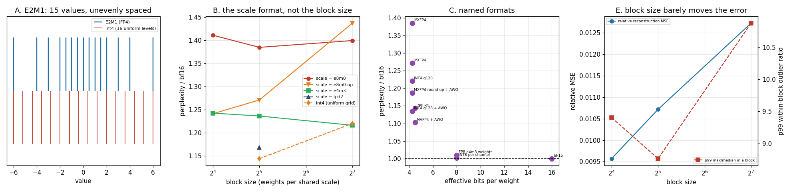

# FP4 (Blackwell) Deployment

---

> Benchmark [FP4](/shared/glossary/#fp4) weights against [FP8](/shared/glossary/#fp8) on hardware that has neither, by building both shipping FP4 formats from their specifications — the numerics are fully determined, so every quality figure here is measured, and only throughput is arithmetic. The result inverts the marketing. [NVFP4](/shared/glossary/#nvfp4)'s two advantages over [MXFP4](/shared/glossary/#mxfp4) are a smaller block and a better scale format, and **the block does nothing**: with an fp8 scale, going from 128 weights per block to 16 moves [perplexity](/shared/glossary/#perplexity) by **−2%, in the wrong direction**. The scale format is the whole gap — a power-of-two-only scale costs **×1.385**, an fp8 scale **×1.237**, at identical size. And the incumbent wins the like-for-like: **plain asymmetric [int4](/shared/glossary/#int4) group-128 (×1.220) beats every MXFP4 variant at the same 4.25 bits per weight**, with [AWQ](/shared/glossary/#awq) on top it reaches ×1.135, and MXFP4 + AWQ only manages ×1.187. NVFP4 + AWQ is the best 4-bit result at **×1.102**, but it costs 4.5 bits, not 4. Three more measured facts a deployment needs: the second-level per-tensor scale nobody mentions is worth **8.0%**; "4-bit" is really **4.25 or 4.5 bits**; and the [quality gate](/shared/glossary/#quality-gate) from [project 35](../35-eval-suite-for-quantized-models/README.md) blocks all of them — including FP8, by 0.03 points.

---

## Key Insight

This project compares 4-bit floating-point ([FP4](/shared/glossary/#fp4)) weights against 8-bit ([FP8](/shared/glossary/#fp8)) — measuring answer quality and memory exactly, and computing throughput and the operational trade-offs from published hardware specifications.

## Why This Matters

FP4 halves memory again over FP8, which is the difference between a very large model needing one GPU or two. New [Blackwell](/shared/glossary/#blackwell) hardware accelerates it, but 16 possible values is close to the edge of usable precision, so whether it is actually safe has to be measured rather than assumed.

---

**This is project 36.**

### "There is no Blackwell GPU here. What can this project honestly claim?"

More than you would expect, and the split is worth stating precisely up front.

**Fully measured (sections A, B, C, E):** the *numbers* MXFP4 and NVFP4 store are completely determined by their published specifications — the value grid, the block size, the scale format, the rounding. A from-scratch implementation reproduces, bit for bit, the weights a B200 would hold. So every perplexity and agreement figure below is a real measurement of a real quantized model. Hardware would change how fast those numbers are multiplied, not what they are.

**Arithmetic, and labelled as such (section D):** throughput and card counts, from NVIDIA's published dense Tensor-Core figures and HBM capacities. No wall-clock FP4 timing appears anywhere in this project, because none was possible.

**Not addressed:** kernel maturity, driver behaviour, and whether a given inference engine's FP4 path is correct on day one. Those are real operational risks and they need the hardware.

### The words first

- **[FP4](/shared/glossary/#fp4) / E2M1** — 4 bits: 1 sign, 2 [exponent](/shared/glossary/#exponent), 1 [mantissa](/shared/glossary/#mantissa). Sixteen bit patterns, **fifteen distinct values** — two patterns are `+0` and `−0`.
- **[Microscaling](/shared/glossary/#microscaling)** — giving each small *block* of adjacent weights its own shared [scaling factor](/shared/glossary/#scaling-factor). "Micro" is the block: 16 or 32 values, not thousands. Without it, 4 bits have a dynamic range of about 12× and are useless for a weight matrix.
- **[MXFP4](/shared/glossary/#mxfp4)** — Open Compute's standard: block of **32**, shared scale in **E8M0** (8 exponent bits, *no mantissa*, so the scale is a power of two). 4 + 8/32 = **4.25 bits/weight**.
- **[NVFP4](/shared/glossary/#nvfp4)** — NVIDIA's Blackwell format: block of **16**, shared scale in **FP8 E4M3**, plus one FP32 scale for the whole tensor. 4 + 8/16 = **4.5 bits/weight**.
- **[Blackwell](/shared/glossary/#blackwell)** — NVIDIA's 2024 architecture (B200), the first with FP4 [Tensor Cores](/shared/glossary/#tensor-core).

### "Why does a 4-bit format need an 8-bit scale? Isn't that just 12 bits?"

No — it is 4.25 or 4.5, because **the scale is shared**. One 8-bit scale covering 32 weights adds 8/32 = 0.25 bits to each of them.

And it is not optional. Look at what 4 bits alone can express: the largest E2M1 value is 6.0 and the smallest non-zero is 0.5, so the entire format spans a **12× dynamic range**. A single row of a real weight matrix routinely spans thousands. Without a scale, almost every weight would round to 0 or to ±6.

The shared scale is what turns "16 fixed values" into "16 values positioned wherever this block needs them". That is the whole idea, and the OCP name for it — [microscaling](/shared/glossary/#microscaling) — is literally "scaling at the granularity of a micro block".

### "Then why do the two formats disagree about the block and the scale?"

Because both choices trade storage against fidelity, in different currencies, and the standards bodies bet differently:

- **Block size.** Smaller blocks mean fewer weights sharing a scale, so one large weight spoils fewer neighbours — but the scale is amortised over fewer weights, so it costs more per weight. 32 → 16 doubles the scale overhead from 0.25 to 0.5 bits.
- **Scale format.** **E8M0** can only represent powers of two, so applying it is an exponent addition — nearly free in silicon — but the scale can be off by up to a factor of √2 from what the block actually wanted. **E4M3** is a real number, so the scale lands where it should, at the cost of a genuine multiply.

NVFP4 pays 0.25 more bits per weight and buys both. **Section B separates them and finds only one is doing anything.**

---

## Running it

```bash
python3 run.py           # ~8 minutes on 6 CPU threads
python3 run.py --plot    # redraw from the committed findings.json
```

Needs `torch`, `transformers`, `pandas`, `matplotlib`. Imports [`quantlib.py`](../30-quantize-a-7b-model-end-to-end/quantlib.py) from [project 30](../30-quantize-a-7b-model-end-to-end/README.md); the FP4 implementation is [`fp4.py`](fp4.py) and is meant to be read.

**One implementation note that changes a headline.** The MX standard does not fully pin down how the encoder rounds the shared exponent, and the direction matters: rounding *down* makes the scale too small so the block's largest values clip at 6.0, and rounding *up* wastes range. Section B measures **both** — `e8m0` (round-to-nearest) and `e8m0-up` (round up, never clips) — so no MXFP4 conclusion here rests on one arbitrary choice. Where a single MXFP4 number is quoted, it is the better of the two.

> **About the numbers.** Everything below comes from the committed
> [`outputs/findings.json`](outputs/findings.json). Baseline: Qwen2.5-0.5B-Instruct
> in fp32, perplexity **18.907** on 7 × 512 held-out
> [WikiText](https://huggingface.co/datasets/Salesforce/wikitext) tokens.



---

## A. E2M1, built from its definition

Derived rather than typed in: for each of three exponents, a mantissa bit choosing between ×1 and ×1.5, plus a subnormal step.

```
  -6  -4  -3  -2  -1.5  -1  -0.5   0   0.5   1  1.5   2   3   4   6
```

**Fifteen distinct values from sixteen bit patterns** (`+0` and `−0` are the same number). Gaps between consecutive positive values: **0.5, 0.5, 0.5, 1.0, 1.0, 2.0** — the grid is *logarithmic*, fine near zero and coarse at the top. Dynamic range 6.0 / 0.5 = **12×**.

The rounding behaviour, probed directly:

| input | 0.24 | 0.26 | 0.9 | 1.3 | 2.6 | 5.0 | 7.0 | −3.4 |
|---|---|---|---|---|---|---|---|---|
| stored as | 0.0 | 0.5 | 1.0 | 1.5 | 3.0 | 4.0 | **6.0** | −3.0 |

Two things to notice. **7.0 saturates to 6.0** rather than overflowing — the implementation clamps, as conversion hardware does. And near the top of the range the rounding is brutal: 5.0 becomes 4.0, a 20% error, because the only neighbours are 4 and 6.

**This is the interesting bet the format makes.** Weight distributions are bell-shaped, so most values sit near zero where E2M1 is fine and only a few sit in the tail where it is coarse. Compare int4, whose 16 levels are *evenly* spaced: uniformly mediocre everywhere, rather than good in the middle and bad at the edges. Section B measures which bet pays.

## B. Which design axis actually carries the win?

Perplexity relative to fp32, for every combination of block size and scale format. `fp32` is not a real format — it is the reference showing what the scale's own rounding costs.

| block ↓ / scale → | **e8m0** (power of two, nearest) | **e8m0-up** (power of two, ceiling) | **e4m3** (fp8) | fp32 (reference) |
|---|---|---|---|---|
| 16 (4.50 bits) | ×1.411 | ×1.241 | **×1.243** | — |
| 32 (4.25 bits) | ×1.385 | ×1.271 | **×1.237** | ×1.168 |
| 128 (4.06 bits) | ×1.399 | ×1.437 | **×1.216** | — |

**Read the `e4m3` column downwards: 1.243 → 1.237 → 1.216.** Going from 16 weights per block to 128 — eight times fewer scales, 0.44 fewer bits per weight — makes perplexity *slightly better*. The differences are inside the noise, but the direction is unambiguous about one thing: **shrinking the block buys nothing here.**

**Read across a row instead: 1.385 versus 1.237 at block 32.** Swapping the power-of-two scale for an fp8 scale, at *identical* storage, removes 40% of the gap to a perfect fp32 scale (1.168). That is the entire NVFP4-versus-MXFP4 difference, and it is on the scale-format axis alone.

So NVFP4 spends 0.25 extra bits per weight on two changes, and only one of them earns anything. **A hypothetical "block 32 + e4m3 scale" — 4.25 bits, the same size as MXFP4 — scores ×1.237, essentially tying NVFP4's 4.5-bit configuration.** The smaller block is paying rent it does not cover.

Section E explains why, with the statistic that predicts it: the **p99 within-block max/median ratio** is 9.40 at block 16 and 10.88 at block 128 — barely different. Weight matrices, unlike activations, do not have violent per-channel outliers ([project 32](../32-w4a8-ablation/README.md) measured activation ratios up to 1,457×). With no outliers to isolate, a smaller block has nothing to isolate them from.

**And the rounding direction is worth as much as the format choice.** At block 32, round-to-nearest scores ×1.385 and round-up ×1.271 — an 8% difference from a single line in the encoder. Round-to-nearest gives half the blocks a scale slightly too small, so their largest weights clip at 6.0, and clipping the largest weight in a block is expensive. (At block 128 the ranking flips: with 128 weights sharing a scale, wasting up to 2× of range hurts more than occasionally clipping one value.)

### The incumbent, at the same bit budget

| plan | perplexity ratio | bits/weight |
|---|---|---|
| MXFP4 (e8m0, best rounding) | ×1.271 | 4.25 |
| **int4 asymmetric group-128** | **×1.220** | **4.25** |
| e4m3-scaled FP4, block 128 | ×1.216 | 4.06 |
| int4 asymmetric group-32 | ×1.144 | 5.00 |

**Plain asymmetric int4 group-128 beats MXFP4 at exactly the same 4.25 bits per weight** — and int4 here has no calibration, no algorithm, nothing but round-to-nearest.

The bet from section A did not pay. Two reasons, both structural:

1. **int4 has a zero-point and E2M1 does not.** An asymmetric int4 block stores a scale *and* an offset, so its 16 levels can be positioned over the block's actual range, which is rarely centred on zero. E2M1's grid is symmetric and fixed; half of it may cover values the block does not contain.
2. **E2M1 spends three of its seven positive levels above 2.0**, where weights are rare. int4's 16 levels are all inside the block's range by construction.

The logarithmic grid is the right answer when the distribution has heavy tails — which is why [FP8 beats int8 for the *KV cache*](../31-fp8-kv-cache/README.md#b-what-each-storage-plan-costs) by 2.1×. Weights inside one small block are not that distribution. **Same argument, opposite conclusion, because the data is different.**

## C. The named formats, head to head

| plan | perplexity | ratio | shadow agreement | 70B weights |
|---|---|---|---|---|
| BF16 (baseline) | 18.907 | ×1.000 | 100% | 131.4 GiB |
| **INT8 per-channel** | 18.947 | **×1.002** | **97.9%** | 65.7 GiB |
| FP8 e4m3 weights | 19.102 | ×1.010 | 95.0% | 65.7 GiB |
| MXFP4 (e8m0 round-to-nearest) | 26.182 | ×1.385 | 69.8% | **34.9 GiB** |
| MXFP4 (e8m0 round-up) | 24.035 | ×1.271 | 73.7% | **34.9 GiB** |
| INT4 g128 (RTN) | 23.076 | ×1.220 | 74.8% | **34.9 GiB** |
| MXFP4 round-up + AWQ | 22.439 | ×1.187 | 76.3% | **34.9 GiB** |
| INT4 g128 + AWQ | 21.458 | ×1.135 | 80.3% | **34.9 GiB** |
| NVFP4 (block 16, e4m3, 2-level) | 21.615 | ×1.143 | 81.1% | 37.0 GiB |
| **NVFP4 + AWQ** | **20.844** | **×1.102** | **83.7%** | 37.0 GiB |

**NVFP4 + AWQ is the best 4-bit result** — ×1.102, and 83.7% of greedy token choices unchanged. It is a genuine improvement on the int4 incumbent (×1.135), for 0.25 extra bits, which is 2.1 GiB on a 70B.

**MXFP4 is dominated.** At its best (round-up + AWQ, ×1.187) it loses to plain int4 g128 + AWQ (×1.135) *at the same size*. On this model there is no bit budget at which MXFP4 is the right choice. If your hardware accelerates MXFP4 specifically, that changes the calculus — but the format itself is not buying quality.

**And an unexpected result at 8 bits: INT8 per-channel beats FP8 e4m3 on weights** — ×1.002 against ×1.010, and 97.9% agreement against 95.0%. Same one byte per number. This is the exact mirror of [project 31's KV-cache finding](../31-fp8-kv-cache/README.md#b-what-each-storage-plan-costs), where FP8 beat int8 by 2.1×, and the explanation is the same one: keys and values have long tails that a logarithmic grid handles well; weights inside a channel are close to Gaussian and well-conditioned, and a uniform grid spends all 256 levels where they are needed. **"FP8 everywhere" is the right default for the cache and a slightly wrong one for the weights.**

## D. [Arithmetic] What the hardware would do with it

From published dense (non-sparse) Tensor-Core throughput and HBM capacities. Nothing in this section was measured.

| GPU | plan | 70B weights | cards | dense TFLOP/s | weight read per decode step |
|---|---|---|---|---|---|
| H100-SXM | bf16 | 131.4 GiB | **2** | 989 | 21.06 ms |
| H100-SXM | fp8 | 65.7 GiB | 1 | 1,979 | 21.06 ms |
| H100-SXM | fp4 | 34.9 GiB | 1 | *no FP4 unit* | — |
| B200 | bf16 | 131.4 GiB | **1** | 2,250 | 17.64 ms |
| B200 | fp8 | 65.7 GiB | 1 | 4,500 | 8.82 ms |
| **B200** | **fp4** | **34.9 GiB** | **1** | **9,000** | **4.69 ms** |

Two observations that matter more than the headline TFLOP/s.

**The H100 bf16 and H100 fp8 rows have the same 21.06 ms weight read** — because bf16 needs two cards, so each card reads half the weights, and the per-step time is set by the slower of the two paths, not the total. Quantization's decode win comes from bytes per card, and going from two cards to one at half the size leaves that unchanged. What you save is the *card*, and the [tensor-parallel](/shared/glossary/#tensor-parallelism-tp) communication on every layer.

**B200 fp4 reads the weights in 4.69 ms against the H100 bf16 baseline's 21.06 ms — 4.5×.** Roughly 2.4× of that is FP4 versus BF16 bytes and 2.4× is HBM3e versus HBM3 bandwidth. **Most of Blackwell's decode advantage is the memory system, not the numeric format**, which is worth knowing before attributing a deployment win to FP4.

And the caveat this project cannot resolve: those TFLOP/s figures only bind in the **compute-bound** regimes ([prefill](/shared/glossary/#prefill), large-batch decode). At [batch](/shared/glossary/#batch) 1, doubling arithmetic throughput changes nothing at all — the same point [project 31 section D](../31-fp8-kv-cache/README.md#d-speed-the-honest-measurement-and-the-honest-arithmetic) makes about FP8 KV.

## E. The gotchas

### "4-bit" is not 4 bits

| format | effective bits/weight | over the nominal 4 |
|---|---|---|
| MXFP4 (block 32, 8-bit scale) | 4.25 | +6% |
| **NVFP4 (block 16, 8-bit scale)** | **4.50** | **+12%** |
| int4 group-128 (fp16 scale + zero) | 4.25 | +6% |
| int4 group-32 (fp16 scale + zero) | 5.00 | +25% |

Budget from the effective number. A 70B in NVFP4 is 37.0 GiB, not 32.8 — and if you sized a deployment on "4 bits" you are 12% over.

### The second-level scale is not a detail

NVFP4 carries one FP32 scale for the entire tensor, on top of the per-block e4m3 scales. It is one number per matrix, so it costs nothing measurable.

| NVFP4, block 16, e4m3 | perplexity | shadow agreement |
|---|---|---|
| without the per-tensor fp32 scale | 23.498 | 75.7% |
| **with it** | **21.615** | **81.1%** |

**It is worth 8.0% of perplexity and 5.4 points of agreement, for 4 bytes per matrix.** Without it, the per-block scales themselves have to be representable in e4m3 — a format whose own precision is coarse and whose range tops out at 448 — so the scales get quantized badly and everything downstream inherits it. The per-tensor factor divides the scale distribution into the part of e4m3 where its resolution is best.

This is the step that looks redundant ("we already have a scale per block, why another one for the tensor?") and is not: **the block scales are data, and data needs a scale too.** If you implement NVFP4 and skip it, you get MXFP4-grade quality out of NVFP4-grade storage.

### The output head must not be FP4

| NVFP4 + AWQ | perplexity | shadow agreement |
|---|---|---|
| head left in fp32 | 20.844 | 83.7% |
| **head in FP4 as well** | **23.962** | **72.2%** |

**+15.0% from one matrix**, confirming [project 33 section E](../33-mixed-precision-deployment/README.md#e-the-output-head-on-its-own) with a different 4-bit format. The head produces 152,000 logits whose *ranking* is the answer, with nothing downstream to absorb an error. Keep it at 8 bits.

### Why the block size did not matter

| block | mean within-block max/median | p99 | relative reconstruction MSE |
|---|---|---|---|
| 16 | 3.71 | 9.40 | 0.00957 |
| 32 | 3.98 | 8.76 | 0.01072 |
| 128 | 4.75 | 10.88 | 0.01272 |

A small block helps when it can *isolate an outlier* so its neighbours do not share a stretched scale. Here the p99 ratio moves from 9.40 to 10.88 across an 8× change in block size, and the reconstruction error moves 33%. There is no outlier structure in a weight matrix at this granularity to isolate — which is exactly the opposite of the activation picture, where [project 32](../32-w4a8-ablation/README.md#a-where-the-activation-outliers-live) measured ratios of 1,457×.

**The general rule: block-scaling pays in proportion to how spiky the data is.** Very spiky (activations, keys) → small blocks are worth a lot. Well-behaved (weights) → spend the bits on a better scale *format* instead.

## F. Through project 35's gate

The [calibrated gate](../35-eval-suite-for-quantized-models/README.md#e-the-audit-how-often-is-the-gate-wrong): perplexity ≤ ×1.05, MMLU drop ≤ 8.4 points, shadow agreement ≥ 95%.

| candidate | perplexity | MMLU (n=80) | shadow agreement | verdict |
|---|---|---|---|---|
| FP8 e4m3 weights | ×1.010 | 43.8% (−0.0) | **95.0%** | **BLOCK** (shadow, by 0.03 pts) |
| MXFP4 round-up + AWQ | ×1.187 | 45.0% (**+1.3**) | 76.3% | BLOCK (perplexity, shadow) |
| NVFP4 + AWQ | ×1.102 | 32.5% (**−11.2**) | 83.7% | BLOCK (perplexity, mmlu, shadow) |

**Every 4-bit candidate is blocked**, and that is the honest bottom line of this project: on a 0.5B model, no FP4 format passes a gate calibrated to catch a real regression. Small models have less redundancy to spare; the published FP4 results are on models 20–140× larger, where the same relative damage is smaller. **Do not read "FP4 failed here" as "FP4 fails" — read it as "gate your own model, at your own size".**

**FP8 blocking by 0.03 points** is worth sitting with. It is a genuinely near-lossless format (×1.010 perplexity, MMLU unchanged) and it lands a hair under a bar that was calibrated against *int8*. Section C explains why: int8 is measurably better than fp8 for weights, so a threshold set from int8's behaviour is slightly too tight for fp8. **A gate threshold is calibrated against a specific reference, and swapping the reference format quietly moves the bar.**

**And the MMLU column is a public service announcement.** MXFP4 + AWQ reads **+1.3 points** and NVFP4 + AWQ reads **−11.2**, while every other measurement says NVFP4 is the better model — better perplexity (×1.102 vs ×1.187) and 7.4 more points of agreement. At n = 80 MMLU's standard error is about 5.5 points, so a 12.5-point spread between two similar models is entirely within its noise. This is [project 35's central finding](../35-eval-suite-for-quantized-models/README.md#b-what-each-metric-cannot-see) reproducing itself unprompted in a different project: **a capability eval sized like this one does not rank models, it ranks the questions you happened to draw.**

---

## What to take away

1. **NVFP4's win over MXFP4 is entirely the scale format, not the block size.** Power-of-two scale ×1.385, fp8 scale ×1.237 at identical storage; shrinking the block 128 → 16 moved perplexity −2%, the wrong way.
2. **Plain asymmetric int4 group-128 beats MXFP4 at the same 4.25 bits** (×1.220 vs ×1.271), with no calibration at all. E2M1's logarithmic grid is the wrong bet for weights, and it has no zero-point.
3. **NVFP4 + AWQ is the best 4-bit result at ×1.102** — better than int4 g128 + AWQ (×1.135), for 0.25 extra bits.
4. **The encoder's rounding direction is worth 8%** — as much as the format choice. The MX standard does not fully pin it down.
5. **NVFP4's second-level per-tensor scale is worth 8.0% of perplexity for 4 bytes per matrix.** Skip it and you get MXFP4 quality out of NVFP4 storage.
6. **"4-bit" is 4.25 or 4.5 bits.** A 70B in NVFP4 is 37.0 GiB, not 32.8.
7. **INT8 beats FP8 for weights** (×1.002 vs ×1.010, 97.9% vs 95.0% agreement) — the exact mirror of the KV cache, where FP8 wins by 2.1×. Match the grid to the distribution, not to a slogan.
8. **Most of B200's decode advantage over an H100 is bandwidth, not FP4** — and none of it appears at batch 1.
9. **Every FP4 plan was blocked by the gate on this 0.5B.** Published FP4 results are on far larger models. Gate your own.
10. **MMLU at n = 80 ranked the two FP4 formats backwards** while three other metrics agreed on the right order.

## Next

- [Project 35 — the eval suite](../35-eval-suite-for-quantized-models/README.md): the gate used above, and why its MMLU check said the opposite of everything else.
- [Project 33 — mixed-precision deployment](../33-mixed-precision-deployment/README.md): where the "head must not be 4-bit" result comes from, at int4.
- [Project 31 — FP8 KV cache](../31-fp8-kv-cache/README.md): the same float-versus-integer question with the opposite answer, because the data is different.
- [Project 30 — quantize end-to-end](../30-quantize-a-7b-model-end-to-end/README.md): the AWQ scales reused throughout this project.
- [Inference-systems Phase 6](../../README.md#phase-6-inference-relevant-kernels-and-hardware-choices) — the kernels that would actually execute these formats.

## Resources

- [OCP — *Microscaling Formats (MX) Specification v1.0* (2023)](https://www.opencompute.org/documents/ocp-microscaling-formats-mx-v1-0-spec-final-pdf) — the MXFP4 block/scale definition implemented in `fp4.py`
- [NVIDIA — *Introducing NVFP4 for Efficient and Accurate Low-Precision Inference* (2025)](https://developer.nvidia.com/blog/introducing-nvfp4-for-efficient-and-accurate-low-precision-inference/) — the two-level scale measured in section E
- [Rouhani et al. — *Microscaling Data Formats for Deep Learning* (2023)](https://arxiv.org/abs/2310.10537) — the accuracy study behind the MX standard
- [AI Hardware Phase 7](../../../ai-hardware/README.md#phase-7-numeric-formats-and-quantization) — the format theory underneath, including how E2M1's value set is derived
- [Inference-systems Phase 5](../../README.md#phase-5-serving-time-quantization-decisions)
