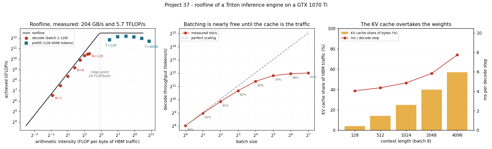

# Roofline Plot for Your Engine

---

> Every operating point is either starved for memory bandwidth or starved for compute — and this one plots them all. The engine is a real transformer written in [Triton](/shared/glossary/#triton) and run on a real GPU. Two ceilings, both measured on the card: **204 GB/s** of memory traffic and **5.71 TFLOP/s** of arithmetic, which put the [ridge point](/shared/glossary/#ridge-point) at **28 FLOP per byte**. Then the surprise. Sweeping the batch from 1 to 128 moves [decode](/shared/glossary/#decode) from an [arithmetic intensity](/shared/glossary/#ai-arithmetic-intensity) of 0.56 to 11.85 — **and it stops there**, because the [KV cache](/shared/glossary/#kv-cache) bytes grow with the batch exactly as fast as the arithmetic does. At a 1,024-token context this engine's decode intensity can never exceed **12.08**, less than half the ridge. **No batch size makes decode compute-bound.** [Prefill](/shared/glossary/#prefill), by contrast, lands at an intensity of 63 to 1,696 and runs at up to **81% of the compute ceiling** — the same model, the same card, the opposite regime.

---

## Key Insight

This project sweeps batch size and prompt length through your own inference engine and draws a [roofline](/shared/glossary/#roofline) plot — [throughput](/shared/glossary/#throughput) against [arithmetic intensity](/shared/glossary/#ai-arithmetic-intensity) — so you can see which operating points are [memory-bound](/shared/glossary/#memory-bound) and which are [compute-bound](/shared/glossary/#compute-bound).

## Why This Matters

Whether to spend money on more [HBM](/shared/glossary/#hbm) bandwidth or more compute depends entirely on which side of the roofline your real workload sits. Measuring it yourself replaces guesswork with a picture you can point at.

---

**This is project 37.**

### The words first

- **[Roofline](/shared/glossary/#roofline)** — a picture of what a chip can possibly do. The name is literal: the plot's ceiling looks like the roof of a house, a slanted part on the left and a flat part on the right. Every kernel you ever write lands *underneath* that roof, and the roof tells you which wall you are up against.
- **[Arithmetic intensity](/shared/glossary/#ai-arithmetic-intensity)** (AI) — how much arithmetic you do per byte you fetch from memory: `FLOPs ÷ bytes`. It is the x-axis of the roofline. Low intensity means "I read a lot and compute a little"; high intensity means the opposite.
- **[Ridge point](/shared/glossary/#ridge-point)** — where the slanted roof meets the flat roof. Left of it you are limited by memory, right of it by arithmetic. Its value is just `peak FLOP/s ÷ peak bytes/s`. The word is borrowed from a house again: the ridge is the top line where two slopes meet.
- **[Memory-bound](/shared/glossary/#memory-bound) / [compute-bound](/shared/glossary/#compute-bound)** — which of the two resources runs out first. A memory-bound kernel goes faster on a card with faster memory and *not at all* faster on a card with more math units.
- **[HBM](/shared/glossary/#hbm)** — High Bandwidth Memory, the DRAM stacked next to a datacentre GPU. This machine's card is older and uses GDDR5, but it plays the same role: the big, slow, far-away memory that holds your weights.
- **[Prefill](/shared/glossary/#prefill) / [decode](/shared/glossary/#decode)** — the two phases of serving. Prefill reads the whole prompt at once; decode then produces one token at a time. They have completely different shapes, and this project is largely about how differently they behave.
- **[FLOP](/shared/glossary/#ai-arithmetic-intensity)** — one floating-point operation. `FLOP/s` is a rate; `FLOPs` is a count. A multiply-and-add counts as 2.
- **[Triton](/shared/glossary/#triton)** — a Python-like language for writing GPU [kernels](/shared/glossary/#kernel). We use it because it compiles for whatever card it finds (see the note under *Running it*).

### "Why write an engine at all? vLLM already exists."

Because the whole point of a roofline is to attribute time to *specific bytes and specific FLOPs*, and a library that hides its kernels also hides the accounting. To place a point on this plot you need three numbers for the same piece of work: the time it took, the FLOPs it required, and the bytes it had to move. The first is easy to get from any engine. The last two are not — they depend on which weights the kernel actually re-read, whether the [KV cache](/shared/glossary/#kv-cache) was touched once or twice, whether an intermediate stayed in registers.

So the engine here is small, complete, and entirely ours: [`enginelib.py`](enginelib.py) is a 12-layer decoder with [grouped-query attention](/shared/glossary/#gqa), [RoPE](/shared/glossary/#rope), [RMSNorm](/shared/glossary/#rmsnorm) and [SwiGLU](/shared/glossary/#swiglu), where every single operation is a Triton kernel we launch by name. It is checked against a CPU reference implementation and agrees to **1.1 × 10⁻⁷** relative error, which is fp32 rounding — so it is a real transformer, not a stand-in. Projects 38–43 all reuse it.

### "Isn't the ridge point just a property of the GPU? Why measure anything?"

The *shape* of the roof is a property of the GPU. Where **your** work lands under it is not, and neither, it turns out, are the ceilings themselves.

The card's data sheet claims 256 GB/s and 9.3 TFLOP/s of fp32, which would put the ridge at 36 FLOP/byte. Measured with a plain copy kernel and a plain matmul, this card delivers 204 GB/s (**80%** of the sheet) and 5.70 TFLOP/s (**61%**), which puts the real ridge at **28**. Using the data-sheet ridge would have told you that batch-128 decode is *further* from the compute wall than it really is, and it would have overstated every "% of peak" in this document by a quarter. Spec sheets describe a chip in a lab; the roofline you should reason with is the one your own kernels can reach.

---

## Running it

```bash
python3 run.py           # ~4 minutes on this GPU
python3 run.py --plot    # redraw the figure from the committed findings.json
```

Needs `torch`, `triton`, `matplotlib`. The shared engine is [`enginelib.py`](enginelib.py), imported by projects [38](../38-profile-a-single-decode-step/README.md), [39](../39-flashdecoding-ablation/README.md), [40](../40-skinny-m-kernel-study/README.md), [41](../41-cuda-graphs-for-decode/README.md), [42](../42-stream-overlap-audit/README.md) and [43](../43-hardware-comparison/README.md).

**Two honest notes about what is measured here.**

*The card is a GTX 1070 Ti (sm_61, Pascal), not a datacentre GPU.* The installed PyTorch only ships prebuilt kernels for sm_70 and newer, and [cuBLAS](/shared/glossary/#cublas) 13 dropped Pascal, so `torch.matmul` on a CUDA tensor raises an error on this machine. Triton compiles fresh for whatever card it finds, so **every timing in this project is real hardware** — it is just old hardware. The consequence to keep in mind: this card has no [tensor cores](/shared/glossary/#tensor-core), so its ridge point (28) is far to the left of an A100's (153) or an H100's (295). Tensor cores raise the compute ceiling ~10× without raising the memory ceiling, which is precisely *why* memory optimisation took over inference. Section E redoes the arithmetic for real serving GPUs.

*Everything runs in fp32.* A production engine serves BF16 or FP8 weights, which halves or quarters the bytes. That changes the constant in every formula below (`bytes per parameter`) but nothing about the structure, and section E states its numbers per format.

> **About the numbers.** Everything below comes from the committed
> [`outputs/findings.json`](outputs/findings.json).



---

## A. The two ceilings, measured

| Ceiling | Measured | Data sheet | Ratio |
|---|---|---|---|
| Memory bandwidth (copy kernel, 128 MiB touched) | **203.6 GB/s** | 256 GB/s | 80% |
| fp32 arithmetic (2048³ matmul, best of 3 tile shapes) | **5.71 TFLOP/s** | 9.30 TFLOP/s | 61% |
| **Ridge point** = FLOP/s ÷ bytes/s | **28.0 FLOP/byte** | 36.3 | — |

The copy kernel is deliberately the dumbest program that exists — read a float, write a float — because that is the honest answer to "how fast can this card move bytes at all". Anything with more logic in it will be slower, so 204 GB/s is a ceiling no kernel in this guide will beat.

**Reading the ridge point in words:** for every byte you pull from memory, this card can afford about 28 floating-point operations before the arithmetic units become the limit. Fewer than 28 and you are waiting on memory; more and you are waiting on math.

## B. Decode: pinned to the memory ceiling, and it cannot leave

The model is 152M parameters (580 MiB in fp32), the context is fixed at 1,024 tokens, and the batch grows.

| batch | ms / step | tok/s | arithmetic intensity | achieved GB/s | % of memory ceiling |
|---|---|---|---|---|---|
| 1 | 3.79 | 264 | 0.56 | 167 | **82%** |
| 2 | 3.97 | 503 | 1.08 | 166 | 81% |
| 4 | 4.28 | 934 | 2.00 | 166 | 81% |
| 8 | 4.87 | 1,642 | 3.50 | 166 | 82% |
| 16 | 5.95 | 2,689 | 5.61 | 170 | 83% |
| 32 | 8.83 | 3,625 | 8.02 | 160 | 79% |
| 64 | 15.99 | 4,003 | 10.22 | 139 | 68% |
| 128 | 30.72 | 4,167 | 11.85 | 125 | 61% |

**Three readings, in order of how much they should change your behaviour.**

**1. Batching is nearly free at first, and then it is not.** From batch 1 to 8, the step takes 28% longer and produces 8× the tokens. That is the entire economic case for [continuous batching](/shared/glossary/#continuous-batching): the weights had to be read anyway, so extra sequences ride along almost for free. But from 64 to 128 — *doubling* the work — throughput improves by **4%**. Serving at batch 128 here would double every user's per-token latency to gain nothing.

**2. The intensity has a ceiling, and it is below the ridge.** This is the result worth memorising. Decode's intensity is

```
        2 · B · P                    (every weight, once, per sequence)
AI =  ─────────────────────
      4 · P  +  B · L · k            (weights once + this batch's KV cache)
```

where `P` is parameters, `B` the batch, `L` the context and `k` the KV bytes per token. As `B` grows, the numerator and the second denominator term both grow linearly, so the ratio flattens out at `2P / (L·k)`. For this model at a 1,024-token context that limit is

```
2 × 152,043,520 ÷ (1,024 × 24,576 bytes) = 12.08 FLOP/byte
```

and the measured value at batch 128 is **11.85** — 98% of the way there. The ridge is at 28. **There is no batch size that makes decode compute-bound at this context length**, and doubling the context halves the ceiling again. Anyone who tells you "just batch harder and you'll saturate the GPU" is describing prefill, not decode.

**3. Efficiency falls exactly where the KV cache takes over.** At small batches the kernels sustain 81–83% of the copy ceiling. At batch 128 that drops to 61%. The weights are read in long, perfectly sequential runs; the KV cache is read per sequence, per head, in 24 KiB pieces scattered across a multi-gigabyte allocation. **Not all bytes are equally fast**, and the ones that grow with your batch are the slow kind.

### The textbook formula, checked

The number every inference talk quotes is `tok/s ≈ bandwidth ÷ (bytes per parameter × parameters)`. Here that predicts

```
203.6 GB/s ÷ 608 MB = 334.8 tok/s        measured: 263.8 tok/s   (79%)
```

The formula is **27% optimistic**, and the two reasons are both visible in the table above: real kernels reach 82% of a pure copy, not 100%, and at a 1,024-token context the KV cache adds another 4% of bytes that the formula ignores. As a *back-of-envelope* it is excellent — it gets the order of magnitude and the scaling law right. As a capacity plan it is a number you should multiply by ~0.8.

## C. Prefill: the same model, on the other side of the ridge

Batch 1, prompt length varies.

| prompt tokens | ms | tok/s | arithmetic intensity | GFLOP/s | % of compute ceiling |
|---|---|---|---|---|---|
| 128 | 10.8 | 11,818 | 63 | 3,631 | 64% |
| 256 | 17.6 | 14,528 | 126 | 4,509 | 79% |
| 512 | 35.2 | 14,551 | 248 | 4,608 | **81%** |
| 1,024 | 76.7 | 13,348 | 481 | 4,395 | 77% |
| 2,048 | 181.6 | 11,280 | 916 | 3,998 | 70% |
| 4,096 | 497.4 | 8,236 | 1,696 | 3,333 | 58% |

**Prefill is 55× more token-throughput than single-stream decode on the same hardware and the same weights.** 14,551 tokens/s against 264. Nothing about the model changed — only the shape of the work. That single comparison is why [TTFT](/shared/glossary/#ttft) and [inter-token latency](/shared/glossary/#itl--tpot) are separate metrics with separate budgets, and why [chunked prefill](/shared/glossary/#chunked-prefill) and [disaggregation](/shared/glossary/#disaggregated-serving) exist as ideas at all.

**But notice that prefill throughput peaks at 512 tokens and then falls.** By 4,096 tokens it is down 43%. This is not the roofline's doing — intensity is still climbing. It is attention's quadratic term: doubling the prompt quadruples the attention FLOPs while only doubling the projection FLOPs, and the attention kernel runs at a lower FLOP/s than the projections do (its inner dimension is the head size, 64, which is too small to keep the machine fed). **"Prefill is compute-bound" is true and still does not mean prefill throughput is constant.**

## D. Where the bytes come from, as context grows

Batch 8, growing context. Same step, same kernels — only the cache is bigger.

| context | ms / step | tok/s | KV cache share of bytes |
|---|---|---|---|
| 128 | 4.05 | 1,975 | 4.0% |
| 512 | 4.37 | 1,833 | 14.2% |
| 1,024 | 4.86 | 1,645 | 24.9% |
| 2,048 | 5.83 | 1,372 | 39.8% |
| 4,096 | 7.75 | 1,033 | **57.0%** |

At a 4,096-token context and a batch of 8 — a completely ordinary chat workload — **the majority of the memory traffic in a decode step is no longer the model**. It is the conversation history. Two consequences follow directly:

- Making the *weights* smaller (the whole of [Phase 5](../../README.md#phase-5-serving-time-quantization-decisions)) stops paying at long context, because you are optimising a shrinking minority of the bytes. This is the measurement behind [project 31](../31-fp8-kv-cache/README.md)'s finding that FP8 on the *cache* buys far more concurrency than FP8 on the *weights*.
- The step time rose 91% while the tokens produced stayed the same. **Long context costs decode speed continuously**, not just memory capacity.

## E. So what should you buy?

Section B verified the formula on hardware we have; here it is applied to hardware we do not, using published bandwidth and capacity. These rows are **arithmetic, not measurements** — but the arithmetic was just validated to within 21%, so it is arithmetic you can plan with.

Single-stream decode, tokens/s, one card:

| Model | | A100 80GB (2.0 TB/s) | H100 (3.35 TB/s) | H200 (4.8 TB/s) | B200 (8.0 TB/s) |
|---|---|---|---|---|---|
| Llama-3-8B | BF16 | 127 | 209 | 299 | 498 |
| Llama-3-70B | BF16 | 14 | 24 | 34 | 57 |
| Llama-3-70B | FP8 | 29 | 47 | 68 | 113 |

And the ridge point of each card, in FLOP/byte, for BF16 dense math: **A100 153, H100 295, H200 206, B200 281**.

**Three things fall out of these two tables.**

1. **For single-stream decode, tok/s is a pure function of bandwidth.** H200 beats H100 by 43% — exactly its bandwidth ratio (4.8/3.35), despite having identical compute. If your workload is one user waiting for one answer, the FLOP/s column on the spec sheet is decoration.
2. **A 70B in BF16 does not fit on any of these cards** (141 GB of weights against 80–141 GB of memory, before the KV cache). The FP8 row is not only twice as fast, it is the row where the deployment exists at all on a single card.
3. **Every one of those ridge points is 5–10× further right than this old card's 28.** Tensor cores multiplied the compute ceiling and left the memory ceiling alone, which pushed essentially *all* of decode deep into the memory-bound regime and kept it there. The historical reason inference engineering became memory engineering is visible in that single row of numbers.

---

## What to take away

1. **Decode has an intensity ceiling that batching cannot break.** `2P / (context × KV bytes per token)` — 12.08 here, against a ridge of 28. Decode is memory-bound at every batch size, and more so the longer the context.
2. **Measure your own ceilings.** The data sheet said 256 GB/s and 9.3 TFLOP/s; the card delivers 204 and 5.71. Every "% of peak" you compute from the sheet is wrong by a quarter.
3. **`tok/s ≈ bandwidth ÷ model bytes` is a good envelope and a 27%-optimistic plan.** Real kernels reach ~82% of a copy, and the KV cache is not in the formula.
4. **Batching pays enormously and then abruptly stops.** 1 → 8 costs 28% more time for 8× the tokens; 64 → 128 buys 4%.
5. **Prefill and decode are different machines.** 14,551 tok/s versus 264 tok/s, same weights, same card, opposite sides of the ridge.
6. **Past ~2k context the KV cache is the majority of decode traffic.** That is where cache-side optimisations start beating weight-side ones.
7. **Prefill throughput peaks and falls** — at 512 tokens here — because attention is quadratic and its kernels run at a lower FLOP/s than the projections.

## Next

- [Project 38 — profile a single decode step](../38-profile-a-single-decode-step/README.md): the 160 kernels behind the 3.79 ms in row one, timed individually.
- [Project 39 — FlashDecoding ablation](../39-flashdecoding-ablation/README.md): why the decode attention kernel is split across the sequence, and what it is worth.
- [Project 40 — skinny-M kernel study](../40-skinny-m-kernel-study/README.md): the `M = batch` GEMM that dominates the decode column above.
- [Project 43 — hardware comparison](../43-hardware-comparison/README.md): the same engine on a CPU, and the gap explained from spec sheets.

## Resources

- [Williams, Waterman & Patterson — *Roofline: An Insightful Visual Performance Model* (2009)](https://dl.acm.org/doi/10.1145/1498765.1498785) — the original paper; the model is 15 years old and still the right first question
- [Kipply Chen — *Transformer Inference Arithmetic* (2022)](https://kipp.ly/transformer-inference-arithmetic/) — where the `bandwidth ÷ model bytes` estimate comes from
- [NVIDIA — *GPU Performance Background*](https://docs.nvidia.com/deeplearning/performance/dl-performance-gpu-background/index.html) — arithmetic intensity and the ridge point, from the vendor
- [AI Hardware Phase 3](../../../ai-hardware/README.md#phase-3-memory-hierarchies-and-data-movement) — the memory-hierarchy foundation this phase assumes
- [Inference-systems Phase 6](../../README.md#phase-6-inference-relevant-kernels-and-hardware-choices)
