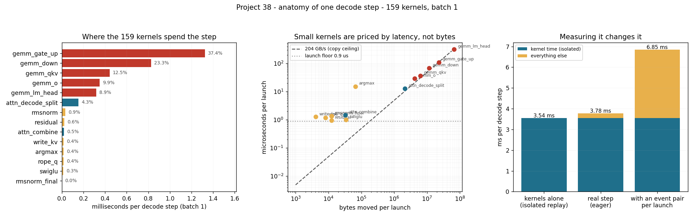

# Profile a Single Decode Step

---

> One token. **159 [kernel](/shared/glossary/#kernel) launches.** 3.78 ms. This project opens that step up and prices every launch inside it. Five kinds of [GEMM](/shared/glossary/#gemm) — 49 of the 159 launches — take **92% of the time**; the other 86 tiny kernels take **3.2%**. The single most expensive kernel is the output head at **316 µs**, 8.9% of the step in one launch. The [launch overhead](/shared/glossary/#kernel-launch-overhead) splits cleanly in two: the hardware needs **0.91 µs** to start a kernel, and Python needs **10.76 µs** to ask for one — **11.8× more** — but because the GPU has 3.78 ms of work and the CPU only 1.71 ms of issuing to do, [CUDA Graphs](/shared/glossary/#cuda-graphs) save **0.2%** here. And a warning about your own tools: bracketing each launch with a timer, the obvious way to profile, **inflates the step by 81%**.

---

## Key Insight

This project takes one decode step apart kernel by kernel: which kernel is longest, how many bytes each one reads, and how much of the wall clock is spent starting kernels rather than running them.

## Why This Matters

When a latency regression lands on you, the profiler trace is the evidence. Knowing what a *healthy* decode step looks like — which kernels, in which proportion — is what lets you spot the unhealthy one.

---

**This is project 38.**

### The words first

- **[Kernel](/shared/glossary/#kernel)** — one GPU program, launched once, run by thousands of threads at the same time. The word comes from operating systems by analogy: it is the small piece of code at the centre of the work.
- **[Kernel launch](/shared/glossary/#kernel-launch)** — the act of telling the GPU to run a kernel. It is not free: the request travels from Python through the driver to the card.
- **[Launch overhead](/shared/glossary/#kernel-launch-overhead)** — the part of a launch that is not the kernel doing your work. Two very different numbers hide under this one name, and section D separates them.
- **[GEMM](/shared/glossary/#gemm)** — GEneral Matrix-Matrix multiply, the BLAS library's name for `C = A·B`. Every linear layer in a transformer is one.
- **[CUDA event](/shared/glossary/#cuda-stream)** — a marker you drop into the GPU's work queue. The GPU timestamps it as it passes. Two events give you the time between them, measured on the GPU's own clock rather than the CPU's.
- **[CUDA Graph](/shared/glossary/#cuda-graphs)** — a recording of a sequence of launches that can be replayed with a single call, so the CPU issues one thing instead of hundreds.
- **Observer effect** — when the act of measuring changes the thing being measured. Borrowed from physics, and section C shows it costing 81%.

### "The GPU is the fast part. Why would starting a kernel matter?"

Because a decode step is not one big job, it is 159 small ones, and each of them has to be requested individually.

Think of it as ordering food. The kitchen (the GPU) is extremely fast. But every dish has to be ordered by a waiter (the CPU thread running your Python), who walks to the kitchen, hands over the ticket, and walks back. If each dish takes 24 ms to cook and 11 µs to order, nobody notices the waiter. If you order 159 tiny dishes that each take 1 µs to cook, the kitchen spends its whole evening waiting for tickets.

A transformer decode step is a mixture of both: five large dishes and eighty-six tiny ones. Section D measures both times so you can tell which situation you are in — and the answer for this engine, at batch 1, is "the kitchen is still the limit, but not by much".

### "Why write a profiler? Nsight Systems exists."

It does, and on a working machine you should use it. Here it half-works, and the half that fails is the important half.

`nsys profile python3 run.py` runs to completion on this box and writes a 30 MB `.qdstrm` file — the raw trace. Converting that into anything readable needs the importer binary, which is not installed in this environment, so `nsys stats` refuses the file and there is no timeline to open. `ncu` (Nsight Compute) launches but reports `No kernels were profiled`. So the choice was between "no numbers" and "numbers we collect ourselves".

The instrument we build instead is two lines of idea:

1. **In situ:** wrap every launch in a [CUDA event](/shared/glossary/#cuda-stream) pair. This sees the real order and the real cache state — and section C shows what it costs.
2. **Isolated:** record every launch's *arguments*, then replay each kernel 20 times from a [CUDA Graph](/shared/glossary/#cuda-graphs) and time the replay. No Python in the loop, so a 1 µs kernel reads as 1 µs instead of as the 15 µs it takes to ask for it.

Neither is the truth on its own. Comparing them **is** the result, and it is a result Nsight would have handed you without explaining.

---

## Running it

```bash
python3 run.py           # ~4 minutes on this GPU
python3 run.py --plot    # redraw the figure from the committed findings.json
```

Needs `torch`, `triton`, `matplotlib`. Imports the engine from [project 37](../37-roofline-plot-for-your-engine/README.md); the model is 152M parameters in fp32, context 1,024.

> **About the numbers.** Everything below comes from the committed
> [`outputs/findings.json`](outputs/findings.json).



---

## A. The inventory: 159 launches, batch 1

Each row is one kernel *kind*, timed in isolation (method 2), with its launch count for a single decode step.

| kernel | launches | ms / step | µs / launch | achieved GB/s | share of step |
|---|---|---|---|---|---|
| `gemm_gate_up` | 12 | 1.325 | 110.4 | 209 | **37.4%** |
| `gemm_down` | 12 | 0.826 | 68.8 | 168 | 23.3% |
| `gemm_qkv` | 12 | 0.442 | 36.8 | 171 | 12.5% |
| `gemm_o` | 12 | 0.350 | 29.2 | 144 | 9.9% |
| `gemm_lm_head` | 1 | 0.317 | **316.5** | 212 | 8.9% |
| `attn_decode_split` | 12 | 0.153 | 12.8 | 164 | 4.3% |
| `rmsnorm` | 24 | 0.032 | 1.3 | 9 | 0.9% |
| `residual` | 24 | 0.023 | 0.9 | 13 | 0.6% |
| `attn_combine` | 12 | 0.018 | 1.5 | 22 | 0.5% |
| `write_kv` | 12 | 0.016 | 1.3 | 3 | 0.4% |
| `argmax` | 1 | 0.015 | 15.4 | 4 | 0.4% |
| `rope_q` | 12 | 0.014 | 1.2 | 7 | 0.4% |
| `swiglu` | 12 | 0.012 | 1.0 | 33 | 0.3% |
| `rmsnorm_final` | 1 | 0.001 | 1.4 | 9 | 0.0% |
| **total** | **159** | **3.544** | | | |

**The 49 GEMM launches are 92% of the time; the 86 small kernels are 3.2% of it.** That ratio is the single most useful thing to carry into a real profiler trace. If you open a decode timeline and the matmuls are *not* almost all of it, something is wrong — you are launch-bound, or your attention kernel is broken, or you are looking at prefill.

**The longest single kernel is the output head, at 316 µs.** One launch, 8.9% of the step, because it reads a 1024 × 16384 weight matrix (67 MB) that no other kernel touches. This is why "should I quantize the LM head?" is a real question in [project 33](../33-mixed-precision-deployment/README.md) and not a detail.

**`gemm_gate_up` is the biggest category** — 12 launches, 37% — for the plain reason that it is the biggest weight: the gate and up projections are 2 × 2816 × 1024 each, more than half of every layer's parameters. **In a decode step, time is proportional to bytes, so the ranking of kernels is just the ranking of weight matrices by size.** You can predict this table from the model config without running anything, and that is exactly the point of [project 37](../37-roofline-plot-for-your-engine/README.md)'s roofline.

### A note on 212 GB/s, which is above the "ceiling"

Project 37 measured the copy ceiling at 203.6 GB/s, yet `gemm_lm_head` reports 212 and `gemm_gate_up` 209. These are not errors. A copy kernel *reads and writes*; these GEMMs almost only read. On GDDR5, as on HBM, a pure-read stream sustains a few percent more than a read/write mix, because the memory does not have to turn the bus around. **The "ceiling" you compare against has to match the access pattern you are running** — otherwise you will conclude a kernel is superhumanly good, or unfairly bad, for reasons that belong to the yardstick.

## B. Bytes versus latency: two populations, no middle

The middle panel of the figure plots each kernel's time against the bytes it moves. Every point lands on one of two lines:

- The **bandwidth line** (204 GB/s): the five GEMMs and the attention kernel. Their time is set by how many bytes they move, and every one of them is within 30% of the ceiling.
- The **latency floor** (0.91 µs): `rmsnorm`, `residual`, `rope_q`, `write_kv`, `swiglu`, `attn_combine`. All of them read a few kilobytes, all of them take about one microsecond, and their "achieved bandwidth" of 3–33 GB/s is not a measure of anything except that they finished before they could get going.

**Nothing sits in between.** A kernel on this card is either big enough to be a bandwidth problem or small enough to be a launch problem, and 12 KB of activations is firmly the second kind.

This is the honest argument for [kernel fusion](/shared/glossary/#kernel-fusion), and also its honest limit. Fusing all 86 small kernels away would recover **3.2% of the step**. Worth doing in a production engine — 3% of every token, forever — but it is not where a first optimisation should go, and any proposal to fuse that is *also* a worse matmul will lose. ([PyTorch Deep Dive project 20](../../../pytorch-deep-dive/README.md#phase-6-custom-kernels--c-cuda-and-triton-extensions) measured exactly that trade going the wrong way.)

## C. The observer effect: measuring it costs 81%

Same step, three ways of looking at it:

| Method | ms / decode step |
|---|---|
| Kernels alone, replayed in isolation from a CUDA graph | **3.544** |
| The real step, uninstrumented | **3.779** |
| The real step with one CUDA event pair per launch | **6.847** |

**Instrumenting every launch made the step 81% slower.** Each event pair is two extra items in the GPU's queue plus two Python objects, 159 times over. If you had taken those per-kernel numbers at face value you would have concluded that `rmsnorm` costs 24.6 µs — 19× its real 1.3 µs — and gone off to fuse a kernel that is 0.9% of the step.

**This is the reason production profilers sample rather than instrument**, and the reason a profiler's own overhead is the first thing to check on a tool you have not used before.

The other direction is more subtle and worth stating carefully. The isolated replays sum to 3.544 ms and the real step takes 3.779 ms — the sum accounts for **94%** of it. The missing 6% is not launch overhead (section D shows the CPU is not the limit here): it is that in a real step each kernel meets a cache the previous kernel left behind, and that the GPU must fully drain one kernel before the dependent next one starts, leaving a short tail where most SMs have nothing to do. **Per-kernel numbers add up to less than the whole, always. Treat the difference as real and unattributed rather than rounding it away.**

## D. Launch overhead, split into its two halves

| | µs per launch |
|---|---|
| Hardware floor — 2,000 null kernels replayed from a CUDA graph | **0.91** |
| Issuing one launch from Python + Triton | **10.76** |
| Eager back-to-back null kernels (the CPU is the limit) | 10.79 |

**Asking for a kernel costs 11.8× what starting one costs.** The 0.91 µs is silicon: the command processor has to fetch the launch descriptor and set up the grid. The 10.76 µs is software: Python bytecode, argument marshalling, Triton's launcher, the driver call. That third row confirms which one wins when you launch eagerly — 10.79 ≈ 10.76, so a chain of empty kernels runs at exactly the speed Python can ask for them.

Now put that against the step:

| | ms |
|---|---|
| GPU work in one decode step | 3.78 |
| CPU time to issue its 159 launches | **1.71** |
| Hardware launch floor for 159 launches | 0.145 |

**The CPU is busy 45% of the time the GPU is.** It stays ahead, so replaying the step from a CUDA graph saves **0.2%** — inside the noise, measured with interleaved rounds. That is a negative result and it is specific, not general: the margin is 2.2×. Halve this model, or run the same engine on a GPU twice as fast, and the 1.71 ms of Python becomes the wall. That is the situation [project 41](../41-cuda-graphs-for-decode/README.md) goes looking for.

**The lesson to generalise is the ratio, not the verdict.** Before reaching for CUDA graphs, measure `launches × CPU issue cost` against the step time. If it is well under 1, graphs will do nothing for you.

## E. Where the bytes come from

| | batch 1 | batch 32 |
|---|---|---|
| Weights | 580 MiB — **95.8%** | 580 MiB — 41.9% |
| KV cache | 24 MiB — 4.0% | 768 MiB — **55.4%** |
| Activations | 1.2 MiB — 0.19% | 37 MiB — 2.7% |

At batch 1 a decode step is, to a first approximation, **one pass over the model weights and nothing else**. Activations are two thousandths of the traffic. This is why the single-stream formula in [project 37](../37-roofline-plot-for-your-engine/README.md) works at all.

At batch 32 the picture inverts, and so does the profile:

| kernel | batch 1 | batch 32 |
|---|---|---|
| `attn_decode_split` | 0.153 ms (4.3%) | **4.216 ms (49.5%)** |
| `gemm_gate_up` | 1.325 ms (37.4%) | 1.457 ms (17.1%) |
| all GEMMs | 3.259 ms (92%) | 4.059 ms (47.6%) |
| **step total** | **3.544 ms** | **8.519 ms** |

**The attention kernel goes from sixth place to first**, and the GEMMs barely move — 32× the batch costs them 25% more time, because they re-read the same weights for all 32 sequences. Attention cannot share anything: every sequence has its own cache. At 191 GB/s the attention kernel is doing an excellent job of reading 768 MiB; there is simply 32× more of it to read.

**The optimisation that matters at batch 1 and the one that matters at batch 32 are different kernels.** Profile at the batch size you actually serve.

---

## What to take away

1. **A decode step is 159 launches, and 49 of them are 92% of the time.** All five are GEMMs, and their ranking is just the ranking of your weight matrices by size.
2. **The 86 small kernels are 3.2%.** Fusing them all is a real but bounded win — know the ceiling before you spend a week on it.
3. **Two numbers hide inside "launch overhead": 0.91 µs of hardware and 10.76 µs of Python.** Only the second one is worth attacking, and only when `launches × 10.76 µs` approaches your step time.
4. **CUDA graphs bought 0.2% here** because the CPU was 45% loaded. The measurement to make first is that ratio, not the graph.
5. **An event pair per launch inflated the step by 81%.** Check your profiler's overhead before you believe its breakdown.
6. **Per-kernel times sum to 94% of the step.** The rest is cache state and drain tails; report it as unattributed rather than hiding it.
7. **At batch 32, attention is half the step and the GEMMs are unchanged.** Weights are shared across the batch; KV caches are not.

## Next

- [Project 39 — FlashDecoding ablation](../39-flashdecoding-ablation/README.md): the `attn_decode_split` row above, and what the "split" is doing.
- [Project 40 — skinny-M kernel study](../40-skinny-m-kernel-study/README.md): the four GEMM rows, and why `M = 1` changes which kernel you want.
- [Project 41 — CUDA Graphs for decode](../41-cuda-graphs-for-decode/README.md): finding the regime where section D's 0.2% becomes worth having.
- [Project 42 — stream-overlap audit](../42-stream-overlap-audit/README.md): the CPU work that section D found idle, put to use.

## Resources

- [NVIDIA — *Nsight Systems user guide*](https://docs.nvidia.com/nsight-systems/) — the tool this project stands in for
- [NVIDIA — *CUDA C++ Best Practices: Timing*](https://docs.nvidia.com/cuda/cuda-c-best-practices-guide/#timing) — why CUDA events, not wall clocks
- [PyTorch profiler recipe](https://pytorch.org/tutorials/recipes/recipes/profiler_recipe.html) — the same idea, one layer up
- [AI Hardware Phase 2](../../../ai-hardware/README.md#phase-2-gpu-architecture-inside-out) — measuring a GPU when the profilers are unavailable
- [Inference-systems Phase 6](../../README.md#phase-6-inference-relevant-kernels-and-hardware-choices)
