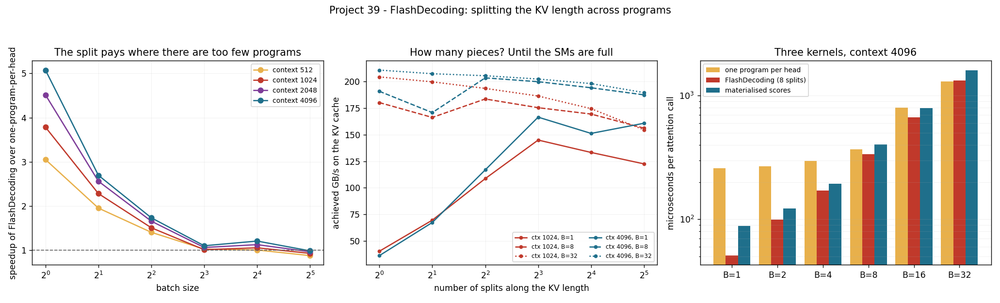

# FlashDecoding Ablation

---

> The same attention, the same bytes, the same answer to 2.4 × 10⁻⁷ — and **5.08× the speed**, purely from cutting the [KV cache](/shared/glossary/#kv-cache) into eight pieces and giving each piece its own program. At batch 1 with a 4,096-token context, one-program-per-head reads the cache at **32.5 GB/s**, 16% of what this card can do; [FlashDecoding](/shared/glossary/#flashdecoding) reads it at **165 GB/s**. End to end that is a decode step of 6.61 ms falling to 4.16 ms — **1.59× more tokens per second for a kernel change**. Then the honest other half: at batch 32 the unsplit kernel already reaches **205.6 GB/s** — the ceiling — and splitting it makes the whole step **4% slower**. And a result that reframes the technique: a deliberately naive kernel that **writes every attention score out to memory**, the thing FlashAttention exists to avoid, is still **2.9× faster** than the unsplit flash kernel at batch 1. For decode, the win is parallelism, not memory.

---

## Key Insight

This project runs the same model with and without the FlashDecoding code path and measures the decode-throughput delta — across batch sizes and context lengths, so you can see where the win comes from and where it goes away.

## Why This Matters

FlashDecoding is on by default in every production engine, which makes it easy to assume it always helps. It does not, and knowing the shape of the curve tells you which of your workloads it was written for.

---

**This is project 39.**

### The words first

- **[FlashAttention](/shared/glossary/#flashattention)** — the attention kernel that never writes the score matrix to memory. It computes attention in tiles and keeps the running softmax in fast on-chip [SRAM](/shared/glossary/#sram). Designed for *training* and *prefill*, where the score matrix is `sequence × sequence` and genuinely enormous.
- **[FlashDecoding](/shared/glossary/#flashdecoding)** — the decode-time variant. In decode there is only **one** query token, so the score "matrix" is a single row and there is nothing big to avoid writing. What FlashDecoding changes is *who does the work*: it [splits](/shared/glossary/#split-k) the cached sequence into chunks and gives each chunk its own program, then merges the partial results.
- **Program** — one instance of a kernel, running on one [SM](/shared/glossary/#sm) (streaming multiprocessor). This GPU has **19 SMs**. If your kernel launches 16 programs, at least 3 SMs have nothing to do and the other 16 are running one program each — a fraction of what they can hold.
- **[Online softmax](/shared/glossary/#online-softmax)** — computing a softmax in one pass while the maximum is still changing, by rescaling what you have so far each time a bigger value appears. It is what makes splitting legal: two chunks processed separately can be merged exactly, as long as each carries its running maximum and sum alongside its partial output.
- **Materialising** — writing an intermediate result out to main memory instead of keeping it on-chip. The naive baseline in section D materialises the scores.

### "Attention already exists in the engine. What does 'the split' add?"

Nothing mathematically — and that is the point worth being precise about, because a beginner reasonably asks why a second kernel that computes the same numbers should be faster.

The unsplit kernel assigns one program to each (sequence, head) pair. At batch 1 with 16 heads that is **16 programs**. The GPU has 19 SMs, each able to run several programs at once, so the card is running at a small fraction of its capacity — and crucially, memory bandwidth on a GPU is only reached by having *many* requests in flight at once. One program reading a cache serially cannot keep the memory system busy no matter how efficient its inner loop is. That is the 32.5 GB/s in the headline: not a bad kernel, an *empty machine*.

FlashDecoding fills the machine. It cuts the 4,096 cached positions into 8 chunks of 512 and gives each chunk its own program, so 16 programs become 128. Each program produces a partial answer over its own chunk; a second, tiny kernel then merges the 8 partials into one.

**The gap it fills is parallelism, and only parallelism.** It does not reduce bytes (the same cache is read once either way), it does not reduce FLOPs, and it does not improve the inner loop. This is also why section B finds it useless at batch 32: there, one-program-per-head already gives 512 programs, the machine is full, and there is nothing left for the split to fill.

### How merging two half-softmaxes is exact

Softmax needs a maximum over *all* scores to stay numerically safe, and a sum over all of them to normalise. A chunk only sees its own. The fix is to have each chunk report three things: its partial output `o`, the largest score it saw `m`, and the sum of its exponentials `l`. Merging chunk A and chunk B is then

```
m = max(m_A, m_B)
l = l_A·exp(m_A − m) + l_B·exp(m_B − m)
o = ( o_A·l_A·exp(m_A − m) + o_B·l_B·exp(m_B − m) ) / l
```

Each chunk's contribution is simply rescaled by how far its own maximum was from the global one. Nothing is approximated. Section A checks this on the hardware: the split result differs from the unsplit result by **2.4 × 10⁻⁷** relative — fp32 rounding, no more.

---

## Running it

```bash
python3 run.py           # ~7 minutes on this GPU
python3 run.py --plot    # redraw the figure from the committed findings.json
```

Needs `torch`, `triton`, `matplotlib`. Imports the engine from [project 37](../37-roofline-plot-for-your-engine/README.md).

**Why not just flip vLLM's flag, as the project brief suggests?** vLLM installs on this machine and then refuses to start: its kernels are compiled for sm_70 and newer, and this card is sm_61. So the flag is ours instead — [`enginelib.py`](../37-roofline-plot-for-your-engine/enginelib.py) contains both kernels (`k_attn_decode` and `k_attn_decode_split` + `k_attn_combine`) and `decode_step(split=True/False)` switches between them. Everything else in the step is byte-for-byte identical, which is a cleaner ablation than a library flag that may change several things at once.

> **About the numbers.** Everything below comes from the committed
> [`outputs/findings.json`](outputs/findings.json).



---

## A. First, they must agree

| variant | max relative difference from the unsplit kernel |
|---|---|
| FlashDecoding, 8 splits | 2.4 × 10⁻⁷ |
| Materialised scores (section D) | 3.4 × 10⁻⁷ |

fp32 has about 7 decimal digits, so these are rounding, not disagreement. **Run this check before any attention benchmark.** A split-softmax kernel with a wrong rescale produces plausible-looking numbers and a much better time.

## B. The ablation: the attention kernel alone, context 4,096

| batch | programs (unsplit → split) | unsplit | FlashDecoding | speedup | unsplit GB/s | split GB/s |
|---|---|---|---|---|---|---|
| 1 | 16 → 128 | 258.0 µs | **50.8 µs** | **5.08×** | 32.5 | **165.0** |
| 2 | 32 → 256 | 268.6 | 99.6 | 2.70× | 62.5 | 168.4 |
| 4 | 64 → 512 | 295.5 | 170.5 | 1.73× | 113.5 | 196.8 |
| 8 | 128 → 1024 | 369.6 | 335.7 | 1.10× | 181.6 | 199.9 |
| 16 | 256 → 2048 | 803.8 | 665.9 | 1.21× | 167.0 | 201.6 |
| 32 | 512 → 4096 | 1305.8 | **1325.3** | **0.99×** | **205.6** | 202.5 |

**Read the right-hand columns first: they explain the left ones.** The split kernel sits at 165–202 GB/s at *every* batch size — it is always near the ceiling. The unsplit kernel climbs from 32.5 GB/s to 205.6 GB/s as the batch grows. The speedup column is just the ratio of those two, and it disappears the moment the unsplit kernel has enough work to fill the card on its own.

**The crossover is at batch 8**, where the unsplit kernel already launches 128 programs — about 6.7 per SM — and reaches 88% of the ceiling.

This is the same fact from two directions: **FlashDecoding does not make attention faster, it makes attention *reach the speed it should always have had*.** The measured ceiling is 204 GB/s ([project 37](../37-roofline-plot-for-your-engine/README.md)); the split kernel is within 1% of it at large batch and within 19% at batch 1.

## C. How many pieces? The split count has an optimum, and it moves

Context 4,096. `NSPLIT` is how many chunks the cached sequence is cut into.

| splits | B=1 | B=8 | B=32 |
|---|---|---|---|
| 1 (no split) | 232.3 µs / 36 GB/s | 351.5 µs / 191 GB/s | **1272.7 µs / 211 GB/s** |
| 2 | 124.6 / 67 | 392.8 / 171 | 1293.7 / 207 |
| 4 | 71.8 / 117 | **329.6 / 204** | 1305.6 / 206 |
| 8 | **50.4 / 167** | 335.6 / 200 | 1325.7 / 203 |
| 16 | 55.5 / 151 | 345.5 / 194 | 1354.5 / 198 |
| 32 | 52.2 / 161 | 357.8 / 188 | 1414.9 / 190 |

**The best setting is 8 splits at batch 1, 4 at batch 8, and 1 — no split at all — at batch 32.** And the penalty for getting it wrong is real in both directions: leaving the split off at batch 1 costs **4.6×**; leaving it at 32 splits when batch is 32 costs **11%**.

The mechanism is a single quantity, *total programs*, and the table above is really one curve in disguise. Everything improves until there are roughly 128–512 programs — enough to keep 19 SMs busy with several each — and then extra splits only add cost: every split writes a partial output and a (max, sum) pair that the merge kernel must read back. At batch 32 with 32 splits that merge is reading 16,384 partial vectors to produce 512 answers.

**This is why production engines choose the split count at runtime** from batch, context and SM count, rather than compiling one number in. It is also why a kernel benchmarked at one batch size tells you very little about another.

## D. The reframe: materialising the scores is *fine* in decode

The naive baseline computes all the scores, **writes them to HBM**, then reads them back to softmax and weight the values — precisely the thing FlashAttention was invented to avoid. Context 4,096:

| batch | unsplit flash | FlashDecoding | materialised scores | extra bytes from materialising |
|---|---|---|---|---|
| 1 | 258.0 µs | 50.8 µs | **88.7 µs** | 0.26 MB against 8.4 MB of cache (**+3.1%**) |
| 8 | 369.6 | 335.7 | 405.0 | 2.10 MB against 67 MB (+3.1%) |
| 32 | 1305.8 | 1325.3 | 1612.2 | 8.39 MB against 268 MB (+3.1%) |

**The memory-wasteful kernel beats the memory-optimal one by 2.9× at batch 1** (88.7 µs against 258.0 µs). The reason is now familiar: its first pass has one program per (head, 128-position block), so it is parallel over the sequence for free, while the unsplit flash kernel is not.

And the "wasteful" part turns out to be almost nothing. In decode there is one query row, so the scores are one number per cached position — **0.26 MB against 8.4 MB of keys and values, 3.1% more traffic**. Compare that with prefill, where the score matrix is `T × T`: at T = 4,096 that is 268 MB of scores against 8.4 MB of cache, a **32× multiplier**, which is exactly the disaster FlashAttention was written to prevent.

**So "FlashAttention for decode" is a misleading name for FlashDecoding.** They fix different problems:

| | FlashAttention (prefill / training) | FlashDecoding (decode) |
|---|---|---|
| Problem | the `T × T` score matrix does not fit in memory or bandwidth | too few programs to fill the GPU |
| Fix | tile the computation, keep scores in SRAM | split the KV length, merge partial softmaxes |
| Measured here | — | 5.08× at batch 1, 0.99× at batch 32 |
| What happens if you skip it | quadratic memory traffic (32× at T=4096) | a 3.1% traffic saving you did not need |

FlashDecoding still uses the online-softmax machinery from FlashAttention — that is the family resemblance — but it uses it to make splitting *legal*, not to make memory smaller.

## E. End to end: what the whole decode step does

The attention kernel is one of 159 in a step ([project 38](../38-profile-a-single-decode-step/README.md)), so the end-to-end effect is diluted by everything else. Measured with interleaved rounds:

| context | batch | unsplit step | FlashDecoding step | tok/s | speedup |
|---|---|---|---|---|---|
| 1,024 | 1 | 4.303 ms | 3.769 ms | 232 → 265 | **1.14×** |
| 1,024 | 8 | 4.829 | 4.853 | 1,656 → 1,649 | 1.00× |
| 1,024 | 32 | 8.472 | 8.822 | 3,777 → 3,627 | **0.96×** |
| 4,096 | 1 | 6.607 | 4.161 | 151 → 240 | **1.59×** |
| 4,096 | 8 | 8.115 | 7.735 | 986 → 1,034 | 1.05× |
| 4,096 | 32 | 20.216 | 20.459 | 1,583 → 1,564 | 0.99× |

**The best case is a chat workload: one user, long history — 1.59× more tokens per second.** That is the single most latency-sensitive case in serving, and it is exactly where the technique was aimed.

**The worst case is short context at high batch, where FlashDecoding costs 4%.** An engine that hard-codes the split would be paying that tax on every offline batch job it runs. The 4% is small, but it is a real, measured, avoidable loss — and it is the answer to "is there any reason not to just always turn it on?"

---

## What to take away

1. **FlashDecoding buys parallelism, not bytes.** Its whole effect is turning 16 programs into 128 so the memory system has enough requests in flight.
2. **5.08× at batch 1, 0.99× at batch 32.** The win is entirely a function of how empty the GPU was without it.
3. **The split count has an interior optimum that moves with the batch** — 8, then 4, then 1. Wrong in one direction costs 4.6×; wrong in the other costs 11%.
4. **Look at achieved GB/s, not at the speedup.** The split kernel is at 165–202 GB/s everywhere; that single fact predicts every number in the speedup column.
5. **Materialising the scores costs 3.1% of traffic in decode and 32× in prefill.** The same design decision is catastrophic in one phase and irrelevant in the other.
6. **The naive materialised kernel beats the "good" unsplit kernel by 2.9×** at batch 1. Being memory-optimal is worth nothing if you leave the machine idle.
7. **Always check that the fast kernel gives the same answer.** A broken softmax merge is fast and wrong, and it looks exactly like a win.

## Next

- [Project 40 — skinny-M kernel study](../40-skinny-m-kernel-study/README.md): the same "too few programs" problem, in the GEMMs this time.
- [Project 41 — CUDA Graphs for decode](../41-cuda-graphs-for-decode/README.md): the launch overhead that all these small kernels pay.
- [Project 38 — profile a single decode step](../38-profile-a-single-decode-step/README.md): where attention sits among the other 158 kernels.
- [Project 14 — attention-sink eviction](../14-attention-sink-eviction/README.md): making the cache smaller instead of reading it faster.

## Resources

- [Dao et al. — *FlashDecoding* (2023)](https://crfm.stanford.edu/2023/10/12/flashdecoding.html) — the original blog post; the "split the KV length" picture is the one implemented here
- [Dao — *FlashAttention-2* (2023)](https://arxiv.org/abs/2307.08691) — where the online-softmax merge comes from
- [vLLM — paged attention kernels](https://github.com/vllm-project/vllm/tree/main/csrc/attention) — the production version, with the split count chosen at runtime
- [AI Hardware project 21](../../../ai-hardware/README.md#phase-4-cuda-triton-and-writing-real-kernels) — the prefill-side flash-vs-materialised comparison, where the answer is the opposite way round
- [Inference-systems Phase 6](../../README.md#phase-6-inference-relevant-kernels-and-hardware-choices)
