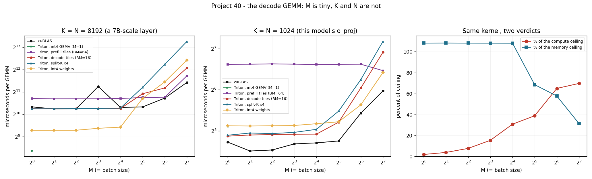

# Skinny-M Kernel Study

---

> `M = 8, K = 8192, N = 8192` — the shape a [decode](/shared/glossary/#decode) step asks for, and the shape nothing is tuned for. Five kernels on it. The headline is a bug in the vendor library: **[cuBLAS](/shared/glossary/#cublas) takes 2.43 ms at M = 8 and 1.22 ms at M = 4 *and* at M = 16** — it reads the 268 MB weight matrix **twice** at exactly the size the textbook example names, and it does so reproducibly. A 25-line [Triton](/shared/glossary/#triton) kernel with a 16-row tile beats it there by **2.0×** and matches it everywhere else. **Split-K, the trick that was worth 5× for attention in [project 39](../39-flashdecoding-ablation/README.md), is worth nothing here** — narrowing the output tile had already filled the machine. And the [int4](/shared/glossary/#int4) weight kernel — the [Marlin](/shared/glossary/#marlin) idea — runs **3.72× faster** than fp32 at M = 1, which is 49% of the 7.5× its byte count promises. Getting the other half back is what a hand-written kernel is for: across six tile shapes of the *same* int4 kernel, the slowest is **70× the fastest**.

---

## Key Insight

This project takes one decode-shaped GEMM and runs it through cuBLAS, a generic Triton GEMM, a decode-tuned Triton GEMM, a split-K variant and an int4-weight kernel, reporting TFLOP/s and GB/s for each.

## Why This Matters

A decode step is 92% matmul ([project 38](../38-profile-a-single-decode-step/README.md)), and those matmuls have a shape general-purpose libraries were not written for. Knowing which kernel wins at which `M` is the difference between a serving stack at 60% of the hardware and one at 100%.

---

**This is project 40.**

### The words first

- **[GEMM](/shared/glossary/#gemm)** — GEneral Matrix-Matrix multiply, `C[M,N] = A[M,K] · B[K,N]`. The letters have been the same since the 1979 BLAS standard, and every kernel library still names its functions after them.
- **[GEMV](/shared/glossary/#gemv)** — GEneral Matrix-Vector multiply: the same thing with `M = 1`. A different routine, because a single row cannot be tiled the way a block of rows can.
- **M, K, N** — rows of the output, the shared (contracted) dimension, columns of the output. In decode: **M = batch size** (1–128), **K and N = model width** (1,024–8,192). M is 1,000× smaller than the other two, and that asymmetry is the whole subject here.
- **Tile** — the rectangle of output one program computes, `BM × BN`, marching over the shared dimension in steps of `BK`. Choosing these three numbers is 90% of GEMM performance.
- **[Split-K](/shared/glossary/#split-k)** — cutting the shared dimension into pieces so more programs run at once, then adding the pieces up. Same idea as FlashDecoding's split, applied to a matmul.
- **[Marlin](/shared/glossary/#marlin)** — a hand-written mixed-precision kernel (int4 weights × fp16 activations) used by vLLM for quantised serving. It cannot run on this card (it needs sm_80+), so what is measured here is *its idea*, implemented in Triton.
- **[Tensor cores](/shared/glossary/#tensor-core)** — dedicated matrix-multiply units. This card has none, so its compute ceiling is 5.7 TFLOP/s rather than an H100's ~990. That changes the *numbers* below but not the shape of any curve.

### "Why would M = 8 be a problem? The GPU is doing 8× less work."

That is exactly the problem: 8× less arithmetic, and **exactly the same amount of memory traffic**.

A GEMM's cost has two parts: read the weights (`K × N × 4` bytes = 268 MB here, no matter what M is) and do the arithmetic (`2 × M × K × N` FLOPs, which shrinks with M). At M = 8 that is 1.07 GFLOP against 268 MB — an [arithmetic intensity](/shared/glossary/#ai-arithmetic-intensity) of **4 FLOP/byte**, against this card's [ridge point](/shared/glossary/#ridge-point) of 28. The kernel is waiting on memory the entire time, and its "% of peak FLOPs" is meaningless.

There is a second, sharper problem. `tl.dot` — like a tensor-core instruction — cannot multiply fewer than 16 rows at a time. So M = 1 is padded to 16, and **15 of every 16 rows of arithmetic are thrown away**. In fp32 that costs nothing (section B: the padded kernel still hits 220 GB/s, the ceiling). Section E shows what happens when the bytes shrink and the padding suddenly is not free any more.

### "cuBLAS is NVIDIA's own library. How can 25 lines of Triton beat it?"

It usually cannot, and at M = 128 it does not — cuBLAS wins by 20% there. What section B finds is narrower and more interesting: cuBLAS's *kernel-selection heuristic* picks badly at one specific M.

cuBLAS ships hundreds of pre-compiled kernels and chooses among them with a heuristic that was tuned on the shapes that mattered when it was written — mostly training shapes, where M is in the thousands. At M = 8 on this card it picks one that processes the rows in two passes and therefore streams the weight matrix twice. You can see it in the FLOP/s column rather than the time column: **M = 8 achieves 441 GFLOP/s and M = 4 achieves 442** — identical, which is only possible if M = 8 did the work of M = 4 twice.

Our Triton kernel does not beat cuBLAS by being cleverer. It beats it by having exactly one tile shape, chosen for this shape.

---

## Running it

```bash
python3 run.py           # ~8 minutes; compiles skinny.cu on first run
python3 run.py --plot    # redraw the figure from the committed findings.json
```

Needs `torch`, `triton`, `matplotlib`, and `nvcc` for the cuBLAS reference.

**Two notes on what could and could not be measured.**

*cuBLAS is reached through C++, not PyTorch.* The installed PyTorch links cuBLAS 13, which dropped Pascal, so `torch.matmul` on this card raises `CUBLAS_STATUS_ARCH_MISMATCH`. The system CUDA 12.0 toolkit still supports sm_61, so [`skinny.cu`](skinny.cu) calls `cublasSgemm` and `cublasSgemv` directly and is compiled with `nvcc -arch=sm_61 -lcublas`. The cuBLAS numbers are the real vendor library.

*Marlin itself will not run here.* It requires sm_80 and fp16 tensor cores. [`kernels40.py`](kernels40.py) implements its central idea instead — 4-bit weights unpacked inside the kernel, with a group scale — in Triton, and section E measures it. What that cannot show is Marlin's tensor-core pipelining; what it can show is where the 4-bit win comes from and how much of it a straightforward implementation loses.

> **About the numbers.** Everything below comes from the committed
> [`outputs/findings.json`](outputs/findings.json).



---

## A. First, they must agree

| kernel | max relative difference from `x @ w` on the CPU |
|---|---|
| Triton, decode tiles | 1.0 × 10⁻⁶ |
| Triton, split-K ×4 | 3.8 × 10⁻⁷ |
| Triton, int4, **against the dequantised weights** | 8.4 × 10⁻⁷ |
| Triton, int4, against the original fp32 weights | **9.9 × 10⁻²** |

The last two rows are worth separating carefully, because they measure different things.

The int4 kernel reproduces *the product of the quantised weights* to 8.4 × 10⁻⁷ — it is arithmetically exact, no shortcuts. Against the **original** weights it is 9.9% off, and all of that is the quantisation itself: 4 bits give 16 levels per group of 128, so each weight lands about 14% of a standard deviation away from where it started. **The kernel is not the source of the error, and no kernel could remove it.** What that error costs a model is a different question, measured in [project 30](../30-quantize-a-7b-model-end-to-end/README.md) (+22% perplexity at group-128) — this project only measures what it *buys*.

## B. K = N = 8192, the shape from the brief

Microseconds per GEMM. The weight matrix is 268 MB; the memory ceiling is 204 GB/s.

| M | cuBLAS | Triton, prefill tiles (BM=64) | Triton, decode tiles (BM=16) | split-K ×4 | int4 |
|---|---|---|---|---|---|
| 1 | 1,290 | 1,670 | **1,219** | 1,215 | **624** (GEMV: **328**) |
| 2 | 1,211 | 1,658 | 1,218 | 1,217 | 624 |
| 4 | 1,216 | 1,659 | 1,220 | 1,221 | 624 |
| **8** | **2,430** | 1,659 | **1,221** | 1,227 | 663 |
| 16 | 1,269 | 1,673 | 1,224 | 1,242 | 687 |
| 32 | 1,287 | 1,726 | 1,939 | 2,369 | 1,677 |
| 64 | **1,693** | 1,743 | 2,322 | 4,829 | 2,802 |
| 128 | **2,758** | 3,390 | 4,327 | 9,852 | 5,526 |

**The M = 8 cliff.** cuBLAS reads the weights at 221 GB/s at M = 4, at 110 GB/s at M = 8, and at 212 GB/s at M = 16. It reproduces to three decimal places across separate process launches, so it is not noise; it is a kernel-selection choice. **A batch size of 8 is not exotic — it is a perfectly ordinary decode batch**, and on this hardware/library pair it costs 2×. The lesson generalises past this card: *sweep M through your own stack and look for cliffs, because the library's heuristic was not tuned on your shapes.*

**Tile shape is worth 37% at M = 1, for identical bytes.** The prefill config (BM=64, BN=64, BK=32) reads the same 268 MB as the decode config (BM=16, BN=128, BK=32) and takes 1,670 µs instead of 1,219. The difference is the width of each load: 64 columns of fp32 is a 256-byte row, 128 columns is 512 bytes, and DRAM rewards the longer burst. **The tile that is right for prefill is 37% wrong for decode.**

**Above M = 16 the ordering inverts.** The decode kernel's 16-row tile has to sweep the weights `M/16` times — at M = 128 that is eight full passes, and it duly takes 3.5× longer than at M = 16. cuBLAS, which switches to a large-tile kernel, is fastest from M = 64 on and reaches **6.23 TFLOP/s** at M = 128. **This is the entire argument for keeping two GEMM code paths in a serving engine**, one for prefill and one for decode, which is exactly what vLLM and TRT-LLM do.

## C. Split-K bought nothing — and project 39 explains why

| shape | decode tiles | split-K ×4 | programs (before → after) |
|---|---|---|---|
| M=1, K=N=8192 | 1,219 µs / 220 GB/s | 1,215 µs / 221 GB/s | 64 → 256 |
| M=1, K=N=1024 | 29.2 µs / 144 GB/s | 29.7 µs / 142 GB/s | 32 → 128 |

Four times the programs, no change. In [project 39](../39-flashdecoding-ablation/README.md) the identical trick was worth **5.08×** on attention. The difference is a single sentence:

**In a GEMM you can always make the output tile narrower; in attention you cannot.** Attention's output tile is one head — 64 numbers, fixed by the model architecture — so with 16 heads and one sequence there are exactly 16 programs and the only remaining axis to split is the KV length. A GEMM's output is 8,192 columns wide, so setting `BN = 128` already produces 64 programs and `BN = 32` would produce 256. The problem split-K solves had already been solved by choosing a tile.

**The generalisable rule: split the reduction dimension only when the output is too small to split.** Otherwise you are paying for an extra pass over the partial products (visible in the M ≥ 32 rows of section B, where split-K is the worst kernel in the table) to fix a problem you do not have.

## D. Two ceilings, two verdicts, one kernel

The same decode-tile measurements, scored two ways:

| M | % of the 5.70 TFLOP/s compute ceiling | % of the 204 GB/s memory ceiling |
|---|---|---|
| 1 | **1.9%** | **108%** |
| 8 | 15.4% | 108% |
| 32 | 38.9% | 69% |
| 128 | 69.7% | 31% |

**At M = 1 the same kernel is either a catastrophe (1.9% of peak) or slightly better than perfect (108% of the copy ceiling), depending only on which yardstick you pick up.** Only the second is meaningful: there is no arithmetic to do, so failing to do arithmetic quickly is not a failure.

(The 108% is real and worth explaining rather than rounding away: the 204 GB/s reference comes from a copy kernel, which reads *and* writes. This GEMM almost only reads, and a pure-read stream sustains a few percent more because the memory bus never has to turn around. Compare against the access pattern you are actually running — see [project 38](../38-profile-a-single-decode-step/README.md).)

**So: report GB/s for decode kernels and TFLOP/s for prefill kernels.** A dashboard that shows "% of peak FLOPs" for a decode fleet will show single digits forever and tell you nothing about whether anything is wrong.

## E. int4 weights: 3.72×, which is half of what the bytes promise

fp32 weights are 268 MB. int4 group-128 weights are 33.5 MB plus 2.1 MB of scales — **7.5× fewer bytes**. If the kernel were purely bandwidth-bound, it would be 7.5× faster.

| M = 1, K = N = 8192 | time | achieved GB/s | speedup over fp32 |
|---|---|---|---|
| fp32, decode tiles | 1,219 µs | 220 | 1.00× |
| cuBLAS GEMV | 1,250 µs | 215 | 0.97× |
| int4, `tl.dot` with a padded 16-row tile | 624 µs | 57 | 1.95× |
| **int4, written as a true GEMV (no padding)** | **328 µs** | **109** | **3.72×** |

**Two things are visible here and both matter.**

**First, the padding stops being free.** With fp32 weights, padding one row to sixteen costs nothing because the kernel waits on memory regardless. Remove 7.5× of the bytes and the wait is gone: now the 16× of wasted arithmetic is the bill. Dropping `tl.dot` for a plain multiply-and-accumulate — legal only because M = 1 — takes 624 µs to 328. **Quantising the weights moves a decode GEMM toward the compute side of the roofline, and the padding you could ignore before becomes the limit.**

**Second, even the good version reaches only 109 GB/s where fp32 reaches 220.** Unpacking is not free: each 4-bit weight costs a shift, a mask and an integer-to-float conversion, and on this Pascal chip both the shift and the conversion run at a quarter of the fp32 rate. Modern kernels hide this by overlapping unpacking with the next tile's loads and by using instructions that dequantise several values at once — which is precisely why Marlin is 1,500 lines of hand-written CUDA rather than 25 lines of anything.

**And the tile shape matters more than the algorithm.** The same int4 kernel across six (tile width, warp count) settings:

| configuration | GEMV time | GEMM time (M=16) |
|---|---|---|
| BN=64, 4 warps | 669 µs | **688 µs** |
| BN=128, 4 warps | 836 | 947 |
| BN=256, 2 warps | **327** | 2,981 |
| BN=256, 4 warps | 430 | 1,654 |
| BN=512, 2 warps | 1,229 | **48,582** |
| BN=512, 4 warps | 334 | 2,967 |

**A 3.8× spread for the GEMV and a 70× spread for the GEMM, from two numbers that do not change what is computed.** The two kernels also want *opposite* settings — the GEMV's winner is the GEMM's second-worst. This is why quantised kernels ship autotuners, and why a benchmark of "int4 vs fp16" that used one hand-picked tile shape is not evidence of anything.

**Finally, int4 does not always win.** At K = N = 1,024 — the actual size of this guide's model — int4 is *slower* than fp32 at every M below 128 (34.8 µs against 29.2 at M = 1). A 4 MB fp32 matrix is small enough that the kernel is limited by launch latency and cache behaviour rather than DRAM, so removing DRAM traffic removes nothing. **Weight quantisation pays when the weights are much larger than the last-level cache**, which is true of a 7B and false of a toy.

---

## What to take away

1. **cuBLAS reads the weights twice at M = 8** on this card — 2.43 ms against 1.22 at M = 4 and M = 16, reproducibly. Sweep M through your own stack before trusting the library's heuristic.
2. **The right tile for prefill is 37% wrong for decode**, at identical bytes, because the output tile's width decides how long each DRAM burst is.
3. **Keep two GEMM paths.** The decode tile wins up to M = 16 and loses 1.6× by M = 128; cuBLAS's big-tile kernel is the reverse.
4. **Split-K bought 0% here and 5.08× in project 39.** Split the reduction dimension only when the *output* is too small to split — which is true of attention heads and false of an 8,192-column GEMM.
5. **Score decode kernels in GB/s, not TFLOP/s.** At M = 1 the same measurement reads as 1.9% of peak or 108% of the copy ceiling.
6. **int4 weights bought 3.72×, not the 7.5× the bytes promised** — and getting from 1.95× to 3.72× meant deleting the matmul instruction, because with 7.5× fewer bytes the padded arithmetic is no longer free.
7. **The same int4 kernel spans 70× across six tile shapes.** Any quantised-kernel benchmark without an autotuner is measuring the author's guess.
8. **int4 loses on small matrices.** At K = N = 1,024 it is slower than fp32 until M = 128; there is no DRAM traffic to save.

## Next

- [Project 41 — CUDA Graphs for decode](../41-cuda-graphs-for-decode/README.md): the launch cost around all these kernels.
- [Project 42 — stream-overlap audit](../42-stream-overlap-audit/README.md): overlapping the CPU with the GPU work measured here.
- [Project 32 — W4A8 ablation](../32-w4a8-ablation/README.md): what int4 weights cost in quality, measured on a real model.
- [Project 37 — roofline plot](../37-roofline-plot-for-your-engine/README.md): where these shapes sit under the roof.

## Resources

- [NVIDIA — *Marlin* / vLLM mixed-precision kernels](https://github.com/IST-DASLab/marlin) — the int4×fp16 kernel this section imitates
- [NVIDIA *CUTLASS*](https://github.com/NVIDIA/cutlass) — where the tile-shape vocabulary (`BM`, `BN`, `BK`, split-K) comes from
- [NVIDIA — *Matrix multiplication background*](https://docs.nvidia.com/deeplearning/performance/dl-performance-matrix-multiplication/index.html) — tile quantisation and wave quantisation, explained by the vendor
- [OpenAI *Triton* matmul tutorial](https://triton-lang.org/main/getting-started/tutorials/03-matrix-multiplication.html) — the kernel `enginelib.k_matmul` is derived from
- [AI Hardware project 19](../../../ai-hardware/README.md#phase-4-cuda-triton-and-writing-real-kernels) — the square-GEMM version of this tile-shape study
- [Inference-systems Phase 6](../../README.md#phase-6-inference-relevant-kernels-and-hardware-choices)
