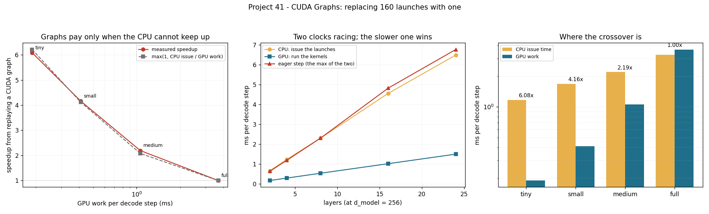

# CUDA Graphs for Decode

---

> Replace 160 [kernel launches](/shared/glossary/#kernel-launch) per token with one call, and the answer is either **6.08×** or **1.00×** — the same technique, the same code, four model sizes. [Project 38](../38-profile-a-single-decode-step/README.md) measured 0.2% on the full model and left the question open; this project finds the law. A decode step is two clocks racing: the GPU running kernels, and the CPU *asking* for them at a flat **20.5 µs per kernel** no matter how much work each one does. The step takes the longer of the two, so a [CUDA graph](/shared/glossary/#cuda-graphs) — which removes the CPU clock entirely — is worth exactly `max(1, CPU issue ÷ GPU work)`. Predicted 6.21×, 4.12×, 2.08×, 1.00×; measured **6.08×, 4.16×, 2.19×, 1.00×**. And a correctness trap that a benchmark would never catch: a graph replays *fixed pointers*, so unless the sequence position lives on the device and is incremented **inside** the captured region, the replayed step silently writes every token to the same cache slot — here the tokens match for five steps and then diverge.

---

## Key Insight

This project captures the per-token decode kernel sequence as a CUDA graph and measures the launch-overhead saving as the model gets smaller.

## Why This Matters

Production engines turn CUDA graphs on by default and quote 5–20%. The number depends entirely on a ratio you can measure in five minutes, and knowing it tells you whether graphs are your next optimisation or a distraction.

---

**This is project 41.**

### The words first

- **[Kernel launch](/shared/glossary/#kernel-launch)** — asking the GPU to run one program. The request goes from Python through Triton, through the CUDA driver, into a queue the GPU reads from.
- **[CUDA Graph](/shared/glossary/#cuda-graphs)** — a recording of a sequence of launches, with their arguments and their dependencies, stored on the device. Replaying it costs *one* driver call instead of one per kernel. The name is literal: it stores the launches as a directed graph of nodes, so the driver knows which can overlap.
- **Capture** — recording mode. You put a [stream](/shared/glossary/#cuda-stream) into capture, run the code once (nothing actually executes), and take the graph out at the end.
- **Issue** — the CPU-side cost of a launch, as opposed to the GPU-side cost of running it. Section B measures 20.5 µs of issue against 0.91 µs of hardware launch ([project 38](../38-profile-a-single-decode-step/README.md)).
- **Replay** — running a captured graph. The kernels, the grid sizes and **the pointers** are all fixed at capture time; only the *contents* of the memory those pointers refer to can change.

### "The GPU does the work. Why would the CPU ever be the limit?"

Because they are not doing the same amount of work per kernel.

Every kernel in a decode step costs the CPU about the same to ask for — around 20 µs of Python, argument packing and a driver call — whether that kernel then runs for 1 µs or 300 µs. So the CPU's total is `kernels × 20.5 µs`, which depends only on the *shape of the model*, while the GPU's total depends on its *size*.

For the 152M model those two numbers are 3.26 ms and 3.67 ms: the CPU is fast enough, just. Shrink the model to 26M and the GPU's work falls to 1.06 ms while the CPU still needs 2.20 ms — now the GPU spends half its time waiting for instructions. At 0.6M it is 1.17 ms of CPU against 0.19 ms of GPU: **the GPU is idle 84% of the time and the "GPU-bound" model is entirely CPU-bound.**

The graph removes the CPU side. That is all it does, which is why the speedup is so exactly predictable.

### "Isn't the position already in the kernel arguments? Why put a counter on the GPU?"

This is the step that looks redundant and is not, and it is worth being exact about the gap it fills.

In an ordinary eager loop the sequence position is a Python integer. You pass it to the kernel as an argument, it becomes larger next iteration, and everything works. **A captured graph freezes its arguments.** Whatever the position was during capture is the position for every replay, forever: every token would be written into the same KV-cache slot and every attention would run over the same length. The kernels would run, the timings would look perfect, and the output would be wrong.

So the position has to be something the graph can *reach* rather than something baked into it — a one-element tensor on the device. The kernels read it with `tl.load(len_ptr)`; a one-line kernel inside the captured region adds 1 to it. The pointer is fixed (which is fine, and required); the number behind the pointer moves.

Section A measures both versions. This is the same class of constraint behind every other rule of graph capture — fixed shapes, fixed buffers, no allocation during replay — and it is why serving engines pre-allocate a KV cache and capture one graph per batch-size bucket.

---

## Running it

```bash
python3 run.py           # ~5 minutes on this GPU
python3 run.py --plot    # redraw the figure from the committed findings.json
```

Needs `torch`, `triton`, `matplotlib`. Imports the engine from [project 37](../37-roofline-plot-for-your-engine/README.md).

**How the graphs are captured here.** `torch.cuda.graph()` does not work on this card — the context manager runs PyTorch kernels of its own during setup, and they are compiled for sm_70+. So [`enginelib.Graph`](../37-roofline-plot-for-your-engine/enginelib.py) calls the CUDA runtime directly through `ctypes`: `cudaStreamBeginCapture`, the Triton launches, `cudaStreamEndCapture`, `cudaGraphInstantiate`, `cudaGraphLaunch`. About 30 lines, and it is the same four API calls PyTorch itself makes.

> **About the numbers.** Everything below comes from the committed
> [`outputs/findings.json`](outputs/findings.json).



---

## A. First: does a replayed graph still generate the right tokens?

Eight tokens from the same starting state, three ways. (The weights are random, so the token ids are arbitrary — what matters is whether the three lists agree.)

| | tokens | final sequence length |
|---|---|---|
| eager loop | `3697 3697 580 580 580 3887 3887 3887` | 72 |
| graph **with** the position counter inside | `3697 3697 580 580 580 3887 3887 3887` ✅ | 72 |
| graph **without** the counter | `3697 3697 580 580 580 580 580 580` ❌ | 64 |

**The broken version agrees for five tokens and then quietly stops moving.** Its sequence length never left 64: every replay wrote its key and value into slot 64 and attended over the first 65 positions. Nothing errored, nothing was slower, and a throughput benchmark would have reported a clean win.

This is the single most important thing to take from CUDA graphs. **The failure mode is not a crash, it is a plausible wrong answer**, and the only defence is to diff the generated tokens against the eager path — which costs one test and catches everything.

## B. The CPU's clock is flat

| | µs |
|---|---|
| One empty kernel, issued from Python + Triton | 9.91 |
| One engine kernel, issued from `decode_step` | **20.5** |
| One kernel launch, hardware floor ([project 38](../38-profile-a-single-decode-step/README.md)) | 0.91 |

The 20.5 µs figure is startlingly consistent — 20.9, 20.6, 20.4 and 20.4 µs per kernel across four models spanning 250× in parameters. Half of it is Triton's launcher; the other half is the engine's own Python (computing grid sizes, looking up buffers, the tracing hook).

**The CPU cost of a decode step is therefore just `number of kernels × 20.5 µs`, and nothing else.** That is a model you can apply to your own stack in one line, and it is the numerator of every speedup below.

## C. The law: `speedup = max(1, CPU issue ÷ GPU work)`

Batch 1, context 512, four models with identical architecture and different widths.

| model | kernels | GPU work | CPU issue | eager step | predicted | **measured** |
|---|---|---|---|---|---|---|
| tiny, 0.6M | 56 | 0.189 ms | 1.173 ms | 1.149 ms | 6.21× | **6.08×** |
| small, 4M | 82 | 0.409 | 1.686 | 1.704 | 4.12× | **4.16×** |
| medium, 26M | 108 | 1.058 | 2.202 | 2.322 | 2.08× | **2.19×** |
| full, 152M | 160 | 3.669 | 3.259 | 3.680 | 1.00× | **1.00×** |

**The prediction is within 5% in all four rows**, and the mechanism is visible in the "eager step" column: it is always the larger of the two clocks (1.149 ≈ 1.173; 3.680 ≈ 3.669). A decode step really is a race between two independent producers, and the graph deletes one of them.

**The crossover is where the model's GPU work passes its kernel count × 20.5 µs.** For this engine on this card that is around 100M parameters. Below it, you are running a very expensive Python program with a GPU attached.

## D. More kernels does *not* make graphs more valuable

Same width (d_model = 256), more layers:

| layers | kernels | GPU work | CPU issue | speedup |
|---|---|---|---|---|
| 2 | 30 | 0.162 ms | 0.656 ms | 3.86× |
| 4 | 56 | 0.285 | 1.228 | 4.13× |
| 8 | 108 | 0.530 | 2.301 | 4.34× |
| 16 | 212 | 1.012 | 4.556 | 4.77× |
| 24 | 316 | 1.494 | 6.493 | 4.53× |

Ten times the kernels; the speedup moves from 3.9× to 4.5×. **Adding layers adds CPU issue time and GPU work in the same proportion**, so the ratio — and therefore the graph's value — barely moves.

The intuition to correct here is a natural one: "we launch hundreds of kernels, so surely launch overhead is our problem." Launch overhead is a problem when the kernels are *small*, not when they are *many*. A deep, narrow model and a shallow, narrow model are equally launch-bound; a deep, **wide** model is not launch-bound at all.

## E. What a graph costs

| | |
|---|---|
| Time to capture and instantiate one graph, kernels already compiled | 9-21 ms |
| Device memory per captured graph | **384 KiB** |
| Memory returned by `cudaGraphExecDestroy` | **0%** |

(The very first capture of a new shape is much slower - 0.3-0.5 s - because Triton compiles the kernels then, not because the graph is expensive.) The first two are small; the third is a genuine operational surprise. Destroying sixteen graphs returned none of their 6 MiB to the free pool — the driver keeps it. For a serving engine that captures one graph per batch-size bucket (vLLM captures dozens by default) this is a fixed tens-of-megabytes cost, paid once, that never comes back if you re-capture. **Capture your graphs at start-up, in one pass, and never re-capture in the serving loop.**

That bucketing is itself the main practical cost of graphs, and it follows directly from the rule in section A: shapes are frozen at capture. A graph captured for batch 8 cannot serve batch 9, so an engine either pads every batch up to the nearest captured size or falls back to eager launches. Padding wastes GPU work; falling back gives up the win. Neither is free, and this is why graphs are a *default* in production rather than a *given*.

## F. Why production engines enable this by default anyway

This card is slow, and that is what hides the effect. Section C's full model does 3.67 ms of GPU work here. An H100 has 16.4× this card's memory bandwidth, and decode is bandwidth-bound ([project 37](../37-roofline-plot-for-your-engine/README.md)), so the same step would take roughly **0.22 ms** there — while the CPU still needs its 3.26 ms to issue 160 launches.

| | this GPU | H100 (arithmetic, from the bandwidth ratio) |
|---|---|---|
| GPU work per step | 3.67 ms | ~0.22 ms |
| CPU issue per step | 3.26 ms | 3.26 ms (unchanged) |
| Predicted graph speedup | 1.00× | **~14×** |

**Kernels got dramatically faster over ten years; issuing a kernel did not.** That is the whole reason CUDA Graphs exist, and the reason a 152M model that looks perfectly healthy on a 2017 card would be desperately launch-bound on a 2023 one. (A production engine in C++ pays perhaps 5 µs per launch rather than 20, which moves the crossover but not the direction.)

**The generalisable procedure**: measure `kernels × per-launch issue cost`, compare it with your step time, and only then decide. Do not port the 5–20% from someone else's blog post — for the tiny model in section C it was 508%.

---

## What to take away

1. **`speedup = max(1, CPU issue ÷ GPU work)`** — predicted 6.21/4.12/2.08/1.00, measured 6.08/4.16/2.19/1.00.
2. **The CPU cost of a decode step is `kernels × 20.5 µs`** and nothing else. It was flat to within 2.5% across a 250× range of model sizes.
3. **A graph without a device-side position counter is silently wrong** — five correct tokens, then the same token forever, at full speed. Diff against the eager path.
4. **More kernels does not increase the win; smaller kernels does.** 10× the layers moved the speedup from 3.86× to 4.53×.
5. **Graph memory is not returned when you destroy the graph.** Capture once at start-up.
6. **The win grows with GPU speed.** The same model that gains 0% here would gain roughly 14× on an H100, because issuing a launch has not become cheaper.
7. **Measure before porting a number.** "CUDA graphs are worth 5–20%" was true for someone else's model on someone else's card.

## Next

- [Project 42 — stream-overlap audit](../42-stream-overlap-audit/README.md): the CPU time this project found idle, put to work.
- [Project 38 — profile a single decode step](../38-profile-a-single-decode-step/README.md): where the 160 kernels come from and what each costs.
- [Project 43 — hardware comparison](../43-hardware-comparison/README.md): the same engine on hardware with a very different balance.
- [Project 16 — static vs continuous batching](../16-static-vs-continuous/README.md): the scheduler above all of this, which decides how many buckets you need.

## Resources

- [NVIDIA — *Getting Started with CUDA Graphs*](https://developer.nvidia.com/blog/cuda-graphs/) — capture, instantiate, replay, and the rules about fixed arguments
- [PyTorch — *Accelerating with CUDA Graphs*](https://pytorch.org/blog/accelerating-pytorch-with-cuda-graphs/) — `torch.cuda.graph`, and the static-input requirement in a framework
- [vLLM — CUDA graph capture and batch-size buckets](https://docs.vllm.ai/en/latest/) — where `--enforce-eager` turns this off and why you might
- [Inference-systems Phase 6](../../README.md#phase-6-inference-relevant-kernels-and-hardware-choices)
