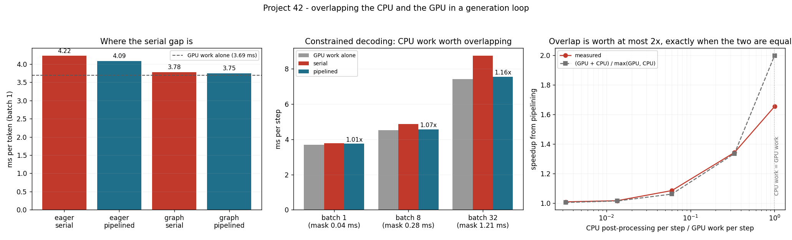

# Stream-Overlap Audit

---

> The textbook serial gap is "[detokenization](/shared/glossary/#detokenization) on the CPU stalls the GPU". Measured with the **real Qwen2.5 tokeniser**, detokenising a token and scanning it for stop strings costs **2.6 µs** — 0.07% of a 3.69 ms decode step. Pipelining it recovers **1.01×**. The gap is real but it is somewhere else: a naive loop that calls `synchronize()` after every step takes **4.22 ms** against a GPU floor of 3.69, and **all** of that 0.53 ms is the CPU issuing 160 launches into a window it just closed. A [CUDA graph](/shared/glossary/#cuda-graphs) recovers 84% of it; pipelining recovers 26%. Then the case where overlap earns its keep: a constrained-decoding mask over a 151,643-token vocabulary costs **1.21 ms** at batch 32, and overlapping it is worth **1.16×**. The general law, verified over a 300× range of CPU cost: `speedup = (GPU + CPU) / max(GPU, CPU)` — at most 2×, and only when the two are equal.

---

## Key Insight

This project finds the serial gap in a generation loop — the point where the CPU and the GPU wait for each other instead of running together — pipelines it, and measures the result.

## Why This Matters

"Overlap the CPU with the GPU" is standard advice, and the standard advice does not say how much it is worth. It is worth `(GPU + CPU) / max(GPU, CPU)` and nothing more, so measuring both halves first tells you whether to bother.

---

**This is project 42.**

### The words first

- **[CUDA stream](/shared/glossary/#cuda-stream)** — an ordered queue of GPU work. Two streams can run at the same time; work inside one stream runs in order. Every launch in this guide goes to the default stream unless it is told otherwise.
- **Synchronise** — `torch.cuda.synchronize()`: the CPU stops and waits until the GPU has finished everything queued. Necessary before reading a result, and the source of most accidental serialisation.
- **[Detokenization](/shared/glossary/#detokenization)** — turning generated token ids back into text. "De-" because it undoes tokenization; a serving loop does it incrementally, one token at a time, so it can stream text to the user.
- **Pipelining** — starting the next piece of work before finishing the bookkeeping for the last one, so two workers are busy at once. The word is from manufacturing: a pipeline moves items through stages rather than doing one item completely at a time.
- **Pinned (page-locked) memory** — host memory the operating system promises never to move. The GPU's copy engine can read and write it directly, without the driver first staging it through a temporary buffer, which makes transfers faster and asynchronous transfers possible at all.
- **Constrained decoding** — restricting which tokens are legal at each step (valid JSON, a grammar). Every step needs a mask over the whole vocabulary, computed on the CPU. See [project 53](../53-json-mode-reliability/README.md) and [project 54](../54-custom-grammar/README.md).

### "The GPU and CPU are different chips. Don't they already run at the same time?"

They can, and by default they do — right up until you ask a question whose answer is on the GPU.

Launching a kernel is asynchronous: the CPU drops the request into a queue and carries on. So a loop that only launches work will run ahead happily. But a serving loop cannot only launch work; it has to *read the token that came out* so it can stream text to the user and check for a stop string. Reading it means waiting for it, and waiting means the CPU sits idle until the GPU is done — and then the GPU sits idle while the CPU catches up.

That alternation is the serial gap, and its cost is exactly the CPU's share: `GPU + CPU` per step instead of `max(GPU, CPU)`.

The fix is one line of reordering: **snapshot the token, launch the next step, and only then do the CPU work**. The GPU is then busy on step *i+1* while the CPU finishes step *i*.

### "If the tokens must be read every step, how can anything overlap?"

Because *reading* a token and *processing* it are different operations with very different costs, and only the first one has to happen before the next launch.

The copy is 128 bytes and takes 11.6 µs (section E). Everything after it — building the text, scanning for stop strings, updating a grammar state, deciding whether the request is finished — needs only the *host* copy of the token, so it can happen any time. Moving the launch in between the two is the whole technique.

What cannot be hidden is the sync itself, which is why section B's numbers matter: if your CPU work is 3 µs, there is nothing to hide behind and the reordering is free but pointless.

---

## Running it

```bash
python3 run.py           # ~8 minutes on this GPU
python3 run.py --plot    # redraw the figure from the committed findings.json
```

Needs `torch`, `triton`, `transformers`, `numpy`, `matplotlib`. Imports the engine from [project 37](../37-roofline-plot-for-your-engine/README.md). The detokeniser is the real `Qwen/Qwen2.5-0.5B-Instruct` tokeniser (151,643 tokens), not a stand-in, so the CPU costs are the ones a real server pays.

> **About the numbers.** Everything below comes from the committed
> [`outputs/findings.json`](outputs/findings.json).



---

## A. The audit: four loops, one model

Batch 1, context 512, 48 tokens per measurement. "Serial" is the obvious loop; "pipelined" issues the next step before post-processing the last one.

| launch style | loop | ms per token | tok/s | above the GPU floor |
|---|---|---|---|---|
| eager | serial | **4.223** | 239 | +0.536 ms (**+14.5%**) |
| eager | pipelined | 4.085 | 245 | +0.398 (+10.8%) |
| graph | serial | 3.778 | 265 | +0.091 (+2.5%) |
| graph | pipelined | **3.746** | 267 | +0.059 (**+1.6%**) |
| — | GPU work alone | 3.687 | 271 | — |

And the CPU work being hidden: **0.0026 ms per token.** Real detokenisation with a real 151k-token vocabulary, plus a stop-string scan, costs **2.6 microseconds**.

**So the 0.536 ms gap is not detokenisation — it is 500× too big to be.** It is the CPU re-issuing 160 kernel launches after every sync. Each `synchronize()` throws away the run-ahead the CPU had built up, so the loop alternates: GPU works while the CPU waits, then the CPU issues while the GPU waits. [Project 41](../41-cuda-graphs-for-decode/README.md) measured that issue cost directly at 20.5 µs per kernel.

**Which is why the graph fixes it and the pipelining barely does.** Replaying a graph is *one* launch, so there is almost nothing left to re-issue after a sync: 84% of the gap disappears. Pipelining only moves the CPU work to a better place, and the CPU work is 2.6 µs.

At batch 32 the same audit gives 7.609 → 7.495 ms (1.5%), with the GPU floor at 7.419: the same gap, now a smaller fraction of a bigger step.

**The generalisable diagnosis:** when a serial gap is much larger than your post-processing, the thing being serialised is *launching*, not *processing*. Look at the launch count before you look at the tokeniser.

## B. So how expensive does the CPU work have to be?

Batch 32, with the detokeniser's work artificially repeated to sweep its cost.

| CPU work per step | CPU / GPU | serial | pipelined | measured | predicted |
|---|---|---|---|---|---|
| 0.024 ms | 0.003 | 7.546 ms | 7.490 | 1.01× | 1.00× |
| 0.099 | 0.013 | 7.611 | 7.496 | 1.02× | 1.01× |
| 0.445 | 0.060 | 8.132 | 7.503 | **1.08×** | 1.06× |
| 2.480 | 0.335 | 10.146 | 7.562 | **1.34×** | 1.33× |
| 7.434 | 1.003 | 16.989 | 10.282 | 1.65× | 2.00× |

The model is arithmetic, not curve-fitting:

```
serial    = GPU + CPU          (they take turns)
pipelined = max(GPU, CPU)      (they run together)
speedup   = (GPU + CPU) / max(GPU, CPU)
```

**It holds to within 0.02 across a 100× range**, and then breaks in the last row — measured 1.65× against a predicted 2.00×. That row is worth understanding rather than ignoring: at parity the pipelined loop has *no* slack, so the parts that genuinely cannot overlap (the sync, the 11.6 µs copy, and the Python interpreter switching between the two jobs) show up directly, and any jitter on either side costs the whole loop.

**The ceiling is 2×, at CPU = GPU exactly.** That is worth saying out loud because "overlap the CPU work" is often proposed as though it were unbounded. If your CPU work is 10% of your step, the best possible outcome is 1.10×, and no amount of engineering changes that.

## C. The case where it pays: constrained decoding

Constrained decoding ([JSON mode](../53-json-mode-reliability/README.md), grammars) must build a mask over the entire vocabulary for every sequence at every step, on the CPU. With Qwen's 151,643 tokens:

| batch | mask cost | GPU work | serial | pipelined | speedup |
|---|---|---|---|---|---|
| 1 | 0.035 ms | 3.691 ms | 3.784 | 3.749 | 1.01× |
| 8 | 0.282 | 4.508 | 4.867 | 4.563 | 1.07× |
| 32 | **1.208** | 7.421 | **8.733** | **7.553** | **1.16×** |

**This is the same audit with a different workload and a completely different answer.** Detokenisation is 0.025 ms at batch 32; the grammar mask is 1.208 ms — **48× more** — because it scales with `batch × vocabulary` rather than with `batch`.

At batch 32, overlapping it converts a 13.5% tax into a 1.8% one. And it scales the wrong way: doubling the batch doubles the mask cost while GPU time grows more slowly, so the CPU share grows with load. **Constrained decoding is the CPU work in a modern serving loop that is actually worth pipelining**, and the audit says so numerically rather than by intuition.

## D. Which of the four loops should you write?

The measurements order the fixes:

| fix | cost to implement | worth (batch 1) |
|---|---|---|
| Capture a CUDA graph | moderate; fixed shapes, a device-side counter, buckets ([project 41](../41-cuda-graphs-for-decode/README.md)) | **1.12×** |
| Reorder three lines to pipeline | trivial | 1.03× |
| Both | — | **1.13×** |
| Overlap detokenisation specifically | pointless here | 1.00× |

**Do the reordering anyway.** It costs three lines, it never hurts, and its value grows with exactly the features a real server adds (bigger batches, grammars, streaming, per-request bookkeeping). But do not expect it to be the win — on this workload the win was in the launches.

## E. The copy that costs more than the work it enables

Device-to-host transfers, measured directly:

| transfer | pageable | pinned | pinned + async |
|---|---|---|---|
| 32 token ids (128 bytes) | 11.62 µs | 10.97 | **8.07** |
| 0.5 MiB of logits | 95.03 µs | **49.82** | 41.57 |

**Pinned memory is worth 1.91× on the logits and 1.06× on the tokens.** The reason is the same in both cases and shows up differently: a pageable copy has to be staged through a driver-owned buffer, which costs *time proportional to size*. For half a megabyte that dominates; for 128 bytes it is invisible next to the fixed ~10 µs of API and launch latency.

Two practical consequences:

- **Copy tokens, not logits.** Sampling on the GPU and copying 128 bytes costs 11.6 µs; copying the logits to sample on the CPU costs 95 µs and rises with the vocabulary. That is 8× more, per step, forever.
- **The token copy costs 4× the detokenisation it feeds** (11.6 µs against 2.6). If you are optimising this end of the loop at all, the copy is the bigger number — and pinning the destination is a one-word change.

---

## What to take away

1. **The serial gap was 0.536 ms and detokenisation was 0.0026 ms.** When the gap is orders of magnitude bigger than the work you suspected, you are looking at the wrong thing.
2. **`synchronize()` every step costs you the CPU's launch time**, because it destroys the run-ahead. That is 14.5% of a batch-1 step with eager launches.
3. **A CUDA graph removed 84% of it; pipelining removed 26%.** Fix the launches first.
4. **`speedup = (GPU + CPU) / max(GPU, CPU)`**, verified to within 0.02 over a 100× range of CPU cost. The ceiling is 2×.
5. **Real detokenisation is 2.6 µs per token** with a 151k vocabulary. It is not your bottleneck and it never was.
6. **Constrained decoding is** — 1.208 ms at batch 32, and overlapping it is worth 1.16×, growing with batch.
7. **Sample on the GPU.** Copying 128 bytes of token ids costs 11.6 µs; copying 0.5 MiB of logits costs 95 µs.
8. **Pin the destination buffer**: 1.91× on a real-sized transfer, free to do.

## Next

- [Project 41 — CUDA Graphs for decode](../41-cuda-graphs-for-decode/README.md): the launch cost that turned out to be the real gap.
- [Project 43 — hardware comparison](../43-hardware-comparison/README.md): the same loop on hardware with a different CPU/GPU balance.
- [Project 03 — stop-string matcher](../03-stop-string-matcher/README.md): the detokenisation-side logic measured here, done properly.
- [Project 53 — JSON mode reliability](../53-json-mode-reliability/README.md): where section C's mask comes from.

## Resources

- [NVIDIA — *How to Overlap Data Transfers in CUDA C/C++*](https://developer.nvidia.com/blog/how-overlap-data-transfers-cuda-cc/) — streams, pinned memory and asynchronous copies
- [NVIDIA — *How to Optimize Data Transfers*](https://developer.nvidia.com/blog/how-optimize-data-transfers-cuda-cc/) — why page-locked memory is faster
- [vLLM — the output processor](https://github.com/vllm-project/vllm) — detokenisation and stop checking moved off the critical path in a production engine
- [Inference-systems Phase 1](../../README.md#phase-1-the-inference-loop-from-first-principles) — the loop this project is auditing
- [Inference-systems Phase 6](../../README.md#phase-6-inference-relevant-kernels-and-hardware-choices)
