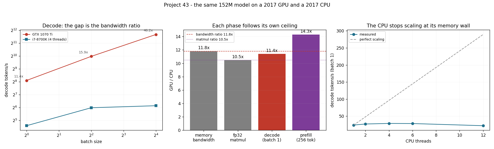

# Hardware Comparison

---

> The same 152M model, the same weights, on the two processors in this machine — and they agree on the logits to **1.7 × 10⁻⁶** and pick the same next token, so it really is one model on two machines. The GPU decodes **11.4× faster**. The interesting part is that this number was predictable to within 4% from two measurements that have nothing to do with transformers: the [memory bandwidth](/shared/glossary/#memory-bandwidth) ratio is **11.8×**, and single-stream [decode](/shared/glossary/#decode) is pure bandwidth. [Prefill](/shared/glossary/#prefill), which is compute-bound, follows the *other* ratio instead — 14.3× measured against a 10.5× matmul ratio. Two honest surprises follow. Using all **12 CPU threads is 1.30× slower than using 4** — the CPU hits its memory wall at four cores and hyper-threading then makes it worse. And if the GPU had to stream its weights over [PCIe](/shared/glossary/#pcie) every token instead of holding them in [VRAM](/shared/glossary/#hbm), it would manage **20.6 tokens/s — slower than the CPU's 24.0**. The GPU's advantage is not that it computes faster; it is that the weights are already next to it.

---

## Key Insight

This project runs the same model and the same benchmark on two different processors and explains the gap from their spec sheets.

## Why This Matters

Buying decisions are made from spec sheets. Learning to predict a real workload's ratio from two numbers on those sheets — and to notice when the prediction misses — is the difference between a purchase and a guess.

---

**This is project 43.**

### The words first

- **[Memory bandwidth](/shared/glossary/#memory-bandwidth)** — how many bytes per second a processor can pull from its main memory. For a GPU this is [VRAM](/shared/glossary/#hbm)/HBM; for a CPU it is the DDR channels on the motherboard.
- **TDP** — Thermal Design Power, the heat a chip is designed to shed, in watts. It is a *design* number, not a measurement: real draw can be well below it, and this asymmetry matters in section G.
- **[PCIe](/shared/glossary/#pcie)** — the bus connecting the GPU to the host. Everything the GPU does not already have in its own memory has to cross it, at a fraction of either machine's internal bandwidth.
- **Hyper-threading** — running two hardware threads on one physical core, so they share its execution units and caches. Helpful when a thread stalls a lot; harmful when both threads want the same cache and the same memory port.
- **oneDNN / MKL** — Intel's optimised kernel libraries, which is what `torch.matmul` calls on this CPU. The CPU side of this comparison is therefore a *good* CPU implementation, not a naive one.

### "Isn't a GPU just faster at everything? What is there to explain?"

A GPU is faster at *arithmetic* by roughly 10× here and at *memory traffic* by roughly 12×, and those are different numbers. Which one you get depends entirely on which phase of inference you are running — which is exactly the roofline argument from [project 37](../37-roofline-plot-for-your-engine/README.md), now applied across two machines instead of across one machine's workloads.

That is the useful version of "how much faster is a GPU": not one number, but *which ratio applies to my workload*. Section D and section E measure two workloads on the same pair of chips and get 11.4× and 14.3×.

And the third possibility, section F, is the one that catches people out: if the data has to travel to the fast processor first, neither ratio applies — the bus does.

### "Why write a second implementation? Couldn't you just run the same code?"

You cannot, and the reason is specific to this machine: the GPU engine is Triton kernels (PyTorch's own CUDA kernels do not support this card), while the CPU path is ordinary `torch.matmul` and `torch.softmax` calls into oneDNN. Two implementations, unavoidably.

That is a real risk to the comparison — if the two engines quietly compute different things, every ratio below is meaningless. So the two share their *weights* rather than their code: [`cpu_engine.py`](cpu_engine.py) replays the same random draws in the same order, so both hold bit-identical parameters, and section C then checks that the two produce the same logits from the same input. They agree to 1.7 × 10⁻⁶ and choose the same token.

**This check is worth its weight in any cross-hardware benchmark you run.** "Same model" usually means "same checkpoint name", which is compatible with a different attention implementation, a different [RoPE](/shared/glossary/#rope) convention, or a different precision — any of which will move your ratio more than the hardware does.

---

## Running it

```bash
python3 run.py           # ~9 minutes
python3 run.py --plot    # redraw the figure from the committed findings.json
```

Needs `torch`, `triton`, `matplotlib`, and `nvidia-smi` for the power reading.

**A note on what "two different GPUs" became.** The project brief asks for two GPUs, or a CPU and an integrated GPU. This machine has one discrete GPU and no usable iGPU, so the comparison is the discrete GPU against the CPU — which is arguably the more instructive pairing, because the two ceilings differ in *ratio* (12× on bandwidth, 10× on compute) rather than being scaled versions of each other. Section H does the spec-sheet arithmetic for datacentre cards, labelled as arithmetic.

> **About the numbers.** Everything below comes from the committed
> [`outputs/findings.json`](outputs/findings.json).



---

## A. The two machines

Both parts launched in 2017, which makes the comparison unusually fair.

| | GTX 1070 Ti | i7-8700K |
|---|---|---|
| Peak fp32 (spec) | 8,186 GFLOP/s | 825 GFLOP/s |
| Memory bandwidth (spec) | 256 GB/s | 41.6 GB/s |
| TDP | 180 W | 95 W |
| Parallelism | 19 SMs × 128 lanes | 6 cores × 8 AVX2 lanes |

## B. What they actually deliver

| | GPU measured | % of spec | CPU measured | % of spec | **ratio** |
|---|---|---|---|---|---|
| Copy bandwidth | 203.4 GB/s | 79% | 17.2 GB/s | 41% | **11.8×** |
| fp32 matmul (2048³) | 5,900 GFLOP/s | 72% | 560 GFLOP/s | 68% | **10.5×** |

**The CPU reaches 41% of its rated bandwidth and the GPU 79%.** That is not a fluke: DDR4 on a desktop rarely reaches its theoretical figure, because a handful of cores cannot keep enough requests in flight to hide the latency, while a GPU has thousands of threads doing exactly that. **On the memory ratio, the spec sheets understate the gap** (6.2× on paper, 11.8× measured). On the compute ratio they are about right (9.9× on paper, 10.5× measured).

## C. Is it the same model?

| | |
|---|---|
| Max relative difference in the logits | **1.7 × 10⁻⁶** |
| Same argmax token | ✅ (4591 on both) |

fp32 with 7 digits of precision, two entirely different implementations, one difference in the seventh digit. The weights are identical by construction and the arithmetic agrees.

*(This check found a real bug on the way in. The GPU engine's prefill was reading the hidden state of the **first** token of the sequence into its output head instead of the last — a shape-compatible mistake that no timing test could see. The CPU comparison caught it immediately: a relative difference of 1.1, i.e. completely different logits. It is fixed, and the incident is the whole argument for section C existing at all.)*

## D. Decode: the bandwidth ratio, and nothing else

Context 512.

| batch | GPU tok/s | CPU tok/s | ratio |
|---|---|---|---|
| 1 | 274.1 | 24.0 | **11.4×** |
| 4 | 1,002.2 | 63.2 | 15.9× |
| 16 | 3,257.9 | 70.5 | **46.2×** |

**At batch 1 the measured ratio is 11.4× and the bandwidth ratio is 11.8× — the prediction is within 4%.** No knowledge of transformers is needed to make it: single-stream decode reads every weight once per token, so it runs at whatever speed the machine can read 580 MiB, and the ratio of two such machines is the ratio of their bandwidths.

**Then the gap widens sharply with batch, and that is the CPU falling apart rather than the GPU improving.** From batch 1 to 16 the GPU gains 11.9× in throughput; the CPU gains 2.9×. Batching works by re-using the weights you already fetched across more sequences — but it also multiplies the [KV cache](/shared/glossary/#kv-cache) traffic and the activation working set, and the CPU's 12 MiB of L3 cannot hold what a GPU holds in its bandwidth. **The processor with less memory parallelism loses more as you ask it to do more at once.**

## E. Prefill: a different ratio, for a different reason

256 prompt tokens, batch 1:

| | GPU | CPU | ratio |
|---|---|---|---|
| prefill tok/s | 14,581.6 | 1,021.2 | **14.3×** |
| the ratio it "should" follow | | | 10.5× (matmul) |

**Prefill follows the compute ratio, but exceeds it by 36%**, and the honest explanation is that the CPU implementation loses ground on the parts that are not matmul. Its attention materialises the whole score matrix and expands the [grouped-query](/shared/glossary/#gqa) keys with `repeat_interleave` — memory traffic the GPU's fused flash kernel never performs. That difference is not "the hardware"; it is the kernels, and it is exactly the point [project 39](../39-flashdecoding-ablation/README.md) makes about attention implementations.

**Report both the prediction and the miss.** A ratio that lands 36% above its ceiling-derived prediction is a signal that the two implementations are not equally good, not a discovery about silicon.

## F. The PCIe tax: where the GPU loses

| | |
|---|---|
| Host → device, pageable memory | 10.63 GB/s |
| Host → device, pinned memory | **12.62 GB/s** |
| Time to load the 580 MiB model onto the card | **48 ms** |
| Decode rate **if** the weights had to cross PCIe every token | **20.6 tok/s** |
| The CPU's actual decode rate, weights already in RAM | **24.0 tok/s** |

**A GPU that has to stream its weights over PCIe for every token is slower than the CPU.** 12.6 GB/s of PCIe against 17.2 GB/s of DDR4 — the bus is narrower than the CPU's own memory, so the "fast" processor is fed more slowly than the slow one, and all of its bandwidth advantage is unreachable.

This is not a hypothetical. It is precisely the situation when a model does not fit in VRAM and a framework starts offloading layers to host memory. The rule that follows is blunt and worth remembering: **fit the weights in device memory or do not use the device.** It is also the strongest argument for weight [quantization](/shared/glossary/#quantization) that has nothing to do with quality — [Phase 5](../../README.md#phase-5-serving-time-quantization-decisions) is largely about staying on the right side of this cliff.

The 48 ms load time has a happier reading: cold-starting a replica of this model costs 48 ms of transfer. For a 7B in fp16 (14 GB) the same bus needs **1.1 seconds**, which is the number that decides how fast an autoscaler can add capacity.

## G. Power

| | |
|---|---|
| GPU idle | 6.7 W |
| GPU decoding, batch 1 (median of 12 samples) | **64.6 W** |
| GPU tokens per joule | **4.22** |
| CPU tokens per joule, **assuming its full 95 W TDP** | ≥ 0.25 |

**The GPU is at least 17× more energy-efficient per token**, and the comparison is deliberately generous to the CPU: 95 W is its design ceiling, so the true figure is probably better than 0.25 and still nowhere near 4.22.

Two things are worth noticing.

**The GPU draws 64.6 W out of a 180 W budget** while running decode flat out. Memory-bound work does not heat a GPU: the arithmetic units are idle most of the time, waiting. If you size a rack's power for peak FLOPs and then serve decode traffic, you will over-provision substantially — and conversely, a prefill-heavy workload on the same card will draw far more.

**And the asymmetry in the measurement is itself the lesson.** `nvidia-smi` reports GPU power directly; the CPU's RAPL energy counters are not readable without elevated privileges on this machine, so its number is a spec sheet, not a measurement. Any "perf per watt" comparison you read should be checked for exactly this: whether both sides were measured, or only one.

## H. Scaling the answer up

The same two ratios, applied to hardware this project does not have. Arithmetic from published figures, not measurements.

| | this GPU | H100 SXM | ratio |
|---|---|---|---|
| Memory bandwidth | 203 GB/s (measured) | 3,350 GB/s | 16.5× |
| Dense BF16 compute | — | 989 TFLOP/s | ~170× this card's fp32 |
| Predicted single-stream decode on the 152M model | 274 tok/s | ~4,500 tok/s | 16.5× |

**Bandwidth grew 16×; compute grew 170×.** That is the single most important trend in this table, and it is why every other project in this phase is about memory: a decade of hardware progress went overwhelmingly into arithmetic, while the phase of inference that dominates user-facing latency needs bytes. The [ridge point](/shared/glossary/#ridge-point) moved from 28 FLOP/byte on this card to 295 on an H100 ([project 37](../37-roofline-plot-for-your-engine/README.md)), which is the same fact stated as a ratio.

---

## What to take away

1. **Check that it is the same model before comparing hardware.** 1.7 × 10⁻⁶ agreement here — and the check caught a real bug in the GPU engine that no benchmark would have.
2. **Single-stream decode follows the bandwidth ratio.** Predicted 11.8×, measured 11.4×, with no transformer knowledge required.
3. **Prefill follows the compute ratio** — 10.5× predicted, 14.3× measured, and the 36% excess is the CPU's weaker attention implementation, not the silicon.
4. **The gap grows with batch**: 11.4× at batch 1, 46.2× at batch 16. Batching rewards the machine with more memory parallelism.
5. **4 CPU threads beat 12 by 1.30×.** The CPU reaches its memory wall at four cores, and hyper-threading past it makes things worse.
6. **A GPU streaming weights over PCIe (20.6 tok/s) loses to a CPU with them in RAM (24.0).** Fit the weights in device memory or do not use the device.
7. **Decode draws 64.6 W of a 180 W budget.** Memory-bound work does not heat a GPU; sizing power from peak FLOPs over-provisions.
8. **Measure both sides of a perf-per-watt claim**, or say plainly that you did not.

## Next

- [Project 37 — roofline plot](../37-roofline-plot-for-your-engine/README.md): the two ceilings that predicted both ratios here.
- [Project 42 — stream-overlap audit](../42-stream-overlap-audit/README.md): the CPU-GPU interaction inside a single serving loop.
- [Project 63 — cost report](../63-cost-report/README.md): turning these ratios into dollars per million tokens.
- [Project 72 — on-device build](../72-on-device-build/README.md): where the CPU is the only processor you have.

## Resources

- [NVIDIA — *GeForce GTX 1070 Ti* specifications](https://www.nvidia.com/en-us/geforce/graphics-cards/geforce-gtx-1070-ti/specifications/) — the GPU column of section A
- [Intel — *Core i7-8700K* product specification](https://www.intel.com/content/www/us/en/products/sku/126684/) — the CPU column
- [`llama.cpp`](https://github.com/ggerganov/llama.cpp) — what serious CPU inference looks like, and why quantisation matters more there
- [AI Hardware Phase 5](../../../ai-hardware/README.md#phase-5-tpus-npus-and-alternative-accelerators) — comparing accelerators when you cannot buy them
- [Inference-systems Phase 6](../../README.md#phase-6-inference-relevant-kernels-and-hardware-choices)
