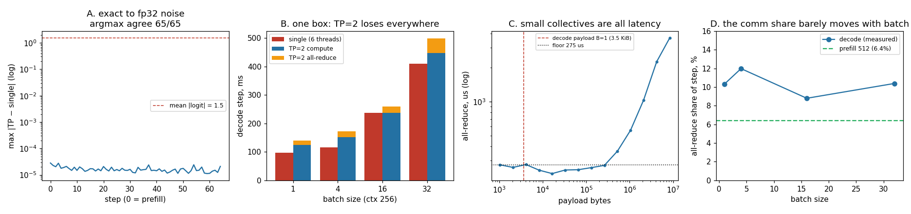

# TP=2 from Scratch

---

> Split one model across two GPUs and prove the answer doesn't change. This project slices Qwen2.5-0.5B's [attention](/shared/glossary/#attention) heads and MLP columns in half, runs the two halves as two real processes talking over [gloo](/shared/glossary/#gloo), and checks the output against the unsplit model: **65 of 65 steps pick the same token**, with logits differing by **2.8e-05** on values whose typical size is 1.54 — pure floating-point dust. Then it prices the split. On this one machine TP=2 is a **loss at every batch size** (0.70x at batch 1, 0.92x at its best), because two ranks share one CPU instead of adding a second one. The number worth carrying away is *why*: an [all-reduce](/shared/glossary/#allreduce) costs **~250 microseconds no matter how small it is**, decode fires **48 of them per token**, and at batch 1 each one carries just **3.5 KiB**. Sharding also does not halve memory the way the arithmetic suggests — **1.26 GB per rank instead of 1.98**, a 1.57x saving rather than 2x, because the 544 MB [embedding](/shared/glossary/#embedding) table sits on both ranks.

---

## Key Insight

This project applies [tensor parallelism](/shared/glossary/#tensor-parallelism-tp) by hand on two GPUs — splitting a model's [attention](/shared/glossary/#attention) layer [weights](/shared/glossary/#weights) across both and combining their partial results with an [all-reduce](/shared/glossary/#allreduce) — then verifies the output exactly matches the single-GPU model.

## Why This Matters

Tensor parallelism is how a model too big for one GPU still runs, but it adds communication on every layer. Building TP=2 by hand shows both how the split works and why that cross-GPU chatter — not the math — often becomes the limit on speed.

---

**This is project 44.**

### The words first

- **[Tensor parallelism](/shared/glossary/#tensor-parallelism-tp) (TP)** — cut each weight *matrix* into pieces and give one piece to each device. The name is literal: the things being split are the tensors (the weight matrices) themselves, not the batch and not the layers. Contrast with [data parallelism](/shared/glossary/#data-parallelism) (whole model on every device, different *requests* on each — [project 45](../45-vllm-multi-replica/README.md)) and [pipeline parallelism](/shared/glossary/#pipeline-parallelism) (whole *layers* on each device, one after another).
- **[All-reduce](/shared/glossary/#allreduce)** — "reduce" is the old functional-programming word for folding many values into one with an operator, here `+`. "All" means every participant ends up holding that one result, not just a designated leader. So an all-reduce over two ranks is: add my numbers to yours, and make sure we both end up with the sum. It is a [collective operation](/shared/glossary/#collective-operation) — every rank must call it, and none may proceed until all have.
- **Rank** — the index of a process in the group (rank 0, rank 1). Not a quality ranking; it is just a name, borrowed from MPI, the message-passing standard that HPC has used since the 1990s.
- **Column-parallel and row-parallel** — the two ways to cut a matrix multiply. Split a weight matrix by *output* columns and each device produces a slice of the output (no communication needed yet). Split the *next* matrix by *input* rows to match, and each device produces a **partial sum** of the full output — correct in shape, incomplete in value, and completed by one all-reduce. Megatron-LM's arrangement, and the one implemented here.
- **Partial sum** — a number that is part of an answer but not the answer. If the true output is `a + b` and rank 0 computed `a` while rank 1 computed `b`, each rank holds a partial sum. Adding them (the all-reduce) finishes the job. This is the single idea that makes TP exact rather than approximate.
- **[gloo](/shared/glossary/#gloo)** — PyTorch's CPU collective-communication backend. On real GPUs the equivalent is [NCCL](/shared/glossary/#nccl) over [NVLink](/shared/glossary/#nvlink). Same operations, different speed.
- **[torchrun](/shared/glossary/#torchrun)** — the launcher that starts N copies of your script and tells each one its rank.

### "Two GPUs already exist. Why not just run the model on one and the next request on the other?"

That is [data parallelism](/shared/glossary/#data-parallelism), it is simpler, it is faster per request, and it is what you should do — *whenever the model fits on one device*. [Project 45](../45-vllm-multi-replica/README.md) is that project, and its results are better than this one's.

Tensor parallelism exists for the case where that option is not available: the model's weights do not fit in one device's memory. A 405B-parameter model in [fp16](/shared/glossary/#float16) is 810 GB; the largest single GPU today holds 192 GB. No amount of replication helps, because you cannot replicate what you cannot load once. TP is what makes the model runnable at all, and the communication cost is the fee.

That framing matters for reading the results below. **TP losing to a single device is the expected outcome whenever a single device was an option.** The measurement worth taking from this project is not "is TP fast" but "what exactly does TP charge, and which part of the charge scales."

### "If each GPU only has half the attention heads, isn't the answer only half right?"

No, and the reason is a property of attention rather than a clever trick.

The heads of a [multi-head attention](/shared/glossary/#multi-head-attention) layer **never read each other's work**. Head 3 computes its own queries, keys, values, and its own weighted sum, and never looks at head 4. The heads only meet at the very end, when their outputs are concatenated and passed through the output projection `W_o`.

So splitting heads across devices is exact. Rank 0 computes heads 0–6 completely. Rank 1 computes heads 7–13 completely. The only thing neither can do alone is the final projection — because that matrix reads *all* the heads. And that is precisely where the all-reduce goes.

The [MLP](/shared/glossary/#mlp) is the same story in different clothing. It computes `down(silu(gate(x)) * up(x))`. Cut `gate` and `up` by output column: each rank owns half the hidden dimension, and `silu` and the multiply are elementwise, so no rank needs its neighbour's half. Cut `down` by input row to match, and each rank produces a partial sum of the full output. One all-reduce finishes it.

Two all-reduces per transformer block, then: one after attention, one after the MLP. **Twenty-four blocks x 2 = the 48 all-reduces per forward pass** that section B counts.

### "Why does each rank keep a full copy of the residual stream?"

Because it is cheap and it saves communication. The vector flowing between blocks (`x` in the code) is `d_model` wide — 896 numbers per token. The things that are sharded are the wide inner matrices: `896 x 4864` in the MLP, and the `14 x 64` heads of attention. Those are hundreds of times larger.

Keeping the small thing replicated means the all-reduce's output *is* the next block's input on both ranks, with no further exchange. Sharding it too would save a negligible amount of memory and require an extra collective (an all-gather) at every layer boundary.

### "You can't shard finer than a KV head" — what that means

Qwen2.5-0.5B uses [GQA](/shared/glossary/#gqa): 14 query heads share just **2** key/value heads. Query heads 0–6 read KV head 0; query heads 7–13 read KV head 1.

That grouping sets a hard ceiling on TP degree. At TP=2 the split is clean — one KV head each, so **each rank stores half the KV cache** (12,288 bytes per token instead of 24,576). At TP=4 there is no way to give each rank its own KV head, so real systems duplicate the KV cache across ranks: the cache stops shrinking as you add devices, while the [KV cache](/shared/glossary/#kv-cache) is usually the reason you needed the memory in the first place. This is why production TP degree on GQA models is commonly held at or below the KV-head count.

---

## Running it

```bash
python3 run.py           # ~4 minutes; launches torchrun with 2 ranks
python3 run.py --plot    # redraw from outputs/findings.json
```

Needs `torch`, `transformers`, `matplotlib`, and [project 16](../16-static-vs-continuous/README.md)'s `batchlib.py`. `tplib.py` subclasses `BatchedRunner` and overrides exactly one method, `_layer`, adding two `dist.all_reduce` calls; everything else — [RoPE](/shared/glossary/#rope), the slot pool, the masks — is inherited unchanged, so any difference in output is attributable to the sharding and nothing else.

**The honest framing of the hardware.** There are two GPUs in the *story* and one CPU in the *room*. The two ranks are two processes on one 12-core machine, given 3 threads each against the single model's 6. That reproduces TP's costs faithfully (the collectives are real, the sharded matrices are real) and cannot reproduce its central benefit, which is having a second device's memory and arithmetic. Section B is therefore a deliberately unflattering test and is labelled as one; sections A, C and D are the parts that transfer.

> **About the numbers.** Everything below comes from the committed
> [`outputs/findings.json`](outputs/findings.json).



---

## A. Does the split change the answer?

65 forward passes — one prefill over three prompts of different lengths, then 64 decode steps — with the sharded model and the whole model fed **identical inputs**.

| | result |
|---|---|
| steps where both pick the same next token | **65 / 65** |
| largest logit difference, any step | **2.81e-05** |
| typical size of a logit | 1.54 |
| relative error | **~1.8e-05** |

**This is a floating-point tie, not an approximation.** The two runs do the same multiplications and additions in a different *order*: the single model sums all 14 heads' contributions in one matrix product, while TP sums 7 on each rank and adds the two results. Addition of floats is not associative — `(a+b)+c` can differ from `a+(b+c)` in the last bit — so a difference of order 1e-5 in fp32 is what "identical" looks like.

Compare with the margin that matters: [project 06](../06-determinism-audit/README.md) measured that Qwen's greedy choice survives perturbations of this size with room to spare, and here every one of the 65 steps agrees.

**A trap worth naming.** The first version of this test let each model generate *its own* continuation with greedy sampling. That is the wrong instrument: one near-tie anywhere in 64 steps sends the two runs down different sentences, and every later logit then differs for a legitimate reason, drowning the signal you were looking for. The fixed version force-feeds both models the same pre-drawn token sequence, so each step is an independent comparison. Any test of "did my optimisation change the model" wants this shape.

## B. What the split costs, on one machine

Decode step time at context 256, single model on 6 threads vs. TP=2 on 3 threads per rank.

| batch | single | TP=2 | of which all-reduce | speedup |
|---|---|---|---|---|
| 1 | **97.9 ms** | 139.8 ms | 14.5 ms (10.3%) | **0.70x** |
| 4 | **116.8 ms** | 172.3 ms | 20.6 ms (12.0%) | 0.68x |
| 16 | **238.1 ms** | 260.2 ms | 22.9 ms (8.8%) | **0.92x** |
| 32 | **411.0 ms** | 499.8 ms | 51.9 ms (10.4%) | 0.82x |
| prefill, 512 tokens | **1,270 ms** | 1,807 ms | 115.6 ms (6.4%) | 0.70x |

**TP=2 loses everywhere here, and that is the correct result for this hardware.** Splitting one CPU's cores between two processes does not create arithmetic; it only adds the collectives. On two *actual* GPUs the compute column would roughly halve while the communication column stayed put — which is exactly why the interesting quantity is that third column, not the second.

**Communication is 6–12% of the step, and it barely moves with batch size.** Decode sits at 10.3 / 12.0 / 8.8 / 10.4% across batches 1 to 32 — flat within the noise of a shared machine — while prefill is lowest at 6.4%.

That flatness is worth pausing on, because section C predicts something different. If the collectives were pure wire time, batch 32's payload (112 KiB) would still be under the latency knee and would cost the same as batch 1's, so the *share* should fall as the compute grows. Instead the measured communication rose from 14.5 ms to 51.9 ms.

The gap is a real effect and it has a name: **the measured time inside `dist.all_reduce` includes waiting for the other rank to arrive.** A collective cannot complete until both participants call it, so whichever rank reaches it first blocks — and that wait is charged to the collective even though no bytes are moving. As the per-layer compute grows, so does the scope for the two ranks to drift apart, and the waiting grows with it. **On a shared CPU the two ranks never stay in lockstep, so part of what this column calls "communication" is really load imbalance.**

Two practical consequences. First, prefill's 6.4% is the most trustworthy number in the table, because its long, uniform layers keep the ranks tightly synchronised. Second, if you profile TP in production and see a large all-reduce time, check whether your ranks are actually *arriving* together before you go shopping for a faster interconnect — an [NVLink](/shared/glossary/#nvlink) upgrade does nothing for a rank that is late.

## C. Why a tiny all-reduce costs the same as a big one

The all-reduce that finishes attention at batch 1 moves `1 token x 896 numbers x 4 bytes = 3,584 bytes`. Here is what gloo charges for payloads from 1 KiB to 8 MiB:

| payload | latency | effective rate |
|---|---|---|
| 1 KiB | 275 us | 0.004 GB/s |
| 16 KiB | 230 us | 0.071 GB/s |
| 256 KiB | 272 us | 0.965 GB/s |
| 1 MiB | 556 us | 1.885 GB/s |
| 8 MiB | 3,663 us | 2.290 GB/s |

**From 1 KiB to 256 KiB — a 256-fold increase in bytes — the time does not move.** It sits at roughly 250 microseconds throughout. Only past ~512 KiB does the payload start to matter, after which time grows in proportion to size and the rate flattens out at the link's real bandwidth of ~2.3 GB/s.

That flat region is a **latency floor**: the cost of getting two processes' attention, agreeing that they have both arrived, and doing a round trip. The bytes are free by comparison. Below the knee you are not paying for bandwidth at all — you are paying for the *existence* of the collective.

Now put that together with decode:

- 48 all-reduces per token (2 per block x 24 blocks)
- 48 x 250 us = **12 ms of floor per token**, before a single useful byte moves
- measured all-reduce time at batch 1: **14.5 ms** — the floor plus a little

**This is the whole reason TP is priced per layer rather than per byte.** Adding batch does not add collectives; it only makes each one carry more. At batch 32 the payload is 114,688 bytes — 32x the batch-1 payload — and *still under the knee*, so on wire time alone it should have cost what batch 1 cost. It rose 3.6x instead (14.5 ms to 51.9 ms), which is the rank-synchronisation effect section B describes rather than bandwidth.

The practical consequences follow directly:

- **Deeper models pay more**, in exact proportion to layer count. A 32-layer model pays 64 collectives per token, an 80-layer model 160.
- **Small batches pay the most per token**, since the fixed cost is divided among fewer tokens.
- **A faster link helps less than you would guess.** [NVLink](/shared/glossary/#nvlink) has roughly 400x this loopback's bandwidth, but the sub-microsecond latencies it also brings are what actually move decode — a link that were merely wider would leave the 48-collective floor almost untouched.
- It is also why production TP implementations work so hard to *fuse* collectives with the compute around them, and why [CUDA Graphs](/shared/glossary/#cuda-graphs) ([project 41](../41-cuda-graphs-for-decode/README.md)) matter so much in TP deployments: both attack fixed per-launch overheads rather than bytes.

## D. What sharding actually saves in memory

Per-rank bytes at TP=2, fp32:

| | single device | per rank at TP=2 | saving |
|---|---|---|---|
| sharded weights (attention + MLP) | 1,431 MB | **716 MB** | exactly 2.00x |
| replicated (embedding, norms, lm_head) | 545 MB | **545 MB** | 1.00x — *not sharded* |
| **total weights** | **1,976 MB** | **1,260 MB** | **1.57x** |
| KV cache per token | 24,576 B | **12,288 B** | 2.00x |

**The headline "TP=2 halves your memory" is wrong by a wide margin at this model size, and the reason is the vocabulary.** Qwen2.5-0.5B's embedding table is 151,936 tokens x 896 dimensions x 4 bytes = **545 MB** — more than a quarter of the model, and larger than all 24 blocks' attention weights combined. This implementation replicates it on both ranks, so it contributes nothing to the saving.

Production implementations do sometimes shard the embedding and `lm_head` (Megatron splits the vocabulary dimension and follows the output projection with its own all-reduce), which would recover most of that 545 MB. It is left replicated here because doing so keeps the diff against `batchlib.BatchedRunner` down to a single method, and because the *shape* of the lesson survives either way:

**TP's memory saving applies only to what you actually shard, and the fraction of a model that is shardable falls as the model gets smaller.** At 0.5B parameters the vocabulary is 28% of the weights; at 70B the same table is under 2%, and TP=8 really does come close to dividing memory by 8. Small models are the worst case for TP on every axis at once — least to gain in memory, least arithmetic to hide the collectives behind.

The KV cache does halve cleanly, and for long-context serving that is often the number that decides whether the deployment fits at all.

---

## What to take from this

1. **Sharding is exact, not approximate.** 65/65 identical token choices; logits differ by 1.8e-05 relative, which is float addition being non-associative. Attention heads never read each other, so splitting them costs nothing but a sum at the end.
2. **An all-reduce costs ~250 us whether it carries 1 KiB or 256 KiB.** Below the knee you pay for the collective's existence, not its payload.
3. **Decode fires 48 collectives per token**, so it inherits 12 ms of pure floor. This is why TP hurts most at batch 1 and long-decode workloads — exactly the case chat serving lives in.
4. **Communication was 6–12% of the step and roughly flat across batch sizes**, lowest for prefill (6.4%), whose uniform layers keep the ranks in step. Part of that column is ranks waiting for each other, not bytes moving. On real GPUs the compute halves and this share roughly doubles.
5. **TP=2 halved the KV cache and the block weights, but only cut total memory 1.57x**, because a 545 MB embedding table sits on both ranks. Check what fraction of *your* model is actually shardable before predicting the saving.
6. **GQA sets a ceiling on TP degree.** 2 KV heads means TP=2 splits the cache cleanly and TP=4 would have to duplicate it.
7. **Use TP when the model does not fit, not to go faster.** Where a single device was an option, it won here at every batch size.

### Common traps this project walks into on purpose

- **Letting each model generate its own continuation when checking correctness.** One tie diverges the sequences and every later comparison becomes meaningless. Force identical inputs at every step.
- **Timing a collective by wrapping the whole step.** The `TPRunner` meters `dist.all_reduce` calls individually, so the communication column is measured rather than inferred from a difference of two noisy totals.
- **Reading the 1 KiB row of section C as a bandwidth figure.** 0.004 GB/s is not a bandwidth; it is a 250 us fixed cost divided by a tiny payload.
- **Assuming TP=N divides memory by N.** It divides *what you sharded* by N. Audit the replicated remainder.
- **Sharding finer than the KV-head count** without noticing the KV cache stops shrinking.

---

## Next

[Project 45 — vLLM multi-replica](../45-vllm-multi-replica/README.md) takes the opposite approach to the same machine: instead of splitting one model across devices, run several complete copies and spread requests across them. It is simpler, and where the model fits, it wins.
