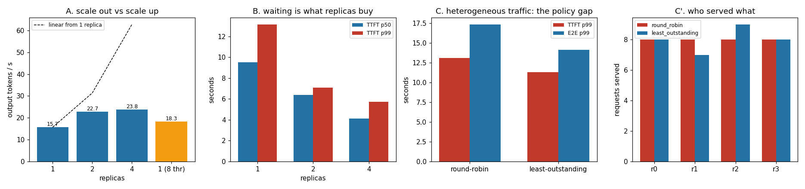

# vLLM Multi-Replica

---

> When one copy isn't enough, run several and spread the load across them. This project starts four real replica *processes*, each with its own model and its own port, and load-tests them through a round-robin balancer. The result is the one nobody puts on a slide: **four replicas gave 1.51x the throughput of one, not 4x** (15.7 to 23.8 tokens/s) — because four copies of the same model on one machine fight over one memory bus. What replication genuinely bought was **waiting time**: [TTFT](/shared/glossary/#ttft) p50 fell **2.32x** (9.52 s to 4.10 s) and p99 **2.29x**. The scale-*up* control is the sharpest comparison in the project: one replica given all 8 threads reached 18.3 tok/s with a **50 ms** token gap, while four replicas at 2 threads reached 23.8 tok/s with a **157 ms** gap — the same box, one arrangement better for throughput and the other 3.1x better for smoothness. Swapping round-robin for [least-outstanding](/shared/glossary/#load-balancing) routing on uneven traffic cut TTFT p99 **1.16x** and E2E p99 **1.23x** while moving exactly **one request**.

---

## Key Insight

This project runs four complete copies (replicas) of a model in [vLLM](/shared/glossary/#vllm) behind a simple round-robin [load balancer](/shared/glossary/#load-balancing) — a form of [data parallelism](/shared/glossary/#data-parallelism) — then load-tests them and reports the combined [throughput](/shared/glossary/#throughput).

## Why This Matters

Replication is the simplest way to scale: each copy is independent, so a failure stays isolated and capacity grows almost linearly with the number of replicas. It is the default choice for any model small enough to fit on a single GPU.

---

**This is project 45.**

### The words first

- **Replica** — one complete, independent copy of the model, serving requests on its own. Nothing is shared with the other replicas: not weights, not [KV cache](/shared/glossary/#kv-cache), not the scheduler. That independence is the whole point — it is what makes failures isolated and scaling easy to reason about.
- **[Data parallelism](/shared/glossary/#data-parallelism)** — the *data* (requests) is what gets divided; the model is not. Compare [tensor parallelism](/shared/glossary/#tensor-parallelism-tp) in [project 44](../44-tp-2-from-scratch/README.md), where the model is divided and the request is not.
- **[Load balancer](/shared/glossary/#load-balancing)** — the component that decides which replica each request goes to. "Balancer" is optimistic: it can only balance as well as its information allows, which is section C's subject.
- **Round-robin** — hand out requests in a fixed cycle: replica 0, 1, 2, 3, 0, 1... The name comes from a French petition format (*ruban rond*, round ribbon) where signatures were arranged in a circle so no one appeared to be the ringleader. The relevant property is the same: it is scrupulously fair and completely uninformed.
- **Least-outstanding-requests** — send each request to whichever replica currently has the fewest requests in flight. Still simple, but it looks at the fleet's actual state.
- **Scale out vs. scale up** — add more machines, or make one machine bigger. Section B runs both on the same hardware.
- **Open loop / closed loop** — a closed-loop test keeps a fixed number of requests in flight, starting a new one only when one finishes. This project is closed-loop, which measures *capacity*. [Project 48](../48-failure-mode-drill/README.md) needs the open-loop version and explains why.

### "vLLM is in the title. Where is vLLM?"

Not here, and the reason is in every phase of this guide: **[vLLM](/shared/glossary/#vllm) does not run on this machine.** Its CUDA kernels require compute capability sm_70 or newer; the GPU in this box is sm_61, one generation too old. [Project 20](../20-priority-queue/README.md) hit the same wall for scheduling and [project 39](../39-flashdecoding-ablation/README.md) for kernels.

So the replicas here are the serving stack this guide has been building since Phase 1: Phase 3's [`batchlib.BatchedRunner`](../16-static-vs-continuous/README.md) behind an HTTP server that streams one JSON line per token. What that costs is vLLM's engine-level cleverness ([continuous batching](/shared/glossary/#continuous-batching), [paged attention](/shared/glossary/#pagedattention)) — all of which this guide already built and measured in Phases 2 and 3.

What it costs *nothing* is the subject of this project. Replication, routing and failover live **above** the engine. The balancer sees ports, queues and token streams; it has no idea whether a paged cache sits behind them. Everything measured below would read the same with vLLM in the boxes, with different constants.

### "Four processes on one machine aren't four GPUs. Does that invalidate the results?"

It changes which results transfer, so it is worth being precise about which is which.

**Four real GPUs each have their own memory bus.** That is the physical fact behind "capacity grows almost linearly with replicas". Each replica reads its own weights out of its own HBM at full speed, and they do not interfere.

**Four processes on one CPU share one memory bus.** Decode is [memory-bound](/shared/glossary/#memory-bound) — [project 37](../37-roofline-plot-for-your-engine/README.md) measured that it is capped below the [ridge point](/shared/glossary/#roofline) at *any* batch size — so four replicas all dragging their own copy of the weights through the same DRAM controller contend directly with each other.

That gives a clean split:

- **The sublinear throughput of section A is a property of this box**, not of replication. On four GPUs it would be near-linear. It is reported here because the *mechanism* — replicas compete for whatever resource decode is bound by — is real and shows up in production too, whenever replicas share a NUMA node, a host, or a network link.
- **The TTFT and queueing results transfer directly.** They are about how many requests can be served concurrently, which is a counting argument that does not care what the hardware is.
- **The routing comparisons transfer completely.** Those are decisions made before a request reaches any hardware.

Each replica also runs a **shortened model** — 8 of Qwen2.5-0.5B's 24 blocks. Four full fp32 copies need 11 GB and push this machine into swap, at which point the benchmark measures the disk. A router cannot tell how deep the model behind a port is, so the truncation costs these experiments nothing; it is noted here because it means the absolute tokens/second are not comparable with earlier phases' numbers.

---

## Running it

```bash
python3 run.py           # ~6 minutes; starts real server processes
python3 run.py --plot    # redraw from outputs/findings.json
```

Needs `torch`, `transformers`, `httpx`, `matplotlib`, and [project 16](../16-static-vs-continuous/README.md)'s `batchlib.py`.

`fleetlib.py` is this phase's shared stack — [projects 46](../46-prefix-aware-routing/README.md), [48](../48-failure-mode-drill/README.md), [49](../49-session-affinity-routing/README.md) and [50](../50-cross-region-latency/README.md) all import it. It has a server half (a replica: model, KV pool, optional prefix/session caches, streaming HTTP) and a client half (the load generator and the routers).

**One design choice worth flagging: each replica serves one generation at a time.** That is not a shortcut, it is an instrument. [Project 02](../02-streaming-server/README.md) measured that concurrency *without* batching buys 1.03x, and Phase 3 built the batched engine properly. Making each replica's capacity a known constant means every effect measured here belongs to the routing layer instead of to batching dynamics inside the engine.

> **About the numbers.** Everything below comes from the committed
> [`outputs/findings.json`](outputs/findings.json).



---

## A. What four replicas actually bought

24 requests, 64-token prompts, 24 output tokens, 8 in flight at once. Each replica has 2 threads.

| replicas | throughput | vs. 1 replica | TTFT p50 | TTFT p99 | ITL p50 |
|---|---|---|---|---|---|
| 1 | 15.69 tok/s | 1.00x | 9.52 s | 13.13 s | **52.5 ms** |
| 2 | 22.72 tok/s | 1.45x | 6.38 s | 7.08 s | 80.9 ms |
| 4 | **23.76 tok/s** | **1.51x** | **4.10 s** | **5.72 s** | 156.8 ms |

**Doubling from 1 to 2 replicas gained 45%. Doubling again gained 5%.** The fleet is saturated at two: past that, replicas are queued behind the memory bus instead of the model.

**Meanwhile TTFT improved 2.32x, and kept improving after throughput stopped.** These two facts are not in tension — they are the same fact seen from two ends. With one replica, 8 concurrent requests means 7 of them are waiting; [project 07](../07-request-lifecycle-tracer/README.md) measured that at concurrency 8, **81.6% of a request's life is queue**. Adding replicas attacks that 81.6%, and it does so even when it cannot add any tokens per second. **The user's experience improved 2.3x while the server's output improved 1.5x**, because most of what the user was experiencing was a queue.

**And the per-token gap got 3x worse (52.5 to 156.8 ms).** Once four replicas are all decoding at once they share the memory bus, and each individual token takes longer to produce. So the fleet answers *sooner* and then types *more slowly*. Which of those a user notices depends entirely on the product: a chat UI's users notice the wait before the first word; a code-completion box's users notice the stutter.

## B. Scale out, or scale up?

The identical workload against **one replica holding all 8 threads**, versus the four-replica fleet at 2 threads each. Same machine, same total CPU, same requests — only the arrangement differs.

| | 4 replicas x 2 threads | 1 replica x 8 threads |
|---|---|---|
| throughput | **23.76 tok/s** | 18.33 tok/s |
| TTFT p50 | **4.10 s** | 9.16 s |
| TTFT p99 | **5.72 s** | 9.61 s |
| ITL p50 | 156.8 ms | **50.2 ms** |
| E2E p50 | **7.71 s** | 10.33 s |

**Scaling out won throughput by 1.30x and TTFT by 2.23x; scaling up won the token clock by 3.1x.** Neither arrangement is better — they are different products built from the same silicon.

The reason scaling up loses at TTFT is that one replica, however many threads it has, still serves one request at a time in this setup, so seven requests queue behind the eighth. The reason it wins at ITL is that when it is your turn, all 8 threads work on your tokens.

The reason scaling up loses at *throughput* is the more interesting one: **threads stop helping long before you run out of them.** Eight threads on one memory-bound decode do not produce four times what two threads produce, because past a point the bottleneck is the memory bus, not the arithmetic. [Project 43](../43-hardware-comparison/README.md) measured this directly on this machine: **4 threads beat 12 by 1.30x** on the same model. Splitting the machine into four 2-thread replicas puts those threads to work on four *independent* streams instead of piling them onto one, which recovers some of the loss.

The general rule: **replicate until each replica is individually efficient, then stop.** Adding threads to a memory-bound engine and adding replicas to a saturated bus are the same mistake in different clothes.

## C. Round-robin vs. least-outstanding

32 requests with [lognormal](/shared/glossary/#poisson-process) prompt *and* output lengths — a mix where some requests take five times as long as others, which is what real chat traffic looks like.

| | round-robin | least-outstanding |
|---|---|---|
| throughput | 23.53 tok/s | 23.40 tok/s |
| TTFT p50 | **3.00 s** | 3.36 s |
| **TTFT p99** | 13.12 s | **11.34 s — 1.16x better** |
| E2E p50 | **5.46 s** | 6.63 s |
| **E2E p99** | 17.35 s | **14.13 s — 1.23x better** |
| worst queue wait | 12.97 s | **10.54 s** |
| requests per replica | 8 / 8 / 8 / 8 | 8 / 7 / 9 / 8 |

**Look at the last row before the others.** Least-outstanding moved exactly one request compared to perfectly even round-robin — and bought 3.2 seconds off the worst end-to-end latency. That is the entire lesson of the section: **the p99 lives in a handful of unlucky requests, so a policy that fixes a handful of decisions can move it.**

**Round-robin is perfectly fair by count and unfair by work.** All four replicas got 8 requests; some of those requests were five times bigger than others. When round-robin hands a replica a long request and then, four ticks later, hands it another, a short request behind them waits for both — [head-of-line blocking](/shared/glossary/#head-of-line-blocking), the same disease [project 18](../18-chunked-prefill-simulator/README.md) treated inside a single engine. Least-outstanding cannot see how *big* a queued request is, but it can see that a replica is still busy, which is enough to stop stacking work behind a slow one.

**Note also what did not change: throughput, at 0.99x.** Routing policy redistributes waiting; it does not create capacity. That is exactly the finding [project 20](../20-priority-queue/README.md) reached for priority scheduling — "priority redistributes, never creates" — arrived at one layer higher in the stack. Do not expect a smarter balancer to raise your token rate. Expect it to move which users are unhappy.

And the medians moved the *wrong* way (TTFT p50 3.00 to 3.36 s, E2E p50 5.46 to 6.63 s). Least-outstanding deliberately parks a request rather than handing it to a busy replica, which costs typical requests a little to save the worst ones a lot. **If your SLO is written on the median, this policy looks like a regression.** Write it on the p99.

---

## What to take from this

1. **Four replicas gave 1.51x, not 4x**, because decode is memory-bound and four replicas on one machine share one memory bus. On four GPUs with four memory buses this would be near-linear — the *mechanism* is what transfers, not the number.
2. **Replication's real product is queueing, not throughput.** TTFT p50 improved 2.32x while throughput improved 1.51x, because most of a request's life at concurrency 8 is waiting.
3. **More replicas made each token slower** (52.5 to 156.8 ms). The fleet answers sooner and types slower; which one your users notice is a product question.
4. **Scale-out beat scale-up 1.30x on throughput; scale-up beat scale-out 3.1x on ITL.** Same hardware, different products.
5. **Least-outstanding moved one request out of 32 and took 3.2 s off E2E p99** — while making the median slightly worse. Tail-latency policies are median-hostile by construction.
6. **No routing policy changed throughput** (0.99x). Balancers redistribute waiting; they never manufacture capacity.

### Common traps this project walks into on purpose

- **Reporting fleet throughput without a scale-up control.** "4 replicas do 23.8 tok/s" means nothing until you know one replica with the same total CPU does 18.3.
- **Calling round-robin balanced because the request counts are equal.** 8/8/8/8 by count was the *worse* policy; the work was not equal.
- **Reading the median when the change targets the tail.** Least-outstanding improved p99 and worsened p50.
- **Leaving replica processes running after the test.** `Fleet.stop()` kills by handle, waits, then kills by PID and waits again — a replica that outlives its owner keeps ~2 GB and quietly starves the next experiment, which then fails with the unhelpful message "replica never became ready".

---

## Next

[Project 46 — prefix-aware routing](../46-prefix-aware-routing/README.md) keeps the same fleet and asks the balancer to look at something it has been ignoring: what is *in* the request. When many users share a long system prompt, sending them to the replica that already cached it turns a slow prefill into a cache hit.
