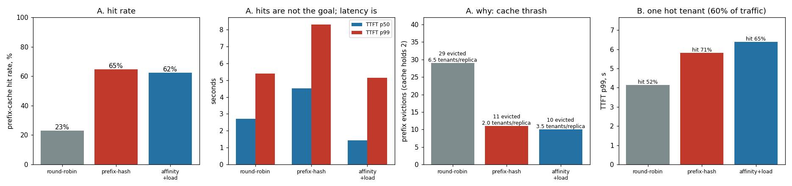

# Prefix-Aware Routing

---

> Send every request that begins the same way to the same server, so its shared opening is processed once, not over and over. This project routes 8 tenants' traffic across 4 replicas whose [prefix caches](/shared/glossary/#prefix-cache) are deliberately too small to hold everything — the normal condition of a real multi-tenant server. Hashing the prompt's opening to a replica works exactly as advertised on the metric it targets: the hit rate goes **22.9% → 64.6%** and the average [prefill](/shared/glossary/#prefill) falls **3.1x** (1,025 ms → 331 ms). **And [TTFT](/shared/glossary/#ttft) gets worse anyway** — p50 rises 2.70 s → 4.51 s — because 8 prefixes hashed into 4 buckets sent **32 of 48 requests to one replica and 0 to another**. The fix is the guide's own sketch, affinity treated as a *hint* that yields when a replica is busy: it keeps essentially all the cache benefit (62.5% hit rate) with the load spread 13/12/12/11, and lands **the best latency of all three policies** — TTFT p50 **1.42 s**, 1.9x better than round-robin and 3.2x better than pure hashing. The lesson is not "route on the prefix"; it is that **cache locality and load balance are two objectives, and optimising either alone loses.**

---

## Key Insight

This project builds a small routing layer that sends requests sharing the same opening tokens to the same replica. Because those requests all start with the same long [system prompt](/shared/glossary/#system-prompt), the first one to arrive makes that replica compute it once and save the result in its [prefix cache](/shared/glossary/#prefix-cache); every later request sent there reuses that saved work instead of redoing it, and the project checks that this raises the cache hit rate. It's like sending everyone who orders the same set menu to the one chef who has prepped the shared starter, instead of scattering them across kitchens that each cook it from scratch.

## Why This Matters

When many users share a long system prompt, routing them to the same replica turns a fresh, slow [prefill](/shared/glossary/#prefill) into a near-instant cache hit, sharply cutting [time to first token](/shared/glossary/#ttft) in [multi-tenant](/shared/glossary/#multi-tenant) systems.

We route the *request* to where the cache already lives, rather than copying the cache to whichever replica the request happens to land on, because that cache is the [KV cache](/shared/glossary/#kv-cache) — often several gigabytes sitting in one replica's GPU memory. Shipping a tiny request over to the right replica is far cheaper than moving gigabytes of cache around the cluster for every call.

---

**This is project 46.**

### "Project 12 already built prefix caching and got a 33x TTFT win. What is different here?"

The cache is the same; the question is one layer up.

[Project 12](../12-prefix-share-benchmark/README.md) had **one** server. Every request that shared a prefix arrived at the same place by default, so the cache hit whenever a hit was possible, and the project could measure the pure value of caching: 33x on TTFT.

With **four** servers, that guarantee evaporates. Each replica has its own cache, and none of them can see the others'. A request that would have been a certain hit on a single server is now a hit only if the [load balancer](/shared/glossary/#load-balancing) happens to send it to the replica that cached it. **Replication silently broke prefix caching**, and this project is about repairing it from the routing layer.

So project 12 asked "is the cache worth having?" (yes, enormously). This one asks "who decides whether the cache gets used?" — and the answer turns out to be the balancer, which until now has not been looking at the request at all.

### The words first

- **Tenant** — one customer or application sharing the server with others. Each has its own long [system prompt](/shared/glossary/#system-prompt), which is identical across all *their* requests and different from everyone else's. That is what makes their traffic cacheable and their prefix a natural routing key.
- **[Prefix cache](/shared/glossary/#prefix-cache)** — saved [KV cache](/shared/glossary/#kv-cache) for the opening tokens of a prompt, so a later request starting the same way skips computing them. Here it is keyed by a hash of the first 192 tokens.
- **Affinity** — a remembered association between a key and a replica: "requests starting like *this* belong on r2."
- **Hash routing** — `hash(key) % n_replicas`. Deterministic, stateless, needs no coordination — every router instance independently picks the same replica for the same key. Its weakness is that it takes whatever distribution the hash function happens to produce.
- **Cache thrash** — when more distinct items compete for a cache than it can hold, so each new insert evicts something that is about to be needed. The eviction counter in section A is measuring exactly this.
- **[LRU](/shared/glossary/#lru)** — "least recently used", the eviction rule: when full, throw out whatever has gone longest without being touched.

### "Why is the cache only big enough for 2 prefixes? That seems rigged."

It is *chosen*, and the choice is the experiment. Here is what happens without it.

A [prefix cache](/shared/glossary/#prefix-cache) lives in GPU memory, alongside the weights and every running request's KV. It is always far too small to hold every tenant's prompt — that is the ordinary condition of a multi-tenant server, not a corner case. But on a toy fleet, a cache with room for all 8 tenants makes **every** policy converge to a high hit rate, because each replica eventually accumulates a copy of every prefix. Routing stops mattering, and the experiment measures nothing.

Capacity is what makes the routing decision real. Scatter the tenants and each replica must somehow cover all 8; concentrate them and each replica covers 2. Section A's eviction counts show the mechanism directly: **29 evictions under round-robin against 11 under prefix hashing**.

There is also a real-memory version of the same argument. If all 4 replicas cache all 8 tenants' prefixes, the fleet is storing 32 copies to serve 8 distinct prompts. Prefix-aware routing means it stores 8. At production sizes — a 2,000-token system prompt on a 70B model is around 640 MB of KV — that difference is the whole reason to bother.

### "If hashing balances load in every other system, why does it fail here?"

Because hashing balances *keys*, and 8 keys is not many.

Hash 8 prefixes into 4 buckets and the counts are lumpy, exactly the way 8 coin flips rarely give 4 heads. This run produced a **3/1/0/4** split of tenants — one replica received four tenants, one received none. Weighted by traffic, that became **32 of 48 requests on r3 and 0 on r2**.

The reason web-tier hashing does not visibly suffer from this is that it hashes *millions* of keys, and with millions of draws the buckets even out (the law of large numbers). An LLM fleet routing on system prompts might have a few dozen distinct tenants. **You are in the small-numbers regime, where hashing is genuinely unbalanced**, and consistent hashing — the usual fix, which minimises *reshuffling* when the replica count changes — does not help with that at all.

Hence the third policy, and hence the guide's sketch having a load check in it.

---

## Running it

```bash
python3 run.py           # ~7 minutes; starts real server processes
python3 run.py --plot    # redraw from outputs/findings.json
```

Needs [project 45](../45-vllm-multi-replica/README.md)'s `fleetlib.py` (which brings `torch`, `transformers`, `httpx`). One fleet of 4 replicas serves every policy, with caches cleared between arms via `/reset` so each starts cold — restarting the processes instead would cost 45 seconds a time and prove nothing extra.

`AffinityWithLoad` is the guide's `PrefixRouter` sketch made runnable: honour the remembered affinity only while that replica is not more than `slack` requests busier than the least-busy one; otherwise spill to the least-loaded replica and remember *it* as the prefix's new home.

> **About the numbers.** Everything below comes from the committed
> [`outputs/findings.json`](outputs/findings.json). Replicas run 8 of the
> model's 24 blocks so four fit in RAM; see [project 45](../45-vllm-multi-replica/README.md).



---

## A. Eight tenants, four replicas, a cache that holds two

48 requests, tenants drawn at random, 192-token system prompt + 24 unique tokens, 6 requests in flight.

| | round-robin | prefix-hash | **affinity + load** |
|---|---|---|---|
| prefix-cache hit rate | 22.9% | **64.6%** | 62.5% |
| mean prefill | 1,024.7 ms | **330.6 ms** | 589.4 ms |
| cache evictions | 29 | **11** | 10 |
| distinct tenants per replica | 6.5 | **2.0** | 3.5 |
| requests per replica | 12/12/12/12 | **6/10/0/32** | 13/12/12/11 |
| **TTFT p50** | 2.700 s | 4.509 s | **1.422 s** |
| **TTFT p99** | 5.403 s | 8.312 s | **5.155 s** |
| **E2E p50** | 5.09 s | 5.25 s | **3.76 s** |

**Read the top half and the bottom half as two different verdicts on the same policy.**

The top half says prefix hashing worked perfectly. It nearly tripled the hit rate, cut the average prefill by **3.1x**, and reduced each replica's working set from 6.5 tenants to exactly 2 — which is precisely the cache's capacity, so the thrashing stopped (29 evictions → 11).

The bottom half says it made the product worse. **TTFT p50 went up 67%** and p99 up 54%.

The row that reconciles them is `requests per replica`: **6/10/0/32**. Two thirds of all traffic queued at r3 while r2 sat idle for the entire run. The cache saved 694 ms of prefill per request on average, and the queue at r3 gave back more than that. **A policy can win decisively on the metric it was designed for and still lose the only metric users have.**

**Affinity + load is the one that works, and it wins on both axes at once.** It keeps 62.5% of requests hitting cache — within 2 points of pure hashing — while spreading load essentially perfectly. That combination beats *both* other policies on every latency figure: TTFT p50 is **1.9x better than round-robin** and **3.2x better than pure hashing**; E2E p50 is 1.35x better than round-robin.

Its mean prefill (589 ms) sits between the two, and that is the trade being made explicit: it gives up some cache locality — 3.5 tenants per replica rather than 2.0 — in exchange for never parking a request behind a queue. Given the numbers, that is an excellent trade, and it is a trade a pure-hash router has no way to express.

## B. When one tenant is 60% of your traffic

Same fleet, but tenant 0 now sends 60% of all requests — the shape of most real multi-tenant systems, where one big customer dominates.

| | round-robin | prefix-hash | affinity + load |
|---|---|---|---|
| hit rate | 52.1% | **70.8%** | 64.6% |
| mean prefill | 676.5 ms | **319.9 ms** | 573.1 ms |
| requests per replica | 12/12/12/12 | **4/31/0/13** | 11/13/11/13 |
| TTFT p50 | 1.934 s | 3.594 s | **1.251 s** |
| **TTFT p99** | **4.131 s** | 5.822 s | 6.385 s |
| E2E p50 | 4.01 s | 4.65 s | **3.66 s** |

**Round-robin's hit rate more than doubled (22.9% → 52.1%) without anyone changing the router.** When 60% of requests share one prefix, even blind scattering keeps that prefix hot on all four replicas — it is re-inserted faster than LRU can evict it. **A skewed workload does some of your caching for you**, which is worth knowing before attributing a hit-rate improvement to a routing change.

**Pure hashing's imbalance gets worse, not better** — 31 of 48 requests on r1, because the hot tenant's single hash value pins its entire load to one replica. This is the "hot key" problem that hash-based sharding has in every system that uses it, and skew makes it sharper.

**And here affinity + load shows its own cost.** It wins TTFT p50 (1.251 s, best of the three) but **loses p99: 6.385 s against round-robin's 4.131 s.** Spilling the hot tenant across replicas when its home is busy means some of those spilled requests land on a cold cache and pay a full prefill. Typical requests get faster; the unlucky tail gets slower.

That is a genuine limitation, not a tuning failure, and it points at what production systems do next: keep more than one home per hot prefix (replicate the *cache entry* across two or three replicas and load-balance among them), so that spilling stays warm. This project stops at the two-policy comparison the guide's sketch describes.

---

## What to take from this

1. **Replication silently breaks prefix caching.** A hit that was guaranteed on one server becomes a coin flip on four, and only the router can fix it.
2. **Prefix hashing did what it promised** — hit rate 22.9% → 64.6%, prefill 3.1x cheaper, thrash cut from 29 evictions to 11 — **and still made TTFT worse**, because it put 32 of 48 requests on one replica and 0 on another.
3. **Hashing is unbalanced when keys are few.** Eight tenants over four buckets is the small-numbers regime; the law of large numbers that saves web-tier hashing does not apply.
4. **Affinity as a hint beats affinity as a law.** Yielding when the target is busy kept 62.5% of the hits, balanced the load 13/12/12/11, and produced the best latency in the project.
5. **A skewed workload caches itself.** Round-robin's hit rate went 22.9% → 52.1% purely because one tenant sent 60% of the traffic.
6. **Cache locality and load balance are separate objectives.** Each policy that optimised one alone lost to the one that traded between them.

### Common traps this project walks into on purpose

- **Assigning tenants as `i % 8` with 4 replicas.** Then tenant *t* lands on replica *t* % 4 under round-robin — round-robin *becomes* prefix routing, both arms score 83%, and the experiment measures nothing. The first run of this project did exactly that. Tenants are now drawn at random.
- **Sizing the cache so everything fits.** Every policy then converges to a high hit rate and routing stops mattering.
- **Reporting hit rate as the result.** It is the mechanism; TTFT is the result, and here they disagreed.
- **Assuming an even request split means balanced load.** In [project 45](../45-vllm-multi-replica/README.md) 12/12/12/12 was the *worse* policy; here it is the better one. The count never tells you on its own.

---

## Next

[Project 47 — disaggregated prototype](../47-disaggregated-prototype/README.md) leaves routing behind and returns to the cache itself: if one pool computes it and another consumes it, how do you move it without the user paying for the trip?
