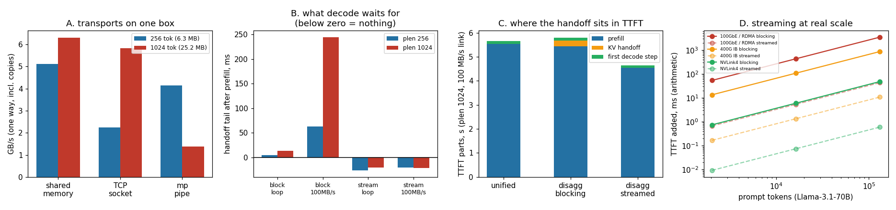

# Disaggregated Prototype

---

> One pool reads the prompt, another writes the answer, and the cache travels between them. [Project 19](../19-disaggregated-poc/README.md) asked *whether* to disaggregate; this one builds the part it waved at — the [KV-cache transfer](/shared/glossary/#kv-cache-transfer) itself — and finds that **you can make it free**. A prefill worker that ships each layer's cache the moment that layer finishes, instead of waiting for the whole prompt, leaves the decode worker with **nothing to wait for at all**: the measured handoff tail is **−21 ms**, a negative number meaning the last bytes landed *before* prefill even ended. The blocking version pays **244 ms** on the same 25 MB over the same throttled link. The trick works because of a property of the cache nobody states out loud: **it is append-only**, so layer 3's keys and values are final while layer 4 is still being computed. Three transports get measured too — shared memory **6.3 GB/s**, TCP **5.8 GB/s**, a multiprocessing pipe **1.4 GB/s** — and the arithmetic at real scale says a 128k-token prompt on Llama-3.1-70B needs **3.4 seconds** of blocking transfer over 100GbE, or **43 milliseconds** if you stream it.

---

## Key Insight

This project builds a prototype of [disaggregated serving](/shared/glossary/#disaggregated-serving) where one process runs [prefill](/shared/glossary/#prefill) and hands its [KV cache](/shared/glossary/#kv-cache) blocks to a separate [decode](/shared/glossary/#decode) process — over shared memory or [RDMA](/shared/glossary/#rdma) — and measures the transfer overhead against doing both in one process.

## Why This Matters

Prefill is compute-heavy while decode is bandwidth-heavy, so giving each its own pool of GPUs lets you size hardware for each job independently. The prototype shows whether moving the cache between pools costs less than that flexibility is worth.

---

**This is project 47.**

### "Project 19 already built a prefill worker and a decode worker. What is left to do?"

A fair question, and the answer is that they are two different projects wearing similar clothes.

[Project 19](../19-disaggregated-poc/README.md) asked the **architecture** question: is this arrangement worth having at all? It answered with the ratio that justifies the whole idea — shipping a prompt's cache is **160x cheaper than recomputing it** — plus the honest finding that on a single box disaggregation *loses* throughput and buys only a steadier token clock.

This project takes that answer as settled and asks the **engineering** question: given that we are moving the cache, how do we move it *well*? That is where production systems (Mooncake, NIXL, DistServe) actually spend their effort, and it has its own answers:

- **Which transport?** Section A.
- **When do you send it?** Section B — and this is the one that matters, because the naive answer costs the user real time and the better answer costs nothing.
- **Where does it land in the latency the user feels?** Section C.
- **Does the good answer still matter at 128k tokens and 70B parameters?** Section D.

Concretely: project 19 measured that the transfer is *small*. This project makes it *invisible*.

### The words first

- **Handoff** — the moment prefill's output becomes decode's input. Everything in this project is about its shape in time.
- **Handoff tail** — how long after prefill finishes the decode worker is still waiting for cache bytes. **This can be negative**, and section B is about making it so: negative means the transfer finished before the computation that produced it did.
- **Blocking handoff** — compute the whole prompt, then send the whole cache. Simple, and the transfer sits entirely inside the user's [TTFT](/shared/glossary/#ttft).
- **Streamed (layer-wise) handoff** — send each layer's cache as soon as that layer is done, overlapping the transfer with the remaining computation.
- **Append-only** — the property that makes streaming correct. A transformer writes each token's keys and values once and never revises them; later layers read the residual stream, not earlier layers' KV entries. So layer *i*'s slice of the cache is final the instant layer *i* finishes.
- **Pacing / throttling** — deliberately slowing the sender to a fixed byte rate, to imitate a link slower than the one you have. Loopback here moves gigabytes per second, which would hide every effect worth seeing.
- **One-way delay vs. bandwidth** — two different things a link charges for. This project throttles *bandwidth*; [project 50](../50-cross-region-latency/README.md) delays *propagation*. Long prompts are limited by the first, short requests by the second.

### "Why simulate a 100 MB/s link when the real one is faster?"

Because on this machine the transfer is *too easy*, and an experiment where the effect cannot appear proves nothing.

Loopback moves several GB/s. A 256-token cache is 6.3 MB, so it crosses in a couple of milliseconds while prefill takes 819 ms. Blocking versus streaming is then a comparison between "0.3% overhead" and "0.0% overhead" — technically a win, practically noise, and completely unlike the situation the technique exists for.

Throttling the sender to 100 MB/s puts the transfer back in proportion with the compute, which is what it looks like on a real cluster where the prompt is 100x longer and the cache is measured in gigabytes. It is labelled as a simulation everywhere it appears, and section D gives the un-simulated arithmetic for real hardware.

---

## Running it

```bash
python3 run.py           # ~6 minutes on 3+3 CPU threads
python3 run.py --plot    # redraw from outputs/findings.json
```

Needs `torch`, `transformers`, `matplotlib`, and [project 16](../16-static-vs-continuous/README.md)'s `batchlib.py`. Two child processes each load their own full copy of Qwen2.5-0.5B (~2.8 GB resident each), started with **spawn** — [project 19](../19-disaggregated-poc/README.md) documents why `fork` deadlocks here.

`streamkv.py` opens up `batchlib.prefill` and runs the layer loop by hand, because that is the only way to get *between* the layers and send a slice mid-computation. A background sender thread owns the socket, so enqueueing a layer never stalls the compute thread — a slow link grows the backlog instead of the prefill.

> **About the numbers.** Everything below comes from the committed
> [`outputs/findings.json`](outputs/findings.json).



---

## A. Three ways to move bytes between two processes

The same KV payload through each transport, timed from "producer starts writing" to "consumer holds the bytes".

| transport | 6.3 MB (256 tok) | 25.2 MB (1024 tok) |
|---|---|---|
| shared memory | **5.11 GB/s** | **6.31 GB/s** |
| TCP socket (loopback) | 2.24 GB/s | 5.84 GB/s |
| multiprocessing pipe | 4.14 GB/s | 1.38 GB/s |

**Shared memory wins both sizes, because it copies once instead of twice.** The producer writes into a region both processes have mapped; the consumer reads it directly. The socket and the pipe each copy the data into the kernel and then out again.

**The other two rows are noisy, and it would be wrong to rank them from this table** — the pipe reads 4.14 GB/s at 6.3 MB and 1.38 GB/s at 25.2 MB, which is not a real property of pipes but of a shared machine where another process happened to want the memory bus. Loopback transports on an idle box all land in the same few-GB/s band; the reliable statement is that the copy-once path is fastest and that all of them are far quicker than recomputing the cache.

That ranking is the local-machine version of a distinction that matters on a real cluster, and it is the reason [RDMA](/shared/glossary/#rdma) exists. "Remote Direct Memory Access" is the network card reaching into the remote machine's memory without the remote CPU — the network equivalent of the shared-memory row, whereas plain TCP over Ethernet is the socket row with a cable attached.

**A measurement trap worth naming.** The first version of this benchmark timed shared memory at **0.02 GB/s** — 100x slower than the socket. The bug was that a spawned Python interpreter takes about a second to boot, and the shared-memory arm happened to include that boot inside its timed window while the socket arm did not (the parent's `accept()` blocked until the child was already up). Every arm now waits for an explicit `ready` message before starting its clock. **If one arm of your comparison is 100x off, suspect the harness before the technology.**

## B. When to send: the result the project exists for

Handoff tail — how long the decode worker waits *after* prefill has finished.

| prompt | mode | link | prefill | **handoff tail** |
|---|---|---|---|---|
| 256 tok | blocking | loopback | 0.82 s | 5.0 ms |
| 256 tok | blocking | 100 MB/s | 0.78 s | **63.3 ms** |
| 256 tok | streamed | loopback | 0.96 s | **−26.3 ms** |
| 256 tok | streamed | 100 MB/s | 0.80 s | **−20.6 ms** |
| 1024 tok | blocking | loopback | 4.53 s | 13.2 ms |
| 1024 tok | blocking | 100 MB/s | 5.44 s | **244.4 ms** |
| 1024 tok | streamed | loopback | 4.53 s | **−20.4 ms** |
| 1024 tok | streamed | 100 MB/s | 4.56 s | **−21.4 ms** |

**Every streamed row is negative.** The cache is fully delivered *before* prefill ends. There is no transfer left to wait for, so the handoff costs the user exactly nothing.

**And notice which number stopped mattering.** Blocking at 1024 tokens over the throttled link pays 244 ms — and that figure scales with the payload, because the whole cache has to cross after the compute is done. Streaming pays −20.6 ms at 256 tokens and −21.4 ms at 1024 tokens: **the same**, because what is left in flight at the end is never the whole cache, only the *last layer's* share of it. The blocking cost grows with the prompt; the streamed cost does not.

That is the entire idea, and it is worth stating plainly: **streaming turns a cost proportional to the cache into a cost proportional to one layer of the cache** — here, 1/24th of it — and then hides even that behind the compute still to come.

**Why it is safe.** The KV cache is append-only. Layer 3 writes its keys and values for every prompt token during its pass and never touches them again; layer 4 reads the *residual stream*, not layer 3's cache entries. So the bytes are final the moment the layer finishes, and sending them early cannot send a stale value. This is not a heuristic or an approximation — it is a structural property of the architecture, and it is what makes the overlap free rather than risky.

**One honest wrinkle:** streamed prefill is sometimes *slower* than blocking (0.96 s vs 0.82 s at 256 tokens on loopback). Packing each layer's tensors into bytes now happens 24 times inside the layer loop, competing with the model for the same 3 threads. On a real deployment this cost largely disappears, because the transfer engine registers the cache pages with the network card instead of copying them in Python — the same "pack/unpack is the real cost" finding project 19 reported. The comparison to trust is the throttled one at 1024 tokens, where streamed prefill is *faster* (4.56 s vs 5.44 s) and the tail is what really differs.

## C. Where the handoff sits in what the user feels

TTFT decomposed at 1024 tokens over the 100 MB/s link:

| | prefill | KV handoff | first decode step | **total** |
|---|---|---|---|---|
| unified (one process) | 5.54 s | — | 0.112 s | **5.65 s** |
| disaggregated, blocking | 5.44 s | 0.244 s | 0.119 s | **5.80 s** |
| disaggregated, streamed | **4.56 s** | **0.000 s** | 0.113 s | **4.67 s** |

**Streamed disaggregation costs nothing against running both phases in one process** — and that is the claim the architecture needs to be true. If the split cost 5% of TTFT, every deployment would have to weigh that against the benefit of separate pools. At 0%, the transfer stops being part of the decision.

(The streamed row is actually *fastest* here, at 4.67 s against unified's 5.65 s. Do not read that as disaggregation making prefill faster — it cannot. The prefill worker in the disaggregated arm has 3 threads to itself while the unified process is also running decode, and run-to-run spread on this shared box is a few hundred milliseconds. The honest reading of this table is that the three totals are the same to within the noise, and that the handoff column is genuinely zero.)

What remains in the decision is what [project 19](../19-disaggregated-poc/README.md) measured: two pools you can size independently, and a decode worker that structurally cannot be interrupted by someone else's prefill (ITL p99 2240 ms → 232 ms there). This project's contribution is removing the one cost that stood against those benefits.

## D. Does it still matter at real scale?

Arithmetic, not measurement — none of this hardware exists here. Milliseconds added to TTFT by the handoff, blocking vs. streamed:

| model | prompt | KV size | 100GbE blocking | 100GbE streamed | 400G IB blocking | NVLink4 blocking |
|---|---|---|---|---|---|---|
| Llama-3.1-8B | 2,048 | 0.27 GB | 21.5 ms | **0.67 ms** | 5.4 ms | 0.3 ms |
| Llama-3.1-8B | 131,072 | 17.2 GB | 1,374 ms | **43.0 ms** | 344 ms | 19.1 ms |
| Llama-3.1-70B | 2,048 | 0.67 GB | 53.7 ms | **0.67 ms** | 13.4 ms | 0.7 ms |
| **Llama-3.1-70B** | **131,072** | **42.9 GB** | **3,436 ms** | **43.0 ms** | 859 ms | 47.7 ms |

**The bottom row is the case for streaming.** A 128k-token prompt on a 70B model produces 43 GB of cache. Shipping it as one blob over a 100 Gb link adds **3.4 seconds** to TTFT — on its own, a worse [SLO](/shared/glossary/#slo) violation than most systems budget for the entire request. Streamed, the same handoff adds **43 ms**, an 80x improvement, because only 1/80th of the cache (one layer of the 80) is ever in flight at the end.

Two patterns in the table are worth reading:

- **The streamed column barely moves between the 8B and 70B rows** (43.0 ms both). The 70B model has 2.5x the layers, so each layer's share is 2.5x smaller, which exactly cancels its 2.5x bigger cache. **Deeper models stream better**, which is a pleasant inversion of the usual rule that deeper models cost more.
- **NVLink blocking (47.7 ms) is roughly the same as 100GbE streamed (43.0 ms).** A software change bought what a 72x faster interconnect buys. That is the kind of comparison worth having before signing a hardware order.

---

## What to take from this

1. **A streamed handoff costs nothing.** Measured tail −21 ms — the cache arrives before prefill finishes. Blocking on the same payload and link pays 244 ms.
2. **The reason is that the KV cache is append-only.** Layer *i*'s entries are final when layer *i* finishes, so they can be sent while later layers compute. Structural, not heuristic.
3. **Streaming changes what the cost is proportional to** — one layer's cache instead of the whole cache — which is why its tail is identical at 256 and 1024 tokens (−20.6 and −21.4 ms) while blocking's grows 63 ms → 244 ms.
4. **Shared memory was the fastest transport at both sizes** by copying once instead of twice. That difference is why RDMA exists on real clusters — though on one loopback-connected box the transports are close enough that the ranking below the top is noise.
5. **At 128k tokens on a 70B model, blocking adds 3.4 s to TTFT and streaming adds 43 ms.** Deeper models stream *better*, because each layer's share shrinks as fast as the cache grows.
6. **A software change matched a 72x faster interconnect** (100GbE streamed ≈ NVLink blocking).

### Common traps this project walks into on purpose

- **Timing a transport with the consumer's startup inside the window.** This read 0.02 GB/s for shared memory, 100x wrong. Every arm now waits for an explicit `ready`.
- **Benchmarking on a link so fast the effect cannot appear.** Loopback hides the whole result; the throttled sender puts it back in proportion and says so.
- **Quoting streamed prefill time as a regression.** It is slower here because packing runs in Python inside the layer loop — an artifact of this implementation, not of the technique.
- **Forking a process that has touched PyTorch.** Spawn, always. Project 19 documents the deadlock.
- **Passing a `multiprocessing.Queue` inside a message on another queue.** It cannot be pickled that way; queues must be inherited at spawn time, which is why the first token travels on its own dedicated queue.
- **Benchmarking while another experiment starts up.** The first run of this project measured a 577-second prefill because a four-replica fleet from another project was loading at the same time. That number was thrown away and the project re-run on a quiet machine.

---

## Next

[Project 48 — failure-mode drill](../48-failure-mode-drill/README.md) stops asking how to move work between healthy machines and starts asking what happens when one of them dies mid-request.
