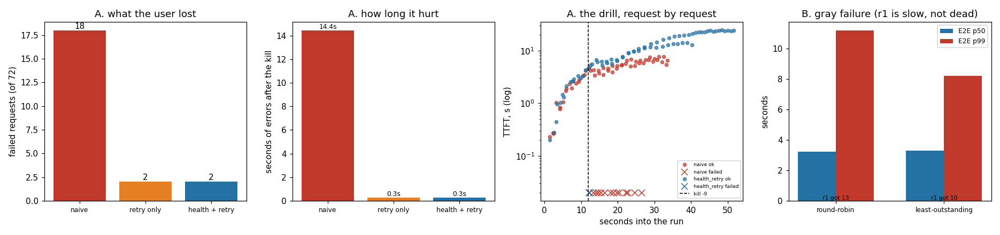

# Failure-Mode Drill

---

> Pull the plug on a replica under load and see whether users even notice. This project `kill -9`s one of three replicas twelve seconds into an [open-loop](/shared/glossary/#open-loop-load-test) load test running at 60% of fleet capacity, and compares three routing layers. Adding retries did exactly what it is supposed to — errors fell from **18 of 72 to 2** — and then did something nobody puts in the runbook: **[TTFT](/shared/glossary/#ttft) after the kill went from 6.16 s to 12.87 s, and p99 from 7.68 s to 20.08 s.** Two thirds of the fleet cannot absorb all of the traffic, so every retried request became queue instead of error. The naive fleet was *faster for the survivors precisely because it was dropping people.* A [health check](/shared/glossary/#health-check) spotted the corpse in **0.26 s** and cut wasted attempts from 24 to 5, but it could not conjure capacity either. Then the failure that health checks cannot see at all: a replica given a third of the threads answered its liveness probe in **24.21 ms against a healthy replica's 23.90 ms** — indistinguishable — while the requests it served took **8.16 s against 1.88 s**. Least-outstanding routing walked around it without being told anything, taking fleet E2E p99 from **11.19 s to 8.21 s**.

---

## Key Insight

This project kills one replica in the middle of a load test and checks that the system fails over gracefully — rerouting traffic to the healthy replicas. You measure the user-visible impact straight from the load generator's own numbers: how many requests came back as errors (an HTTP 5xx or a dropped connection), how far [latency](/shared/glossary/#latency) spiked, and how many seconds it took to recover. "Rerouting cleanly" means the requests in flight on the dead replica are retried or shifted onto a healthy one so the user still gets an answer; "dropping requests" means those users simply get an error.

## Why This Matters

In production a GPU will die mid-request and the user's [KV cache](/shared/glossary/#kv-cache) is lost. Rehearsing the failure tells you whether your routing layer reroutes cleanly or drops requests — long before it happens for real at 3 a.m.

---

**This is project 48.**

### The words first

- **[Failover](/shared/glossary/#failover)** — moving work off a component that has stopped working onto one that still is.
- **[Health check](/shared/glossary/#health-check)** — a periodic probe asking a server whether it should still get traffic. A **liveness** check asks "are you running?"; a **readiness** or deep check asks "can you actually do the work?" The difference is the whole of section B.
- **Detection time** — how long between a replica dying and the router noticing. Bounded below by the probe interval: probing once a second means up to a second of traffic sent into a void.
- **[Gray failure](/shared/glossary/#gray-failure)** — a component that is neither working nor dead. It answers, but wrongly or far too slowly. Named for the middle ground between a green dashboard and a red one, and it is the failure monitoring is worst at.
- **Retry storm** — when failures cause retries, the retries add load, the extra load causes more failures, and the system talks itself into an outage. Section A is a small, non-fatal instance of the first half of that loop.
- **[Open-loop load](/shared/glossary/#open-loop-load-test)** — each request is sent at its own predetermined time regardless of whether earlier ones came back. Essential here, and the next section explains why.
- **Blast radius** — how much was affected. Measured here as the number of failed requests and the number of seconds during which failures were still happening.

### "Why does the load generator have to be open-loop?"

Because a closed-loop test will quietly hide the damage, and it is worth understanding exactly how.

A closed-loop generator holds a fixed number of requests in flight and starts a new one only when one finishes. That models a fixed set of users who each wait for a reply before asking again — and it is the right tool for measuring capacity, which is why [project 45](../45-vllm-multi-replica/README.md) uses it.

Now kill a replica during a closed-loop test. Requests stop finishing, so the generator stops starting new ones. **The load politely backs off exactly when the fleet is weakest**, the queue never grows, and the report says the outage was mild.

Real users do not do that. They keep arriving at whatever rate they were already arriving at, and if anything they arrive *more* — refreshing, resubmitting, retrying by hand. An open-loop generator reproduces that: request 47 is sent at its scheduled time whether or not requests 30 through 46 have come back. It is the only way to see a queue actually grow, and section A's entire result depends on it.

### "If the fleet is only 60% busy, why does losing one of three replicas hurt so much?"

Because 60% of three replicas is 90% of two, and queueing time does not rise in proportion to load — it accelerates.

The arrival rate here is 2.4 requests per second and each replica serves about 1.35, so three replicas provide 4.0/s of capacity and the fleet runs at roughly 60%. Kill one and capacity drops to 2.7/s, putting the fleet at about **90%**.

That last number is the one that matters. A queue's waiting time scales roughly with `1 / (1 − utilisation)`: at 60% load the factor is 2.5, at 90% it is 10. **Losing a third of your capacity did not make things a third worse — it made them about four times worse**, and that non-linearity is why capacity planning talks about N+1 redundancy rather than percentages. The fleet must be sized so that it still fits *below the knee* after losing a node, not merely so that it fits.

This is also why the first version of this project was misleading. At 1.1 requests/s the fleet ran at 27%, and losing a replica took it to 41% — still comfortably below the knee. Two replicas absorbed everything without a ripple, the only casualties were the handful of requests actually on the dead machine, and the drill concluded that failover was free. **That conclusion was an artifact of testing an idle fleet**, and it is the sort of reassuring result that gets a system paged at 3 a.m.

---

## Running it

```bash
python3 run.py           # ~9 minutes; starts real server processes
python3 run.py --plot    # redraw from outputs/findings.json
```

Needs [project 45](../45-vllm-multi-replica/README.md)'s `fleetlib.py`.

The kill is a real `kill -9` on a real OS process. Nothing is simulated: in-flight requests get a genuinely reset TCP connection, and new ones get a genuine connection-refused. Section A restarts the fleet for each arm so all three see an identical, undamaged starting point.

> **About the numbers.** Everything below comes from the committed
> [`outputs/findings.json`](outputs/findings.json). Replicas run 8 of the
> model's 24 blocks so several fit in RAM; see [project 45](../45-vllm-multi-replica/README.md).



---

## A. Three routing layers, one dead replica

72 requests at 2.4/s across 3 replicas; r1 is killed at t = 12 s.

| | naive | retry only | health + retry |
|---|---|---|---|
| failed requests | 18 / 72 | **2 / 72** | **2 / 72** |
| in-flight requests lost | 5 | **0** | **0** |
| seconds of errors after the kill | 14.44 s | **0.27 s** | **0.27 s** |
| detection time | — | — | **0.26 s** |
| wasted attempts on the corpse | — | 24 | **5** |
| TTFT p50 before the kill | 2.65 s | 3.18 s | 3.35 s |
| **TTFT p50 after the kill** | **6.16 s** | 12.87 s | 14.56 s |
| **TTFT p99 after the kill** | **7.68 s** | 20.08 s | 24.68 s |

**Retries did their job on errors: 18 failures became 2, and the error window collapsed from 14.44 s to 0.27 s.** Without them, every request routed to the dead port for the rest of the run simply failed — round-robin kept dealing cards to a player who had left the table.

**And then the latency more than doubled.** This is the result worth carrying out of the project.

**Errors are a form of load shedding, and the naive fleet was accidentally doing it.** Those 18 requests failed fast, consumed no capacity, and went away. The two surviving replicas therefore served only the traffic they could, and their users saw TTFT rise a survivable 2.3x. With retries on, all 72 requests insisted on being served by a fleet that could now handle about 2.7 of the 2.4 arriving per second — so they queued, and the queue grew for the rest of the run. **6.16 s of latency and 18 errors became 12.87 s of latency and 2 errors.** Nothing was created; the damage was converted from one currency into another.

Which currency you prefer is a product decision, not a technical one, and it is worth making deliberately:

- A **chat UI** would rather show 25% of users an error immediately than make everyone wait 20 seconds.
- A **batch pipeline** would rather everything succeed slowly.
- A **checkout flow** wants the retry *and* the capacity to serve it, which is a capacity-planning answer, not a routing one.

Production systems make this explicit with **retry budgets** (never retry more than ~10% of requests) and **circuit breakers** (stop sending to a failing dependency entirely). Both exist for exactly the effect measured here — and note that this run captured only the gentle half of a retry storm. The load was fixed at 2.4/s, so retries could lengthen the queue but could not *increase the arrival rate*. In a real incident, users and upstream services retry too, and the loop closes.

**So what did the health check actually buy?** Not errors (2 either way) and not latency (marginally worse, within the run-to-run spread of a shared machine). It bought the row labelled *wasted attempts*: **24 requests bounced off the dead replica without it, and 5 with it**, because it noticed the corpse in **0.26 s** and stopped routing there.

That is a smaller prize than the dashboards suggest, and its size is set by arithmetic worth internalising: the detection window is at most one probe interval (1 s here), during which the router keeps dealing a dead replica its full share of traffic — one third of 2.4/s, so about 2 requests, plus those already in flight. **Probe faster and you shrink the window linearly**; probe every 100 ms and it is 0.2 requests. The health check's job is to bound that window. It is not, and cannot be, a substitute for having enough capacity.

## B. The failure a health check cannot see

Replica r1 now runs with 1 thread instead of 2. It is alive, correct, and roughly three times too slow. Nothing is killed.

**What the liveness probe sees:**

| replica | threads | probe reply |
|---|---|---|
| r0 | 2 | 23.90 ms |
| **r1** | **1** | **24.21 ms** |
| r2 | 2 | 24.42 ms |

**The sick replica answers its health check faster than a healthy one.** Not approximately — 24.21 ms against r2's 24.42 ms. A liveness probe measures how quickly a server can say the word "yes", and saying yes is not the work that got slow. Every green dashboard in this scenario is telling the truth and telling you nothing.

**What users see:**

| | round-robin | least-outstanding |
|---|---|---|
| requests sent to r1 | 13 | **10** |
| E2E p50 on r0 / r1 / r2 | 2.39 / **8.16** / 1.88 s | 3.66 / 4.82 / 2.58 s |
| fleet E2E p50 | **3.23 s** | 3.30 s |
| **fleet E2E p99** | 11.19 s | **8.21 s — 1.36x better** |

**The gray failure is severe and completely invisible to liveness**: requests unlucky enough to land on r1 took **8.16 s against 1.88 s** on the healthy r2 — 4.3x worse — while r1 reported itself perfectly healthy throughout.

**Least-outstanding routing fixed a third of the damage without being told anything.** It never learns that r1 is slow. It only observes that r1 still has requests outstanding when the others do not, and declines to add more — sending it 10 requests instead of 13, which pulled its own p50 from 8.16 s to 4.82 s and the fleet's p99 from 11.19 s to 8.21 s.

**This is the argument for load-aware routing over health-based routing**, and the distinction is worth stating precisely: a health check is a *classifier* that must decide "healthy or not", needs a threshold, and is wrong near the boundary — which is exactly where gray failures live. Least-outstanding is a *feedback loop* with no threshold and no classification. Being slow makes a replica busy, being busy makes it receive less, and it degrades smoothly instead of flipping between "in" and "out".

The medians barely moved (3.23 vs 3.30 s), which is the same pattern [project 45](../45-vllm-multi-replica/README.md) found: tail-latency policies buy the tail and charge the middle. If your SLO is a median, this change looks like a regression.

**One property of this implementation worth flagging**, because it shows up in the request counts: `LeastOutstanding` breaks ties by lowest index, so when the fleet is idle it keeps choosing r0. That produces mild herding at low load and is why production balancers break ties randomly — the "power of two random choices" trick, where you sample two replicas at random and take the less busy one, gets most of the benefit with none of the herding.

---

## What to take from this

1. **Retries converted 18 errors into 2 errors and doubled the latency** (TTFT p50 6.16 → 12.87 s after the kill; p99 7.68 → 20.08 s). Two replicas could not do three replicas' work, so the demand became queue instead of error.
2. **Failing fast is load shedding.** The naive fleet's survivors were faster *because* it was dropping requests. Choose which currency you want the damage paid in, and enforce it with retry budgets and circuit breakers.
3. **60% utilisation becomes 90% when you lose one of three replicas**, and queueing time scales like `1/(1 − utilisation)`. Size for N+1, not for a percentage.
4. **The health check bought detection (0.26 s) and 19 fewer wasted attempts — not errors, not latency.** Its value is bounding the window during which you route into a void, and that window shrinks linearly with the probe interval.
5. **A liveness probe cannot see a gray failure.** The 3x-slow replica answered in 24.21 ms against a healthy 23.90 ms while serving requests 4.3x slower.
6. **Least-outstanding routing routed around the sick replica with no health signal at all**, improving fleet E2E p99 1.36x. A feedback loop degrades gracefully where a classifier must pick a threshold.
7. **An idle fleet cannot be drilled.** At 27% utilisation this same test reported that failover was free.

### Common traps this project walks into on purpose

- **Drilling a fleet that is not busy.** The first version ran at 27% utilisation and concluded failover was free.
- **Using a closed-loop load generator.** It stops sending work exactly when the fleet is weakest and under-reports the damage.
- **Grading the drill on error count alone.** By that measure retries scored best and latency scored worst; only one of those was on the scorecard.
- **Trusting a liveness check to mean healthy.** It means *responsive to liveness checks*.
- **Timing a health probe once.** The first probe also pays for opening a connection, which is larger than the difference being looked for — enough to make a healthy replica look like the slow one. Probe several times and take the best.
- **Killing a replica and assuming it died.** `Fleet.stop()` kills by handle, waits, then kills by PID and waits again; a survivor keeps ~2 GB and silently starves the next arm of the experiment.

---

## Next

[Project 49 — session-affinity routing](../49-session-affinity-routing/README.md) returns to routing for speed rather than survival, and finds a cost this project just previewed: when you tie a conversation to one replica, that replica's death takes the conversation's cache with it.
