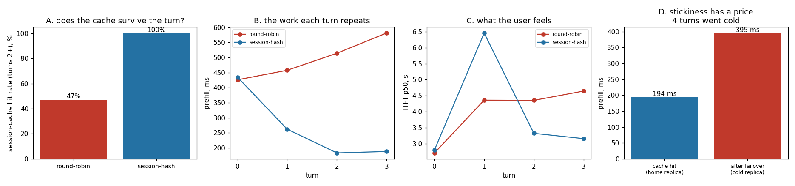

# Session-Affinity Routing

---

> Keep a multi-turn chat on the same replica so its cache survives between turns. This project runs 12 concurrent 4-turn conversations across 4 replicas and compares blind [round-robin](/shared/glossary/#round-robin) against hashing the `session_id`. Sticky routing takes the [session-cache](/shared/glossary/#kv-cache) hit rate from **47.2% to 100%** and the share of prompt tokens that skip [prefill](/shared/glossary/#prefill) from **35.3% to 85.8%**, cutting the average prefill **2.5x** (518 ms → 211 ms). The detail that makes the case is the *shape* of the curve: round-robin's prefill **grows every turn** (426 → 581 ms) because each turn carries more history to redo, while sticky routing's **falls** (435 → 188 ms) because each turn only pays for what the user just typed. Then the cost: killing the home replica mid-conversation sent 4 turns to a cold cache, where re-prefill cost **394.6 ms against 194.0 ms** warm — a 2.03x penalty, and the reason stickiness must be a preference rather than a rule.

---

## Key Insight

This project implements "sticky" routing that sends every turn of a conversation (keyed by its `session_id`) to the same replica, so that replica's [KV cache](/shared/glossary/#kv-cache) from earlier turns is still there — then verifies the multi-turn cache hit rate.

## Why This Matters

Without stickiness, each chat turn might land on a different replica with a cold cache, forcing an expensive re-[prefill](/shared/glossary/#prefill) of the whole history. Affinity routing preserves the cache across turns and keeps long conversations fast.

---

**This is project 49.**

### "Project 46 already routed on the prompt's content. Isn't a conversation just a long shared prefix?"

Close, and the difference is worth being precise about because it changes what you can key on.

[Project 46](../46-prefix-aware-routing/README.md) routed on a prefix that is **shared between different users** — a tenant's system prompt, identical across everyone using that app. Many requests, one prefix, and the prefix is knowable from the request's first tokens.

A conversation's history is **unique to one user** and **grows with every turn**. Nobody else will ever benefit from it, and the thing you would hash — the prompt's opening — is not what identifies the session; two different conversations that began with the same system prompt are *not* interchangeable, because what matters is the whole history.

So the key is different: `session_id` rather than a hash of the tokens. And the economics are different too. A shared prefix is cached once and amortised over many users, so a miss costs you one prefill among many. A conversation's cache serves exactly one user, and a miss costs that user a re-prefill of *everything they have said so far* — a cost that grows the longer they talk. That growth is section A's main result and it is the reason session affinity is worth its complications.

### The words first

- **Session** — one conversation, spanning several request/response round trips. Identified by a `session_id` the client sends with each turn.
- **Turn** — one user message plus the model's reply. Turn 3's prompt contains turns 1 and 2 in full, which is why prompts grow.
- **[Session affinity](/shared/glossary/#session-affinity) / sticky routing** — always send a given session to the same replica. "Sticky" because the request sticks to where it has been before.
- **Warm vs. cold cache** — warm means the replica already holds this conversation's KV and only needs to prefill the new tokens; cold means it holds nothing and must process the entire history.
- **Partial hit** — a cache entry that covers *some* of the prompt. Because a conversation only ever appends, an entry saved at turn 1 is still a valid prefix of turn 3's prompt, so it can be reused even though it is out of date. That is why the hit *rate* and the tokens *saved* are two different numbers here, and the second is the honest one.

### "Why do sessions need their own cache? Project 12's prefix cache already matches any shared opening."

Because the two caches are keyed on different things and neither can do the other's job.

A prefix cache is keyed by **content**: hash the first N tokens, look them up. That works when N is fixed and known in advance — a system prompt has a length you can configure. A conversation has no such N; its reusable portion is "everything up to whatever the user just typed", which is different on every turn and different for every user.

You could in principle run a prefix cache with block-level hashing (as [project 11](../11-tiny-paged-cache/README.md)'s paged cache does) and get conversation reuse as a special case — and real engines do exactly that, which is worth saying plainly. What the session cache adds is not a different *mechanism* but a different *unit of management*: something with an owner, a lifetime, and an identity the router can see **before** the request is parsed. The router has to choose a replica from the `session_id` alone, at a point where it has not looked at the tokens at all — and that is what makes affinity routing possible.

---

## Running it

```bash
python3 run.py           # ~7 minutes; starts real server processes
python3 run.py --plot    # redraw from outputs/findings.json
```

Needs [project 45](../45-vllm-multi-replica/README.md)'s `fleetlib.py`.

This project cannot reuse the generic load generator, and the reason is structural: **a conversation is sequential.** Turn 2's prompt contains turn 1's answer, so it cannot even be built until turn 1 returns. `run_conversations` therefore drives 12 conversations concurrently while keeping each one's turns strictly in order — a different traffic shape from the independent-request stream every other project in this phase uses, and the shape session affinity exists to serve.

> **About the numbers.** Everything below comes from the committed
> [`outputs/findings.json`](outputs/findings.json). Replicas run 8 of the
> model's 24 blocks so four fit in RAM; see [project 45](../45-vllm-multi-replica/README.md).



---

## A. Does the cache survive the turn?

12 conversations, 4 turns each, 4 replicas. Measured over turns 2–4 (turn 1 can never hit — there is nothing cached yet).

| | round-robin | session-hash |
|---|---|---|
| session-cache hit rate | 47.2% | **100%** |
| prompt tokens that skipped prefill | 35.3% | **85.8%** |
| mean prefill | 518 ms | **211 ms — 2.5x less** |
| replicas visited per session | 2.58 | **1.00** |
| TTFT p50 | 4.36 s | **3.20 s** |
| TTFT p99 | **6.53 s** | 7.04 s |

**Sticky routing hits every time, by construction.** `hash(session_id) % 4` sends every turn of a conversation to the same replica, so the cache is always where the request lands. 1.00 replicas per session is that statement measured rather than assumed.

**Round-robin's 47.2% is higher than you might expect, and the reason is a trap.** Each replica here can hold 16 sessions and there are only 12, so a replica never evicts anything — once a session has visited a replica, every later turn that lands there hits. With 4 turns spread over 4 replicas, sessions visited 2.58 of them and got lucky about half the time. **On a real server, where sessions vastly outnumber cache slots, that number collapses toward zero.** The 47.2% is a floor produced by a generous cache, not a defence of round-robin.

**Which is why the tokens-saved row matters more than the hit-rate row.** Round-robin saved 35.3% of prompt tokens while hitting 47.2% of the time; those hits were *partial*. A conversation only appends, so a cache entry from turn 1 is still a valid prefix of turn 3's prompt — it matches, so it counts as a hit, but it covers only the oldest part of the history and the rest is re-prefilled. **A hit-rate dashboard would report round-robin as half as good as sticky; the truth is 2.4x.**

### The curve is the argument

Mean prefill per turn:

| turn | prompt length | round-robin | session-hash |
|---|---|---|---|
| 1 | 64 tok | 426 ms | 435 ms |
| 2 | 92 tok | 458 ms | **262 ms** |
| 3 | 120 tok | 514 ms | **184 ms** |
| 4 | 148 tok | 581 ms | **188 ms** |

**Round-robin's cost climbs; sticky routing's falls, then flattens.**

Round-robin pays for the history over and over: every turn the prompt is longer, and a cold replica must process all of it. **Its cost grows with the conversation, which is exactly backwards from what a chat product wants** — the users who have invested the most in a conversation get the worst service.

Sticky routing pays for what the user just typed and nothing else. Turn 4's prompt is 2.3x longer than turn 1's, and it prefills in *less than half* the time, because only the ~28 new tokens are new. It flattens because that per-turn increment is roughly constant no matter how long the history gets. **This is the property that makes long conversations viable at all**, and it is invisible if you only measure averages across turns.

**One honest wrinkle: sticky routing's TTFT p99 is slightly worse** (7.04 s vs 6.53 s). Hashing 12 sessions onto 4 replicas is unbalanced in the same small-numbers way [project 46](../46-prefix-aware-routing/README.md) measured, and a replica that draws more than its share makes its sessions queue. The median improves 1.36x, the tail does not. The same fix applies — treat affinity as a hint that yields under load — with the same caveat that spilling costs a cold cache, which brings us to section B.

## B. What stickiness costs when a replica dies

Same setup, but replica r0 is killed 14 seconds in, mid-conversation. Sessions homed there fail over to a live replica.

| | value |
|---|---|
| turns that failed outright | **0** — all 48 completed |
| turns that landed cold after failover | 4 |
| re-prefill on the cold replica | **394.6 ms** |
| prefill on a warm home replica | **194.0 ms** |
| **penalty** | **2.03x** |
| hit rate over the whole run | 88.9% (vs 100% undisturbed) |

**Nobody got an error, and that is worth stating first**: with a retry onto a live replica, a dead server is invisible to the user as a *failure*. What it is not invisible as is *latency*.

**The four displaced turns paid 2.03x to be prefilled from scratch**, because their conversation's KV died with the replica. That is the bill for stickiness, and it has a shape worth noticing: **it grows with conversation length.** These conversations were four turns long and the penalty was 200 ms. A user 30 turns into a session carries 30 turns of history, all of which must be recomputed on the new replica — and [project 47](../47-disaggregated-prototype/README.md) showed a 128k-token prompt takes seconds to prefill. The longer a session has been sticky, the more it loses when its home goes away.

This is the tension that makes session affinity a *policy* rather than a *rule*:

- **Stick too hard** and every replica failure inflicts a full re-prefill on its longest conversations, and load cannot be rebalanced when a replica gets hot.
- **Stick too loosely** and you are back to round-robin's rising curve.

Production systems buy their way out with the same move [project 47](../47-disaggregated-prototype/README.md) built the plumbing for: keep the session's KV somewhere it can outlive one replica — replicated to a second replica, or offloaded to host memory or a shared store ([project 15](../15-cpu-nvme-offload/README.md) measured that reloading a cache from disk beat recomputing it by 183x). Then failover moves the *cache* as well as the request, and the 2.03x becomes a transfer instead of a recomputation.

---

## What to take from this

1. **Sticky routing took the session-cache hit rate from 47.2% to 100%** and cut mean prefill 2.5x, because the cache is always where the request lands.
2. **Read tokens-saved, not hit rate.** Round-robin "hit" 47.2% of the time but saved only 35.3% of tokens — its hits were partial, matching an old prefix of a longer history.
3. **The curve is the argument.** Round-robin's prefill *rises* every turn (426 → 581 ms) while sticky routing's *falls* (435 → 188 ms). Averages hide this completely.
4. **Round-robin's 47.2% is an artifact of a cache big enough to never evict.** With sessions outnumbering slots, it collapses.
5. **Failover cost 2.03x on the displaced turns** (394.6 vs 194.0 ms) and zero errors. Stickiness trades a rare, large latency penalty for a common, steady saving.
6. **The penalty scales with conversation length**, which is why long-lived sessions need their cache to outlive a single replica.

### Common traps this project walks into on purpose

- **Ending a conversation when a turn fails.** The first version did, and section B then measured "conversations that stopped" rather than "conversations that failed over and lost their cache" — which is the thing that actually costs a user time. Each turn now retries on a live replica.
- **Reusing the independent-request load generator.** Conversations are sequential; turn 2 does not exist until turn 1 returns.
- **Reporting hit rate for a cache that supports partial matches.** A 1-token match and a 140-token match both count as one hit.
- **Sizing the session cache so nothing is ever evicted**, then concluding that blind routing does fine.

---

## Next

[Project 50 — cross-region latency](../50-cross-region-latency/README.md) is the last routing decision in this phase, and the only one where the cost is imposed by physics rather than by software: what does it cost to send a request to a datacenter on another continent, and which part of that cost can routing actually remove?
