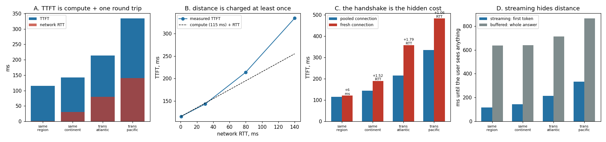

# Cross-Region Latency

---

> The closest datacenter wins the first token; physics does the rest. This project puts a delay proxy in front of one real replica and measures it from four distances, and the two headline numbers point in opposite directions. [TTFT](/shared/glossary/#ttft) is badly hurt: **115.5 ms locally against 334.4 ms from across the Pacific — 2.9x, on the same process, with zero difference in compute.** The gap between tokens is not hurt *at all*: **45.06 / 44.16 / 43.82 / 43.41 ms** at 0.5, 30, 80 and 140 ms of [round trip](/shared/glossary/#round-trip-time). Distance is charged **once**, at the start, because tokens pipeline — packet 2 leaves while packet 1 is still crossing. Which makes streaming the single most effective thing you can do about geography: a buffered client waits for the *last* token, so it pays **636 ms locally and 865 ms remotely**, turning a 219 ms penalty into a wait that never drops below half a second. And the cheapest optimisation of all is one nobody thinks of as one — reusing a connection saved **143 ms** on the trans-Atlantic path, because a fresh TCP handshake crosses the ocean before your request is allowed to.

---

## Key Insight

This project deploys the same model in two geographic regions and measures the [time to first token](/shared/glossary/#ttft) difference when each request is routed to the nearest region versus a far one.

## Why This Matters

Network round-trips across continents add tens to hundreds of milliseconds before any compute even starts, so routing each user to their closest region is often the cheapest [latency](/shared/glossary/#latency) win available — with no change to the model at all.

---

**This is project 50.**

### The words first

- **One-way delay (OWD)** — how long a packet takes to get from A to B. Set mostly by the speed of light in fibre (about 200,000 km/s) plus the routers along the way. New York to London is about 40 ms; New York to Singapore about 70 ms.
- **[Round-trip time (RTT)](/shared/glossary/#round-trip-time)** — there and back: 2x OWD. The important unit, because protocols are built out of round trips.
- **Handshake** — the exchange that opens a connection before any of your data may be sent. TCP costs one RTT (SYN, SYN-ACK); TLS on top costs one or two more.
- **Connection pooling / keep-alive** — reusing an already-open connection for the next request, so the handshake is paid once instead of every time.
- **Propagation vs. serialisation delay** — how long a packet takes to *travel* versus how long it takes to *put on the wire*. For a few kilobytes these are not close: at 10 Gb/s, 4 KB serialises in 3 microseconds and crosses the Atlantic in 40,000.
- **Pipelining** — sending the next thing without waiting for the previous one to arrive. It is why 12 tokens do not cost 12 round trips, and it is the mechanism behind this project's main finding.

### "There is one machine here. How can there be two regions?"

There cannot, so the distance is built rather than rented: `wan.py` is a TCP proxy that sits between the client and the replica and holds every byte for a fixed one-way delay in each direction. The replica is the *same process* in every measurement below — same weights, same threads, same everything — so any difference is distance and nothing else. That is a cleaner comparison than two real regions would give, where the machines would also differ.

**Why a byte-level proxy rather than a `sleep()` in the client?** Because the question is not "what if requests were slower", it is **how many times does the protocol cross the ocean**. A sleep charges exactly one delay and hides everything interesting. A proxy that delays real packets charges whatever the protocol actually incurs — which is how section C can *measure* the handshake cost instead of assuming it.

**One thing modelled and one thing deliberately not.** Modelled: propagation delay, in both directions, plus a full RTT to open a connection. Not modelled: bandwidth limits, packet loss, and TLS. For a 400-byte prompt and one token per packet that is the right simplification — bandwidth is irrelevant at these sizes ([project 47](../47-disaggregated-prototype/README.md) covers the case where it is not). Real TLS would add one or two more RTTs to the cold-connection row, making section C's argument stronger, not weaker.

### "Why is the delay applied per packet instead of per request?"

Because getting this wrong inverts the project's main result, and the first version of the proxy did get it wrong.

The obvious implementation is: read a chunk, sleep, write it, repeat. That is wrong, because chunk 2 does not begin its delay until chunk 1 has been delivered — so a 12-token response pays the delay **twelve times**, and the measurement would report that distance destroys the token clock.

Real links do not behave that way. Packet 2 is launched while packet 1 is still in flight; both arrive one delay after they were *sent*, not one delay after each other. The fixed proxy stamps each chunk with the time it should arrive and hands it to a writer that sleeps until then, so chunks queue only to preserve order. Verified directly: a test server emitting a token every 50 ms shows gaps of ~50 ms through the proxy at 70 ms one-way delay, unchanged from direct.

**The corrected behaviour is exactly section A's finding**, which is a good reminder that a simulation can only teach you something if its mechanism is right.

---

## Running it

```bash
python3 run.py           # ~6 minutes; starts one replica + four proxies
python3 run.py --plot    # redraw from outputs/findings.json
```

Needs [project 45](../45-vllm-multi-replica/README.md)'s `fleetlib.py`.

Latencies are reported as the **minimum** over 12 samples, not the median. This box is shared, so every sample is the true latency plus some scheduling noise, and noise is one-sided — it can only add. The minimum is the best estimate of the floor being compared across distances. (The same convention Phases 5 and 6 of this guide use for timing anything on this machine.)

> **About the numbers.** Everything below comes from the committed
> [`outputs/findings.json`](outputs/findings.json). The replica runs 8 of the
> model's 24 blocks; see [project 45](../45-vllm-multi-replica/README.md).



---

## A. The same replica, seen from four distances

| region | one-way | RTT | **TTFT** | **ITL** |
|---|---|---|---|---|
| same region | 0.25 ms | 0.5 ms | **115.5 ms** | 45.06 ms |
| same continent | 15 ms | 30 ms | 143.0 ms | 44.16 ms |
| trans-Atlantic | 40 ms | 80 ms | 214.0 ms | 43.82 ms |
| trans-Pacific | 70 ms | 140 ms | **334.4 ms** | 43.41 ms |

**TTFT nearly triples (2.9x) and the gap between tokens does not move.** 45.06 down to 43.41 ms across a 280-fold increase in RTT — the small decline is noise on a shared machine, not a trend.

**Why the token clock is immune.** The tokens pipeline. The server emits token 5 without waiting to hear that token 4 arrived, so each token is delayed by one one-way trip *individually* and they land at the same spacing they were sent at. Distance shifts the whole stream later in time; it does not stretch it. A conveyor belt that starts in another country still delivers at the same rate once it starts.

**Why TTFT is not immune.** Nothing can pipeline before the first token, because there is nothing yet to overlap with. The request has to cross, the model has to prefill, and the answer has to come back — strictly in that order.

**How much of TTFT is distance?** Subtracting the local baseline gives 27.5, 98.5 and 218.9 ms against added RTTs of 30, 80 and 140 — so **0.92, 1.23 and 1.56 round trips.** The near and middle distances track the single expected round trip closely; the trans-Pacific point runs about half a round trip above it. That excess is protocol chatter this project does not isolate, and it is reported rather than smoothed over. The robust claim, and the one the routing decision rests on, is that **distance is charged to TTFT at least once and to ITL never.**

## B. What routing actually saves

A user in Europe, served from a European replica or an American one — the same model either way:

| | value |
|---|---|
| compute (TTFT with no distance) | 115.5 ms |
| TTFT served locally | **115.5 ms** |
| TTFT served trans-Atlantic | 214.0 ms |
| **cost of the wrong region** | **+98.5 ms — 85% on top of the compute** |

**Getting the region right was worth almost as much as making the model twice as fast**, and it costs nothing but a routing rule. That is why regional routing is usually the first optimisation a global deployment makes: no retraining, no [quantization](/shared/glossary/#quantization), no kernel work.

It also sets a floor on what the other optimisations can achieve. Phases 4, 5 and 6 of this guide fought hard for milliseconds — [speculative decoding](/shared/glossary/#speculative-decoding), [FP8 weights](/shared/glossary/#fp8), [CUDA Graphs](/shared/glossary/#cuda-graphs) — and **all of that work is invisible to a user routed to the wrong continent.** Check the routing before optimising the kernels.

## C. The handshake, which is pure profit to remove

Same request, over a pooled connection versus a brand-new one:

| region | pooled | fresh | difference | in RTTs |
|---|---|---|---|---|
| same region | 115.5 ms | 121.5 ms | +6.0 ms | — |
| same continent | 143.0 ms | 188.6 ms | **+45.6 ms** | 1.52 |
| trans-Atlantic | 214.0 ms | 357.3 ms | **+143.3 ms** | 1.79 |
| trans-Pacific | 334.4 ms | 482.6 ms | **+148.2 ms** | 1.06 |

**Opening a connection costs roughly one extra round trip** — measured between 1.06 and 1.79 RTT across the three distant regions, against the 1.0 the model charges plus the client's own setup work. **On the trans-Atlantic path that is 143 ms of pure overhead**, and a pooled connection removes all of it for free.

The same-region row (+6.0 ms) is worth reading carefully: at 0.5 ms RTT, dividing by the round trip produces a meaningless "12 RTT". The 6 ms is the cost of building a fresh HTTP client, which exists at every distance and is simply invisible next to a real ocean. **A ratio whose denominator is nearly zero is not a finding.**

Real deployments pay *more* than this table shows, because TLS adds one or two more round trips on top of TCP's one. That is what HTTP/2 connection reuse, TLS session resumption, and 0-RTT are all for — and it is why an API client that opens a new connection per request can be twice as slow as one that pools, with no difference in the server at all.

## D. Streaming is the real defence against distance

The same responses, measured as "when does the user see something":

| region | streaming (first token) | buffered (whole answer) | ratio |
|---|---|---|---|
| same region | **115.5 ms** | 636.4 ms | 5.51x |
| same continent | **143.0 ms** | 639.0 ms | 4.47x |
| trans-Atlantic | **214.0 ms** | 714.2 ms | 3.34x |
| trans-Pacific | **334.4 ms** | 864.9 ms | 2.59x |

**A buffered client waits 2.6x to 5.5x longer before seeing anything**, because it cannot show the first token — it waits for the last one, and then pays the network delay on top of the *entire* generation.

**The interaction with distance is the part worth keeping.** Streaming makes the network cost visible early and small: the user sees a token after one round trip plus a prefill, and the remaining 11 tokens arrive on a clock distance cannot touch. Buffering makes it late and compounded: generation time *plus* the trip, with nothing on screen in the meantime.

So for a globally distributed deployment the priority order is clear, and the second item is the one usually missed:

1. **Route to the nearest region** — worth 98.5 ms here, and free.
2. **Stream, and reuse connections** — worth 521 ms and 143 ms respectively, also free.
3. *Then* optimise the model.

---

## What to take from this

1. **Distance triples TTFT and leaves ITL untouched** — 115.5 → 334.4 ms while token gaps held at ~44 ms. It is charged once, at the start.
2. **Tokens pipeline**, which is why a 12-token response does not cost 12 round trips. A simulation that gets this wrong reports the opposite conclusion.
3. **Serving from the wrong continent cost 98.5 ms — 85% on top of the compute.** No kernel optimisation survives a bad routing decision.
4. **A fresh connection costs about one extra round trip** (143 ms trans-Atlantic). Connection pooling is the cheapest latency win in this project, and TLS makes it bigger in production.
5. **Buffering costs 2.6–5.5x the time-to-first-anything.** Streaming is the strongest defence against distance available, and it is a client-side decision.
6. **Beware ratios with tiny denominators.** "12 RTT" of handshake in the same-region row is 6 ms divided by 0.5 ms, not a finding.

### Common traps this project walks into on purpose

- **Delaying each chunk in the read loop.** That charges the delay once per token instead of once per stream, and would have reported that distance destroys the token clock. The proxy delivers on an arrival timestamp instead.
- **Simulating distance with a `sleep()` in the client.** It charges exactly one delay and makes the handshake — the thing section C measures — invisible.
- **Reporting medians on a shared machine.** Noise is one-sided; the minimum estimates the floor being compared.
- **Comparing two real regions.** The machines would differ too. One process behind four proxies isolates distance exactly.

---

## Next

That closes Phase 7. Every project here was about the layer *above* the engine — how many copies to run ([45](../45-vllm-multi-replica/README.md)), how to split one that will not fit ([44](../44-tp-2-from-scratch/README.md)), which copy a request should go to ([46](../46-prefix-aware-routing/README.md), [49](../49-session-affinity-routing/README.md)), how to move state between machines ([47](../47-disaggregated-prototype/README.md)), and what happens when one dies ([48](../48-failure-mode-drill/README.md)). [Phase 8](../../README.md#phase-8-long-context-structured-output-and-multi-tenant-tricks) goes back inside the engine for the features real workloads demand: million-token contexts, JSON that always parses, and hundreds of fine-tuned adapters served from one base model.
